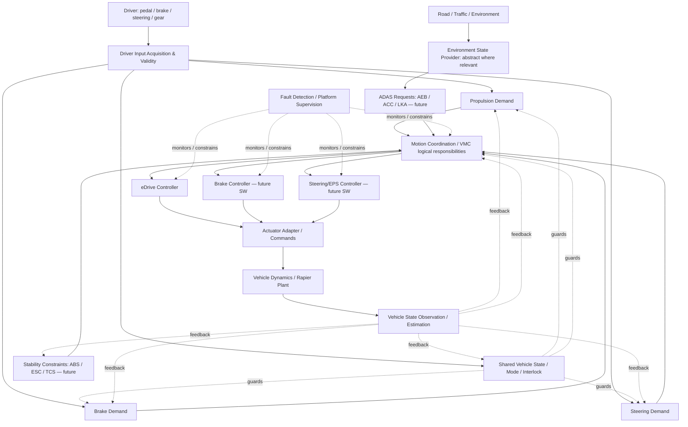

# TRACKBACK — 01 Vehicle Reference Architecture

**Version:** Phase 01 Design Draft v1.0 (2026-10-07)  
**Status:** PROPOSED — human review required; **not** executable Ground Truth  
**Scope:** whole-vehicle logical architecture, boundaries, flows, state ownership, execution/deployment distinction, baseline-source reconciliation. Domain-internal algorithms, full signals, requirements and TCs are Phase 02–06.

## 0. Authoritative input and provenance

Existing materials (do not silently replace them):
- `Requirement.md` — **TRACKBACK 통합 요구사항 명세서 v2.0**, vehicle reference architecture, function flows, virtual CAN-FD concept, physics, runtime, HARA and simulation authoring rules.
- `TRACKBACK Propulsion Reference Requirements v0.1.md` — nine areas (State Management, Request Acquisition, Request Interpretation, Torque Generation, Torque Limitation, Command Output, Monitoring, Fault Reaction, Recovery), and **assumed** separate Motion Arbitration, FR/SYS/SWR/TC draft identifiers.
- `00_TRACEBACK_MASTER.md` — Reference Case Authoring Prompt, evidence provenance and separation of Safety Trace vs Failure Trace.
- Recent Codex-provided reports (not a direct current-repo audit): C/WASM `VMC`/`eDrive`, actual scenario path `SimulationRuntime → C/WASM → eDrive adapter → Rapier`, 1/60-s fixed step, driver accelerator/brake/steering/gear inputs, monitoring and component/vehicle Workbench. Verify all mappings against current code before implementation.

**Authority order for factual claims:** observed code/runtime and validated trace > approved canonical registry > reference documents > this proposal. A reference document may describe an intended future subsystem, not a runtime capability. All drafted engineering objects remain `PROPOSED` until reviewed.

## 1. Product and modeling decisions

- Reference vehicle: generic driver-controlled road vehicle with an electric-drive **initial implementation profile**, adaptable to other propulsion implementations; not any OEM production car.
- A `Domain` is a **logical functional grouping**, not an ECU, network segment, AUTOSAR SWC, folder, or physical packaging zone.
- Cross-cutting coordination, vehicle state, sensing and platform execution are services/functional groups, not necessarily independent ECUs.
- `Function`, `Subfunction`, `Algorithm/State machine`, `Port/Signal`, `Software component`, `Runnable/Task`, `ECU`, `Physical actuator`, `Plant` have distinct identities and typed many-to-many allocation relations. No compulsory `Domain → Function → SWC → Runnable` 1:N tree.
- Overall function graph can branch, join, feed back and be concurrent. No universal serial pipeline Propulsion → Braking → Steering.
- Safety artifacts are independently derived from HARA, not automatically present for every functional requirement; no actual ASIL or ISO-26262 compliance claim.
- Each entity/edge records `provenance`, `confidence/approval`, `supportStatus` and optionally `sourceRef`.
- Case ground truth and hidden defect mechanisms are NOT player-visible architectural facts.

## 2. Architecture views (separate, never conflate)

| View | Objects | Key question |
|---|---|---|
| L0 context | Driver, environment, traffic, ego vehicle | Where is system boundary? |
| L1 vehicle behavior | Propulsion, Braking, Steering, Gear, Stability, ADAS, Occupant Safety, Energy | What must vehicle do? |
| L2 logical functions | Demand interpretation, request coordination, state management, actuator control, supervision | Who is responsible for each decision? |
| L3 application software | SWCs, runnables, functions, calibrations, state machines | What implements each logical function? |
| L4 platform/deployment | Virtual controller/ECU, scheduler, BSW/RTE if modeled, network, software endpoints | Where and when does it execute/communicate? |
| L5 actuation/plant | Adapter, drive/brake/steer force/command, Rapier physics, vehicle observables | How does control affect vehicle behavior? |
| L6 engineering evidence | FR/SYSR/SWR/safety, signal dictionary, test, oracle, run result | Why is behavior correct/incorrect? |

These are **views**, not sequential pipeline stages.

## 3. Logical whole-vehicle architecture



**Diagram convention:** conceptual planned flows are not claims that the current code implements all control blocks. In the current verified slice, driver inputs, VMC/eDrive and Rapier are the only known full SW→physics control path. Brake and steering inputs may affect physics but that does not imply the proposed Brake/EPS SW is already implemented.

## 4. Domain catalog — proposed ownership

| Functional domain / group | Primary responsibilities | Typical subfunctions in Phase 02 | Status |
|---|---|---|---|
| `PROPULSION` | Interpret/enable drive demand; generate/limit/command propulsion | Pedal validity and mapping; torque request; limiting; command; monitor/recovery | **Partial executable slice**, detailed reference draft |
| `BRAKING` | Interpret brake demand; generate/regulate braking; monitor brake behavior | Brake-demand; actuation; constraint handling; anti-lock integration boundary | Driver brake/plant exists; controller details proposed |
| `STEERING` | Interpret steering request; regulate/actuate direction | Steering-demand; assistance/actuation; feedback | Driver steer/plant exists; EPS logic proposed |
| `GEAR` | Gear request, permission, engaged state, directional interlock | Selection validity; transitions; gear state | D precondition/control partially supported; broader rules proposed |
| `STABILITY` | Constrain vehicle behavior for stability/traction | ESC/TCS interventions, coordination with braking and propulsion | Reference-only |
| `ADAS` | Driver-assistance requests | AEB, ACC, LKA and request priority | Reference-only, requires environment abstractions |
| `OCCUPANT_SAFETY` | Detect crash-related events and issue occupant protection decisions | Impact sensing, airbag/pretensioner decision | Reference-only, separate from motion chain |
| `POWER_ENERGY` | Report available propulsion energy/power and limits | Drive power availability, torque-limit request, HV readiness (if modeled) | Proposed; no invented HV architecture |
| `PLATFORM_SUPERVISION` | Execution, alive monitoring, watchdog, reset/fault supervision | Task-alive, event monitoring, reaction/recovery | Reference-only; safety analysis required |

Shared logical service groups (not one mandatory ECU per group):

| Shared service | Purpose |
|---|---|
| `VEHICLE_STATE_MODE` | Global readiness, drive enable, operating mode, state ownership; not simply a stage in serial flow |
| `MOTION_COORDINATION` | Resolve drive/brake/steer/ADAS/stability requests, apply control authority, allocate commands; logical roles may be implemented by VMC |
| `SENSING_ESTIMATION` | Produce speed/yaw/vehicle state feedback with validity/confidence; avoid inventing physical sensors |
| `COMMUNICATION_INTERFACES` | Typed SW port transfers and, only when implemented, messages/network/supervision |
| `EXECUTION_PLATFORM` | Simulation clock, task/runnable scheduling, reset, logging; do not equate fixed physics tick with ECU task period |
| `ACTUATION_PLANT` | Software commands → applied physical commands → vehicle response; distinguish actuator controller and physics adapter |

## 5. Functional controller responsibility and allocation

A controller (for example `VMC`) should not be stored as both a domain and a function merely because the same word is used by both. Maintain unique objects and typed links:

- `MOTION_COORDINATION` = logical **responsibility group**.
- `VMC` = existing executable **software function/implementation endpoint**, with confirmed current VMC role of `PropulsionRequest → DriveTorqueRequest` under speed/direction/validity conditions.
- VMC might later implement arbitration, longitudinal/lateral control and actuator allocation as specified in integrated requirements, but those are **PROPOSED subfunction allocations** until code confirms them.
- `eDrive` = existing executable software endpoint receiving `DriveTorqueRequest`, generating `EDriveCommand`; the eDrive-to-physics adapter maps software output into physics commands. `EDriveCommand` is **not automatically an independently measured actual motor torque**.
- Brake Controller / EPS Controller / Transmission Controller are future deployment/implementation entities unless independently verified in code.
- AUTOSAR SWC and runnable identity must not be invented by assuming reference logic was auto-generated with AUTOSAR. Store implementation allocation separately.

## 6. Current runtime vertical slice vs proposed expanded normal path

### 6.1 Reported existing executable path — status: CODEX_REPORTED, not independently audited in this design pass

```text
DriverInputRuntime: accelerator, brake, steering, gear
   → VehicleSwInput / actual input adaptation
   → C/WASM VMC: PropulsionRequest, VehicleSpeed, direction, validity
   → DriveTorqueRequest [Nm]
   → C/WASM eDrive (direction, validity)
   → EDriveCommand [magnitude; units/formal meaning verify]
   → EDriveToVehiclePhysicsAdapter
   → VehiclePhysicsCommand / DriveForce [N]
   → RapierVehiclePhysics
   → speed, velocity, acceleration, position [observed]
   → feedback to next tick where connected
```

Current scenario driver controls: accelerator 0–1, brake 0–1, steer −1–1 and Gear D precondition. Current fixed physics tick: 1/60 second; scenario profiles CONSTANT/STEP/LINEAR_RAMP and synchronized monitors. No claim that specific low-level controller tasks have 10 ms periods.

### 6.2 Reference Propulsion v0.1 — status: PROPOSED / NOT ONE-TO-ONE MAPPED

```text
Vehicle/Gear State
→ State Management
→ Request Acquisition
→ Request Interpretation
→ Torque Generation: RequestedDriveTorque
→ Motion Arbitration: ArbitratedDriveTorque
→ Torque Limitation: LimitedDriveTorque
→ Command Output: DriveTorqueCommand
→ eDrive
→ physical response
parallel: Monitoring → Fault Reaction → Recovery
```

The expanded reference path describes **logical function responsibilities**, not proof that each block is currently an independently implemented function. In particular, the `Torque Generation` location conflicts with the simplified executable VMC mapping unless we decide which subfunction VMC owns. `Motion Arbitration` is a functional boundary logically separate from torque generation but need not be a separate physical controller or domain. The recommended implementation-compatible mapping is:

- Driver acquisition/interpretation produces a normalized request (existing `PropulsionRequest` as runtime boundary; mapping to `DriverDriveDemand` is **unconfirmed**).
- VMC owns the current executable demand-to-`DriveTorqueRequest` conversion; future arbitration/limiting may be internal VMC responsibilities without duplicated calculations.
- eDrive owns the executable drive-command transformation and output to adapter.
- `RequestedDriveTorque`, `ArbitratedDriveTorque`, `LimitedDriveTorque`, `DriveTorqueCommand` remain PROPOSED intermediate identities until individually defined, connected and supported. Do not equate any of them by string similarity.
- `ActualDriveTorque` is a hypothetical actuator feedback signal, not an alias for `EDriveCommand` or `DriveForce`.

## 7. Six reference behavioral flows

These are top-level behavioral responsibilities, not executed implementation claims.

**Propulsion**: driver accelerator & validity + drive authorization + direction + measured vehicle state → drive demand → motion/torque calculation and constraints → eDrive command → applied drive force → longitudinal vehicle response → feedback.

**Braking**: driver brake / AEB / stability intervention request → deceleration/brake-demand resolution → braking control (and optional propulsion torque constraint/regen split if designed) → brake actuator command → braking force → deceleration and wheel/vehicle feedback.

**Steering**: driver steering / optional LKA request → steering authority/demand → steering controller → road-wheel actuation → yaw/lateral response → feedback.

**Gear**: driver selection → gear/vehicle condition validation → gear/drive-direction state → propulsion interlock/actuation policy → engaged/requested state feedback. Gear Request and actual Gear State are separate data.

**Stability/ABS/TCS**: vehicle/wheel state estimates + driver demand → slip/stability detection → intervention request or constraint to propulsion/brake control → actual motion response. ABS brake pressure modulation and ESC yaw correction are different functions; separate allocations even when graphically related.

**ADAS**: environment provider (ground-truth abstraction for simulated road/traffic, not an actual radar/camera model) + vehicle state → AEB/ACC/LKA decision → motion request or constraint → VMC/control authority resolution → actuation → physical response.

Occupant Safety (crash detection → airbag/pretensioner) belongs to a separate event-triggered branch, not the motion-control loop.

## 8. Shared state/model ownership

| State or data | Responsible conceptual owner | Consumers | Important distinction |
|---|---|---|---|
| `VehicleReady` | Vehicle state/power readiness | motion domains / coordination | readiness is not Proof of active propulsion |
| `DriveEnable` | Vehicle state/interlock | Propulsion/VMC/eDrive | requested/allowed/active may differ |
| `GearRequest` | Driver interface | Gear management | input command, not engagement |
| `GearState` | Gear management (or modeled runtime state) | VMC/propulsion/brake | observed state, not request |
| `PropulsionOperatingState` | Propulsion state-management function | drive demand/command/supervision | local domain state; reference `PROP_OFF`, `PROP_READY`, `PROP_ACTIVE`, `PROP_DEGRADED` are DRAFT until implemented |
| `DriveMode` | Operating mode management | request mapping/limits | no arbitrary actual calibration mapping |
| `VehicleSpeed` | physics/estimation feedback | VMC, mode/limits, stability, ADAS | actual-only without valid vehicle-level Expected oracle |
| `PropulsionFaultStatus` | supervision/detection | state manager and fault reaction | detection criteria/confirmation logic not implied by fault stimulus |
| `RecoveryConditionsSatisfied` | defined recovery logic | state manager | must be specified; fault disappearing alone does not imply recovery |

**Policy:** independent states can coexist (Gear D + VehicleReady + PROP_READY). Do not flatten into a universal enumeration. State transitions specify entry guards, source/target, trigger, processing tick/latency if defined, invalid/unknown handling and observable outputs. State Machine detailing belongs to Phase 03.

## 9. Signal and interface contract boundaries

A signal needs at least: stable ID, explanation (KO/EN as useful), logical type/units/scale, producer endpoint, consumer endpoints, domain/function roles, legal/raw/physical range where known, allowed enum/validity, timestamp/quality policy, support status and provenance. Contextual Expected belongs to a requirement/oracle association, **not** to the static range definition.

Define distinct endpoint identities:

```
Producer function.portOut  -- Source observation
   -> Transfer boundary [may include adapter, network or internal port]
   -> Consumer function.portIn -- Destination observation
```

A structural graph link is not proof of transfer equality. Real interface comparison requires independent source/destination samples and compatible timing basis. A logical SW interface does **not** imply CAN-FD. Virtual Motion CAN-FD in `Requirement.md` is a **future reference design**, not currently implemented CAN telemetry. When that layer is built, it must have explicit messages/signals/times/timeout semantics without fabricated defaults.

## 10. Time and execution contract

- `physicsTick = 1/60s` is current fixed physics/integration step.
- Software task periods such as VMC 10 ms, AEB 20 ms or CAN 10 ms in the integrated requirements are **reference examples**. They are not confirmed runtime timings.
- A future multi-rate scheduler must distinguish simulation time, task release/execution, communication transfer/delivery, sample/hold, timestamps and physics application time. A 16.67-ms physics tick cannot exactly stand in for a 10-ms task period.
- Fault injection occurs at defined typed boundary points, not globally 'after physics'; values before injection, after injection and at consumer are different observables when relevant.

## 11. Engineering traceability layers

```
Vehicle/stakeholder need
  → System functional requirement [SYS]
      → allocated logical function(s)
      → refined Software requirement(s) [SWR]
          → allocated implementation component(s)
          → verification criterion / TC(s)
              → runs → observed evidence → verdict

Independent safety branch (only when justified by hazard analysis):
Malfunctioning behavior + operating situation
  → Hazardous event / HARA
      → Safety Goal → FSR → TSR
          → allocated HW/SW safety requirements
          → verification / validation evidence
```

`FR-PROP-*`, `SYS-PROP-*`, `SWR-PROP-*`, `TC-SWR-*` from Propulsion v0.1 are source draft identifiers. They are NOT automatically confirmed approved canonical requirements. The reference contains duplicate-like SYS/SWR phrasing; Phase 05 must refine system-level observable behavior vs software-level allocated implementation, not copy one into the other.

Propulsion v0.1 functional groups with canonical draft sample IDs:
- State management: `FR-PROP-STA-001/002`, `SYS-PROP-STA-001/002`, `SWR-PROP-STA-001/002`.
- Input acquisition: `FR-PROP-IN-001/002` and corresponding SYS/SWR/TC.
- Request interpretation: `FR-PROP-REQ-001` and linked layers.
- Torque generation: `FR-PROP-GEN-001` and linked layers.
- Torque limitation: `FR-PROP-LIM-001/002` and linked layers.
- Command output: `FR-PROP-OUT-001` and linked layers.
- Monitoring: `FR-PROP-MON-001` and linked layers.
- Fault reaction: `FR-PROP-REA-001` → `SWR-PROP-REA-001/002`.
- Recovery: `FR-PROP-REC-001` and linked layers.

Monitoring, degraded behavior and recovery in v0.1 are **reference functional requirements**, not proof that HARA assigned ASIL or that the corresponding runtime monitoring path exists. Do not create an SG based only on finding a fault root cause.

## 12. Architecture entity/edge contract for future case and UI

**Entity types**: `VEHICLE`, `DOMAIN`, `LOGICAL_FUNCTION`, `SUBFUNCTION`, `SOFTWARE_COMPONENT`, `RUNNABLE_TASK`, `CONTROLLER`, `PORT`, `SIGNAL`, `STATE`, `INTERFACE_BOUNDARY`, `ACTUATOR`, `PLANT`, `REQUIREMENT`, `TEST`, `RUNTIME_TARGET`, `CASE`.

**Edges**: `PART_OF`, `PERFORMS`, `REFINES`, `ALLOCATED_TO`, `PRODUCES`, `CONSUMES`, `REQUIRES_STATE`, `FEEDS_BACK`, `CONSTRAINS`, `VERIFIES`, `OBSERVES`, `IMPLEMENTED_BY`. Each edge records basis/source and is not created from ID similarity. Use many-to-many and typed graph traversal where appropriate.

**Separation**: common `Reference Architecture` vs reviewed `Canonical Engineering Data` vs actual `Runtime Capability` vs per-case hidden `Ground Truth` vs per-player `Investigation State/Evidence`. The case picks its scope and reveal/telemetry plan from the reference but never rewrites the reference graph.

**UI contract**: selection of a Domain/Function/Signal/Interface/Requirement/Test points to the same canonical IDs and graph; Function Inspector, path view, requirement mindmap, Page 3 context and notebook must be projections of that one source. Lack of observability should be an honest empty/unsupported observation, not an invented normal value or missing function explanation.

## 13. Source conflicts requiring explicit resolution

| ID | Current sources | Proposed resolution | Validation needed |
|---|---|---|---|
| C01 | v0.1 places Torque Generation before Motion Arbitration; integrated master proposes VMC as allocator; current VMC calculates DriveTorqueRequest | Separate logical role vs actual allocation; VMC remains current executable owner; intermediate proposed names not auto-mapped | Inspect code/Trace/Architecture ownership |
| C02 | Reference `ActualDriveTorque` after eDrive versus runtime `EDriveCommand` and physics DriveForce | Keep commanded value, force and independently measured actual torque distinct | Instrument actual motor/actuation feedback if desired |
| C03 | Master `Motion CAN-FD` vs currently no verified software bus | Design/deployment intent `PROPOSED`; no fake CAN data | Future network implementation |
| C04 | Reference VMC/CAN tasks of 10 ms/20 ms vs 60 Hz physics step | Distinct scheduling domains, no false period claims | Scheduler design |
| C05 | v0.1 SYSR repeats SWR conditions and expected outputs | Rewrite by abstraction level in Phase 05; do not silently edit approved requirements | Human review |
| C06 | Generic Requirement.md case safety trace vs non-safety normal cases | Conditional HARA/safety path only, not obligatory SG for every case | Case policy review |
| C07 | Fault stimulus vs inherent software defect | Keep stimulus in scenario/test and defect in hidden case ground truth | Runtime fault semantics |
| C08 | The v0.1 numeric maps/limits (e.g. 120 Nm at 20%, 300 Nm limiter) | Preserve as **draft reference calibration examples**, not executable canonical calibration | Compare with actual C/WASM |
| C09 | Current VehicleSpeed actual-only vs reference desire for Expected | Require real oracle/safe paired reference before claiming vehicle trajectory mismatch | Future scenario reference capture/oracle |

## 14. Phase 01 acceptance / freeze conditions

- Same logical domain graph can represent acceleration, braking, steering, gear, stability, AEB, occupant safety, platform faults and physical faults without inventing additional root types.
- VMC/coordination/Propulsion separation remains semantically consistent; no double torque calculation forced by reference drafts.
- Runnable/SWC/ECU/motion function and logical domain are not treated as synonyms.
- Current VMC→eDrive→Rapier route and telemetry are preserved.
- Reference-only, proposed and executable models have clear status/provenance.
- SG/HARA, the fault mechanism and formal verification are separated.
- Interfaces, requirements and tests have stable typed relationships with data provenance and no fake signals.
- Domain architecture graph can drive multi-view UI without a per-case custom architecture.

## 15. Open decisions / deferrals

- Does `MOTION_COORDINATION` stay a logical shared-service group or become a top-level user-facing Domain in the educational UI? Recommended: logical group, with VMC shown as selected function/executable endpoint.
- Exact normalization and correspondence between `DriverDriveDemand`, `PropulsionRequest`, `RequestedDriveTorque`, `DriveTorqueRequest`, `LimitedDriveTorque` and `DriveTorqueCommand` must be resolved from code and an approved mapping before use.
- Decide whether an explicit Energy/Power availability representation is required for MVP; do not add imaginary HV/BMS data.
- Decide how far braking/steering reference algorithms go before their real SW controllers exist.
- Requirement v0.1 is a DRAFT reference expansion, not a substitute for the currently approved registry and executable three TCs.

**Next:** Phase 02 function/subfunction decomposition. Keep this document as a versioned proposal until user approval; use Phase 03–06 to finish detailed logic/states/signals/requirements/TCs. No repository changes are implied by this design document.
