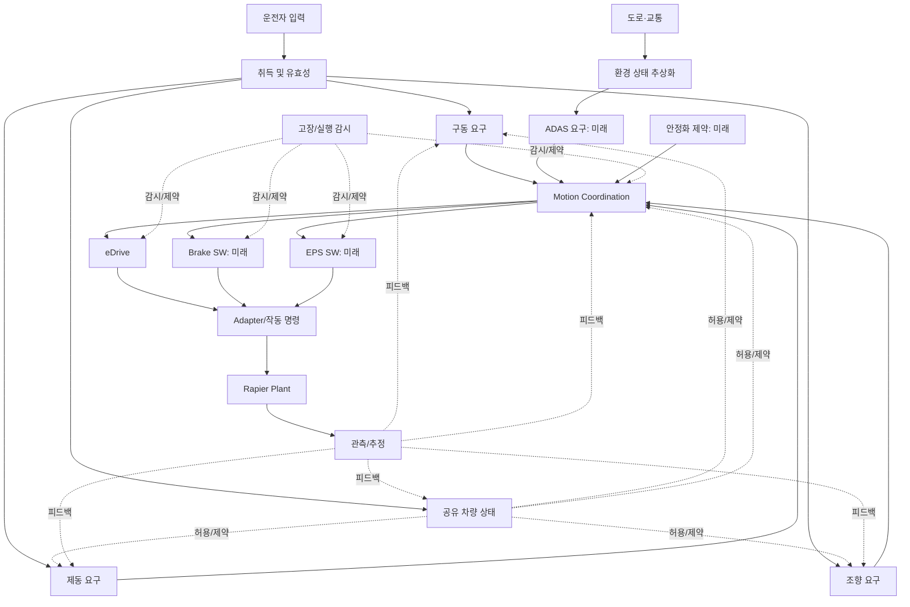

# TRACKBACK — Phase 01 차량 참조 아키텍처 (한글 검토판)

- 대응 문서: `01_REFERENCE_ARCHITECTURE.md` v1.0 (원문 15개 절에 대응)
- 성격: **원문을 한국어로 재정리한 검토판(의역 포함)**. 원문 기술 식별자와 의미, 충돌 항목을 유지한다. 새 공식 승인 근거가 아님.
- 기준 날짜: 2026-10-07. 설계 상태 `PROPOSED`; 최신 소스 직접 감사 전까지 일부 실행 정보는 `CODEX_REPORTED`.

## 0. 근거 자료 및 우선순위

- `Requirement.md`: 통합 요구사항 명세 v2.0. 차량 참조 구조, 제어 흐름, 향후 Virtual CAN-FD, 물리·실행·Safety 설계 원칙.
- `TRACKBACK Propulsion Reference Requirements v0.1.md`: Propulsion 9개 논리 영역, 독립 Motion Arbitration 경계 가정, FR/SYS/SWR/TC **참조 초안**.
- `00_TRACEBACK_MASTER.md`: 공개 사례를 참조 게임 케이스로 작성하는 규칙. 공개 Fact vs 재구성, Safety Trace vs Failure Trace의 분리.
- Codex 보고: DriverInputRuntime, VMC/eDrive C/WASM, adapter, Rapier, 1/60s vehicle scenario 등. **코드 직접 감사 근거가 아님**.
- 확정성의 우선순위: **실제 코드와 검증된 실행 > 승인 canonical 데이터 > 참고 문서 > 새 제안 설계**. 정식 승인 전 새 객체는 `PROPOSED`.

## 1. 제품·모델 결정 사항

1. 운전자가 조작하는 참조 도로 차량을 기본으로, 현재 구현 프로파일은 전기 구동계 중심. 특정 OEM 양산 차량 복제 아님.
2. `Domain`은 논리 기능 그룹이지 물리 ECU, Network, SWC, 폴더를 의미하지 않음.
3. `Function`, `Subfunction`, `Algorithm/State`, `Port/Signal`, `SW Component`, `Runnable/Task`, `ECU`, `Physical Actuator`, `Plant`는 서로 다른 엔티티. 필요에 따라 다대다 할당 관계.
4. 기능 그래프는 병렬·분기·합류·피드백을 허용. Propulsion→Brake→Steering이 공통 직렬 체인인 것처럼 표현하지 않음.
5. Safety 분석은 실제 HARA 근거가 있을 때만 관련 기능에 연결. 모든 기능에 SG/ASIL 자동 생성 금지.
6. 개별 객체·관계에는 `provenance`, 승인 상태, `supportStatus`, 자료 근거를 기록. 숨겨진 고장 결함/정답은 공개 참조 구조와 분리.

## 2. 다중 아키텍처 관점

| View | 다루는 것 | 답할 질문 |
|---|---|---|
| L0 시스템 경계 | Driver, Traffic, Environment, Ego Vehicle | 시스템 안/밖은 어디인가? |
| L1 차량 동작 | Propulsion, Braking, Steering, Gear, Stability, ADAS, Occupant, Energy | 차량은 무엇을 해야 하는가? |
| L2 논리 기능 | 해석, 요구 조정, 상태, 명령, 감시 | 누가 판단/책임을 가지는가? |
| L3 Application SW | SWC, Runnable, 제어 식, Calibration, Stateflow | 로직을 무엇으로 구현하는가? |
| L4 실행·배치 | Controller/ECU, Scheduler, BSW/RTE 모델, Port/Network | 어디에서 언제 실행되는가? |
| L5 Actuation/Plant | Adapter, Force, Motor/Brake/Steering, Rapier | 명령은 물리 거동에 어떻게 반영되는가? |
| L6 기술 근거 | FR/SYSR/SWR/SG, Signal, TC, Oracle, Evidence | 올바르거나 틀렸음을 어떻게 판단하는가? |

이는 **관점(View)**이지 L0→L6 순서로 실행되는 Stage가 아니다.

## 3. 차량 전체 논리 구조



**주의:** 현재 알려진 실제 SW→Plant 전체 경로는 VMC/eDrive/Rapier 중심. Braking과 Steering 입력이 Physics를 움직인다는 것만으로 Brake Controller/EPS 소프트웨어가 존재한다는 결론을 내리지 않는다. Motion Coordination 블록은 모든 출력이 반드시 현재 VMC를 통과한다는 주장도 아니다.

## 4. Domain과 공통 서비스 소유권

| 영역 | 핵심 책임 | 지원 상태 |
|---|---|---|
| `PROPULSION` | 구동 요구 판단, 토크 요구/명령, 제한, 감시/복귀 | VMC/eDrive 좁은 실행 구간 보고, v0.1 상세 참조 |
| `BRAKING` | 제동 요구 및 반응 관리 | Driver brake/plant만 확인, SW Controller는 제안 |
| `STEERING` | 조향 요구·제어 | Driver steering/plant만 확인, EPS 미확인 |
| `GEAR` | 기어 요청/허용/현재 상태 | D precondition 부분 확인 |
| `STABILITY` | ABS/TCS/ESC, 안정화 개입 | Reference only |
| `ADAS` | AEB/ACC/LKA 주행 보조 요구 | Reference only |
| `OCCUPANT_SAFETY` | 충돌·보호 장치 | Reference only |
| `POWER_ENERGY` | 구동력/전력 가용성, 토크 한계 | 제안. HV/BMS 강제 도입 금지 |
| `PLATFORM_SUPERVISION` | Task alive, watchdog, reset, 실행 고장 | Reference only |

공통 기능 그룹은 별도로 표현: `VEHICLE_STATE_MODE`(상태/허용), `MOTION_COORDINATION`(요구 우선순위/배분), `SENSING_ESTIMATION`(측정/추정), `COMMUNICATION_INTERFACES`(내부 포트·향후 네트워크), `EXECUTION_PLATFORM`(Clock/Scheduler/기록), `ACTUATION_PLANT`(물리 반응).

## 5. VMC와 Controller의 의미

- `MOTION_COORDINATION`은 여러 운행 요구를 조정하는 **논리적 기능 그룹**.
- `VMC`는 현 런타임에서 `PropulsionRequest`/속도/방향/유효성으로 `DriveTorqueRequest`를 계산하는 **실행 소프트웨어 대상**. Arbitration/종·횡 제어/Actuator Allocation까지 코드 구현됐다고 가정하지 않음.
- `eDrive`는 `DriveTorqueRequest`를 받아 `EDriveCommand`를 계산하는 소프트웨어. `EDriveCommand`를 측정된 물리 `ActualDriveTorque`로 취급 금지.
- Brake Controller/EPS/Transmission Controller와 AUTOSAR SWC/Runnable 이름은 근거 없는 임의 할당 금지.

## 6. 현재 구동 경로 vs 상세 참조 기능

**Codex 보고 실행 경로** (코드 확인 전):

```text
DriverInputRuntime → VehicleSwInput
→ C/WASM VMC (PropulsionRequest, VehicleSpeed, Direction, Validity)
→ DriveTorqueRequest
→ C/WASM eDrive
→ EDriveCommand
→ EDriveToVehiclePhysicsAdapter
→ DriveForce / VehiclePhysicsCommand
→ Rapier → Speed / Acceleration / Position
```

**Propulsion v0.1 참조 경로** (실제 단계별 구현 확인 없음):

```text
State Management / Request Acquisition
→ Request Interpretation
→ Torque Generation
→ Motion Arbitration
→ Torque Limitation
→ Command Output
→ eDrive → Physical Response

병렬: Monitoring → Fault Reaction → Recovery
```

참조 기능을 현 VMC/eDrive 사이에 중복 실행해선 안 된다. `DriverDriveDemand`, `PropulsionRequest`, `RequestedDriveTorque`, `DriveTorqueRequest`, `ArbitratedDriveTorque`, `LimitedDriveTorque`, `DriveTorqueCommand`는 코드 확인 전에는 별도 객체로 유지. `ActualDriveTorque` 또한 `EDriveCommand`/`DriveForce`와 동일시 금지.

## 7. 대표 차량 동작 6가지

1. **가속:** 유효 Pedal/Drive Request → Propulsion/VMC 역할 → eDrive → Adapter → Plant → 속도/가속도.
2. **제동:** Driver Brake 또는 향후 AEB/ESC 제약 → 제동 요구 조정 → Brake 명령 또는 직접 물리 제동 → 감속.
3. **조향:** Driver Steering 또는 향후 LKA → 권한/상태/조향 요청 → EPS 또는 직접 물리 조향 → Yaw/방향 변화.
4. **기어:** Selector Request → 유효성/Interlock → 수용 상태·적용 → Gear State가 구동 허용에 영향.
5. **Stability/ADAS:** 차량/환경 관측 → ABS/TCS/ESC 또는 AEB/ACC/LKA 판단 → 개입 후보 → Motion Coordination/Domain Controller → 물리 결과.
6. **고장/복귀:** 관측 불일치 → 정의된 기준에 따른 Detection/Confirmation → 도메인 반응 → Recovery guard. 주입된 고장 발생과 실제 ECU 고장 검출은 다름.

## 8. 공유 상태의 소유권

| 상태 | 소유/출처의 논리적 후보 | 실제 의미·주의 |
|---|---|---|
| `VehicleReady` | Vehicle State / startup | 전 차량 준비. 기능별 가용성과 동의어 아님 |
| `DriveEnable` | 허용/Interlock | 구동 허용. Gear D/Ready와 혼동 금지 |
| `GearState` | Gear 상태 관리자 | 선택 요청과 적용/보고 Gear 분리 |
| `PropulsionOperatingState` | Propulsion State Manager 초안 | OFF/READY/ACTIVE/DEGRADED는 문서 초안 상태 |
| `DriveMode` | 운용 모드 | 전 입력에 같은 mapping을 적용한다고 가정 금지 |
| `VehicleSpeed` | Plant/상태 추정 | 관측 실측 성격. 독립 Oracle 없이 Expected 곡선 없음 |
| `PropulsionFaultStatus` | 감시/검출 | 고장 주입 flag와 다름 |
| `RecoveryConditionsSatisfied` | 복귀 기준/상태 | 고장 해제만으로 복귀 허용 아님 |

각 상태는 독립적으로 병존한다. 전이에 대해서는 guard, trigger, 시작·종료 상태, invalid 처리, 동기화/시간, 실제 관측을 따로 관리한다.

## 9. 신호 및 인터페이스 계약

필요 필드: ID, 의미, 타입, 단위·스케일, Producer/Consumer, 역할, 값 범위/Enum/Validity, 시간·품질, 출처, 실제 실행 지원 상태.

```text
Producer function.portOut  (Source 측 관측)
       ↓
Transfer Boundary (SW port/adapter/향후 network)
       ↓
Consumer function.portIn  (Destination 측 관측)
```

구조상 연결과 실제 양단 값 일치 **검증**은 다르다. 독립된 endpoint sample·기준 시각 없이는 MATCH 판정 금지. `Motion CAN-FD`는 참조 네트워크 제안이지 현재 동작하는 CAN 송수신 증거가 아니다.

## 10. 실행 시간

현재 보고된 physics integration은 `1/60 s` 고정 tick. 마스터 문서의 VMC 10ms, AEB 20ms, CAN 10ms 등은 **논리 설계 예시**다. 물리 tick 16.667 ms는 10ms runnable의 실행 주기와 정확히 동일할 수 없다.

다중 주기 실행을 추가하면 simulation clock, runnable release, source production, transfer delivery, sample/hold, plant command application 시각을 구분해야 한다. Fault Injection 또한 각 typed boundary에 적용해야 하며 전체 루프 '물리 후'에 일괄 주입하면 안 된다.

## 11. 요구사항 추적성

```text
차량 요구/기능 필요 → SYSR → Logical Function
                      ↘ SWR → 구현 할당 → TC/Oracle → Run Evidence

(별도 조건부 기능안전 경로)
Malfunctioning behavior + Operating situation
→ Hazardous Event/HARA → SG → FSR → TSR
→ 관련 HW/SW Safety Requirement → Verification/Validation
```

`FR-PROP-*`, `SYS-PROP-*`, `SWR-PROP-*`, `TC-SWR-*`는 v0.1 문서 초안의 **기존 식별자**다. 레벨 간 중복 조건 문장이 존재하므로 Phase 05에서 SYSR의 차량 관측 동작과 SWR의 할당 구현 조건으로 나누어 정리할 예정이다. Human Review 전 approved registry에 무단 대체하지 않는다.

Propulsion 원문 기능/ID 분류:
- State: `STA-001/002`
- Input Acquisition: `IN-001/002`
- Request Interpretation: `REQ-001`
- Torque Generation: `GEN-001`
- Limitation: `LIM-001/002`
- Output: `OUT-001`
- Monitoring: `MON-001`
- Fault Reaction: `REA-001` + SWR의 `REA-002`
- Recovery: `REC-001`

Monitoring·Degraded·Recovery가 등장한다고 해서 실제 HARA/ASIL 또는 검증된 기능안전 메커니즘이 존재한다는 뜻은 아니다.

## 12. 엔티티/관계 및 UI 입력 계약

- Entity: `VEHICLE`, `DOMAIN`, `LOGICAL_FUNCTION`, `SUBFUNCTION`, `SOFTWARE_COMPONENT`, `RUNNABLE_TASK`, `CONTROLLER`, `PORT`, `SIGNAL`, `STATE`, `INTERFACE_BOUNDARY`, `ACTUATOR`, `PLANT`, `REQUIREMENT`, `TEST`, `RUNTIME_TARGET`, `CASE`.
- Edge: `PART_OF`, `PERFORMS`, `REFINES`, `ALLOCATED_TO`, `PRODUCES`, `CONSUMES`, `REQUIRES_STATE`, `FEEDS_BACK`, `CONSTRAINS`, `VERIFIES`, `OBSERVES`, `IMPLEMENTED_BY`. 유사 ID만으로 엣지 생성하지 않는다.
- **분리해야 하는 데이터:** 공통 Reference Architecture / 승인된 Canonical Engineering Data / Runtime Capability / 개별 Case Hidden Ground Truth / Player Investigation State.
- Function Inspector·Signal Path·Requirement Map·Workbench·Notebook은 동일 canonical ID를 다른 시점/관점으로 투영한다. 누락된 Expected를 생성해 화면을 채우지 않는다.

## 13. 미해결 소스 충돌 C01–C09

| ID | 충돌·위험 | 권고 처리 |
|---|---|---|
| C01 | v0.1 Torque Generation→Arbitration vs VMC 실제 DriveTorqueRequest 계산 | 논리 역할과 구현 할당 분리, 실제 포트 감시 |
| C02 | 참조 `ActualDriveTorque` vs 실제 eDrive/physics `EDriveCommand`, `DriveForce` | 명령·힘·실측 토크 구분 |
| C03 | Motion CAN-FD 참조와 실제 네트워크 구현 부재 | 향후 개별 구현, 가짜 메시지 금지 |
| C04 | 10/20ms task vs 60Hz physics | multi-rate 시간 계약 분리 |
| C05 | SYSR와 SWR 유사 반복 | Phase05에서 추상화 수준 조정 |
| C06 | 모든 사고에 SG가 필요한 듯한 문장 | Safety Trace는 HARA가 있을 때만 |
| C07 | Fault Stimulus와 SW Defect | scenario/test 입력 vs 숨겨진 결함 분리 |
| C08 | 120Nm, 300Nm 등 수치 | 참고 Calibration 예시, 실행 표준 아님 |
| C09 | VehicleSpeed Expected 욕구 vs Oracle 부재 | valid oracle 없는 차량 궤적 FAIL 금지 |

## 14. Phase01 통과조건

- 위 기능별 domain을 같은 관계 그래프로 표현하면서도 Propulsion 전용 체인에 종속시키지 않는다.
- VMC/Coordination/Propulsion 책임이 중복 계산되지 않는다.
- Runnable, SWC, ECU, Domain, Plant는 각각 별개 개체다.
- VMC→eDrive→Rapier 실행 경로는 기존 보고 내용을 보존한다.
- 모든 제안/참조/실행 근거가 구분되고 Safety/Failure/Verification 근거도 분리된다.
- 기능 설명·신호·요구사항·TC를 동일 그래프에서 조회할 수 있다.

## 15. 미결정 사항

1. Motion Coordination은 별도 물리 ECU가 아니라 공통 서비스 그룹으로 두는 것을 추천하되 UX 범주 명은 검토.
2. Reference torque/request 신호들과 런타임 실제 신호의 대응은 **코드 대조 전 미확정**.
3. Energy/HV 모델을 MVP에 추가할지 결정 필요. 실체 없는 BMS 수치 금지.
4. Braking/Steering을 어디까지 교육용 로직으로 설계하고 실제 실행으로 구현할지는 뒤 단계에서 분리 결정.
5. Propulsion v0.1 문서는 기존 실행 3개 TC의 검증된 소스와 자동으로 동급 승인하지 않는다.

**다음 문서:** `02_DOMAIN_FUNCTION_DECOMPOSITION_KO.md`와 `03_INTERNAL_LOGIC_STATE_MACHINE_KO.md`.
