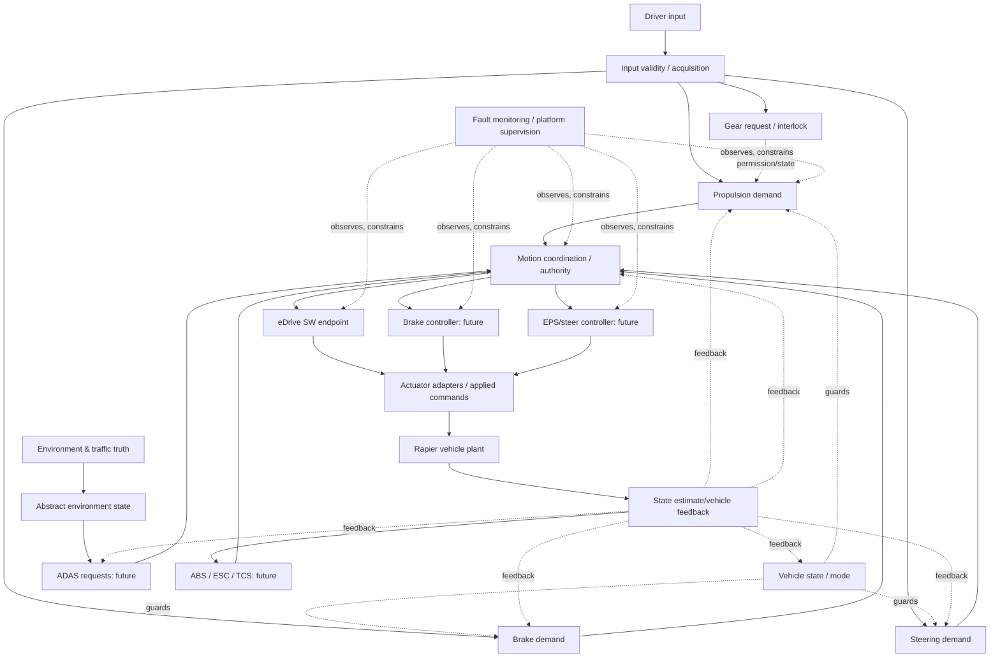

# TRACKBACK — 02 Domain & Function Decomposition

**Version:** Phase 02 Design Draft v1.0 — 2026-10-07  
**Status:** `PROPOSED` / human review required / no repository code changes  
**Dependency:** `01_REFERENCE_ARCHITECTURE.md` (Phase 01)  
**Scope:** complete logical functional catalog and subfunctions, I/O *roles*, states, connections, requirement trace candidates, fault-oriented investigation relevance. Precise logic/state transitions are Phase 03; signal contracts Phase 04; full requirements Phase 05; TC/oracles Phase 06.

> **Non-claim:** This document is a designed TRACKBACK reference-vehicle decomposition. It is **not** evidence that these functions are already implemented, that the real vehicle uses this architecture, or that safety integrity/performance is established.

## 0. Sources, authority and conventions

### 0.1 Supplied sources
- **`TRACKBACK Propulsion Reference Requirements v0.1.md`**: existing *reference proposal* for nine Propulsion activities — State Management, Request Acquisition, Request Interpretation, Torque Generation, Torque Limitation, Command Output, Monitoring, Fault Reaction, Recovery — plus separate assumed Motion Arbitration boundary and associated draft `FR-`, `SYS-`, `SWR-`, `TC-` IDs. Preserve these draft IDs; do not copy them into a second authoritative DB.
- **`Requirement.md`**: TRACKBACK integrated requirement specification v2.0. Lists driver-control functions (Propulsion, Braking, Steering, Gear), ADAS (AEB, ACC, LKA), dynamic functions (ABS, ESC, TCS), VMC conceptual responsibilities, actuator controllers (eDrive, Brake Controller, EPS, Transmission), occupant and supervision examples, conceptual virtual Motion CAN-FD. Do not treat all as executable.
- **`00_TRACEBACK_MASTER.md`**: reference-case authoring rules. Safety trace and failure trace remain separate; reconstruction must not masquerade as published OEM facts; authoring AI does not approve ground truth.
- **`01_REFERENCE_ARCHITECTURE.md`**: approved *direction for drafting*, not automatically approved canonical runtime truth. Logical domain vs controller vs ECU vs software vs plant; motion arbitration design collision noted.
- **Codex reports** (secondhand, not newly audited in this step): actual vehicle input → C/WASM `VMC` → `DriveTorqueRequest` → C/WASM `eDrive` → `EDriveCommand` → physics adapter → Rapier; component-level VMC/eDrive verification and driver accelerator/brake/steering scenario inputs. Audit source code before asserting runtime details.

### 0.2 Status and ownership

- `SRC_DRAFT`: expressly present in an existing **reference** document, but not necessarily approved/executable.
- `PROPOSED`: new decomposition, inferred engineering responsibility, or example. Requires human review.
- `CODEX_REPORTED`: reported working by Codex, not independently audited for this design.
- `REFERENCE_ONLY`: conceptual feature not known to execute in current software.
- `UNKNOWN`: owner or mapping cannot yet be determined.

A row may be `SRC_DRAFT + PROPOSED` because a named function was in a file but its subfunctions were designed here. Nothing here automatically becomes `APPROVED`.

### 0.3 ID and ontology

Use **temporary** design IDs `LF-<GROUP>-<FUNCTION>` only for this *logical function catalog*. These are not the existing requirements IDs, or runtime identifiers, and must not be minted into canonical registry until reviewed for collisions. Keep `VMC` and `eDrive` as actual implementation endpoint names, not invented AUTOSAR SWC names.

- `Domain`: conceptual vehicle responsibility area, many-to-many with functions where appropriate.
- `Function`: externally meaningful responsibility, e.g. "apply admissible torque command".
- `Subfunction`: a separately explainable calculation, guard, monitor, or decision; may be allocated to any future implementation unit.
- `Process/algorithm`: exact equations or state transitions, **not** defined by names alone.
- `Controller/SWC/Runnable`: implementation allocation/deployment; not a compulsory extra 1:N functional hierarchy.
- `Shared service`: vehicle-wide state, motion coordination, estimation, communication, supervision.
- `Plant`: physical dynamics and actuator effects; separate from software logic and observed sensor estimates.

## 1. Ownership boundary decisions (Phase 02 baseline)

1. Driver input acquisition owns **raw driver requests and validity**; per-domain interpretation owns converting valid requests to domain-specific *demand*. The legacy Propulsion Request Acquisition remains as a logical boundary in Propulsion and references the shared input provider, not a second sampled pedal by default.
2. Gear owns **requested gear**, **gear validation** and **reported engaged/accepted state** separately. Vehicle State consumes permitted/mode information; it must not fabricate physical transmission action.
3. Propulsion owns **demand and propulsion-specific calculations**. Motion Coordination owns **cross-source/cross-domain authority**, including request arbitration and actuator allocation if modeled. Which implementation endpoint performs the behavior is separately allocated.
4. Runtime `VMC` currently performs a reported `PropulsionRequest` → `DriveTorqueRequest` computation. Do **not** add a second executable torque generator merely to fit v0.1's expanded pipeline.
5. `eDrive` receives an already prepared `DriveTorqueRequest` and produces `EDriveCommand` as reported. `EDriveCommand` is **not** actual motor torque feedback or force. Physical adapter and applied drive force are separate boundaries.
6. Braking: driver friction braking, ABS modulation, ESC intervention, regenerative braking, and brake blending are **distinct functions**; do not silently assume all exist or arbitrarily sum both actuator commands.
7. Steering: driver input, EPS assistance and steer-by-wire command, LKA request, rack/wheel response, and yaw are **different quantities** and different possible implementations.
8. Stability (ABS, TCS, ESC) supervises/modifies longitudinal/lateral commands; it is not automatically a serial domain between Braking and Plant.
9. ADAS (AEB, ACC, LKA) creates requests/interventions; it does not receive unrestricted control authority until explicit arbitration/priority contracts exist.
10. Sensor/estimator output, physics ground truth, and UI telemetry are not interchangeable. A reliable raw sensor model must be explicitly introduced before sensor error cases are claimed.
11. Diagnostics and fault response are conditional functions, not universal SG/FSR/SWR assignments. A fault injected by the case is not identical to a detected/confirmed software fault state.
12. `Motion CAN-FD` is reference design in `Requirement.md`; no CAN producer/receiver protocol or timing may be declared executed without actual implementation.

## 2. Functional dependency overview



All links are **logical proposal** except separately verified current execution edges. Model alternative physical driver-to-plant brake/steer routes where code shows them. Domains function concurrently, branch, and feed back.

## 3. Common function-record contract

Each catalog record should eventually have:

```yaml
id: LF-XXX-YYY       # Proposed logical ID, never reuse as requirement/port/TC ID
nameKo: ...
nameEn: ...
responsibility: ...  # WHAT, not a prescriptive implementation
parentFunctions: []
subfunctions: [ {id, responsibility, inputRoles, outputRoles, guards, exceptions} ]
inputRoles: []       # conceptual; exact signal IDs Phase 04
outputRoles: []
requiredStates: []   # dependency only; precise transition Phase 03
upstream: []
downstream: []
relatedReqIds: []    # explicitly from source, or empty
knownImplementation: [] # verified endpoint mapping only
faultCandidates: []    # investigation coverage, not game ground truth
status: PROPOSED
sourceRefs: []
```

Represent `producer/consumer`, `parent/child`, `allocation`, `requirement allocation`, `verification` as **typed many-to-many edges**. Distinguish `valid static range`, `contextual acceptance criterion`, `recorded actual`, `reference record` and `hidden case truth`.

---

# 4. Domain catalog with Function → Subfunction detail

## 4A. Driver & Environment Inputs — `DRIVER_ENV` (shared input boundary)

This is not an additional drive-controller; it supplies requests and environment observations to other domains. Pedal steering and gear hardware details remain outside current simulation assumptions.

### LF-DRV-ACQ — Driver-control acquisition · 운전자 조작 취득 [`PROPOSED`, partial control support `CODEX_REPORTED`]
- **Why:** Translate player controls to clearly time-stamped application requests rather than distribute keyboard/GUI state as authoritative signal objects.
- **Subfunctions:** `ACQ-ACCEL` sample accelerator; `ACQ-BRAKE` sample brake; `ACQ-STEER` sample steering; `ACQ-GEAR` capture request; `ACQ-TIME` timestamp and sample/hold policy.
- **Inputs:** raw accelerator/brake/steer, gear request, simulation time. **Outputs:** request samples with validity/provenance. **State:** scenario active, input freshness as actually modeled. **Consumers:** Propulsion, Braking, Steering, Gear. **Failure questions:** input stuck/out of range, stale sample vs normal change. **Runtime boundary:** reported `DriverInputRuntime` controls accel 0..1, brake 0..1, steer -1..1 and Gear D precondition; **do not** infer physical sensor fault detection from these UI ranges.

### LF-DRV-VALID — Input plausibility & normalization · 입력 품질 판단 [`PROPOSED`]
- **Subfunctions:** `VALID-RANGE` evaluate documented limits; `VALID-STATUS` preserve validity indication; `VALID-CONVERT` map representation/unit where specified; `VALID-AGE` evaluate freshness only if timestamps exist.
- **I/O:** sampled controls → validated controls and status. **Preconditions:** known signal contract. **Consumers:** domain request interpreters and diagnostics. **Boundary:** no physical dual-sensor plausibility or timeout without modeled sensors/timing.

### LF-ENV-STATE — Environment-state provider · 환경 상태 제공 [`SRC_DRAFT`, `REFERENCE_ONLY`]
- **Subfunctions:** `ENV-ROAD` expose relevant road/geometry/friction; `ENV-TRAFFIC` abstract traffic actors; `ENV-REL` relative position/speed and in-path relations; `ENV-LANE` lane/offset abstraction.
- **I/O:** authoritative simulated map/traffic state → typed environmental observations. **Consumers:** future AEB/ACC/LKA/stability scenarios. **Boundary:** simulation ground truth is not proof of real camera/radar/perception output. Source `Requirement.md` expressly excludes full Camera/Radar AI models for MVP.

## 4B. Vehicle State & Mode — `VEHICLE_STATE` (shared service)

### LF-VS-INIT — Startup/availability · 초기화 및 준비 상태 [`PROPOSED`]
- **Subfunctions:** `INIT-START` initialize state; `INIT-READY` assess vehicle availability; `INIT-RESET` reset on scenario/replay; `INIT-EXPOSE` publish current ready state.
- **I/O:** power/initialization conditions (not yet modeled in detail) → readiness. **Consumers:** domain state guards. **Do not infer** high-voltage contactor/BMS state or ignition semantics.

### LF-VS-PERM — Drive permission / interlock · 주행 허용 [`PROPOSED`]
- **Subfunctions:** `PERM-READY`, `PERM-GEAR`, `PERM-FAULT`, `PERM-FINAL`; combine known gating inputs without assuming a specific truth table.
- **I/O:** readiness, accepted gear, fault/inhibit state → drive enable/permission. **Consumers:** propulsion/motion controllers. **Boundary:** `VehicleReady`, `DriveEnable` appear as draft reference conditions, not proof of independent executable modules.

### LF-VS-MODE — Operating mode coordination · 차량 운용 모드 [`PROPOSED`]
- **Subfunctions:** `MODE-REQUEST`, `MODE-GUARD`, `MODE-PUBLISH`, `MODE-TRANSITION-REPORT`.
- **I/O:** selected mode + capability/vehicle state → effective mode. **Consumers:** torque mapping, constraints. **No** invented ECO/SPORT calibration.

### LF-VS-FAULT — Vehicle-level degraded availability · 고장 시 기능 가용성 [`PROPOSED`]
- **Subfunctions:** `FAULT-AGGREGATE`, `FAULT-PERMISSION`, `FAULT-RECOVERABILITY`.
- **I/O:** detected/confirmed faults + safety requirements where present → allowed operation/degraded availability. **Consumers:** domain managers. **No** invented ASIL, safe-state or torque limit.

## 4C. Gear / Direction — `GEAR` (`SRC_DRAFT` at function level; detailed below `PROPOSED`)

### LF-GEAR-ACQ — Gear request acquisition · 변속 요청
- **Subfunctions:** `GEAR-REQUEST` record selected P/R/N/D or supported subset; `GEAR-VALID` validate the command; `GEAR-AGE` request freshness if supported.
- **I/O:** gear selector request → accepted/invalid request. **Consumers:** interlock/transition. **Current:** D precondition is known; other positions and semantics NOT verified.

### LF-GEAR-INTERLOCK — Gear change authorization · 기어 전환 허용 판단
- **Subfunctions:** `GEAR-SPEED-GUARD`, `GEAR-BRAKE-GUARD`, `GEAR-DIRECTION-GUARD`, `GEAR-INHIBIT-REASON`.
- **I/O:** request, speed, brake, readiness/vehicle state → allowed/rejected request + reason. **No numerical thresholds until Phase 03/05.** **Failure questions:** unintended D/R, rejected valid request, incorrect state reporting.

### LF-GEAR-STATE — Engaged state tracking · 기어 상태 관리
- **Subfunctions:** `GEAR-PENDING`, `GEAR-TRANSITION`, `GEAR-ENGAGED`, `GEAR-REPORT`.
- **I/O:** accepted request + actual state/confirmation if modeled → gear state. **Consumers:** propulsion direction and readiness. **Important:** gear request != confirmed gear state.

### LF-GEAR-REACT — Gear fault handling · 전환 실패 처리
- **Subfunctions:** `GEAR-FAIL-DETECT`, `GEAR-INHIBIT`, `GEAR-RECOVER`; concept only, with no automatic safe state.

## 4D. Propulsion — `PROPULSION`

**High-fidelity preservation:** The first nine headings and FR/SYS/SWR trace IDs below come **directly** from `TRACKBACK Propulsion Reference Requirements v0.1.md`, which is itself a reference draft. The subfunctions provide a consistent decomposition of those statements; extra distinctions are proposals.

### LF-PROP-STA — State Management · 구동 상태 관리 [`SRC_DRAFT`]
- **Responsibility:** Put propulsion into readiness/active status only when defined state and request guards apply.
- **Subfunctions:** `STA-READY-GUARD` assess `VehicleReady`, `GearState`, `DriveEnable`; `STA-REQUEST-GUARD` assess demand/validity; `STA-TRANSITION` select `PROP_OFF/READY/ACTIVE` (draft); `STA-PUBLISH` emit current propulsion state.
- **I/O:** shared vehicle state + driver demand/validity → propulsion operating state. **Upstream:** Vehicle State, Gear, request validation. **Downstream:** torque generation/command. **Fault classes:** unexpected activation, missing activation, wrong transition.
- **Existing reference trace:** `FR-PROP-STA-001/002`; `SYS-PROP-STA-001/002`; `SWR-PROP-STA-001/002`; `TC-SWR-PROP-STA-001-01`, `TC-SWR-PROP-STA-002-01`. **Runtime:** specific named state machine not independently verified.

### LF-PROP-ACQ — Request Acquisition · 구동 입력 수용 [`SRC_DRAFT`]
- **Responsibility:** Accept or reject a pedal/request sample without treating invalid input as valid demanded torque.
- **Subfunctions:** `ACQ-PEDAL-READ`, `ACQ-VALIDITY`, `ACQ-REJECT-INVALID`, `ACQ-STATUS` publish request validity.
- **I/O:** driver accelerator/value-validity → accepted accelerator and drive-request-valid status. **Upstream:** `LF-DRV-ACQ/VALID`. **Downstream:** interpretation/state guards. **Failure classes:** invalid input used, stale acceptance, bad validity handling.
- **Trace:** `FR-PROP-IN-001/002`, `SYS-PROP-IN-001/002`, `SWR-PROP-IN-001/002`, `TC-SWR-PROP-IN-001-01`, `TC-SWR-PROP-IN-002-01`. **Do not duplicate** actual sampling already owned by driver provider.

### LF-PROP-INTERP — Request Interpretation · 운전자 구동 의도 해석 [`SRC_DRAFT`]
- **Responsibility:** Convert accepted pedal input into a normalized demand (not Nm).
- **Subfunctions:** `INT-NORMALIZE` input representation; `INT-PEDAL-MAP` select defined mapping; `INT-VALID-GATE`; `INT-DEMAND-PUBLISH`.
- **I/O:** valid accelerator input → `DriverDriveDemand` (draft reference: normalized 0.0..1.0). **Next:** torque generation/coordination. **Failure classes:** map/scaling/validity interpretation fault.
- **Trace:** `FR-PROP-REQ-001`, `SYS-PROP-REQ-001`, `SWR-PROP-REQ-001`, `TC-SWR-PROP-REQ-001-01`. **Unresolved:** whether `DriverDriveDemand` is identical or adapted to runtime `PropulsionRequest`; **no implicit alias**. The 20%→0.20 example is a reference-calibration assumption, not validated implementation.

### LF-PROP-GEN — Torque Generation · 구동 토크 요구 생성 [`SRC_DRAFT`]
- **Responsibility:** Convert authorized drive demand and applicable vehicle state into an initial demanded torque quantity.
- **Subfunctions:** `GEN-ENABLE`, `GEN-SELECT-MAP`, `GEN-LOOKUP/COMPUTE`, `GEN-UNIT-CHECK`, `GEN-PUBLISH`.
- **I/O:** `DriverDriveDemand`, vehicle speed, mode and active state (draft) → `RequestedDriveTorque [Nm]` (draft). **Upstream:** interpretation, state estimation. **Downstream:** Motion Arbitration. **Failure classes:** wrong gain/map, direction sign, speed dependence, stale feedback.
- **Trace:** `FR-PROP-GEN-001`, `SYS-PROP-GEN-001`, `SWR-PROP-GEN-001`, `TC-SWR-PROP-GEN-001-01`.
- **Actual allocation conflict:** reported C/WASM `VMC` computes `DriveTorqueRequest` from `PropulsionRequest` (and speed/direction/validity), **not proven identical** to this conceptual staged `RequestedDriveTorque` calculation. Do not implement both calculations by default. Reference numeric example (20% and 30 km/h → 120 Nm) is not executable ground truth.

### LF-PROP-LIM — Torque Limitation · 토크 허용 범위 처리 [`SRC_DRAFT`]
- **Responsibility:** Apply applicable admissible upper/lower bounds to an already resolved torque request, without silently changing valid in-range requests.
- **Subfunctions:** `LIM-SELECT` appropriate limit from approved conditions; `LIM-COMPARE`; `LIM-SATURATE`; `LIM-STATUS` optional limit status.
- **I/O:** `ArbitratedDriveTorque` and `MaxAllowedDriveTorque` (draft) → `LimitedDriveTorque` (draft). **State:** drive/fault/energy limits must be defined separately. **Failure classes:** missing limit, wrong limit, unintended saturation, sign handling.
- **Trace:** `FR-PROP-LIM-001/002`, `SYS-PROP-LIM-001/002`, `SWR-PROP-LIM-001/002`, `TC-SWR-PROP-LIM-001-01`, `TC-SWR-PROP-LIM-002-01`. 300 Nm and 299.9/300.0/300.1 Nm are illustration only.

### LF-PROP-OUT — Command Output · 구동 명령 제공 [`SRC_DRAFT`]
- **Responsibility:** Provide the defined final admissible torque command to the eDrive boundary with explicit command validity.
- **Subfunctions:** `OUT-GATE`, `OUT-MAP`, `OUT-VALID`, `OUT-PUBLISH`.
- **I/O:** `LimitedDriveTorque`, `PropulsionRequestValid`, propulsion state → `DriveTorqueCommand`, `DriveTorqueCommandValid` (draft). **Next:** eDrive adapter/controller. **Failure classes:** command gating, wrong final value, invalid flag.
- **Trace:** `FR-PROP-OUT-001`, `SYS-PROP-OUT-001`, `SWR-PROP-OUT-001`, `TC-SWR-PROP-OUT-001-01`. **Unresolved:** how these draft IDs map onto runtime `DriveTorqueRequest`.

### LF-PROP-MON — Monitoring · 구동 명령 일관성 감시 [`SRC_DRAFT`]
- **Responsibility:** Compare the value that should be commanded to the value reported at the monitoring boundary under defined active conditions.
- **Subfunctions:** `MON-SAMPLE` gather both independent quantities; `MON-DEVIATION` calculate magnitude difference; `MON-TOLERANCE` compare applicable tolerance; `MON-STATUS` report discrepancy; `MON-CONFIRM` only after defined confirmation behavior exists.
- **I/O:** draft `LimitedDriveTorque` and `DriveTorqueCommand` → draft `CommandTorqueDeviation`, `PropulsionFaultStatus`. **Failure classes:** monitor omission, false detection, undetected mismatch. **No invented independent samples**; reading one aliased value twice does not form a meaningful check.
- **Trace:** `FR-PROP-MON-001`, `SYS-PROP-MON-001`, `SWR-PROP-MON-001`, `TC-SWR-PROP-MON-001-01`. `CommandTorqueTolerance` remains a draft calibration contract.

### LF-PROP-REACT — Fault Reaction · 검출 이상에 대한 구동 대응 [`SRC_DRAFT`]
- **Responsibility:** Apply the explicitly specified fault-handling behavior only when a *confirmed* fault exists.
- **Subfunctions:** `REA-CONFIRM-GUARD`, `REA-STATE`, `REA-OUTPUT-LIMIT`, `REA-PUBLISH`.
- **I/O:** `PropulsionFaultStatus == FAULT_CONFIRMED` (draft) → `PROP_DEGRADED` and command constraint. **Failure classes:** no response, incorrect limitation, unjustified activation.
- **Trace:** `FR-PROP-REA-001`, `SYS-PROP-REA-001`, `SWR-PROP-REA-001/002`, `TC-SWR-PROP-REA-001-01`, `TC-SWR-PROP-REA-002-01`. Draft degraded limit 50 Nm is **example only**. Do not assume an OEM-calibrated safe state or an existing runtime safety implementation.

### LF-PROP-REC — Recovery · 구동 복귀 처리 [`SRC_DRAFT`]
- **Responsibility:** Recover from fault-restricted state using defined conditions, not solely from absence of an instantaneous fault flag.
- **Subfunctions:** `REC-FAULT-CLEAR`, `REC-CONDITION`, `REC-REARM`, `REC-READY-TRANSITION`, `REC-REACTIVATE-GUARD`.
- **I/O:** degraded state, no-fault, `RecoveryConditionsSatisfied` → `PROP_READY` (draft). **Failure classes:** premature recovery, no recovery, oscillation.
- **Trace:** `FR-PROP-REC-001`, `SYS-PROP-REC-001`, `SWR-PROP-REC-001`, `TC-SWR-PROP-REC-001-01`.

### LF-PROP-EDRV — eDrive Controller Command Processing · 전기 구동 명령 변환 [`SRC_DRAFT` role; `CODEX_REPORTED` executable]
- **Responsibility:** Consume accepted torque request and generate a controller-level drive command; distinguish software magnitude from physical torque response.
- **Subfunctions:** `EDRV-INPUT` read `DriveTorqueRequest`; `EDRV-STATE` direction/validity handling; `EDRV-CALC` apply actual modeled conversion/calibration; `EDRV-OUTPUT` publish `EDriveCommand`; `EDRV-ADAPTER` separate downstream adapter boundary (not necessarily same function).
- **I/O:** runtime `DriveTorqueRequest [Nm]`, direction, validity → runtime `EDriveCommand` magnitude. **Next:** `EDriveToVehiclePhysicsAdapter` → force → Rapier. **Runtime:** component-level executable eDrive and vehicle path Codex-reported; `EDriveCommand` must not be claimed measured `ActualDriveTorque`.
- **Trace:** no matching new requirement ID is fabricated in this catalog. Use existing executable `TC-PROP-NORMAL-010A/010B` only after confirming true registry trace, not by similar names.

**Propulsion flow relationships:**
- Draft functional path: `STA/ACQ → INTERP → GEN → (Motion Coordination Arbitration) → LIM → OUT → EDRV → Adapter → Plant`.
- Parallel supervision: `MON → REACT → REC`, conditioned by real detection/confirmation.
- Current reported executable path remains `PropulsionRequest → VMC → DriveTorqueRequest → eDrive → EDriveCommand → physics adapter → Rapier`.
- Do not claim the full reference state/request/calibration chain is executable. Keep the reference and current graph as **distinct views with explicit mapping status**.

## 4E. Braking — `BRAKING` [`SRC_DRAFT` general function; subfunctions `PROPOSED`]

### LF-BRK-ACQ — Driver/automatic brake request acquisition · 제동 요구 취득
- **Subfunctions:** `BRK-PEDAL` ingest brake control; `BRK-ADASSRC` accept AEB decel request (future); `BRK-STABSRC` accept stability/ABS constraints (future); `BRK-VALID` validity and request provenance.
- **Inputs:** brake pedal, optional AEB/stability requests. **Outputs:** categorized brake-demand candidates. **Why:** AEB and driver requests are not the same source or same authority. **Current:** player brake input and physics brake force are observable, but a discrete Brake SW Controller is not proven.

### LF-BRK-STATE — Brake availability & operating mode · 제동 기능 상태
- **Subfunctions:** `BRK-ENABLE`, `BRK-MODE`, `BRK-FAULT-STATE`, `BRK-PUBLISH`.
- **I/O:** readiness, controller availability and constraints → allowed brake mode. **Guard:** avoid assuming brake always depends on propulsion `DriveEnable` or Gear D. **Fault questions:** no braking under request, brake request unintentionally suppressed.

### LF-BRK-DEMAND — Deceleration/brake demand interpretation · 감속 요구 해석
- **Subfunctions:** `BRK-INTENT`, `BRK-REQUEST-MAP`, `BRK-COAST/DISABLE` as defined by final architecture; `BRK-DEMAND-PUBLISH`.
- **I/O:** valid brake request/vehicle state → target deceleration or braking demand, with exact units to be defined. **Do not assume** pedal = hydraulic pressure or deceleration linearly.

### LF-BRK-COORD — Brake demand coordination & limits · 제동 요구 조정
- **Subfunctions:** `BRK-ARB-REQUEST` interact with Motion Coordination; `BRK-PROP-INTERLOCK` propulsion interaction; `BRK-LIMIT` allowed magnitude; `BRK-PRIORITY` future ADAS/stability priority.
- **I/O:** driver and automatic candidates/vehicle capability → final requested brake action; owns no final actuator allocation unless explicitly assigned. **No fake precedence table.**

### LF-BRK-BLEND — Friction/regenerative split · 제동 배분 [`REFERENCE_ONLY`, optional future EV feature]
- **Subfunctions:** `BLEND-ELIGIBLE`, `BLEND-REGEN-LIMIT`, `BLEND-FRICTION-REMAINDER`, `BLEND-TRANSITION`.
- **I/O:** demanded deceleration, regen availability → regenerative and friction portions. **Boundary:** only implement with an actual power/actuator allocation and physical semantics; do not introduce automatic regenerative braking now.

### LF-BRK-CMD — Brake controller & actuator command · 제동 명령 생성
- **Subfunctions:** `BRK-CMD-CONVERT`, `BRK-CMD-VALID`, `BRK-CMD-SATURATE`, `BRK-CMD-PORT`.
- **I/O:** final allocated brake demand → friction brake command or physics adapter command. **Actuator model:** distinguish software command, applied brake force and physical deceleration. **Current:** direct simulation brake behavior is not evidence of a Brake Controller SWC.

### LF-BRK-FDBK — Brake response monitor / recovery · 제동 반응 감시
- **Subfunctions:** `BRK-OBSERVE`, `BRK-COMPARE`, `BRK-FAULT`, `BRK-RECOVER`.
- **I/O:** commanded brake and independent response/state (when available) → verified discrepancy/status. **Avoid invented** pressure sensors, feedback ranges and fallback behavior.

**Fault families covered:** braking disabled, unintended braking, insufficient effect, incorrect request priority, actuator-versus-software discrepancy; ABS/ESC belong to Stability, not an automatic subroutine of every brake.

## 4F. Steering — `STEERING` [`SRC_DRAFT` general function; subfunctions `PROPOSED`]

### LF-STR-ACQ — Steering input & authority · 조향 요구 취득
- **Subfunctions:** `STR-DRIVER` interpret driver steering control, `STR-ASSIST` accept LKA request where present, `STR-VALID`, `STR-AUTHORITY` track source.
- **I/O:** driver control/ADAS request → typed steering demands. **Current:** steer control -1..1 in scenario is not confirmed road-wheel angle in radians or degrees.

### LF-STR-STATE — Steering enable/mode · 조향 상태 관리
- **Subfunctions:** `STR-AVAIL`, `STR-ASSIST-MODE`, `STR-FAULT-STATE`, `STR-PUBLISH`.
- **I/O:** mode/availability/driver authority → steering control state. **Boundary:** EPS assist and steer-by-wire are different implementations. Select before writing Phase 03 control law.

### LF-STR-DEMAND — Desired steering response · 요구 조향 해석
- **Subfunctions:** `STR-MAP`, `STR-LIMIT`, `STR-OPTIONAL-FILTER`, `STR-REQUEST`.
- **I/O:** accepted steering control and speed/state → conceptual target steering quantity. **Do not equate** normalized input, steering-wheel angle, road-wheel angle or yaw target.

### LF-STR-COORD — Driver/ADAS steering arbitration · 조향 요구 조정
- **Subfunctions:** `STR-REQUEST-TYPES`, `STR-DRIVER-OVERRIDE`, `STR-PRIORITY`, `STR-FINAL-DEMAND`.
- **I/O:** driver & LKA candidates/authority → admissible command request. **No assumption** that LKA actively controls steering in current runtime.

### LF-STR-ACT — Steering actuator control · EPS/조향 구동
- **Subfunctions:** `STR-ACT-CONVERT`, `STR-ACT-GUARD`, `STR-ACT-SEND`, `STR-ACT-APPLIED` at adapter boundary.
- **I/O:** allocated steering command → controlled wheel/rack/physics input. **Current:** reported steering input affects scenario vehicle, not verified EPS implementation.

### LF-STR-MON — Steering response monitor / fault reaction · 조향 반응 감시
- **Subfunctions:** `STR-FEEDBACK`, `STR-DEVIATION`, `STR-MON-STATUS`, `STR-RESPONSE`.
- **I/O:** demand and independently observed angle/yaw (when real) → status. **Fault questions:** delayed, saturated, reversed direction, unintended assist. No fictional safe steering actuation on failure.

## 4G. Vehicle Stability & Traction — `STABILITY` [`SRC_DRAFT` ABS/ESC/TCS; `REFERENCE_ONLY`]

### LF-STB-ABS — Anti-lock braking · ABS
- **Subfunctions:** `ABS-WHEEL-SLIP-ESTIMATE`, `ABS-LOCK-TREND`, `ABS-MODULATE`, `ABS-RELEASE/RECOVER`, `ABS-MONITOR`.
- **I/O:** wheel rotation/state, vehicle motion estimates and braking demand → friction brake modulation constraint. **Requires:** actual wheel-state model, appropriate sampling/control plant. **Current:** wheel-slip signal and ABS dynamics not confirmed.

### LF-STB-TCS — Traction control · 구동 미끄럼 방지
- **Subfunctions:** `TCS-DRIVE-SLIP`, `TCS-DEMAND-LIMIT`, `TCS-BRAKE-REQUEST` (optional), `TCS-EXIT`.
- **I/O:** wheel/vehicle state & propulsion request → motor torque limiting and optional brake intervention. **Requires:** traction/slip plant realism; do not equate wheel spin with vehicle speed alone.

### LF-STB-ESC — Electronic stability control · 자세 안정 제어
- **Subfunctions:** `ESC-DESIRED-YAW`, `ESC-STATE-ESTIMATE`, `ESC-YAW-ERROR`, `ESC-INTERVENTION`, `ESC-RECOVERY`.
- **I/O:** driver steering, yaw/lateral feedback, vehicle speed → brake/drive torque intervention demands. **Requires:** lateral/yaw model and controls; no invented threshold, wheel-selective braking capability or unsafe claims.

### LF-STB-COORD — Stability intervention handoff · 안정화 요구 전달
- **Subfunctions:** `STB-REQUEST-PRIORITY`, `STB-LIMIT-PROP`, `STB-REQUEST-BRAKE`, `STB-TRACE`.
- **I/O:** ABS/ESC/TCS intervention requests → Motion Coordination or relevant controller. **No unsupported bus/ECU claims.**

## 4H. ADAS / Driving Assistance — `ADAS` [`SRC_DRAFT` AEB/ACC/LKA; `REFERENCE_ONLY`]

### LF-ADAS-AEB — Automatic emergency braking · 긴급 제동 보조
- **Subfunctions:** `AEB-TARGET-VALIDITY`, `AEB-THREAT-EVALUATION`, `AEB-ACTIVATION`, `AEB-BRAKE-REQUEST`, `AEB-RELEASE`.
- **I/O:** abstract object position/speed/relevance, ego speed, driver state → requested emergency deceleration/action. **Must define later:** hazard-related decision, activation criteria, availability and suppression. **No TTC thresholds or sensor guarantees yet.**

### LF-ADAS-ACC — Adaptive cruise control · 차간거리/속도 유지
- **Subfunctions:** `ACC-MODE`, `ACC-TARGET-SELECTION`, `ACC-SPEED/GAP-CONTROL`, `ACC-LONGITUDINAL-REQUEST`, `ACC-DRIVER-OVERRIDE`.
- **I/O:** selected speed/gap, lead-object abstraction, ego speed → accelerator/deceleration request candidate. **No assumed physical radar or automatic safety priority.**

### LF-ADAS-LKA — Lane keeping assistance · 차로 유지 보조
- **Subfunctions:** `LKA-AVAIL`, `LKA-LANE-STATE`, `LKA-INTERVENTION`, `LKA-STEER-REQUEST`, `LKA-RELEASE`.
- **I/O:** lane-offset/heading abstraction, vehicle state, driver activity → steering intervention candidate. **Requires:** lane model + authority contract; do not equate lane offset with wheel angle.

### LF-ADAS-COMMON — Shared assistance availability · ADAS 공통 관리
- **Subfunctions:** `ADAS-INPUT-QUALITY`, `ADAS-ENGAGE-GUARD`, `ADAS-CANCEL`, `ADAS-STATUS`.
- **I/O:** environment validity/driver request/vehicle state → per-feature availability; **not** an automatically implemented centralized ADAS ECU.

## 4I. Motion Coordination / Logical VMC responsibilities — `MOTION_COORDINATION` (cross-domain group)

The reference `Requirement.md` attributes state management, request management/arbitration, longitudinal/lateral control, actuator allocation, and safety monitoring to conceptual VMC; the currently reported executable VMC only proves a narrower propulsion conversion path. The following are **logical capabilities**, not confirmed executable VMC internals.

### LF-MC-REQ — Collect/qualify motion requests · 차량 운동 요구 수용 [`SRC_DRAFT` / `PROPOSED`]
- **Subfunctions:** `MC-LONGITUDINAL` collect drive/brake/ACC/AEB; `MC-LATERAL` collect steer/LKA; `MC-CONSTRAINT` collect stability, energy, fault constraints; `MC-PROVENANCE` preserve request origin/validity.
- **I/O:** concurrent typed demands & constraints → qualified candidate set. **Faults:** lost request, stale request, invalid source accepted.

### LF-MC-AUTH — Control authority & arbitration · 요구 우선순위 조정 [`SRC_DRAFT` / `PROPOSED`]
- **Subfunctions:** `MC-PRIORITY`, `MC-CONFLICT`, `MC-FALLBACK`, `MC-SELECT`, `MC-REASON`.
- **I/O:** concurrent demands + authority/mode → selected longitudinal/lateral request(s). **Do not** invent priority order (`AEB > driver`, etc.) without approved requirements. `Motion Arbitration` in Propulsion v0.1 is conceptually mapped here, not duplicated.

### LF-MC-LON — Longitudinal request conditioning · 종방향 조정 [`SRC_DRAFT` / `PROPOSED`]
- **Subfunctions:** `MC-LONG-INTERPRET`, `MC-TORQUE/DECEL-MODE`, `MC-LIMITS`, `MC-COUPLING`.
- **I/O:** arbitrated longitudinal demand, vehicle feedback and constraints → admissible drive/brake control intents. **Allocation unresolved:** whether C/WASM `VMC` already does any constraint stage besides reported requested torque calculation.

### LF-MC-LAT — Lateral request conditioning · 횡방향 조정 [`SRC_DRAFT` / `PROPOSED`]
- **Subfunctions:** `MC-LAT-REQUEST`, `MC-LAT-LIMIT`, `MC-LAT-COUPLING`, `MC-LAT-HANDOFF`.
- **I/O:** driver/LKA request, vehicle speed/stability limits → steering request. **Only reference until lateral controller exists.**

### LF-MC-ALLOC — Actuator allocation & consistency · 작동계 배분 [`SRC_DRAFT` / `PROPOSED`]
- **Subfunctions:** `MC-ASSIGN-DRIVE`, `MC-ASSIGN-BRAKE`, `MC-ASSIGN-STEER`, `MC-PUBLISH`, `MC-STATUS`.
- **I/O:** constrained motion command → controller-specific drive/brake/steer requests. **Note:** allocation may be done by distributed controllers or VMC; no mandatory central ECU in reference graph.

### LF-MC-MON — Coordination supervision · 조정 결과 감시 [`SRC_DRAFT` / `PROPOSED`]
- **Subfunctions:** `MC-CHECK-CONSISTENCY`, `MC-CHECK-CONSTRAINT`, `MC-DETECT-CONFLICT`, `MC-FAULT-HANDOFF`.
- **I/O:** requests vs resolved commands, mode/validity → contradiction/fault observations. **Do not assign safety grade without HARA.**

**Requested vs arbitrated vs limited:** `RequestedDriveTorque`, `ArbitratedDriveTorque`, `LimitedDriveTorque`, `DriveTorqueRequest` and `DriveTorqueCommand` must remain distinguishable. Avoid creating intermediate aliases solely because proposed reference and runtime both say “torque.”

## 4J. Sensing & State Estimation — `SENSING_ESTIMATION`

### LF-SEN-MOTION — Vehicle motion observation · 차량 거동 추정 [`SRC_DRAFT`/`CODEX_REPORTED` observable plant]
- **Subfunctions:** `SEN-SPEED`, `SEN-LONG-VELOCITY`, `SEN-LONG-ACCEL`, `SEN-YAW/HEADING` when available, `SEN-TIMESTAMP`, `SEN-QUALITY` if quality genuinely modeled.
- **I/O:** physical simulated states → accessible feedback and timebase. **Current monitors reported:** speed, velocity, longitudinal acceleration, position and gear; do not infer real sensor noise/quality or Expected vehicle trajectory.

### LF-SEN-ACT — Actuator response observation · 작동계 반응 계측 [`PROPOSED`]
- **Subfunctions:** `SEN-COMMAND`, `SEN-APPLIED-FORCE`, `SEN-ACTUAL-RESPONSE`, `SEN-DISCREPANCY` once independent observations exist.
- **I/O:** command, adapter-applied force and actual plant outcome → identifiable observation fields. **Important:** drive force in N is not command magnitude in Nm; equivalence requires explicit model conversion.

### LF-SEN-QUALITY — Observation validity/provenance · 관측값 품질 정보 [`PROPOSED`]
- **Subfunctions:** `SEN-MISSING`, `SEN-TIME-AGE`, `SEN-SOURCE`, `SEN-CONFIDENCE` as real data supports.
- **I/O:** telemetry metadata → usable/unavailable status. **No** invented hardware plausibility, independent channel or timestamp precision.

## 4K. Energy & Power Availability — `POWER_ENERGY` [`REFERENCE_ONLY`, generic contract]

### LF-EN-READY — Energy availability · 전원/구동 가용성
- **Subfunctions:** `EN-AVAILABLE`, `EN-INHIBIT`, `EN-STATE-PUBLISH`.
- **I/O:** modeled power/energy states → available/not available. **No** invented HV/BMS/contactor behavior.

### LF-EN-LIMIT — Drive/regen capability limits · 토크 가용 한계
- **Subfunctions:** `EN-DRIVE-LIMIT`, `EN-REGEN-LIMIT`, `EN-VALIDITY`, `EN-PUBLISH`.
- **I/O:** energy/temperature/capacity state *only when modeled* → allowed torque bounds. **No** numeric EV power/thermal envelope in current reference.

### LF-EN-MON — Power constraint monitoring · 가용 범위 상태 감시
- **Subfunctions:** `EN-OBSERVE`, `EN-CONSTRAINT-STATUS`, `EN-DEGRADE-HANDOFF`.
- **I/O:** modeled availability, command/limit relation → constraint status; fault semantics depend on future safety requirements.

## 4L. Occupant Safety — `OCCUPANT_SAFETY` [`SRC_DRAFT` function names; `REFERENCE_ONLY`]

### LF-OCC-IMPACT — Impact observation · 충돌 이벤트 입력
- **Subfunctions:** `OCC-EVENT`, `OCC-VALIDITY`, `OCC-CONTEXT`.
- **I/O:** explicitly modeled crash event/sensor abstraction → impact observations. **No** real crash sensor/accelerometer semantics assumed.

### LF-OCC-DECIDE — Crash evaluation · 전개 판단
- **Subfunctions:** `OCC-CLASSIFY`, `OCC-GUARD`, `OCC-DECISION`, `OCC-LOG`.
- **I/O:** valid impact conditions → deploy/not-deploy decision if and only if reference criteria approved. **No real airbag firing logic or safety guarantees.**

### LF-OCC-DEPLOY — Protection command · 승객 보호 장치 명령
- **Subfunctions:** `OCC-AIRBAG-OUTPUT`, `OCC-PRETENSIONER-OUTPUT`, `OCC-EVENT-REPORT`.
- **I/O:** deployment decision → modeled event/actuator activation, future only. **Independent branch**, not VMC torque chain.

## 4M. Fault Detection / Diagnostics / Recovery — `FAULT_DIAGNOSTICS` (cross-cutting)

### LF-FM-OBS — Diagnostic observation · 감시 입력 수집 [`PROPOSED`]
- **Subfunctions:** `FM-RANGE`, `FM-CONSISTENCY`, `FM-HEARTBEAT` where implementation exists, `FM-EVENT-CONTEXT`.
- **I/O:** independent measurements/events and contracts → diagnostic observations. **Don't confuse** injected fault activation with detected fault.

### LF-FM-DETECT — Fault detection and confirmation · 검출·확정 [`PROPOSED`]
- **Subfunctions:** `FM-CONDITION`, `FM-FILTER/DEBOUNCE`, `FM-CONFIRM`, `FM-REPORT`.
- **I/O:** violation observations/time history → candidate/confirmed status. **Cannot assume** debounce duration, diagnostic trouble codes, or timeout without specs.

### LF-FM-REACT — Reaction arbitration · 고장 대응 요구 [`PROPOSED`]
- **Subfunctions:** `FM-SELECT-REACTION`, `FM-DOMAIN-HANDOFF`, `FM-AVAILABILITY`, `FM-PUBLISH`.
- **I/O:** confirmed fault + safety/functional response contract → requested domain restriction. **Local reaction stays in owning domain** (e.g. `LF-PROP-REACT`).

### LF-FM-REC — Fault clearing/recovery · 오류 해제·재활성 [`PROPOSED`]
- **Subfunctions:** `FM-CLEAR-OBS`, `FM-RECOVERY-GUARDS`, `FM-REARM`, `FM-LOG`.
- **I/O:** persistence/clear conditions → permission to recover. **Not** automatically cleared on injection end.

### LF-FM-DIAG — Diagnostics interface · 진단 정보 노출 [`REFERENCE_ONLY`]
- **Subfunctions:** `FM-EVENT-RECORD`, `FM-STATE-EXPOSE`, `FM-SERVICE-BRIDGE` when UDS modeled.
- **Boundary:** UDS/CAN service functionality is **not** installed merely because a user project about UDS exists. Do not fabricate DTC/ISO-14229 response semantics.

## 4N. Communication & Software Interfaces — `COMMUNICATION_INTERFACES`

### LF-COM-PORT — Internal typed data transfer · 내부 포트 전달 [`PROPOSED`, some software path exists]
- **Subfunctions:** `COM-SOURCE-ENDPOINT`, `COM-TRANSFER`, `COM-CONSUMER-ENDPOINT`, `COM-OBSERVE-BOTH-ENDS` if instrumentation exists.
- **I/O:** producer typed output → consumer typed input, with independent endpoint/timestamp provenance. **Current telemetry status:** confirm from latest code; prior audit said independent two-end telemetry absent, and a subsequent Fault Injection prompt requested it, not proof of implementation.

### LF-COM-NET — Virtual Motion CAN-FD · 가상 네트워크 [`SRC_DRAFT`, `REFERENCE_ONLY`]
- **Subfunctions:** `NET-TX`, `NET-SCHEDULE`, `NET-RX`, `NET-VALIDATE`, `NET-DECODE`, `NET-UPDATE-STATUS`.
- **I/O:** typed message signals, timing, receiver state; **requires explicit approved** message IDs, sender/receiver, cycle, factor/offset, validity and actual scheduled delivery runtime. Current draft network diagrams are not a real implementation.

### LF-COM-SUP — Transfer freshness/timing supervision · 전달 시간 감시 [`REFERENCE_ONLY`]
- **Subfunctions:** `COM-AGE`, `COM-MISSING-UPDATE`, `COM-TIMEOUT`, `COM-RECOVERY`.
- **I/O:** source/receiver events with genuine timestamps + per-interface contract → status. **Do not call** constant zero `DROP_UPDATE`, or claim ECU timeout based on 60-Hz physics samples.

## 4O. Execution & Platform Supervision — `EXECUTION_PLATFORM`

### LF-EXE-CLOCK — Simulation time owner · 시뮬레이션 시간 [`SRC_DRAFT`, `CODEX_REPORTED`]
- **Subfunctions:** `CLK-TICK`, `CLK-RESET`, `CLK-SCENARIO-TIME`, `CLK-TIMESTAMP`.
- **I/O:** fixed simulation step → ordered execution/event timestamps. **Known reported:** Rapier integration fixed at 1/60 s; **not equivalent** to virtual ECU runnable period.

### LF-EXE-SCHED — SW/runnable/task scheduling · 소프트웨어 스케줄러 [`SRC_DRAFT`, `REFERENCE_ONLY` for multi-rate]
- **Subfunctions:** `SCHED-RELEASE`, `SCHED-PERIOD`, `SCHED-ORDER`, `SCHED-HOLD`, `SCHED-LOG`.
- **I/O:** simulation time and defined tasks → observable releases/calls; **never label** assumed 10ms/20ms spec as actual executed schedule.

### LF-EXE-SUP — Alive/wd/reset supervision · 실행 감시 [`SRC_DRAFT`, `REFERENCE_ONLY`]
- **Subfunctions:** `SUP-ALIVE`, `SUP-TIME-BUDGET`, `SUP-WATCHDOG`, `SUP-RESET`, `SUP-REACTION`.
- **I/O:** actual task activation/events → supervised execution status. **Requirements:** approved task periods/watchdog thresholds and actual independent monitoring. No real MCU peripheral implied.

### LF-EXE-RECORD — Blackbox trace, snapshot and replay · 기록·재실행 [`SRC_DRAFT`, partial `CODEX_REPORTED`]
- **Subfunctions:** `REC-SAMPLE`, `REC-BUFFER`, `REC-CAPTURE`, `REC-RESTORE`, `REC-REPLAY`, `REC-PROVENANCE`.
- **I/O:** logged inputs/SW/physics at known timestamps → incident evidence and deterministic-enough replay; preserve current incident record while running Page 3 scenarios. **No** invented independent Expected trajectory or cross-device bitwise determinism.

## 4P. Actuation & Vehicle Dynamics — `ACTUATION_PLANT`

### LF-ACT-DRIVE — eDrive command adapter and application · 구동 명령 물리 반영 [`CODEX_REPORTED`]
- **Subfunctions:** `ACT-DRIVE-CONVERT`, `ACT-DRIVE-VALIDATE`, `ACT-DRIVE-APPLY`, `ACT-DRIVE-TRACE`.
- **I/O:** `EDriveCommand` to `VehiclePhysicsCommand`/`DriveForce` [N] → plant; **must preserve** separate computed SW torque-command value vs applied force vs plant response.

### LF-ACT-BRAKE — Brake command application · 제동 명령 반영 [`CODEX_REPORTED` physics input, detailed controller unknown]
- **Subfunctions:** `ACT-BRAKE-INPUT`, `ACT-BRAKE-CONVERT`, `ACT-BRAKE-APPLY`, `ACT-BRAKE-TRACE`.
- **I/O:** brake control → applied brake force → plant. **Current:** Brake input and force observation reported; actual named Brake Controller SW path not proven.

### LF-ACT-STEER — Steering command application · 조향 명령 반영 [`CODEX_REPORTED` vehicle driver control, detailed controller unknown]
- **Subfunctions:** `ACT-STEER-INPUT`, `ACT-STEER-APPLY`, `ACT-STEER-TRACE`.
- **I/O:** normalized driver steering or accepted control signal → physics steering input. **Unknown:** road wheel angle calibration/model representation.

### LF-PLANT-MOTION — Vehicle longitudinal/lateral dynamics · 차량 거동 [`CODEX_REPORTED`]
- **Subfunctions:** `PLANT-FORCE-INTEGRATION`, `PLANT-BRAKE-EFFECT`, `PLANT-STEERING-EFFECT`, `PLANT-CONTACT`, `PLANT-STATE`, `PLANT-OBSERVATION`.
- **I/O:** applied physics commands, vehicle/environment configuration → speed, velocity, acceleration, position and if supported yaw/heading. **No** assumption of high-fidelity automotive tire/ABS/thermal dynamics.

### LF-PLANT-ENV — Road and traffic dynamics · 노면 및 교통 환경 [`SRC_DRAFT` / `REFERENCE_ONLY` as case-specific]
- **Subfunctions:** `ROAD-SEGMENT`, `ROAD-FRICTION`, `TRAFFIC-ACTOR-UPDATE`, `SCENARIO-ZONE`.
- **I/O:** track/scenario configuration → physical conditions and environment state. **Avoid** creating hidden triggers that announce root-cause location to player.

---

# 5. Cross-domain functional chains (expected signal roles, NOT values)

## 5.1 Normal acceleration (current-vs-reference double view)

**Executable slice, as reported:**

`Accelerator / direction / validity & VehicleSpeed → PropulsionRequest → [C/WASM VMC] → DriveTorqueRequest → [C/WASM eDrive] → EDriveCommand → [adapter] → DriveForce → Rapier acceleration/speed`.

**Expanded reference logical responsibilities:**

`Driver Input → Request Acquisition/Interpretation & VehicleReady/Gear/DriveEnable → Propulsion state → desired torque → motion arbitration/constraints → final torque command → eDrive → physical response → estimation/feedback`.

The two are related but **not literally the same signal graph** until contracts/allocations are reviewed. The reference path is richer, not proof of missing runtime intermediate signal instances.

## 5.2 Braking

`Driver Brake Request` and future `AEB Request`, `ABS/ESC intervention` → brake-source qualification + driver/automatic authority → brake action/constraint → brake controller or direct simulated brake physics command → force → deceleration → feedback. Optional regen split is a **separate not-yet-approved EV feature**.

## 5.3 Steering

`Driver steering request` + future `LKA steering request` → steering authority/state → target steering quantity → controller or current direct physics control → road-wheel/vehicle heading effect → yaw/lateral response → feedback. Never equate normalized input with a wheel angle or yaw rate without unit conversion.

## 5.4 Gear

`Gear selector request → Validity/Interlock → Accepted gear transition → GearState/DrivePermission` → affects `Propulsion` gating. `D` request, accepted `D`, and physically selected drive direction are not interchangeable facts.

## 5.5 AEB / ACC / LKA

`Environment State Provider + ego state → ADAS feature decision → typed motion request + priority/source → Motion Coordination → domain controller → plant`. A simulated object trigger is not equivalent to a real radar detection chain.

## 5.6 Stability

`Vehicle/wheel observation + steering/brake/drive demand → ABS/TCS/ESC condition → intervention demand → constrained brake/drive command → plant → state feedback`. Requires real model-specific feedback. No invented slip curves, wheel-level pressure or threshold.

## 5.7 Confirmed fault response

`Observed potential deviation → confirmed fault decision by diagnostic criteria → local reaction request + vehicle availability policy → constrained command or state change → independent physical effect observation → qualifying recovery guards`. **Injected fault and detected fault are separate events.**

---

# 6. Source traceability and registration rules

## 6.1 Existing Propulsion requirement allocations

| Logical Function (draft ID) | Source requirements (all reference/draft) | Key test identifier(s) in v0.1 |
|---|---|---|
| LF-PROP-STA | `FR-PROP-STA-001/002`, `SYS-PROP-STA-001/002`, `SWR-PROP-STA-001/002` | `TC-SWR-PROP-STA-001-01`, `...STA-002-01` |
| LF-PROP-ACQ | `FR-PROP-IN-001/002`, `SYS-PROP-IN-001/002`, `SWR-PROP-IN-001/002` | `...IN-001-01`, `...IN-002-01` |
| LF-PROP-INTERP | `FR-PROP-REQ-001`, `SYS-PROP-REQ-001`, `SWR-PROP-REQ-001` | `...REQ-001-01` |
| LF-PROP-GEN | `FR-PROP-GEN-001`, `SYS-PROP-GEN-001`, `SWR-PROP-GEN-001` | `...GEN-001-01` |
| LF-PROP-LIM | `FR-PROP-LIM-001/002`, `SYS-PROP-LIM-001/002`, `SWR-PROP-LIM-001/002` | `...LIM-001-01`, `...LIM-002-01` |
| LF-PROP-OUT | `FR-PROP-OUT-001`, `SYS-PROP-OUT-001`, `SWR-PROP-OUT-001` | `...OUT-001-01` |
| LF-PROP-MON | `FR-PROP-MON-001`, `SYS-PROP-MON-001`, `SWR-PROP-MON-001` | `...MON-001-01` |
| LF-PROP-REACT | `FR-PROP-REA-001`, `SYS-PROP-REA-001`, `SWR-PROP-REA-001/002` | `...REA-001-01`, `...REA-002-01` |
| LF-PROP-REC | `FR-PROP-REC-001`, `SYS-PROP-REC-001`, `SWR-PROP-REC-001` | `...REC-001-01` |

All `...` shorthand above is **display-only** to shorten table text; canonical registry must use complete exact IDs. **Do not create an ID from shorthand.** All these are from v0.1 and must be cross-checked against the latest canonical `PropulsionGroundTruth.ts`/`Trace.ts` before claiming existing code allocation/execution. Specifically, the currently **executable** C/WASM TCs previously reported are `TC-PROP-NORMAL-009`, `TC-PROP-NORMAL-010A`, `TC-PROP-NORMAL-010B`; this is **not evidence** that all above source TCs can run.

## 6.2 Safety trace (conditional)

- General functional requirement: vehicle need → SYSR → SWR allocation → test (as applicable).
- Functional safety path only where HARA/safety analyses exist: malfunctioning behavior/operational context/hazard → SG → FSR → TSR → applicable safety-relevant SW/HW requirements and tests.
- **Do not invent SG/ASIL** for every Propulsion/Braking/Steering item. The `MON/REACT/REC` sections are draft functionality, not certification evidence.
- Public source facts, TRACKBACK reference assumptions, actual runtime observations, case hidden failure and human-reviewed approval must remain separate.

## 6.3 No erroneous 'safety-critical therefore always' rule

A braking request that matters to vehicle motion is not by itself a completed functional-safety concept phase. HARA determines safety relevance/risk context. For safety-related functions, add system/hardware/software fault response requirements and confirmation criteria only with explicit grounds.

---

# 7. Availability and UI mapping (not a UI redesign)

## 7.1 Domain view labels (high-level)

| Group | Domain/function state for design | Executable substantiation |
|---|---|---|
| Propulsion | SRC_DRAFT 9 functional areas + eDrive processing | Narrow VMC/eDrive C/WASM slice reported |
| Braking | general role SOURCE; logical design proposed | Driver brake → plant and brake-force monitor reported; SW controller unknown |
| Steering | general role SOURCE; logical design proposed | Driver steering → physics input reported; EPS controller unknown |
| Gear | SOURCE; interlock/transition detailed PROPOSED | Gear D precondition supported; full gear state machine unknown |
| Stability, ADAS, Occupant | named SOURCE reference examples | REFERENCE_ONLY |
| Vehicle State, Motion Coordination | named logic proposal + existing VMC role | Partial VMC responsibility reported, not complete allocation/arbitration |
| Sensing, Energy, Diagnostics, Communication, Platform | reference/supporting functions | Some telemetry/clock/ports exist; detailed services unsupported/unknown |
| Actuation & Plant | adapter/physics currently connected | Rapier scenario and monitors reported |

## 7.2 Unified inspector requirements

A chosen `Logical Function` should retrieve from *one canonical record*: (1) what it does/why it exists, (2) where it is in vehicle architecture, (3) inputs, prerequisite state, outputs, (4) processing/subfunction map, (5) upstream/downstream, (6) related requirements and tests, (7) observable monitor points, (8) **limitations**. It must not disappear when Page 2 is changed to a different layout.

UI must not show all catalog functions as enabled runnable entities. Non-executable nodes may still have educational explanation/trace, with explicit `REFERENCE_ONLY`. A selected function context persists across Flow, Signal, Interface, Requirements and Workbench, and no hidden ground-truth defect is exposed before player discovery.

## 7.3 Example: inspect GearState as a beginner

- **What is it?** Current *accepted/reported gear state*, not the button press/gear request.
- **Why exists?** Propulsion permission and drive-direction logic must use a defined gear state rather than assuming the driver command has engaged.
- **Producer (logical):** Gear State Management or the current modeled runtime state (requires source audit).
- **Consumers (logical):** Vehicle State/drive permission, Propulsion, VMC; actual code wiring to audit.
- **Normal?** It is an enum/state with validity and transition/applicability constraints. There is no universal rule that D is always “normal.”
- **Potential fault localization:** selector request invalid, interlock rejects, state transition wrong, stale state delivery, correct state but torque path wrong. The player chooses where to inspect next.

---

# 8. Phase 03 → 06 handoff: what has NOT been silently decided

**Phase 03 Logic & State:** explicit state charts, priorities, enable/precondition logic, temporal semantics, calibrations, mapping/limiting formulas, fault/recovery choices. Require versioned design justification and genuine inputs rather than extrapolating from this function list.

**Phase 04 Signal & Interface:** approved exact signal IDs, units, enum, independent producer/consumer endpoint, RAW/physical mapping, validity, signedness/limits, freshness and clock domains; alias/mapping resolution between `DriverDriveDemand`, `PropulsionRequest`, `DriveTorqueRequest`, `RequestedDriveTorque`, `EDriveCommand` and downstream force.

**Phase 05 Requirements:** distinguish FR descriptive feature, SYSR vehicle behavior, SWR implementable algorithm; replace v0.1 repeated SYS/SWR text only after review, maintain old IDs/migration. Separate safety traces and source facts.

**Phase 06 Verification:** technique vs method vs execution scope vs coverage; test targets may be Function, Signal, Interface, State, Timing, Plant; actual PASS/FAIL only with traceable criterion. Preserve `OBSERVED` for vehicle trace without valid oracle.

**Phase 07 Cases:** hidden software defect vs triggering stimulus vs observed symptom vs user diagnosis vs correction, with data-provenance control and non-linear cases.

---

# 9. Decisions to review before freezing Phase 02

| ID | Choice | Proposed default | Impact / next validation |
|---|---|---|---|
| D02-01 | Is `MOTION_COORDINATION` a player-facing separate domain? | Cross-domain shared-service category; VMC remains visible endpoint | Prevent inflated serial diagram; allow independent VMC selection |
| D02-02 | Does driver pedal interpretation belong entirely in Propulsion? | Shared sampler + Propulsion-specific interpretation; no duplicate raw input acquisition | Match existing PedalInterpreter draft to runtime driver adapter |
| D02-03 | VMC responsibilities | Current execution as reported; other coordination functions are logical candidates | Avoid falsely claiming arbitration/actuator allocation runtime |
| D02-04 | Brake control model | Start driver request→physics, formal Brake Controller SW future | Prevent fake MIL/SIL Brake function |
| D02-05 | Steering implementation | Generic driver control→physics; EPS vs SbW not fixed | Avoid invented steering-angle units and EPS logic |
| D02-06 | Regenerative brake blending | Optional future, not required for base model | Requires energy, limits, physical effect accounting |
| D02-07 | Gear representation | request, accepted, active state separate | Requires real state-transition and D/R/N/P support audit |
| D02-08 | Network | Typed internal ports first; Motion CAN-FD future | Prevent fictitious message/timeout data |
| D02-09 | Safety monitoring | Subfunctions as draft; detection & confirmation separate | No implicit SG/ASIL or full safety implementation |
| D02-10 | Reference status | Catalog is PROPOSED even if heading exists in source draft | Authoring must not auto-promote to canonical ground truth |

# 10. Acceptance checklist

- [ ] All nine existing Propulsion areas retained with their exact source FR/SYS/SWR/TC references, without inventing independent current implementations.
- [ ] All other major original domain function groups present: Braking, Steering, Gear, Stability/ABS/ESC/TCS, AEB/ACC/LKA, Occupant Safety, Power/Energy, Vehicle State, Motion Coordination, Communication, Platform, Actuation/Plant, Sensing, Diagnostics.
- [ ] Each functional group has purpose, subfunctions, conceptual inputs/outputs, interfaces/related state and honest execution availability.
- [ ] Request/acquisition, arbitration, limitation, application and observed physical effect are different layers.
- [ ] VMC→eDrive→Rapier reported runtime continues unchanged; no made-up AUTOSAR SWCs or CAN endpoints.
- [ ] Function-to-requirement and requirement-to-test links are only exact, source-grounded references; no automatic alias IDs.
- [ ] Future cases can target bad value, invalid state, interface transfer, missing update, timing, incorrect arbitration, actuation mismatch, fault handling without making all cases follow Propulsion's specific chain.
- [ ] No source example limit/map/threshold is implicitly approved/executable.
- [ ] Actual observable, requirement Expected and reference simulation are separate.
- [ ] No hidden case diagnosis exposed merely because function reference nodes/IDs are visible.

**End Phase 02:** Preserve as a versioned reviewed design proposal. Before generating canonical registry entries, audit implementation aliases and source traceability; do not create new fault cases or remodel Page 1–4 during this task.
