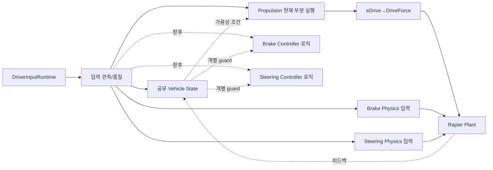
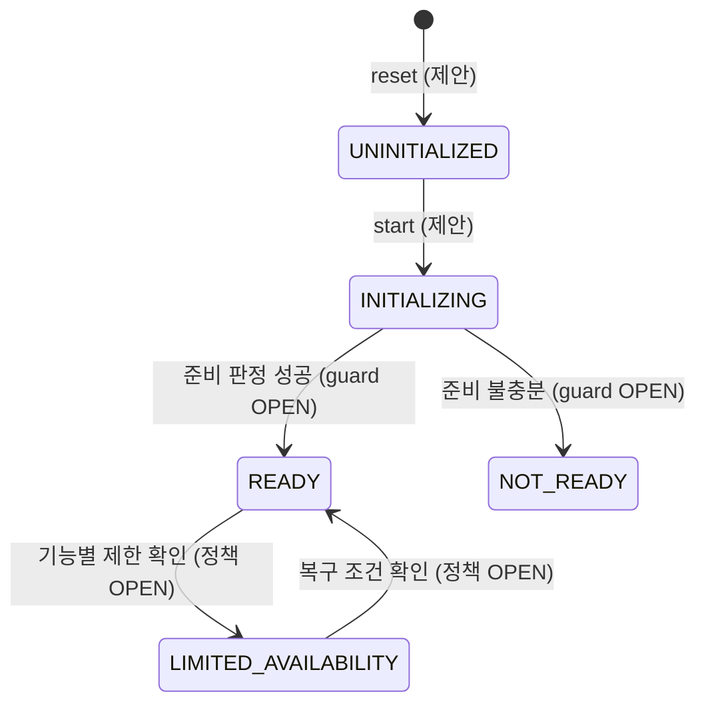
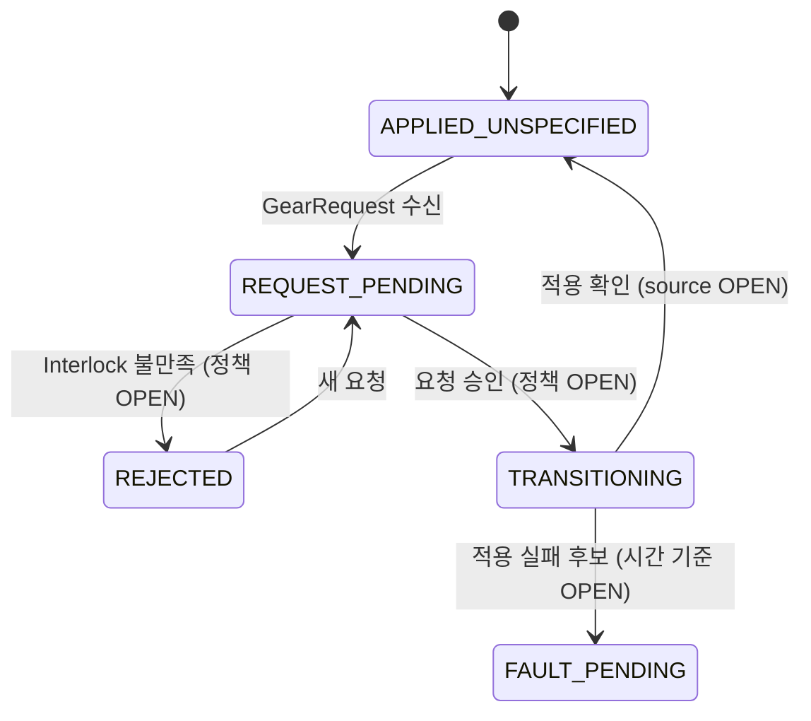
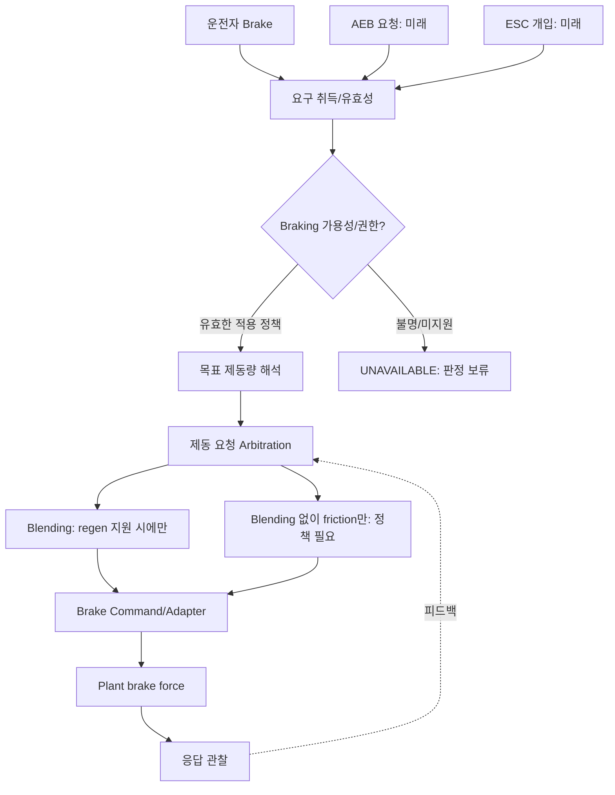
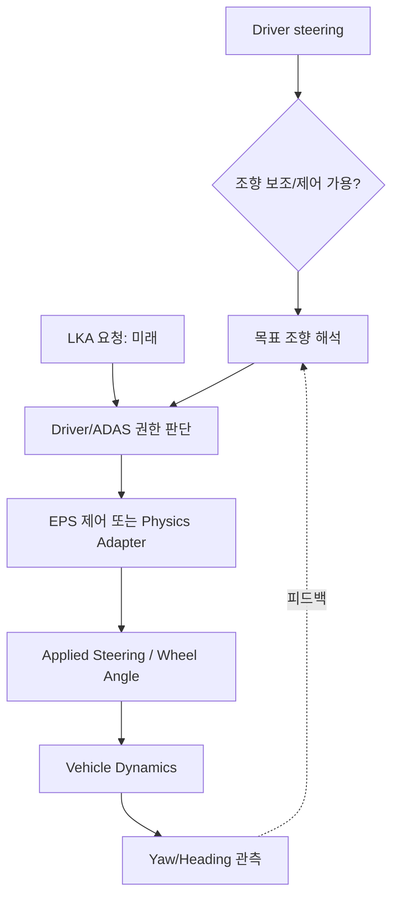

# TRACKBACK Phase 03-B — Driver·Environment / Vehicle State / Gear / Braking / Steering

- 버전: v0.2, 2026-10-07 | **설계 검토용** (`PROPOSED/OPEN`), 기존 C/WASM/물리 코드 변경 없음.
- 근거: `Requirement.md` §9~27·§32·§40, Phase 01/02 한글 설계, `03_INTERNAL_LOGIC_STATE_MACHINE_KO.md` 및 기존 Codex 실행 보고. **함수 이름과 Subfunction은 Phase 02 ID를 유지한다.**
- 근거 등급: `SRC_DRAFT`=참조 요구/명세에 서술; `CODEX_REPORTED`=실제 실행되었다는 도구 보고(직접 확인 전); `ENGINEERING_PROPOSAL`=신규 참조 설계; `OPEN`=정보 부족. 이 페이지의 조건을 실제 차량/검증 결과로 주장할 수 없다.
- 표에 있는 `*Request`, `*Valid`, `*Available`처럼 기존 Runtime Dictionary에 없는 표기는 **개념 데이터 항목(임시 이름)** 이지 등록된 캐노니컬 Signal이 아니다. 특히 아래 상태 후보는 enum이 아니다.

## B0. 두 가지 처리 경로를 구분한다

1. 현재 보고된 **실행 구간**: `DriverInputRuntime`의 accelerator/brake/steering, gear=D 시나리오 전제 → VMC/eDrive 구동 출력 + brake/steering의 Rapier physics 적용 경로. 독립적인 Brake Controller/EPS/Transmission Controller, 노면 휠슬립 센서는 실행 근거 없음.
2. **제안 논리 경로**: Request → validity/applicability → domain state/guard → functional demand → cross-domain constraints → controller/adapter → Plant → independent observation. 새 논리 단계가 곧 실제 실행 객체임을 뜻하지 않음.

## B1. Driver/Environment: 운전자·환경 입력 경계 — 3개 기능

운전자 입력은 **조작 의도**이고, 센서 신뢰도나 실제 제어 요구와 동일하지 않다. Environment State는 참조 Ground Truth를 ADAS용 추상 정보로 변환하는 역할이며 실제 카메라/레이더 검출을 시뮬레이션하지 않는다.

### `LF-DRV-ACQ` — 취득
- **하위 처리**: `ACQ-ACCEL`, `ACQ-BRAKE`, `ACQ-STEER`, `ACQ-GEAR`, `ACQ-TIME` 각각 값을 취득 → 동일 시뮬레이션 clock에 timestamp 부여 → 원시 조작 명령을 변경하지 않고 보관 → 소비 기능으로 전달. Gear는 `requested` 값만 제공.
- **입력→출력**: 운전자 키/조작 이벤트 및 scenario stimulus → `rawDriverCommands`(개념)와 timestamp. 출처마다 수집 주기가 다르면 freshness를 별도로 기록.
- **조건/상태**: UI 게임 일시정지, 새 시나리오 reset, 사전조건 주입, driver scenario active를 구별. 이전 상태 값 유지 방식(sample/hold)은 **OPEN**.
- **반례**: accelerator 값을 0으로 만든 사건을 Invalid 센서 고장이라고 판단하면 안 됨. Gear D 요청이 실제 Gear D 적용을 뜻하지 않음.
- **지원/검증**: accelerator/brake/steering 제어 + scenario reset은 `CODEX_REPORTED`; raw sample timestamp의 독립 기록은 `OPEN`. 관측 재현 시험: reset 직후 첫 샘플, STEP/RAMP 경계 tick.

### `LF-DRV-VALID` — 입력 품질·정규화
- **하위 처리**: `VALID-RANGE` → `VALID-STATUS` → `VALID-CONVERT` → `VALID-AGE`를 논리적으로 분리. 정규화는 단위 변환/값 표현이며 센서 진단과 다름.
- **입력→출력**: 원시 조작, 자료형/등록 도메인, 제공되는 별도 validity/freshness → 판단 가능한 `quality`/normalized input; 판정 근거가 없으면 `UNKNOWN`, 정상 `VALID` 강제 금지.
- **조건/상태**: 허용 입력 범위가 [0,1]인 DriverInputRuntime accelerator/brake 및 [-1,1] steering **보고**만 존재. 실제 페달 센서 이중 채널/불일치 판단은 정의되지 않음.
- **반례**: `clamp(1.1, 1.0)`만 수행하고 입력 범위 위반 이벤트를 없애면 이상 주입 관찰이 소실. `NaN`/타입 오류를 정상 0으로 위장하면 안 됨.
- **지원/검증**: 게임 입력 경계값 BVA 가능할 수 있으나 `INVALID_STATE`, freshness 기반 Fault Diagnosis는 미지원. 변환 전후 값·변환이 일어난 위치를 구분하여 관측.

### `LF-ENV-STATE` — 환경 상태 제공
- **하위 처리**: `ENV-ROAD` 도로 구간/노면 → `ENV-TRAFFIC` 객체 위치/속도 → `ENV-REL` 상대 거리·상대 속도 → `ENV-LANE` 차로 상대 정보. 구현 근거가 없는 필드는 노출 금지.
- **입력→출력**: Scenario Environment / Traffic truth → 필요한 경우 객체 유효성, 상대 속도, 차로 위치 등 추상 state; 인지 sensor output으로 명명하지 않음.
- **조건/상태**: 환경 데이터 시각이 차량 state 시각과 일치하는지, 동일 물체 추적 ID의 연속성이 있는지, 참조 경로가 제공됐는지 확인하는 guard 필요(모두 **OPEN**).
- **반례**: 가상 객체가 보인다는 사실로 AEB가 해당 객체를 검출·추적한다고 주장할 수 없음. 상대 거리 0이 항상 충돌을 뜻하지 않음.
- **지원/검증**: 실제 Traffic/road source 필드가 확인된 후에만 의미 있는 테스트 구성. 현 단계는 `SRC_DRAFT/REFERENCE_ONLY`.

## B2. Vehicle State / Mode 공유 서비스 — 4개 기능

**기어 상태, 차량 준비, 기능별 가용성은 서로 다른 소유자가 담당한다.** VehicleReady 및 DriveEnable을 하나의 boolean으로 합치면 기능별 정책이 사라짐.

### `LF-VS-INIT` — 초기화·준비 상태
- **하위 처리**: `INIT-START` 초기화 이벤트 → `INIT-READY` 필요한 준비 조건 집계 → `INIT-EXPOSE` 요청자에게 ready 정보 → `INIT-RESET` 리셋 시 독립 기능 상태 초기화.
- **입력→출력**: 초기화 완료 이벤트·구동 가용 정보(존재할 때) → `VehicleReady`(참조 이름) 및 근거/미확정 상태.
- **Guard**: 요구조건에서 `VehicleReady=TRUE`를 사용하는 것은 명시됐지만, 그 값의 계산식은 없음(`OPEN`). 모든 ECU가 READY여야 한다는 일반 규칙을 임의 정의하지 않음.
- **상태 후보**: `UNINITIALIZED → INITIALIZING → READY`는 제안된 관찰 단계일 뿐; 전원 OFF 복귀와 Failure 상태는 미정.
- **검증 반례**: Plant가 움직인다고 VehicleReady 출력이 TRUE였다고 추정하면 안 됨.

### `LF-VS-PERM` — 주행 허용·인터록
- **하위 처리**: `PERM-READY` 준비 확인, `PERM-GEAR` 적용 기어 확인, `PERM-FAULT` 기능 제한 확인, `PERM-FINAL` 해당 기능에 필요한 허용 정보만 발행.
- **입력→출력**: `VehicleReady`, `GearState`, availability, fault limits → `DriveEnable` 또는 개별 permission. 단 `DriveEnable`의 생성 로직은 `OPEN`.
- **조건**: Propulsion v0.1 `READY` 가드인 `VehicleReady AND GearState=DRIVE AND DriveEnable`은 참조 요구상 사실. 하지만 이것이 DriveEnable 계산의 정확한 식을 정의하지는 않음.
- **반례**: DriveEnable=FALSE여도 Brake 기능까지 비활성화하면 안 됨. 주행 중 회복 정책은 별도 정의 필요.

### `LF-VS-MODE` — 모드 관리
- **하위 처리**: `MODE-REQUEST` 모드 요구 → `MODE-GUARD` 전환 가능 조건 → `MODE-PUBLISH` 현재 모드 → `MODE-TRANSITION-REPORT` 요청/실제 반영의 구분.
- **입력→출력**: 드라이브 모드 요구와 현재 적용 상태 → 실제 모드/전이 상태/거부 이유. `DriveMode`는 Propulsion v0.1 개요에만 등장, 정확한 map 반영은 `OPEN`.
- **상태 후보**: `REQUESTED`, `ACCEPTED`, `APPLIED`, `REJECTED`는 **전환 생명주기** 분류로, 실제 드라이브 모드 enum과 구분해야 함.
- **반례**: `Sport`와 `Eco` 모드에서 torque Expected가 같다고 단정하지 않고 등록 Calibration이 없으면 판정 불가로 둠.

### `LF-VS-FAULT` — 고장 상태에서의 가용성
- **하위 처리**: `FAULT-AGGREGATE` 도메인별 고장/반응 상태 취합 → `FAULT-PERMISSION` 영향 받는 기능만 제한 → `FAULT-RECOVERABILITY` 복귀 가능성 전달.
- **입력→출력**: Domain fault statuses → 독립적인 기능별 availability/limitation descriptor(개념).
- **Guard**: 누가 어떤 고장에 대해 차량 전체 READY를 변경할 수 있는지 safety/functional requirements가 필요함(**OPEN**).
- **반례**: Steering assist fault가 있다고 구동·제동을 모두 OFF로 만들면 안 됨. 특정 반응을 '안전 상태'로 선언하려면 별도 safety analysis가 필요함.

### Vehicle State — 개념 상태/가용성 상호작용

- `UNINITIALIZED/INITIALIZING/NOT_READY/LIMITED_AVAILABILITY`는 **신규 후보 라벨**이며 실행 enum 아님. `PropulsionOperatingState` 전이를 대신하지 않음.

## B3. Gear / Direction — 4개 기능

기어 선택 스위치의 `GearRequest`, 허용된 요구, 제어기에 반영된 `GearState`, eDrive 동작 방향은 같은 값이라고 보장되지 않음.

### `LF-GEAR-ACQ` — 요청 취득
- **하위 처리**: `GEAR-REQUEST` → `GEAR-VALID` → `GEAR-AGE`. 지원 요청 집합은 P/R/N/D 후보지만 현재 Vehicle Scenario는 gear D를 명시적 전제조건으로만 보고함.
- **입력→출력**: UI selector 요청 및 요청 시각 → 구분된 요청 값/유효성/원인. 실제 선택 가능 enum과 invalid encoding **OPEN**.
- **반례**: 화면에 D 표시가 있다고 실제 변속 actuator가 D를 적용했다는 증거는 아님.

### `LF-GEAR-INTERLOCK` — 전환 허용 판단
- **하위 처리**: `GEAR-SPEED-GUARD`, `GEAR-BRAKE-GUARD`, `GEAR-DIRECTION-GUARD`, `GEAR-INHIBIT-REASON`. 모든 guard는 기능 책임을 나타내는 **후보**.
- **입력→출력**: 요청 기어, 현재 적용 기어, 속도, 브레이크 및 도메인 가용성 → `accepted/rejected/pending`와 이유; 속도 임계값·브레이크 필요 여부는 차량 정책별이라 **OPEN**.
- **반례**: 주행 속도 >0에서 무조건 모든 기어 변경을 막는 규칙도, R 즉시 허용도 근거 없음. N/P 정책은 별도 확정.

### `LF-GEAR-STATE` — 상태 추적
- **하위 처리**: `GEAR-PENDING` → `GEAR-TRANSITION` → `GEAR-ENGAGED` → `GEAR-REPORT` (제안 생명주기).
- **입력→출력**: 승인 요청, 적용 확인 또는 실패 피드백 → 보고 가능한 `GearState`. 적용 확인 source가 없으면 실제 적용 결과로 주장 금지.
- **반례**: 요청 D가 들어온 tick에 기어 상태가 즉시 D라고 주장하면 지연/거부 고장 사례를 구현할 수 없어짐.

### `LF-GEAR-REACT` — 전환 실패
- **하위 처리**: `GEAR-FAIL-DETECT`가 관측·계약 기반 이상을 수집 → `GEAR-INHIBIT` 기능상 처리 → `GEAR-RECOVER` 복구 guard를 개별 검토.
- **입력→출력**: 전환 요청 시각, 적용 상태, 오류/timeout 기준(미정) → 진단 상태/거부 이유/복귀 가능 여부.
- **반례**: 요청→적용 한 tick 지연이 있다고 자동 timeout FAIL 처리 불가. timestamp pair와 허용시간 계약이 있어야 함.

### Gear — 요청과 적용을 구분한 생명주기

- 전체 상태 이름은 `DESIGN_CANDIDATE`. `GearState` 값 P/R/N/D와 **서로 다른 종류**의 상태다.

## B4. Braking — 7개 기능

Braking은 **요청 해석 → 요구 조정 → Brake Controller/Adapter → 마찰력 및 차량 감속** 역할로 분리한다. Propulsion을 끄면 모든 제동이 사라지는 식으로 연결하지 않는다. `BrakeForce`가 계산됐다는 사실만으로 실제 유압·휠 토크를 측정한 것은 아니다.

### `LF-BRK-ACQ` — 제동 요구 수집
- **하위 처리**: `BRK-PEDAL` 운전자 페달, `BRK-ADASSRC` AEB, `BRK-STABSRC` ESC/ABS 등 개입을 **출처를 보존하여** 수집 → `BRK-VALID` 독립 validity/갱신 상태.
- **입력→출력**: Driver brake ∈ [0,1] (`CODEX_REPORTED`), AEB 감속 요구/ESC 개입은 `REFERENCE_ONLY`. 요청은 단위(감속 m/s², 압력, normalized demand 등)가 다르면 즉시 수치 결합 금지.
- **조건**: 같은 출처의 두 sample을 마지막 수신 시각과 비교하는 기준은 OPEN.
- **예시 가설**: AEB braking request가 발생했는데 Brake 경계에서 인식되지 않음 → source/destination 양단 관찰 필요.

### `LF-BRK-STATE` — 가용성 및 제동 상태
- **하위 처리**: `BRK-ENABLE` 기능 가용성, `BRK-MODE` 제어 방식, `BRK-FAULT-STATE` 고장 가용성, `BRK-PUBLISH` 소비자 제공.
- **입력→출력**: 브레이크 가용 신호/진단 보고 → 기능 상태 및 요청 승인 가능 여부. 구성요소의 전원/유압/모터 존재와 같은 하드웨어 정보 **OPEN**.
- **상태 후보**: `AVAILABLE`, `LIMITED`, `UNAVAILABLE`는 가용성 범주이지 실제 Brake ECU state가 아님.
- **반례**: D 기어 해제 후에도 브레이크 제동 요구를 처리해야 할 수 있으므로 `DriveEnable`을 모든 Braking 가드에 넣는 것은 부적절.

### `LF-BRK-DEMAND` — 감속 요구 해석
- **하위 처리**: `BRK-INTENT` 유효 제동 의도 확인 → `BRK-REQUEST-MAP` 목표 감속/제동량 도출 → `BRK-COAST/DISABLE` 요구가 사라질 때 정책 → `BRK-DEMAND-PUBLISH`.
- **입력→출력**: normalized brake 등 → 논리 `RequestedDeceleration` 또는 `RequestedBrakeTorque` 중 **하나를 명시적 계약으로 선택** (아직 이름/계산식 미확정).
- **조건**: 차량 속도, 노면, 동력계, brake map, 정지 유지, 후진 부호 등이 영향을 줄 수 있지만 실제 Calibration 없음.
- **반례**: brake=0.5에서 목표 감속이 항상 절반이라고 가정하면 비선형 페달/힘 제한 문제를 은폐함.

### `LF-BRK-COORD` — 요구 조정
- **하위 처리**: `BRK-ARB-REQUEST` 출처·목적을 식별하고 충돌 검사 → `BRK-PROP-INTERLOCK` 구동/제동 공존 정책 검토 → `BRK-LIMIT` 가용 제약 → `BRK-PRIORITY` 최종 결정.
- **입력→출력**: 운전자·AEB·ESC의 서로 다른 의미/단위 요구 → 승인된 제동 목적·제어권 상태. VMC의 전체 Arbitration과 이 기능의 최종 책임을 중복 할당하지 않음.
- **조건**: Emergency request가 있다고 항상 어떤 우선순위로 특정 Brake 출력이 생성되는지는 정책 **OPEN**.
- **반례**: accelerator+brake 동시 입력이 무조건 brake priority라는 무조건 규칙은 근거 부족; 물리 제동은 무효화하지 말고 실제 정책/차량 타입에 맞춰 결정해야 함.

### `LF-BRK-BLEND` — 회생·마찰 제동 배분
- **하위 처리**: `BLEND-ELIGIBLE` 회생 가능/불가능 판단 → `BLEND-REGEN-LIMIT` 전기 구동 및 에너지 제약 적용 → `BLEND-FRICTION-REMAINDER` 목표 제동 부족분 할당 → `BLEND-TRANSITION` 중첩/변환 시 연속성 보장(정량 기준 미정).
- **입력→출력**: 승인된 총 제동 목표 + Energy/Propulsion의 회생 가능 제약 → `RegenContribution` / `FrictionContribution` **후보 신호**. 각 구동 토크/휠 토크/차량 감속으로 환산하는 모델 필요.
- **조건**: BMS, wheel slip, 에너지 회수 여건, 제동력 회복 등 무정의. 현재 Rapier에 BrakeForce가 있다고 회생 기능도 있다는 결론 금지.
- **반례**: 전체 BrakeForce에 회생 제동을 중복해서 더해 총 감속이 과대해지는 구현 금지.

### `LF-BRK-CMD` — 제동 명령 생성
- **하위 처리**: `BRK-CMD-CONVERT` 목표를 명령단위로 변환 → `BRK-CMD-VALID` 상태/유효성 보존 → `BRK-CMD-SATURATE` 승인된 가용 제한 → `BRK-CMD-PORT` 명령 발행.
- **입력→출력**: 승인 목표/회생·마찰 기여 → 출력 명령과 validity. Brake SW controller 모델이 미확정이므로 실제 `BrakeForce`는 Plant 적용 결과와 분리.
- **조건/반례**: 동적 지연, 속도에 따른 한계, failure reaction을 알고리즘으로 임의 추가하지 않음; validity FALSE 시 실제 Brake reaction은 OPEN.

### `LF-BRK-FDBK` — 응답 감시
- **하위 처리**: `BRK-OBSERVE` 독립 응답(있으면) 채취 → `BRK-COMPARE` 요구·반응의 시각과 단위 정렬 → `BRK-FAULT` 승인 criterion 평가 → `BRK-RECOVER` 복귀 guard.
- **입력→출력**: 명령, 적용 제동력, 감속 관측 중 측정 가능한 것 → `MATCH/MISMATCH/UNAVAILABLE` 성격의 관찰 결과, 진단 확정과 구분.
- **조건**: 차량 가속도는 구배/구동력/노면의 합력 결과로서 명령된 단일 BrakeTorque와 같지 않음. 단순 차이값만으로 ECU Fault 결정 불가.
- **반례**: `BrakeForce`와 brake 요청이 둘 다 증가해도 실제 감속이 정확한지 별도 기준 없으면 `OBSERVED`.

### Braking — 논리 상태 및 출력 관계

**Braking state 후보**: `AVAILABLE`, `REQUESTED`, `ACTIVE`, `LIMITED`, `FAULTED`, `RECOVERY_PENDING`은 가용성과 제어 생명주기가 섞이기 쉬움. 최종 모델에서 `AvailabilityState`와 `DemandState`를 **직교 영역**으로 분리. Trigger, fault severity, recovery guard, braking zero output/park hold 정책은 전부 `OPEN`.

## B5. Steering — 6개 기능

Steering은 **운전자의 조향 의도**, **조향 보조**, **바퀴각**, **차량 yaw 결과**가 서로 다르다. EPS와 steer-by-wire는 구조가 다르므로 현재 모델이 어떤 아키텍처인지 결정되기 전에는 제어 로직을 하나의 실제 SW처럼 고정할 수 없다.

### `LF-STR-ACQ` — 요구 취득
- **하위 처리**: `STR-DRIVER` 운전자 normalized steering → `STR-ASSIST` LKA 등의 보조 요구(미래) → `STR-VALID` 요청 유효성 → `STR-AUTHORITY` 출처/제어권 기록.
- **입력→출력**: steering ∈ [-1,1] (`CODEX_REPORTED`) 및 미래 LKA 조향 보조 후보. normalized 조작값은 steer-wheel angle 또는 road-wheel angle이 아님.
- **반례**: 좌회전 steering input -1이 실제 yaw를 정확히 -1 rad/s 만드는 규칙은 거짓.

### `LF-STR-STATE` — 조향 가용성
- **하위 처리**: `STR-AVAIL` 장치/모델 가용성 → `STR-ASSIST-MODE` 보조 활성화 → `STR-FAULT-STATE` 기능제한 → `STR-PUBLISH` 현재 가용 범위.
- **입력→출력**: EPS assist 또는 SbW 구현 상태(미확정) → assist availability + mode. 실제 `ASSIST_ACTIVE`/`LIMITED` enum은 등록되기 전까지 제안 상태.
- **반례**: 보조기능 unavailable은 기계식 조향이 불가능하다는 뜻이 아닐 수 있음; steer-by-wire와 기계 연결형을 동일시하지 않음.

### `LF-STR-DEMAND` — 목표 조향 해석
- **하위 처리**: `STR-MAP` 운전자/보조 요구를 목표 조향 물리량으로 변환 → `STR-LIMIT` 범위·속도 제약 → `STR-OPTIONAL-FILTER` 연속성 조건(요구 시) → `STR-REQUEST`.
- **입력→출력**: raw steering + speed → 실제 모델이 채택한 목표(road wheel angle, assist torque, yaw-rate request 등 한 가지 타입을 명확히 택함). 데이터에 실제 mapping 없음.
- **반례**: 핸들 각도와 전륜 조향각을 일대일로 계산하면 steering ratio를 놓침. 속도 따른 동작 변화를 가정한 Expected를 만들어선 안 됨.

### `LF-STR-COORD` — 운전자와 보조 요구 조정
- **하위 처리**: `STR-REQUEST-TYPES` 요구 형태 일치 확인 → `STR-DRIVER-OVERRIDE` 운전자 개입 검출 기준(미정) → `STR-PRIORITY` 권한 결정 → `STR-FINAL-DEMAND`.
- **입력→출력**: Driver steering, LKA 요청과 availability → 최종 명령과 출처. 운전자 override가 존재한다는 개념은 제안이지만 감지 임계값 없음.
- **반례**: LKA와 운전자 요구를 단순 더하면 actuator saturation 및 중복 조향 문제가 발생할 수 있음.

### `LF-STR-ACT` — 조향 출력
- **하위 처리**: `STR-ACT-CONVERT` actuator command 변환 → `STR-ACT-GUARD` 유효성/가용 제약 → `STR-ACT-SEND` 명령 전달 → `STR-ACT-APPLIED` 적용 상태 기록.
- **입력→출력**: 최종 목표값/command → 물리 adapter 입력 및 독립된 실제 적용 상태(존재 시). 현재는 Rapier 조향 입력 반응만 보고됨.
- **반례**: physics가 돌아간다는 이유로 별도 EPS software runner와 interface telemetry가 구현됐다는 증거는 아님.

### `LF-STR-MON` — 조향 응답 감시
- **하위 처리**: `STR-FEEDBACK` 실제 조향각 또는 yaw 관측 → `STR-DEVIATION` 물리량 정렬 → `STR-MON-STATUS` 관찰 결과 → `STR-RESPONSE` 진단 요청(기준 존재 시).
- **입력→출력**: command, applied angle, vehicle yaw 등 → 비교 결과. Yaw는 속도/타이어/노면 영향 포함; 목표 steer angle과 같은 수치 비교 금지.
- **반례**: 정지 상태에서 yaw가 0이라는 사실은 조향 모터가 작동하지 않았다는 증거가 아님.

### Steering — 요청과 적용 관측

**Steering state 후보**는 독립 `AssistAvailability` + `RequestAuthority` + `ActuatorStatus`로 다뤄야 한다. 하나의 `STEER_ACTIVE`로 압축해 LKA와 운전자 조향을 동시에 설명하려는 모델은 부적절하다.

## B6. 이 문서의 판단 기준과 열린 쟁점

| 질문 | 필요한 근거 | 미정이면 가능한 결론 |
|---|---|---|
| 차량 READY에서 브레이크 입력은 항상 유효한가? | 제동 가용성/입력 계약 | Range만 확인, 동작 Expected 불가 |
| Brake 0.5일 때 감속 얼마? | brake map, vehicle/road dynamic oracle | Actual 관찰만 가능 |
| Gear D 요청이 적용됐는가? | gear consumer/feedback | D request 확인에 한정 |
| 왜 Steering이 상태를 갖는가? | 가용성, 제어권, 모드·fault handling 관계 | 역할 설명은 가능, 정확한 전이 미정 |
| 운전자·AEB 동시 요청의 우선권? | Arbitration 정책/요구사항 | 자동 판단 금지 |
| ABS 휠잠김 해제 후 다음 명령? | 제어 주기·휠속·slip 기준 | 추후 03-C에서 분석 |

### 승인 전 검사 후보 (PASS/FAIL로 단정하지 않음)
1. DriverInput normal STEP/RAMP → 같은 시각의 physical brake/steer 관측이 실제 연결된 구간만 비교.
2. zero brake, nonzero accelerator; zero accelerator, nonzero brake; simultaneous accelerator/brake에서 관찰값과 숨겨진 정책 간 충돌 확인.
3. Gear D request와 runtime GearState/permission 사이 소유권·출처 감사.
4. 계층 식별자, 단위, source ID, validity가 없는 관측에 허위 Expected를 생성하지 않았는지 검사.
5. 제안 상태 다이어그램을 정식 testcase 또는 실제 차량 safety requirement로 자동 발행하지 않음.
