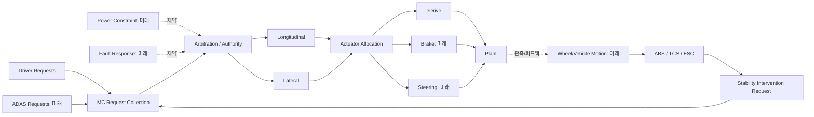
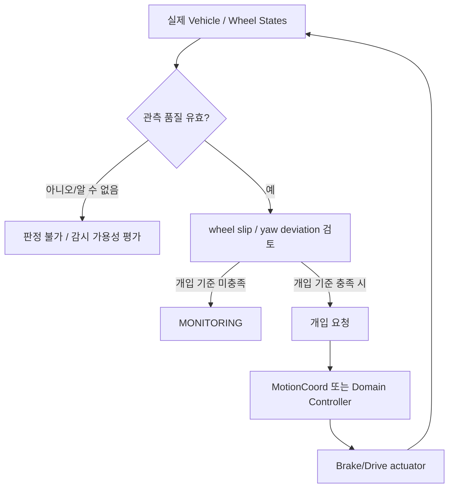
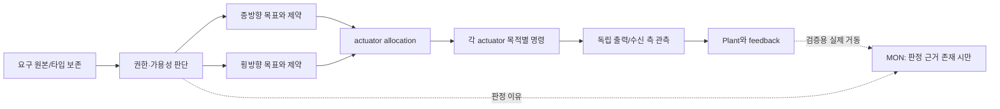

# TRACKBACK Phase 03-C — Stability / Motion Coordination

- `v0.2`, 설계 검토용 · 2026-10-07 · 모든 신규 상태/요청 형식 `ENGINEERING_PROPOSAL`, 숫자·전이 guard는 `OPEN`.
- Phase 02 논리 Function 10개: `LF-STB-ABS/TCS/ESC/COORD`, `LF-MC-REQ/AUTH/LON/LAT/ALLOC/MON`. 문서상 예정 분야이며 **실제 ABS, 휠속도 센서, ESC yaw controller, 독립 Motion CAN-FD SW, VMC 다중 요구 Arbitration은 구현 확인 안 됨**.
- 근거: `Requirement.md` §12–16·§22·§24·§27, `02_DOMAIN_FUNCTION_DECOMPOSITION_KO.md` 해당 식별자, `03_INTERNAL_LOGIC_STATE_MACHINE_KO.md` 상태 및 VMC 경계 규칙.

## C0. 왜 두 영역을 분리하나

- **Stability**: 차량이 원하는 운동에서 벗어나거나 휠이 비정상적으로 미끄러지는 상황을 파악하여 **구동·제동·자세 안정화 개입 요구를 만드는 기능**.
- **Motion Coordination**: 운전자·ADAS·Stability·Power/Fault Constraint의 요구를 받아 **실제 구동·제동·조향 액추에이터로 어떤 목표를 보낼지 정책적으로 정하는 기능**.
- `VMC`라는 소프트웨어가 현재 수행하는 것으로 보고된 역할은 VMC/eDrive 토크 요구 계산. 모든 Motion Coordination 역할이 VMC 코드에 구현됐다는 주장은 금지.
- Stability 기능은 도메인 단위 감시/제어이지만 ESC/ABS/TCS를 무조건 동일한 차원/단위의 torque로 직접 더할 수는 없다.

## C1. Stability — 4개 논리 Function

### `LF-STB-ABS` — Antilock Braking System
- **목적**: 제동 시 개별 휠이 잠기는 경향을 감시하고, 가능한 범위에서 바퀴 회전을 유지하도록 휠별 제동을 조절하는 기능. `차량이 반드시 제동거리가 짧아지는 기능`으로 정의하면 틀릴 수 있다.
- **하위 판단**: 휠속도 관측 → 차량 참조속도 추정 및 유효성 검사 → 제동 중 휠 슬립/감속 추정 → ABS 개입 필요 여부 → 대상 휠의 제동압력/토크 감소·유지·재증가 요청 후보 → 반응 관측.
- **입력 후보**: `wheel angular velocity`, `effective radius`, vehicle reference speed, brake demand, wheel speed validity, road/actuator state. **현재 런타임에는 신뢰 가능한 개별 휠 속도/슬립 관찰 지원이 확인되지 않음**.
- **제어 원리(수치 미정)**: 단순 감시용 longitudinal slip 후보 `s=(v - rω)/max(|v|, v_epsilon)`는 제동 방향의 이상화된 표기이며 v≈0, reverse, wheel reference direction, 타이어 유효 반경, 차량 참조속도 편향 정책 필요. 이 식은 현재 TRACKBACK의 승인 Calibration·Requirement가 아니다.
- **상태 후보**: `STANDBY`, `MONITORING`, `MODULATING`, `UNAVAILABLE`; 개입은 여러 바퀴에서 동시에 다를 수 있어 하나의 global state만으로 wheel 명령을 결정하지 않음.
- **조건**: brake request가 있는지, wheel sensor sample이 유효한지, 휠 잠김/재가속 기준이 충족됐는지. 실제 slip threshold, hold/down/up duty, timing = `OPEN`.
- **출력 후보**: `perWheelBrakeModulationRequest`와 intervention status. 마찰제동 명령에 사용되므로 임의로 eDriveCommand에 직접 덮어쓰지 않음.
- **고장/반례**: 정상 속도 신호 한 개만으로 모든 wheel lock을 판단하거나 `ABS_ON` 상태를 제동 전체 허용으로 삼으면 안 됨. 비교 기준이 없으면 `OBSERVED`만 가능.

### `LF-STB-TCS` — Traction Control System
- **목적**: 구동 시 바퀴의 과도한 회전/미끄럼을 제한하도록 구동 토크 또는 제동 개입을 요청.
- **하위 판단**: 가속 요구/휠 회전 측정 → 참조속도와 wheel rotation 관계 비교 → 구동 슬립 후보 평가 → 허용 토크 제한·선택적 wheel brake intervention 요청 → 결과 모니터.
- **입력 후보**: driven wheel speed, vehicle reference speed, applied drive torque/request, wheel validity, traction/road condition. `VehicleSpeed` 단독으로는 어떤 바퀴가 slip인지 알 수 없음.
- **상태 후보**: `STANDBY`, `WATCHING`, `INTERVENING`, `LIMITED`; guard와 phase durations OPEN.
- **출력 후보**: `driveTorqueUpperConstraint`, `wheelBrakeInterventionRequest`, source=`TCS`. torque의 signed/magnitude semantics를 Propulsion limiter가 결정할 때 보존해야 함.
- **반례**: 구동력 감소 자체를 `eDrive defect`로 단정하면 안 됨. TCS가 정상 개입해 torque를 줄인 것인지 출처를 추적해야 함.

### `LF-STB-ESC` — Electronic Stability Control
- **목적**: 차량 실제 횡방향 운동(예: yaw)이 목표 운동과 크게 어긋날 때 적절한 휠 제동/구동 제한 등 안정화 개입 요청.
- **하위 판단**: 운전자 조향·속도·유효성으로 목표 yaw/trajectory 후보 계산 → 독립 yaw/측가속/자세 관측 확인 → 방향성과 편차 평가 → 통제 가능한 개입 요청 → 실제 vehicle feedback.
- **입력 후보**: steering quantity (운전자 steering과 road wheel angle 구분), speed, yaw rate, lateral acceleration, wheel state, validity, tire/road model. **현재 Physics X/Z position을 실제 yaw sensor와 동의어로 처리 금지**.
- **상태 후보**: `AVAILABLE`, `MONITOR`, `CORRECTING`, `LIMITED`; 좌/우 개입 분배는 Wheel Brake model 및 Authority owner와 합의 후 설계.
- **출력 후보**: selective wheel brake, drive torque reduction, optional stability constraint. 마찰계수와 actuator capability를 만족할 수 없으면 안정화 성공을 주장하지 않음.
- **반례**: 정상 driver steering에도 미끄러운 노면의 Plant yaw가 어긋날 수 있어 내부 로직 불량을 자동 추정 금지.

### `LF-STB-COORD` — 안정화 개입 전달
- **목적**: ABS/TCS/ESC에서 생성된 개입 요구를 대상 제어 영역에 **출처·유효성·우선권**과 함께 전달.
- **하위 처리**: 요청별 목적 및 단위 표준화 계약 확인 → 동일 wheel/actuator 충돌 식별 → Domain owner 또는 Motion Coordination에 전달 → source/destination observation.
- **입력→출력**: `ABS wheel brake limit`, `TCS torque bound`, `ESC selective brake` → typed constraint/intervention request (예시 타입으로만 제안).
- **조건**: 어떤 요청이 Brake controller에 직접 전달되고 어떤 요청이 MC를 거치는지 Deployment allocation **OPEN**. 임의의 CAN 프레임 생성 금지.
- **반례**: ABS가 brake pressure를 낮추는 요청과 AEB가 차량 감속을 높이라는 요청은 단순 MAX/MIN으로 해석되지 않음. 권한과 액추에이터 공간이 다르다.

### Stability 상태와 원인 추적 그래프

`개입 기준`은 실제 threshold가 아닌 **OPEN guard**. ABS/TCS/ESC를 한 개의 상태 머신으로 합치지 않고 독립 요청자로 관리한다.

## C2. Motion Coordination — 6개 논리 Function

### `LF-MC-REQ` — 요청 수집
- **목적**: 서로 다른 기능이 요구하는 차량 운동을 **원본 요청의 의미와 권한을 보존한 채** 수용.
- **하위 처리**: `MC-COLLECT` 출처 취득 → `MC-TYPE` torque/acceleration/deceleration/steering/yaw 요구 구분 → `MC-VALID` validity/time/source 확인 → `MC-TRACE` provenance 저장.
- **입력 후보**: Propulsion, Braking, Gear permission, Driver steering, ACC/AEB/LKA, TCS/ESC; 특정 기능이 미구현이면 입력 자체 없음. 별칭 ID가 같아 보인다고 중복 sample 합산 금지.
- **출력 후보**: typed `motionRequests[]` 이벤트 집합. **그 자체는 최종 command 아님**.
- **반례**: `RequestedDriveTorque=120 Nm`와 `AEB deceleration=3 m/s²`를 직접 수치 비교하거나 하나의 공통 scalar로 저장하면 안 됨.

### `LF-MC-AUTH` — 제어권·요구 Arbitration
- **목적**: 어떤 상황에서 누가 어느 제어 축을 지배/제약하는지 확인하고 **중복·상충 요구를 해결할 정책**을 수행.
- **하위 처리**: 요청 source/criticality/validity 구분 → `ControlAxis`(LONGITUDINAL/LATERAL/WHEEL_BRAKE)별 authority 판정 → 요청 충돌 규칙 및 제한의 소유권 적용 → 승인·거부/제약의 이유 보존.
- **입력→출력**: type-tagged requests+availability+fault constraints → `arbitrationDecision` 및 근거. 실제 priority/driver override/중재 타임아웃은 `OPEN`.
- **상태 후보**: 축별 `MANUAL`, `ASSISTED`, `AUTOMATED_REQUESTED`, `CONSTRAINED`, `UNAVAILABLE`는 서로 배타적인 하나의 모드가 아니라 다양한 dimension의 후보.
- **반례**: `AEB = 항상 최대 브레이크`, `driver = 항상 조향 최우선` 같은 절대 우선순위를 Requirements 없이 고정하면 안전 관련 분석 결과와 충돌할 수 있음.

### `LF-MC-LON` — 종방향 운동 조정
- **목적**: accelerator/torque, decel/brake, ACC/AEB, traction 제약을 차량 종방향 동작 요청으로 정리.
- **하위 처리**: 축 종류 식별 → 요청 간 차량 방향/기어/주행 모드 관련성 확인 → 적용 가능한 drive/brake 요구의 균형·제약 → 인가 가능 목표 발행.
- **입력→출력**: accepted requests + torque/regen availability → longitudinal demand/constraints. 요청 단위가 토크라면 실제 변환 소유자와 관찰지점이 있어야 함.
- **반례**: driver brake>0이라고 drive torque를 항상 0으로 만드는 것은 정책 부재를 숨김. 양 제어가 실제 물리 Plant에 각각 작용할 수도 있으므로 명령·반응을 별개로 기록.

### `LF-MC-LAT` — 횡방향 운동 조정
- **목적**: 조향 운전자 요구, LKA 보조 요구, ESC의 안정화 제한이 동시에 있을 때 횡방향 목표·권한을 관리.
- **하위 처리**: steering 목표 종류 식별(각/토크/yaw) → 각 영역별 authority 선택 → 최종 제한/경로 → steering controller에 typed command 전달.
- **입력→출력**: driver steering, LKA demand, stability intervention → lateral decision + owner. wheel angle과 yaw를 같은 신호처럼 연산하지 않음.
- **반례**: 조향 및 ESC 제동 개입은 다른 actuator이므로 하나의 steering output만으로 안정화 제약을 모두 구현할 수 없음.

### `LF-MC-ALLOC` — Actuator Allocation
- **목적**: **승인된** 차량 운동 요구를 각 actuator가 수행할 수 있는 적절한 명령으로 배분.
- **하위 처리**: actuator capability/availability 확인 → drive/brake/steer 각 명령 공간으로 분리 → 한계/상호 제약 적용 → 명령 source·destination 기록.
- **입력→출력**: approved demand + capability constraints → eDrive/Brake/EPS 각각의 명령 또는 제한. 기존 VMC→eDrive 구동 경로와 별개 계산기가 중복 생성되지 않게 함.
- **조건**: 회생 제동이나 wheel-selective braking을 설계하려면 해당 물리 모형·인터페이스·controller가 실제로 필요. 미구현이면 참조 단계.
- **반례**: `AppliedDriveForce`를 `DriveTorqueRequest` 그대로 전달하거나 음수 출력이 항상 회생 제동이라고 주장 금지.

### `LF-MC-MON` — 조정 결과 감시
- **목적**: Arbitration 결정과 실제 발행/전달/적용된 값이 **계약상** 일치하는지 평가하여 관찰 결과를 제공.
- **하위 처리**: source decision 캡처 → command endpoint 캡처 → 시간·단위 정렬 → approved criterion이 있을 때 비교 → Fault Detection 입력으로 전달.
- **입력→출력**: decision/command/plant observation with provenance → `OBSERVED`, requirement-verdict, optional diagnostic report. 한 shared object의 다른 이름을 양단 독립 telemetry로 표시 금지.
- **반례**: controller의 command가 올바르게 전달된 뒤 물리 반응만 약할 수 있으므로 SW logic fault라고 단정하지 않음.

### Motion Coordination — 제어권 및 제한 구조

## C3. Domain 간 명시적 책임 배분

| 질문 | Owner 추천 | 겹치면 위험한 이유 |
|---|---|---|
| ABS가 개별 휠 제동 감쇠를 결정? | Stability/Brake Actuation 경계 | AEB 감속 요구와 단위·우선순위 다름 |
| 차량 종방향 torque vs decel arbitration? | MotionCoord 논리 책임 | Propulsion과 Braking에 중복 Arbiter 생성 금지 |
| 실제 제동력을 Friction/Regen으로 배분? | Braking 기능, Energy constraint 소비 | MC allocator가 두 번 regen 제한하면 이중 제한 |
| 실제 VMC의 현재 Torque request 계산? | 현재 C/WASM VMC 단일 source | 신규 MC 구현이 동일 출력 덮어쓰기 금지 |
| 안전 고장 제한이 torque를 얼마나 줄일지? | 승인된 Safety/Functional Requirement 필요 | 개인 임의 감소 = safe state 아님 |
| yaw target/oracle은 누가 만드는지? | Steering/Stability 각 목표 정의 + Measurement | yaw angle·angle request를 동일시 금지 |

## C4. 상태 머신 완성 전 승인해야 할 정책

| 정책 ID | 결정 필요 | 미확정일 때 UI/검증 동작 |
|---|---|---|
| `MC-P01` | 축별 요청 타입/단위/방향 부호 | 비교 불가, 수치 합산 금지 |
| `MC-P02` | source 권한/우선순위 및 override | Arbitration `OPEN` |
| `MC-P03` | 감속·구동 동시 명령 제어 정책 | 실제 Plant 관측만 허용 |
| `MC-P04` | 횡방향 steering/LKA/ESC 조정 경계 | 요청 source만 trace |
| `STB-P01` | Wheel speed/slip/yaw 실제 관측 경로 | ABS/TCS/ESC 실행 `UNSUPPORTED` |
| `STB-P02` | 개입 enable, threshold, hysteresis, 샘플링 | intervention verdict `UNAVAILABLE` |
| `STB-P03` | 각 wheel actuator / brake control capability | selective braking 미지원 |
| `MC-P05` | source-output/destination-input boundary 관측 | interface MATCH 금지 |

**Phase 05 연동:** 각 정책이 요구사항 및 실제 source calibration/테스트 oracle로 정의되기 전에는 임의의 SYSR/SWR·PASS/FAIL·SG/ASIL을 발행하지 않는다.
