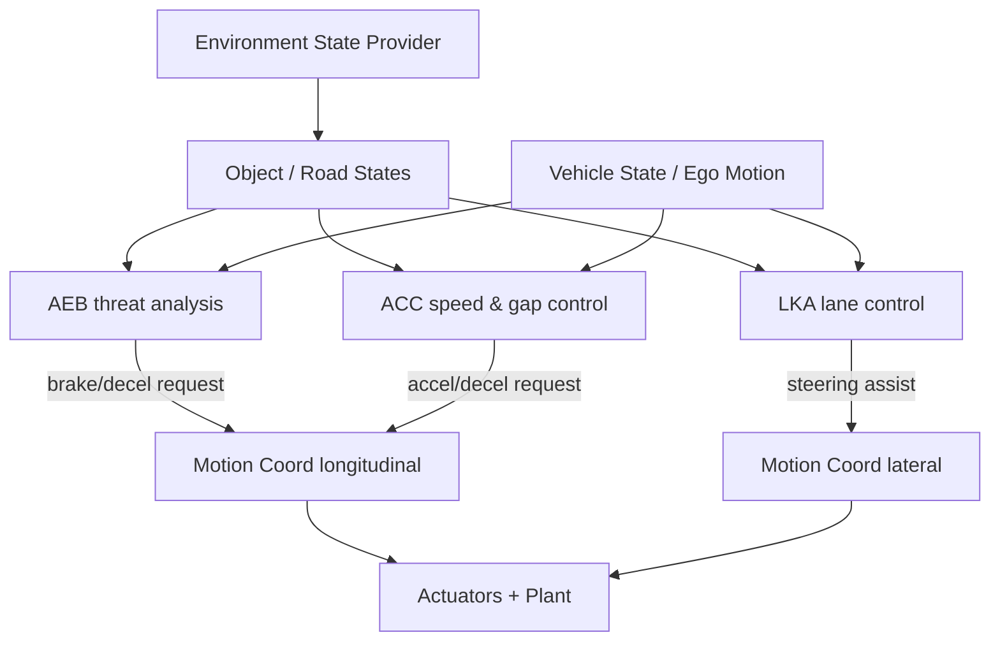
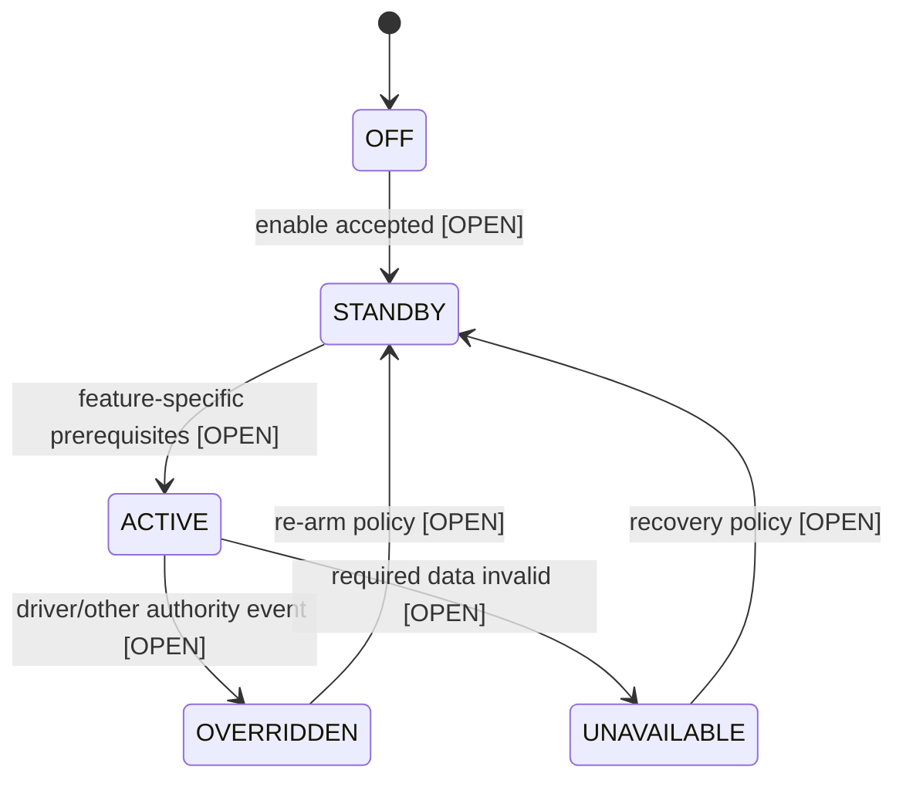
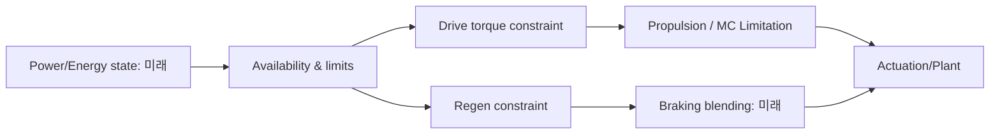

# TRACKBACK Phase 03-D — ADAS / Sensing & Estimation / Power & Energy

- 버전: v0.2, 2026-10-07. **개념·논리 로직 제안** / 미정 조건 명시 / 코드 미반영.
- 대상 10개 Function: `LF-ADAS-AEB/ACC/LKA/COMMON`, `LF-SEN-MOTION/ACT/QUALITY`, `LF-EN-READY/LIMIT/MON`.
- 출처: `Requirement.md` §11~16, §19~23, §24, Phase02 목록. `Environment State Provider`는 Traffic/Environment **Ground Truth의 가상 추상화**이며 실제 camera/radar와 구분한다. 현재 구현된 ADAS, HV battery, wheel sensors 또는 independent actuator feedback의 실행 근거는 없음.
- 각 상태·함수·표 아래 있는 통상적인 차량 제어 공학 설명은 `ENGINEERING_PROPOSAL`, 공개 참조 문서에 기능명/흐름만 있는 것은 `SRC_DRAFT`; 신규 실제 신호·정확한 정량 threshold는 전부 `OPEN`.

## D0. ASIL·안전 설계 경계

AEB/ACC/LKA, BMS 가용 제약, sensor validity가 **기능상** 정의된다고 해서 Safety Goal, 특정 ASIL 또는 양산 수준 safe state가 결정되지는 않는다. HARA/FSR/TSR/SSR은 Phase 05에서 구분하며 실제 차량 자료로 가장하지 않는다.

## D1. ADAS — 4개 논리 Function

### `LF-ADAS-AEB` — Automatic Emergency Braking
- **목적**: 전방 위험과 충돌 위험이 있다고 판단되는 경우 운전자 제동 외의 **자동 제동 요청**을 생성할 후보 기능.
- **내부 순서**: 입력 objects/relative motion 및 in-path 판단 → 관측 `validity`/신선도 검사 → 객체별 위협 가설 구성 → 접근 관계/현재 속도/경로 유효성 판정 → 경고 또는 제동 요구 가능 여부 → 제동·해제 정책 → Braking/MotionCoord에 typed request 발행.
- **입력 후보**: object distance, relative speed, object position and in-path classification, Ego speed, driver brake, AEB availability. 기존 문서에 개념적인 `ObjectValid`, `Distance`, `RelativeVelocity`, `InPath` 등장하지만 실제 등록된 canonical 신호 ID가 아님.
- **판단의 핵심**: 접근 중인 객체인지와 차량 경로상 위협인지가 별개이다. `TTC = distance / closingSpeed`는 **접근속도>0과 적절한 충돌 경로를 가정한 단순 후보 지표**로, 상대속도가 0/음수 또는 객체 측정 무효일 때 TTC를 임의의 0으로 만들지 말아야 함. TTC 기준값·제동 단계·해제·재작동 정책 모두 `OPEN`.
- **상태 후보**: `DISABLED`, `STANDBY`, `THREAT_EVALUATING`, `WARNING_REQUESTED`, `BRAKE_REQUESTED`, `SUPPRESSED`, `UNAVAILABLE`. 진짜 AEB state enum은 아직 없음.
- **출력**: `AebBrakingRequest`, rationale, active status 등 후보. BrakeForce나 AppliedDeceleration과 동일하지 않음.
- **고장 시나리오**: 유효한 object 정보 누락, in-path false classification, brake request 미전달, brake controller 거부, 요청 정상인데 물리 감속 저하 — 원인 위치가 서로 다름.

### `LF-ADAS-ACC` — Adaptive Cruise Control
- **목적**: 운전자 설정 속도 및 유효한 선행 차량과의 간격 관계를 이용해 **종방향 운동 요구**를 생성.
- **내부 순서**: 설정 속도/거리 모드 확인 → ego/target data 유효성 → 선행 차량 선택 여부 → 속도 유지 후보 제어/간격 유지 후보 제어 → longitudinal request 제한 → MotionCoord/Propulsion/Braking에 타입 맞는 전달 → cancel/standby 관리.
- **입력 후보**: set speed, selected gap, lead vehicle distance/relative velocity, ego speed, driver enable/cancel, braking intervention, ADAS availability.
- **구분**: 선행 차량이 없거나 미인식일 때 차량 속도 목표를 유지하는 mode와 유효한 선행 차량의 간격을 추종하는 mode는 다른 제어 기준. target selection이 유효하지 않으면 자동으로 '없음' 또는 '가상 정상 거리'를 만들어서는 안 됨.
- **상태 후보**: `OFF`, `STANDBY`, `ACTIVE_SPEED`, `ACTIVE_GAP`, `OVERRIDDEN`, `CANCELLED`, `UNAVAILABLE`; 구체적인 cruise set조건/버튼/브레이크 override 정책 `OPEN`.
- **출력**: 승인 제어가 필요한 acceleration/deceleration 또는 torque request 후보. 실제 physical throttle/brake command와 별개.
- **반례**: 속도가 설정 속도보다 낮다고 항상 accelerator를 키워야 하는 것은 아님. AEB 개입/커브/기어/전력 제약이 더 우선할 수 있음.

### `LF-ADAS-LKA` — Lane Keeping Assistance
- **목적**: 현재 차량의 차로 상대 위치 및 차량 방향에서 **차로 이탈을 억제하는 조향 보조 요구**를 생성할 후보.
- **내부 순서**: lane boundary/offset, heading error/curvature 등의 참조 정보 취득 → 품질/차로 존재 여부 판단 → assist eligibility → correction direction 및 desired lateral/yaw/steering command 후보 도출 → steering authority와 driver override 확인 → 조향 보조 요청 → 종료/복귀 평가.
- **입력 후보**: lane offset, lane heading/curvature, ego speed/steering, driver override, lane validity; 현재 road geometry가 있다고 perception lane-detection이 존재하는 것은 아님.
- **상태 후보**: `OFF`, `ARMED`, `ASSISTING`, `DRIVER_OVERRIDE`, `SUPPRESSED`, `UNAVAILABLE`; line-crossing threshold, minimum speed, maximum torque, driver override는 모두 `OPEN`.
- **출력 후보**: type-qualified steering assist request + availability/intervention status. road-wheel angle 명령, steering torque, yaw rate는 동일 physical quantity가 아니다.
- **반례**: laneOffset 값이 0이라는 것만으로 heading error 0이라 단정 금지. 도로 곡률을 무시한 보정이면 차로 중앙 차량에도 불필요한 제어를 할 수 있음.

### `LF-ADAS-COMMON` — 기능 공통 가용성·상태
- **목적**: AEB/ACC/LKA가 각자 사용할 수 있는 입력 품질과 차량 운용상태를 확인하며, 하나의 전역 `ADAS_ACTIVE` 상태로 모든 개별 상태를 덮어쓰지 않음.
- **내부 순서**: input quality/age 평가 → 기능별 enable prerequisite → availability/override/inhibition source 별도 기록 → 기능 상태 전달 → recovery eligibility 관리.
- **입력 후보**: driver set/enable, lane/object validity, gear, speed, relevant fault statuses; **개별 기능별 조건을 따로 정의**.
- **출력 후보**: 각 기능 `AEB_AVAILABLE`, `ACC_AVAILABLE`, `LKA_AVAILABLE` 등의 개념 status. `FALSE`가 모두 동일 원인은 아님.
- **반례**: 차로 정보가 없어서 LKA unavailable이어도 AEB 거리 자료가 정상이라면 AEB까지 무조건 unavailable 처리하는 모델은 부적절.

### ADAS — 세 가지 상이한 요청 타입

위 상태도는 **ADAS 공통 개념**에 대한 UI 학습용 구조이지 AEB·ACC·LKA 각각의 완성된 상태 전이표가 아니다.

## D2. Sensing & State Estimation — 3개 Function

### `LF-SEN-MOTION` — 차량 운동 관측
- **목적**: physics state 또는 실제 센서/추정 상태의 출처를 분리한 채 속도·가속·회전·위치 등의 관찰 자료 생성.
- **내부 순서**: state source 선택 (`PLANT_TRUTH`, `SENSOR_SIM`, `ESTIMATED` 등의 provenance 후보) → timestamp sampling → 단위/좌표계 확인 → 관측된 양 발행 → 소비자에 전달.
- **입력/출력**: Rapier position/velocity/speed/acceleration/direction 관찰 (`CODEX_REPORTED` 범위) → `VehicleSpeed` 등 실제 존재하는 이름과 선택한 source. yaw/개별 wheel-speed/side slip의 실제 지원은 확인 전 `OPEN`.
- **조건/반례**: 속력(speed)은 크기이고 longitudinal signed velocity는 방향 성분이므로 reverse에서 같은 의미가 아님. world X/Z position을 차량 전진축으로 임의 정의하지 말 것.

### `LF-SEN-ACT` — 구동·제동·조향 반응 관측
- **목적**: 명령이 실제 시스템에 적용되는 구간의 관측을 만들어 원인 위치를 분리.
- **내부 순서**: controller output, adapter output, plant-applied value, optional independent physical feedback을 **각각 다른 관찰점**으로 기록 → Unit, scale, phase, timestamp를 첨부 → 비교 가능한 쌍만 노출.
- **입력/출력**: `EDriveCommand`/`DriveForce`, BrakeForce, steering input/plant response의 단계별 값 (보고된 부분만) → endpoint observability metadata.
- **조건/반례**: physics가 계산한 DriveForce를 `ActualMotorTorque`란 가상의 독립 센서로 등록 금지. Input command와 force가 다르다고 인터페이스 MISMATCH라고 판정할 수 없음(변환 계수 존재 가능).

### `LF-SEN-QUALITY` — 측정 품질·유효성
- **목적**: 각 관측의 사용 가능성을 결정하되 값의 논리 Expected를 여기서 만들어내지 않음.
- **내부 순서**: source/time/unit/validity flags 점검 → last update/freshness 기준 있는지 확인 → range/type consistency → 신뢰 가능한 것만 제공 → 부족한 경우 `UNKNOWN/UNAVAILABLE`.
- **입력/출력**: telemetry sample+metadata → `Observed`, `Invalid`, `Stale`, `Unavailable` 등의 품질 등급 후보. staleness의 실제 threshold `OPEN`.
- **반례**: `VehicleSpeed`가 [0,60] m/s이면 그 값은 데이터 범위 안에 있을 수 있지만 요구사항 목표 속도에 부합하는지는 이 함수에서 판정할 수 없음.

## D3. Power/Energy — 3개 Function

### `LF-EN-READY` — 전력·구동 가용성
- **목적**: EV 구동·회생제동이 가능한지를 판단하는 **논리적 제약 제공**. HV Battery, BMS, Contactor 상태의 실제 시뮬레이션은 아직 근거 없음.
- **내부 순서**: available source의 준비/정상 여부 검사 → 기능 사용 가능 범위 산정 → Propulsion·Regen을 별도 availability로 전달.
- **입력 후보**: energy system ready, drive available, charge acceptance, temperature/voltage limits (현재 실제 필드 없음).
- **출력 후보**: `DrivePowerAvailable`, `RegenAvailable`, reasons. VehicleReady와 동의어 아님.
- **반례**: 배터리 잔량이 100%이면 항상 최대 회생제동을 허용한다거나, 반대로 전체 제동을 금지한다는 단순 규칙을 만들면 안 됨.

### `LF-EN-LIMIT` — 구동·회생 허용 한계
- **목적**: 주어진 에너지 상태에서 **허용 가능한** drive/regen 한계를 제공. 명령된 토크와 실제 motor torque를 혼동하지 않음.
- **내부 순서**: available energy capacity / thermal / electric constraints → speed/direction별 actuator capability 연관 → physically consistent upper/lower limits 산정(구체식 미정) → typed constraints 발행.
- **입력 후보**: battery/hv/current/thermal/motor-speed 상태 및 limits. **현재 Source 등록값 부재**.
- **출력 후보**: `MaxAllowedDriveTorque`, `RegenTorqueAvailable` 같은 논리 용도. `MaxAllowedDriveTorque`는 Propulsion v0.1에서 언급되지만 Power/Energy가 실제 생산자라는 근거는 없음.
- **반례**: `MaxAllowedDriveTorque=300 Nm`은 v0.1 TC 예시. 이 값을 전 주행 상황 실제 power envelope로 강제하면 안 됨.

### `LF-EN-MON` — 제약 상태 감시
- **목적**: 요청 토크/회생 제약과 지원 가능 상태를 비교하여 제한·품질·일관성 관찰.
- **내부 순서**: relevant capability timestamp 확보 → request와 constraint의 단위/방향/phase 확인 → invalid/over-limit 후보 판정 → Fault management와 domain에 관측 근거 전달.
- **출력 후보**: request exceeds capability 여부, capability stale 여부, degradation suggestion. 이는 approved criterion이 있을 때만 정식 Fault.
- **반례**: 제한값을 초과하는 source demand 자체가 SW 오류인지 제약이 올바르게 적용되기 전 단계인지 확인해야 하며, 제한 후 final output이 규칙을 만족하는지가 중요할 수 있음.

### Energy — 가용성·한계 전달

## D4. 필요 신호와 제안 정책 결정표

| ID | 데이터·정책 | 필요한 이유 | 현재 상태 |
|---|---|---|---|
| `ADAS-01` | Environment abstraction: object frame/time/validity | AEB/ACC가 동일 시간에 비교 | `OPEN` |
| `ADAS-02` | AEB threat classification·braking criteria | 불필요/미작동 판정 | `OPEN` |
| `ADAS-03` | ACC set speed, gap, lead selection, cancel | mode-specific Expected | `OPEN` |
| `ADAS-04` | LKA lane geometry, override, availability | steering assist Expected | `OPEN` |
| `SEN-01` | Plant truth vs estimated vs sensor signal provenance | 가짜 독립 관측 방지 | `OPEN/부분 보고` |
| `SEN-02` | yaw/wheel speed/lane actor 구현 여부 | Stability/ADAS 지원 판단 | `OPEN` |
| `EN-01` | 에너지 모델 및 power state 계약 | torque/regen 제한 근거 | `OPEN` |
| `EN-02` | limit producer→consumer의 실제 연결 | 제한 중복 계산 방지 | `OPEN` |

### 테스트 시나리오 후보 (아직 PASS/FAIL TC 아님)

- 동일 EgoSpeed에서 lead vehicle 유무/품질 차이 → ACC 모드/요청 반응의 요구 확인.
- 접근하지 않는 객체를 AEB 위험 개입으로 오분류하지 않는지(거리만으로 개입하는 버그 후보).
- Steering/LKA 중첩에서 driver override 시 요청 권한이 실제 policy와 일치하는지.
- `RegenAvailable=FALSE` 조건 시 총 요구 감속과 friction allocation의 연계가 부정확하지 않은지(미래 모델).
- 물리 차량 속도와 별도의 센서/추정 속도가 실제로 존재할 때만 두 값 차이에 대한 mismatch 검증 수행.

검증 원칙: 위와 같은 **시나리오 후보**는 실제 기능·신호·요구사항·오라클이 마련되기 전에는 `REFERENCE_ONLY`. 단순하게 가상의 Expected 그래프를 그려서 검증 성공/실패를 만들지 않는다.
