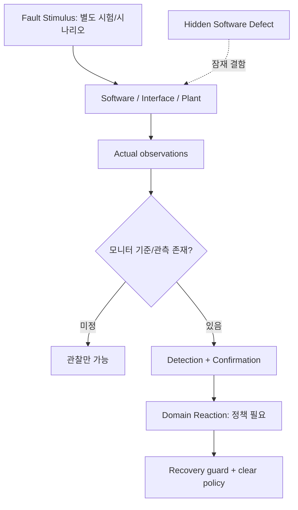
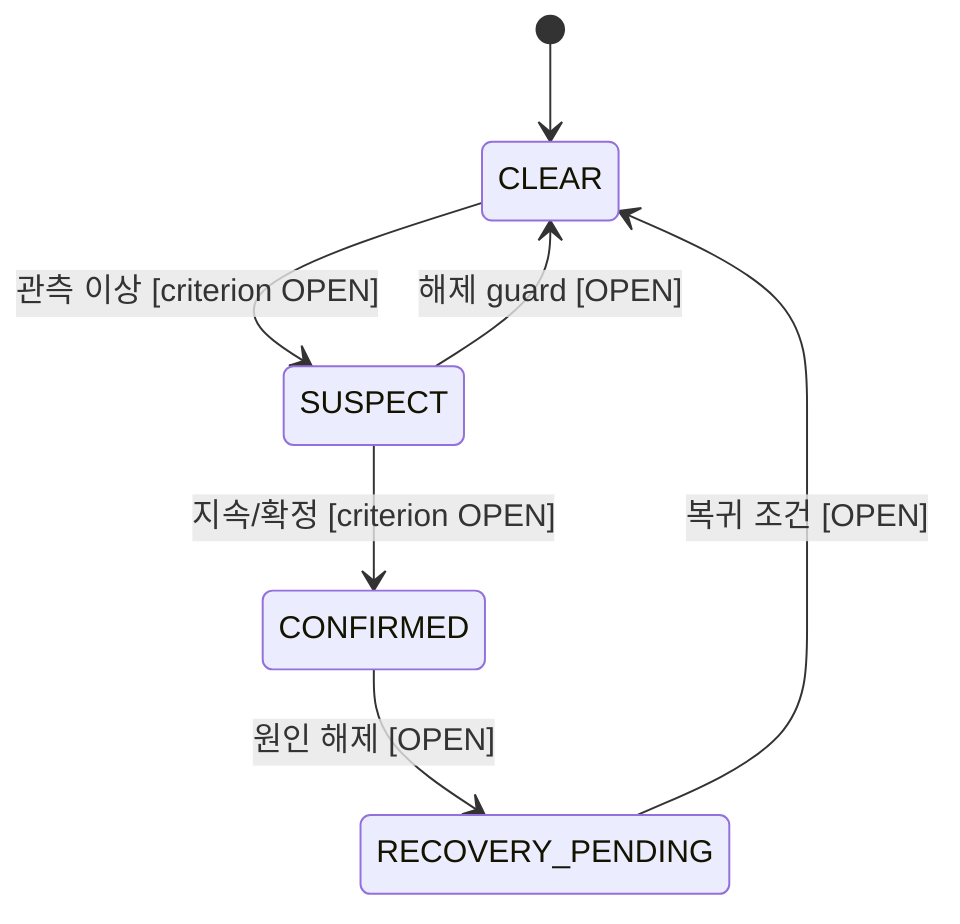
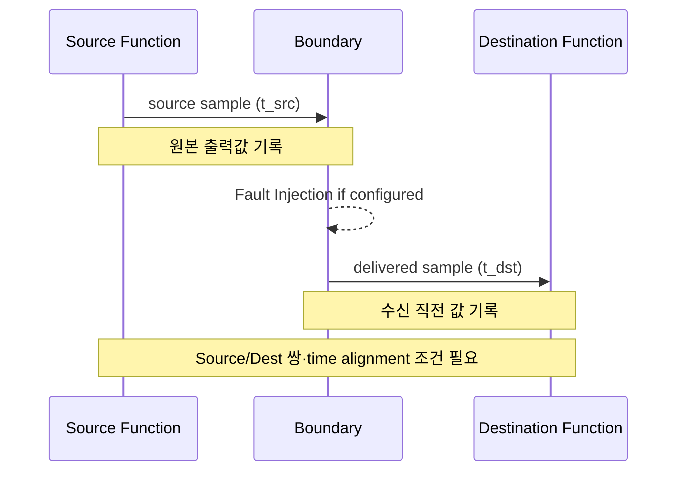

# TRACKBACK Phase 03-E — Fault & Diagnostics / Communication / Execution Platform

- v0.2, 2026-10-07. 기능 12개. 문서·Phase02 기능명을 복원하고, 구현되지 않은 메커니즘은 `ENGINEERING_PROPOSAL/OPEN`으로 표기. 새 진단·네트워크·Watchdog 런타임은 구현하지 않음.
- 핵심 출처: `Requirement.md` §18, §24–28, §39–40, §49/64, `00_TRACEBACK_MASTER.md` 근거 출처 구분. 현재 `CODEX_REPORTED`: SimulationRuntime fixed physics timestep 1/60s, Scenario RESET/RUN/REPLAY, incident record/C/WASM. 독립 포트 endpoint telemetry, Fault Injection, multi-rate scheduler는 당시 audit에서는 미지원. 최신 코드 업데이트 여부는 독립 감사 필요.

## E0. 고장 사고에서 구분할 다섯 가지

1. **Fault stimulus / injection**: 시험자가 주입한 event, 외부 환경 변화, 독립 입력 교란. 고장 원인과 동일하지 않음.
2. **Defect**: 잘못된 SW/Calibration/설계 결정이라는 잠재적 결함.
3. **Failure effect**: SW가 요구된 동작을 만족하지 못하는 관측된 결과.
4. **Detection/Diagnostic status**: 별도의 monitor가 문제를 실제 검출·확정했는지.
5. **Fault reaction/recovery**: 고장 상태에 대한 기능의 반응 및 정의된 복귀 동작.

이 다섯 개를 하나의 FaultFlag에 넣으면 `fault injected`만으로 자동 `FAULT_CONFIRMED`와 `DEGRADED`로 넘어가게 되는 잘못된 모델이 생긴다.

## E1. Fault Management / Diagnostics — 5개 Function

### `LF-FM-OBS` — 감시 입력 수집
- **하위 처리**: `FM-RANGE` 자료 표현/범위 → `FM-CONSISTENCY` 독립 source/consumer·상태 관계 → `FM-HEARTBEAT` 갱신 관측(계약 있을 때만) → `FM-EVENT-CONTEXT` 타임스탬프/상태/출처 저장.
- **입력→출력**: 개별 domain-monitor 관찰과 runtime events → `monitorObservations[]`(제안 구조). Incident ground truth 또는 fault injected flag를 모니터 출력을 대신하는 데이터로 사용 금지.
- **상태/가드**: 관측점 별 availability/validity를 보존. 기대치가 없는 관찰에 일반 FAIL 표시 금지.
- **반례**: eDrive command는 정상인데 DriveForce가 변환식 때문에 다른 값일 수 있음. 다른 단위의 값을 절댓값 비교해 fault를 보고하면 안 됨.

### `LF-FM-DETECT` — Fault Detection & Confirmation
- **하위 처리**: `FM-CONDITION` 명시된 기준 평가 → `FM-FILTER/DEBOUNCE` 시간적 조건(있을 경우) → `FM-CONFIRM` pending/confirmed 구분 → `FM-REPORT` 상태와 근거 기록.
- **입력→출력**: 관찰 시계열, criterion, timestamp, data quality → candidate detection state (`CLEAR`, `SUSPECT`, `PENDING`, `CONFIRMED`, `UNKNOWN` 모두 제안 상태), 일관성 있는 event chronology.
- **미정**: threshold, age, mismatch count, debouncing, sample period, confirmation priority, clear conditions 전부 미정. 비교 대상이 없거나 질이 낮으면 `UNKNOWN/UNAVAILABLE`로 둠.
- **반례**: injected stuck-value activated at 5.0s ≠ ECU fault detected at 5.0s. 실패가 한 tick 관측되더라도 3번 누적이 필요할 수도 있으나 횟수를 정해 넣지 않음.

### `LF-FM-REACT` — Fault Reaction Coordination
- **하위 처리**: `FM-SELECT-REACTION` 고장 진단 상태와 위험도/요구 연결 → `FM-DOMAIN-HANDOFF` 소유 domain에 전달 → `FM-AVAILABILITY` 기능 가용성 제한 정보 제공 → `FM-PUBLISH` 실제 반응 상태 기록.
- **입력→출력**: confirmed diagnostic event → domain-specific reaction request/constraint. `PROP_DEGRADED`는 기존 Propulsion v0.1의 참고 반응이며 브레이크/조향까지 같은 상태로 강제 불가.
- **Guard**: 임의로 `TORQUE=0` 또는 `BRAKE=MAX`를 안전 상태라고 선언할 수 없음. 안전 관련 반응은 별도 Safety Trace와 operational situation 근거 필요.
- **반례**: lost Steering Assist 문제에 긴급 제동을 무조건 수행하도록 배정하면 새로운 hazard를 만들 수 있음.

### `LF-FM-REC` — Recovery & Re-arm
- **하위 처리**: `FM-CLEAR-OBS` 원래 이상 발생 조건 해제 확인 → `FM-RECOVERY-GUARDS` 상태/시간/운전자 제어·재요청 조건 → `FM-REARM` 재활성 가능 여부 → `FM-LOG` 진단 이력 기록.
- **입력→출력**: fault clear observation, recovery eligibility and state-machine history → approval to return to defined domain state (도메인 별로 다름).
- **Guard**: exception release 후 곧바로 normal command 재개할지, ignition cycle 필요인지, hysteresis와 lockout 여부 `OPEN`.
- **반례**: injection 종료 후 곧바로 정상 차량이라고 주장하거나 예전 DTC를 로그에서 지워 `no fault ever`로 바꾸지 않음.

### `LF-FM-DIAG` — Diagnostics / Event Exposure
- **하위 처리**: `FM-EVENT-RECORD` 승인 event 기록 → `FM-STATE-EXPOSE` 현 fault status, freeze-frame 등 제공(정의 시) → `FM-SERVICE-BRIDGE` 별도 진단 서비스 통합(미래).
- **입력→출력**: diagnostic events → accessible diagnostic record/counter/state. `DTC ID`, `UDS DID/RID`, NRC, CAN transport 등 실제 모형이 없다면 출력 없음.
- **반례**: 사용자가 다른 Bootloader 프로젝트에서 UDS를 수행한 경험은 TRACKBACK 가상 ECU DCM이 구현됐다는 증거가 아님.

### 고장 감지 상태 — 진단 상태와 도메인 가용성 분리

**모든 상태 `ENGINEERING_PROPOSAL`.** 임계값, 검출 주기, clear policy 및 재활성 조건이 없으면 완결된 로직이 아님. 각 개별 domain reaction과 별도 state machine.

## E2. Communication / Interface — 3개 Function

### `LF-COM-PORT` — 내부 SW Port Transfer
- **하위 처리**: `COM-SOURCE-ENDPOINT` 실제 생산자 출력 캡처 → `COM-TRANSFER` 전달(로직 포트/adapter) → `COM-CONSUMER-ENDPOINT` 소비 직전 입력 캡처 → `COM-OBSERVE-BOTH-ENDS` 값/시각/단위의 비교 가능성 평가.
- **입력→출력**: typed output port sample+time → delivered typed input sample+time. zero-copy shared object를 source/destination에서 동일 pointer 두 번 읽는 것은 독립 telemetry 아님.
- **Guard**: 전달 복제인지 변환/스케일링인지, same-tick/in-order 관계인지 계약 필요. 변환 경계면 출력과 수신값이 같을 필요가 없으므로 transformation oracle을 먼저 정의.
- **반례**: Source=100 Nm → Adapter=1000 N은 단순 숫자 mismatch가 아님. 선언된 변환을 지키는지 별도 확인해야 함.

### `LF-COM-NET` — Virtual Motion CAN-FD (미래)
- **하위 처리**: `NET-TX` 지정 메시지 build → `NET-SCHEDULE` 실제 논리 시각 전송 → `NET-RX` 수신 이벤트 → `NET-VALIDATE` 프레임/신호 유효성 → `NET-DECODE` signal extraction → `NET-UPDATE-STATUS` RX state.
- **입력→출력**: Source signal samples+message catalog → raw/decoded network events. 실제 메시지 ID, DLC, BitPacking, AliveCounter, CRC, CAN driver/Bus arbitration은 정의된 것이 없음.
- **조건**: 실제 network source/destination endpoint, timestamp, send/receive, data encoding/scale가 모두 있어야 timing·value verification 가능.
- **반례**: `SRC_REQUEST`와 `DEST_REQUEST`의 소프트웨어 함수 호출을 임의로 CAN TX/RX로 표시 금지. CAN ID 예시를 게임의 정식 interface 사실로 둔갑 금지.

### `LF-COM-SUP` — Freshness / Missing Update / Timeout
- **하위 처리**: `COM-AGE` last accepted sample 시각 추적 → `COM-MISSING-UPDATE` 기대 갱신 기회 확인 → `COM-TIMEOUT` 경과 기준 판단(요구가 있을 경우) → `COM-RECOVERY` 정상 갱신 복귀 guard.
- **입력→출력**: source release/delivery events, consumer timestamp, supervision contract → `fresh/stale/timeout/unknown` 등 관측 수준. 미정 기준으로 직접 timeout FAIL 금지.
- **조건**: `DROP_UPDATE`의 의미는 destination sample-hold/invalid/skip semantics 중 실제 선택한 동작을 계약화해야 함. DELAY는 event delivery queue 필요.
- **반례**: fixed physics step 16.667ms에서 10ms task를 구현했다고 주장하면 cadence가 왜곡될 수 있음; 논리 scheduler가 별도로 필요.

### Interface — 독립 관측과 시각 정합

## E3. Execution & Platform — 4개 Function

### `LF-EXE-CLOCK` — Simulation Clock
- **하위 처리**: `CLK-TICK`, `CLK-RESET`, `CLK-SCENARIO-TIME`, `CLK-TIMESTAMP`로 한 시뮬레이션 실행의 논리 시간과 수집 시각 관리.
- **입력→출력**: physics advance delta, scenario reset/seed/spawn, tick ownership → deterministic timeline/event timestamps within the supported configuration.
- **지원**: 1/60s Rapier fixed step과 scenario synchronized samples는 이전 Codex 보고. 이 값은 **ECU SW task period가 아니다**.
- **반례**: reset 없이 scenario만 0초로 표시하면 held state/injection/network age가 다음 run에 남을 수 있음.

### `LF-EXE-SCHED` — SW Task / Runnable Scheduler
- **하위 처리**: `SCHED-RELEASE` periodic/event release → `SCHED-PERIOD` due 시점 → `SCHED-ORDER` 의존성 순서 → `SCHED-HOLD` consumer는 이전값 유지 가능 → `SCHED-LOG` release-start-finish 기록.
- **입력→출력**: configured period/priority/task logic/due events → execution events and held data. VMC 10ms, AEB 20ms, CAN 10ms는 `Requirement.md`의 **설계 예시**.
- **조건**: 10ms와 16.667ms는 비정수 배수로 정확한 event scheduler(별도 logical clock 또는 event queue)가 필요. 단순 physics tick마다 10ms task 수행했다고 기록 금지.
- **반례**: `pulse/timing`을 UI에서 설정했어도 실제 SW task event가 없으면 Timing Verification이 아니라 stimulus observation일 뿐.

### `LF-EXE-SUP` — Execution/Alive/Watchdog Supervision
- **하위 처리**: `SUP-ALIVE` expected checkpoints/release 확인 → `SUP-TIME-BUDGET` 실행 deadline/latency 조건 → `SUP-WATCHDOG` 승인된 watchdog 서비스 조건 확인 → `SUP-RESET` 실제 논리 또는 MCU reset 처리 → `SUP-REACTION` domain availability/fault reporting.
- **입력→출력**: runnable release/finish/checkpoints, watchdog state, reset source → diagnosis events. 실제 MCU peripheral 또는 AUTOSAR WdgM 구현 확인 없음.
- **조건**: alive supervision과 timeout은 단순 elapsed time만으로 구별되지 않음; 빠른 반복/느린 반복/미실행/역순 모두 다른 failure scenario가 될 수 있음.
- **반례**: 프레임 지연을 MCU watchdog timeout으로 해석하거나, 실제 watchdog 없는 virtual reset 버튼을 hardware watchdog as-tested라고 주장 금지.

### `LF-EXE-RECORD` — Blackbox, Reset, Replay
- **하위 처리**: `REC-SAMPLE` actual observations → `REC-BUFFER` pre-fault ring buffer → `REC-CAPTURE` incident context → `REC-RESTORE` physics/SW/scenario state → `REC-REPLAY` same stimulus execution → `REC-PROVENANCE` incident recorded vs replay trace 분리.
- **입력→출력**: actual vehicle and supported SW events+scenario definition → recorded incident / runnable replay / formal verification evidence.
- **조건**: Physics/Driver/SW snapshot 외 교통/네트워크/스케줄러/경계 held value/random state도 replay할 때 해당 domain이 활성화되어 있다면 reset·restore 범위를 맞춰야 함.
- **반례**: 실제 재실행 없이 이전 incident video만 재생하는 것을 Verification Replay라고 명명 금지. Cross-device bitwise 결정론은 주장하지 않음.

### Event Time 관계 (서로 다르다)

| Event | 의미 | 필요한 로그 |
|---|---|---|
| `stimulusAppliedAt` | 플레이어 요구/시험 자극 적용 | scenario ID/tick |
| `taskReleasedAt` | SW Task 수행 조건 발생 | task ID, clock |
| `sourceProducedAt` | Producer가 출력값 생성 | endpoint ID/value |
| `boundaryDeliveredAt` | transfer 경계를 통과 | Boundary ID/injection |
| `destConsumedAt` | 소비자가 실제 샘플 사용 | consumer ID/value |
| `physicsAppliedAt` | Plant 명령 적용 | physical command |
| `observationCapturedAt` | monitor가 값 측정 | monitor ID/timestamp |
| `faultDetectedAt` | 모니터가 확정 기준 충족 | detector ID/criterion |

실제 runtime에서 별개 event가 없으면 같은 이벤트의 이름만 바꾸어 시간을 생성하지 않는다. 아직 없는 event는 `UNAVAILABLE`.

## E4. 무엇을 증명할 수 있는지

| 방법/가설 | 필요 조건 | 현재 상태 |
|---|---|---|
| Component Output Comparison | C/WASM+독립 Oracle | VMC/eDrive 일부 `CODEX_REPORTED` |
| Internal Port Endpoint Comparison | 두 개의 실제 독립 endpoint sample | 해당 audit 기준 미지원; 최신 코드 재확인 |
| Fault Injection | real interception+activation window+reset semantics | 해당 audit 기준 미지원; 최신 코드 재확인 |
| Network Timeout Test | 메시지 시각·실제 RX supervision+timeout requirement | 미래 기능 |
| Task deadline | logical release/finish+clock+criterion | 미래 기능 |
| SW fault recovery | monitor confirmed+reaction+re-arm+result | 참조 기능, 현재 미검증 |
| Incident replay | 실제 재실행과 시나리오·상태 회복 | Vehicle Scenario 일부 `CODEX_REPORTED` |

## E5. Phase 04/05에 넘길 OPEN 정책

`FM-CONFIRM` debounce/clearing, `FM-REACTION` source authority, `COM-NET` network graph+encoding, `COM-AGE` freshness/timeout, `EXE-SCHED` multi-rate scheduling semantics, `EXE-SUP` watchdog trigger/handling, `REC-REPLAY` actual restored state coverage, 다중 Fault 동시 발생시 우선순위. 모두 **추가 구현하기 전 요구사항·기술근거 확인** 필요.
