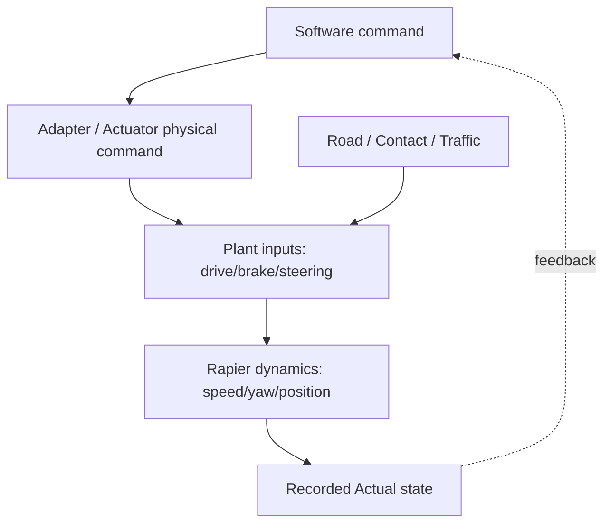
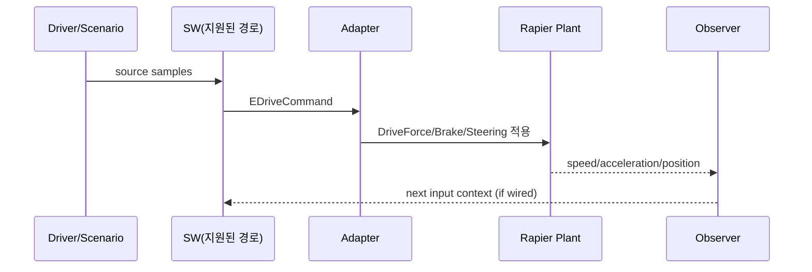
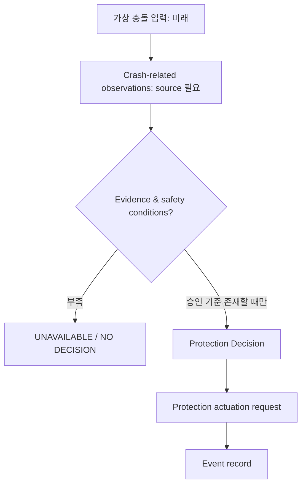

# TRACKBACK Phase 03-F — Occupant Safety / Actuation & Vehicle Plant

- `v0.2`, 2026-10-07, 코드 미반영. 대상: `LF-OCC-IMPACT/DECIDE/DEPLOY` + `LF-ACT-DRIVE/BRAKE/STEER` + `LF-PLANT-MOTION/ENV` = 8개.
- 근거: `Requirement.md` §17, §19–23·§28/29, `02_DOMAIN_FUNCTION_DECOMPOSITION_KO.md`, 이전 Vehicle Scenario 구현 보고.
- 안전성 주의: airbag은 높은 위험의 실시간 안전 기능이다. 아래 설명은 **교육용 기능 분해**이지 에어백 전개 알고리즘, 임계치, HARA, MCU 회로, pyrotechnic hardware 설계·안전 인증이 아니다. 이를 실행 로직으로 자동 구현하거나 테스트용 '실제 에어백 반응'을 주장 금지.

## F0. 명령·물리·센서 경계

- **SW 토크 명령**(`EDriveCommand`)과 **Plant 구동력**(`DriveForce`)은 일반적으로 차원이 다르다.
- `DriveForce`, `BrakeForce`는 physics에 **적용된 계산 명령/힘의 관측**이 될 수 있지만 실제 차량의 동력계·휠 토크·브레이크 압력을 독립 측정한 값이라고 할 수 없다.
- Plant의 `VehicleSpeed`는 실제 동작 관찰값이지만 전체 정상(Expected) 시간 궤적이 승인되어 있지 않으면 `OBSERVED`만 가능한 영역이다.

## F1. Actuation & Plant — 5개 Function

### `LF-ACT-DRIVE` — 구동 명령 물리 적용
- **하위 처리**: `ACT-DRIVE-CONVERT`: `EDriveCommand`를 adapter의 입력 계약으로 읽음 → `ACT-DRIVE-VALIDATE`: 타입/단위/Direction/Validity 확인 가능한 범위만 검사 → `ACT-DRIVE-APPLY`: 실제 `VehiclePhysicsCommand`/DriveForce 생성 및 적용 → `ACT-DRIVE-TRACE`: SW 출력, adapter 출력, physics 적용값과 timestamps 기록.
- **입력→출력**: `EDriveCommand` → `EDriveToVehiclePhysicsAdapter` → `DriveForce` (기존 코드 보고). 특정 drivetrain/gear ratio/wheel radius/torque-to-force 변환식은 현재 코드 대조 없이 확정하지 않음.
- **조건**: 엔진·모터 회전수, 기어비, 동력 전달 효율, 구동 방향, traction limit, 차량 프레임 변환 등의 실제 반영 여부 `OPEN`.
- **반례**: `EDriveCommand = 57 Nm`, `DriveForce = 570 N`이 관찰됐더라도 이 값들이 곧 '실제 바퀴 토크 57Nm'와 '차량 가속도 570m/s²'라는 뜻은 아님.
- **검증**: adapter original→adapted 비교에는 변환 oracle이 있어야 함. source/dest 값이 반드시 같아야 하는 Interface Test와는 구분.

### `LF-ACT-BRAKE` — 제동 명령 물리 적용
- **하위 처리**: `ACT-BRAKE-INPUT` 현재 지원되는 driver brake/추후 approved SW brake command 중 실제 적용 원천 확인 → `ACT-BRAKE-CONVERT` signed/unsigned/단위 변환 → `ACT-BRAKE-APPLY` brake force/torque 제어 → `ACT-BRAKE-TRACE` applied result/vehicle speed 연계.
- **입력→출력**: driver brake ∈ [0,1] 보고, BrakeForce 관찰은 `CODEX_REPORTED`. Brake Controller C/WASM 별도 실행은 입증되지 않음.
- **조건/반례**: brake input에 비례해 속도가 항상 선형 감소한다고 주장 금지. vehicle mass, slope, propulsion, grip과 initial speed의 영향을 받음. 0 입력 시 friction/drag/coasting은 별도 Plant 반응.
- **동시 요구**: driveForce와 brakeForce가 동시에 적용될 수 있음. 어느 쪽을 전자제어 단계에서 제한할지는 Motion Coordination/Braking의 policy.

### `LF-ACT-STEER` — 조향 명령 물리 적용
- **하위 처리**: `ACT-STEER-INPUT` normalized steering/승인 steering command 선택 → `ACT-STEER-APPLY` physics steer control → `ACT-STEER-TRACE` applied control and response observation.
- **입력→출력**: driver steering ∈ [-1,1] → Plant steering. EPS actual `assist torque`, `roadWheelAngle`, `steeringColumnAngle` 등은 현재 구현 근거 부재.
- **조건**: Steering Angle 제한, speed-sensitive steering mapping, rate limit, understeer/oversteer 물리 모델은 실제 코드 확인 후 기술.
- **반례**: steering 값 1을 1 radian으로 단정 금지, yaw change=steering input도 아님. 주차 상태에선 yaw가 변하지 않아도 입력 제어가 적용됐을 수 있음.

### `LF-PLANT-MOTION` — 차량 거동 계산
- **하위 처리**: `PLANT-FORCE-INTEGRATION` 구동 힘 등 적용 → `PLANT-BRAKE-EFFECT` 제동 저항/타이어 마찰 → `PLANT-STEERING-EFFECT` 방향제어/타이어 횡력 → `PLANT-CONTACT` 도로 contact/collision → `PLANT-STATE` 물리 상태 적분 → `PLANT-OBSERVATION` 관측 시점 기록.
- **입력→출력**: DriveForce, BrakeForce, steering, road/collision → position, orientation/rotation, speed, longitudinal acceleration 등 보고된 monitors. 실제 tire model fidelity, mass, moment of inertia, AWD traction distribution 등은 코드 대조 필요.
- **단위/물리 개념**: `sum(forces)=m*acceleration`은 물리 원리이지만 실제 시뮬레이터 출력 가속도의 좌표계/필터/step 방식이 확인되지 않으면 단순 역산 Expected로 사용 금지.
- **반례**: 1/60초 tick의 측정 acceleration이 모든 step에서 매끄럽거나 always positive라고 단정 금지. drag, braking, incline 등으로 acceleration 감소 가능.
- **검증**: 반복 재주행이 비슷한 실제 궤적을 만든다는 사실은 simulation reproducibility를 말할 뿐 차량 제조사 기준을 만족한다는 뜻이 아님.

### `LF-PLANT-ENV` — 도로·노면·교통·Scenario
- **하위 처리**: `ROAD-SEGMENT` 위치/기하 → `ROAD-FRICTION` 노면 접촉 상태(실제 지원 확인 필요) → `TRAFFIC-ACTOR-UPDATE` 객체 시간·상태 → `SCENARIO-ZONE` fault trigger eligibility.
- **입력→출력**: Map geometry/track capabilities/road state/Traffic truth → Plant/Environment State Provider 영향. scenario hidden trigger는 운전자에게 노출하지 않음.
- **반례**: Rain/low-friction 변수를 UI에 노출했다고 실제 Rapier wheel traction이 바뀌는 것은 아님. 파라미터 주입만 되고 Plant model에 전달되지 않으면 시각적 Fake Injection.
- **Case 확장**: 최소 직선거리, 커브, 선행 차량 등 `requiredTrackCapabilities`를 통해 case가 Track 명칭에 하드코딩되지 않도록 함.

### Plant 측 시간 순서 예시 (여러 Task 주기 확정 의미 아님)

## F2. Occupant Safety — 3개 Function

**주의:** Airbag/Pretensioner는 차량 운동 제어 루프와 성격이 다른 보호 장치다. 예시 `Impact → Crash Sensor → Airbag Controller → Deployment Decision → Airbag`은 `Requirement.md`에서 **미래 Reference Flow**로 정의한 것일 뿐, Rapier collision과 보호 장치가 이미 연결되었다는 근거는 없음.

### `LF-OCC-IMPACT` — 충돌 관련 이벤트 취득
- **목적**: 충돌 판단에 사용할 **입력 데이터의 종류와 유효성**을 갖춘다. 게임 collision event와 actual crash sensor waveform은 전혀 다름.
- **하위 처리**: `OCC-EVENT` event capture → `OCC-VALIDITY` data confidence and timeliness → `OCC-CONTEXT` operating/configuration context.
- **입력 후보**: structural impact sensors, acceleration/crash pulse, occupant position, restraint state 등은 *실제 차종별 설계 검토가 필요한 개념*이며 현재 runtime 없음.
- **출력 후보**: credible impact observation, invalid/unavailable detection state (아직 정의된 canonical signal 없음).
- **반례**: low-speed map collision이라는 이유로 airbag deploy required를 자동 생성해서는 안 됨.

### `LF-OCC-DECIDE` — 보호 장치 전개 판단
- **목적**: 정의된 감지 자료, 억제 조건, 안전 전략을 토대로 **해당 보호 장치의 전개 여부**를 결정하는 논리적 역할만 표현.
- **하위 처리**: `OCC-CLASSIFY` 관련 충돌 맥락 분류 → `OCC-GUARD` 제어 가능/유효 입력·억제 조건 확인 → `OCC-DECISION` 보호 장치별 요구 판단 → `OCC-LOG` 판정 근거/시각 기록.
- **입력→출력**: validated impact context+occupant/restraint conditions → conceptual decision request. **충돌 판정 임계값, 알고리즘 식, deployment timing, sensor diagnostics는 전부 OPEN**.
- **상태 후보**: `NOT_READY`, `READY`, `EVALUATING`, `DECISION_RECORDED`, `INHIBITED`, `FAULTED`는 교육용 단계 구분일 뿐; 실제 restraint ECU lifecycle과 다름.
- **반례**: 차량 yaw/속도와 충돌체 감속만으로 '전개해야 한다'고 판단하면 안전하지 않고 기술적으로 성립하지 않음.

### `LF-OCC-DEPLOY` — 보호 명령/이벤트
- **목적**: 승인된 조건에서 판단된 보호 명령이 후속 actuator 모델에 전달되는 관계를 설명.
- **하위 처리**: `OCC-AIRBAG-OUTPUT` 보호 장치 별 명령 기록 → `OCC-PRETENSIONER-OUTPUT` 별도 명령/상태 → `OCC-EVENT-REPORT` 사고 기록.
- **입력→출력**: decision request → mock event trace only until actual restraint actuator/safety model approved. 실차 화약식 구동기, 전개 전류, 무결성 등의 물리 설계를 구현하지 않음.
- **반례**: UI 애니메이션(에어백 그림)이 나온 것을 실제 ECU Safety Validation `PASS`로 처리하면 안 됨.

### Occupant 경계 및 안전 Trace

Safety Trace는 별도로 `malfunctioning behavior + hazardous event/HARA → SG → FSR → TSR → allocated HW/SW requirements → Test`를 작성해야 함. **단순 충돌 scenario를 Hazardous Event/ASIL이라고 자동 확정하는 것 금지.**

## F3. 시스템 물리 인과관계 감사표

| 관찰 | 직접적으로 지지하는 주장 | 아직 지지하지 않는 주장 |
|---|---|---|
| `EDriveCommand` C output | eDrive SW 출력 명령 | 실제 모터 torque 발휘 |
| `DriveForce` adapter output | physics 입력에 쓰이는 계산 구동력 | 독립된 휠 torque 센서 |
| `BrakeForce` physics | 적용 제동력/명령 수준 | Brake ECU/유압 회로 정상 |
| `VehicleSpeed` trajectory | run의 실제 속력 변화 | 승인된 Expected speed/실차 검증 적합 |
| `Yaw/Rotation` 변화 | simulation body orientation 결과 | 실제 gyro 기반 ESC 요구 충족 |
| `Collision` event | physics 충돌 감지 | Airbag deploy condition 충족 |
| fault re-drive | 구현된 시나리오 재현 및 수정안 반응 | ISO 26262 안전 목표 검증 완료 |

## F4. Phase 04/05 이전 결정 목록

- `ACT-01`: eDriveCommand→Force 변환식/단위/방향/제한/owner 실제 코드 확인.
- `ACT-02`: Brake normalized→force/physics command의 source와 signedness 확인.
- `ACT-03`: Steering normalized→Road wheel angle or force semantics 확인.
- `PLANT-01`: masses, inertia, tire/wheel physics fidelity, collision and road contact support 확인.
- `PLANT-02`: 기존 Run의 속도/가속도/위치 관측 시각 정확도와 좌표계 확인.
- `OCC-01`: occupant safety는 별도 안전 아키텍처로 유지, 승인 원문/현실성 검토 없이는 시나리오 실행 기능 자체를 만들지 않음.
- `SYS-01`: software output verdict와 vehicle physics observation verdict를 구분할 승인 criterion 필요.
