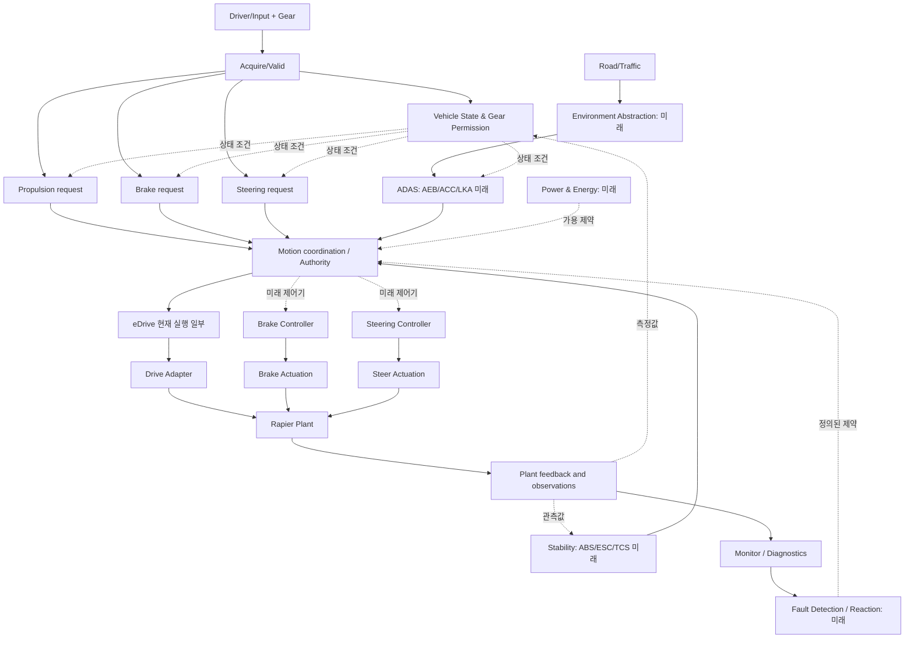

# TRACKBACK Phase 03-G — Cross-Domain Integration, State Model & Review Gate

- `v0.2`, 2026-10-07. Phase 03-B~F 통합. 코드 미반영 / 승인되지 않은 참조 설계. **이 문서는 기능명 목록만 만들지 않고, 실제 사례마다 확인해야 하는 인과 관계·권한·관측 기준을 고정한다.**
- 출처: Phase 01~03 초기 한글본, `Requirement.md`, Propulsion v0.1 및 Codex 보고된 차량 실행 경로.
- 여러 Domain이 동일한 Actuator, State, Signal을 변경할 수 있으므로 **기능 책임과 Runtime 데이터 소유권을 별도로 정의**. 미구현 대상에 대한 전이·Expected를 생성하지 않음.

## G1. 전체 차량 운영 인과 그래프



이 도식은 **목표 논리 Architecture**다. 현 실행 구간은 `DriverInputRuntime → C/WASM VMC/eDrive → Adapter → Rapier` 및 brake/steering의 물리 입력 경로만 보고돼 있다. 모든 모듈을 새로운 직렬 실행 경로로 추가하거나 MC에서 실제 `DriveTorqueRequest`를 중복 계산하지 않는다.

## G2. 반드시 독립적으로 관리할 상태 축

| State axis | 책임 Owner 후보 | 범위/중요성 | 기존/지원 여부 |
|---|---|---|---|
| vehicle startup/ready | Vehicle State | 전체 준비상태. 단일 도메인 ready 아님 | `VehicleReady`는 v0.1 요구상 존재, 생성식 미정 |
| gear request/accepted/applied | Gear | 요청과 실제 적용 구분 | Gear D precondition만 부분 보고 |
| propulsion operating state | Propulsion | OFF/READY/ACTIVE/DEGRADED 등 v0.1 초안 | 참조 요구, Runtime SW 구현 미확인 |
| brake availability + demand | Braking | 가용성과 제동 활성 독립 | Brake physical input 보고, SW 미정 |
| steering availability + authority | Steering | driver/EPS/LKA 권한 | steering physical input 보고 |
| ADAS states | ADAS | AEB/ACC/LKA 각자 독립 | 참조 전용 |
| stability interventions | Stability | ABS/TCS/ESC 요청 각자 독립 | 참조 전용 |
| diagnostic detected/confirmed/cleared | Fault/Diagnostics | Fault Injection 여부와 독립 | 일반 검출 로직 미확인 |
| time/event/task | Execution/Communication | release/produce/deliver/consume/apply/observe | physics tick 보고, task/CAN 미정 |
| actual physical response | Plant | speed/yaw/position/acceleration | 일부 runtime 확인 보고 |

**상태-조건-기준의 네 겹**: (1) raw valid range, (2) functional mode/availability, (3) requirement applicability & expected relation, (4) actual observation. 하나를 나머지로 대체 금지.

## G3. 주요 도메인 간 인터페이스 계약 (논리적, 숫자·ID 신규 등록 금지)

| Source → Target | 전달해야 할 의미 | 계약의 필요 요소 | 현재 |
|---|---|---|---|
| Driver → Propulsion | 요구량/유효성 | normalized vs driver demand mapping | 일부 C/WASM 입력 보고 |
| Gear/State → Propulsion | 현재 적용 gear / enable | request≠applied, invalid/reverse 구분 | D 조건 일부 보고 |
| Propulsion/VMC → eDrive | 구동 토크 요구 | Nm / Direction / Validity | `DriveTorqueRequest` C/WASM 보고 |
| eDrive → Adapter | SW 명령 | command unit, conversion, validity | `EDriveCommand` 보고 |
| Adapter → Plant | applied drive force | N, direction, tick application | `DriveForce` 보고 |
| Driver Brake → Plant | applied braking input/force | normalized→force conversion | 일부 보고 |
| Driver Steering → Plant | applied steering control | normalized→angle/control conversion | 일부 보고 |
| AEB → MC/Braking | 긴급 감속 요구 | 위협 유효성, time, authority | 미래 |
| ACC → MC | cruise longitudinal target | 속도/간격/target info | 미래 |
| LKA → MC/Steering | 조향 보조 요구 | angle/torque/yaw type | 미래 |
| ABS/TCS/ESC → MC/Braking | wheel-specific / torque intervention | 대상 wheel, target, policy | 미래 |
| Energy → Propulsion/Braking | drive/regen constraint | source/limit/validity | 미래 |
| Diagnostics → Domain | fault status/reaction request | detection evidence/level/time | 미래 |
| Communication → Consumer | source value after transfer | endpoint sample, timestamp, update | 구조만, 런타임 미확정 |
| Plant → Estimation → Controllers | 차량 거동 | 참조 좌표계, observation timestamp | 일부 보고 |

이 표의 목적은 **인터페이스가 실제로 존재한다는 거짓말을 피하면서 역할을 정렬하는 것**이다. 처음 네 줄을 제외한 미래 경로의 구체적 Signal ID는 승인된 Dictionary와 Phase 04 대조 전까지 미등록.

## G4. 현상별 도메인 접근 예시 (플레이어 학습 경로)

### I1. 가속 요구 존재하지만 가속 응답 저하
1. 사건의 accelerator, Gear/Ready, speed/deceleration 등 **실제 입력·차량 거동** 구분.
2. VehicleSpeed Actual-only면 임의 normal speed curve 생성 금지. 가능한 SW 경계의 승인 oracle로 추적.
3. `PropulsionRequest → DriveTorqueRequest → EDriveCommand → DriveForce → Plant`에서 각 변환 경계의 **정확한 source/unit/expected basis**를 확인.
4. eDrive output이 예상과 달라도 input validity/state/변환식/전달경계/Plant까지 대안 가설 유지.
5. Formal conclusion은 Phase3 실제 Test Evidence로만 논증, `0.5` 내부 계수처럼 입증하지 않은 механизм을 정답으로 노출하지 않음.

### I2. 가속·제동 동시 입력
1. Driver accelerator 및 brake 수집이 각각 유효한가.
2. Braking 기능이 허용·활성인지와 Propulsion request가 어떻게 적용됐는지 분리.
3. MotionCoord 또는 domain-specific 인터록 **승인 정책**이 실제로 있는가. 없다면 바로 'Brake priority FAIL' 주장 금지.
4. DriveForce와 BrakeForce가 모두 Rapier에 적용됐을 수 있어 최종 Acceleration만으로 어느 경계 결함인지 판정 불가.

### I3. 기어 D 요청 직후 가속 안 됨
1. `GearRequest=D`와 실제 `GearState=D`를 구분.
2. 전환 pending/inhibit/invalid 상태 또는 DriveEnable 정책이 정해져 있는지 확인.
3. Gear 적용 이전에는 READY 요구사항 적용 가능성을 판단할 수 없음.
4. Gear가 D인 것이 확인돼도 Propulsion state/validity/torque request 검증 필요.

### I4. AEB 요청이 있는데도 감속하지 않음
1. AEB object threat 분석이 유효하게 **제동 요구**를 생성했는가.
2. AEB 출력→MotionCoord/Brake 기능의 전달 및 권한 우선순위를 확인.
3. Brake Controller/Plant의 실제 적용 확인.
4. 요청/명령은 정상인데 노면·actuator가 원인인 경우 software defect와 구분.
5. 현재 미구현이므로 실제 testcase PASS/FAIL 생성 불가.

### I5. AEB와 ABS가 동시에 개입
1. AEB는 차량 목표 감속 **요구**, ABS는 wheel lock 예방을 위한 제동 조절 **제약**.
2. 둘은 다른 제어 목적이므로 단순히 한쪽을 일괄 override하면 안 됨. 상호 policy/actuator authority 확인.
3. 각 wheel 속도/슬립/제어 command가 실제 존재해야 판단 가능.
4. Braking와 Stability/Motion Coordination 간 Owner가 이중 명령을 생성하지 않는지 확인.

### I6. 조향했는데 방향이 바뀌지 않음
1. Driver steering normalized input 자체와 Steering SW command 존재 여부 구별.
2. Controller 출력, applied wheel angle, Plant yaw/rotation, 차량 속도·노면 상태 비교.
3. 정지 상태의 yaw=0은 조향 기계 이상을 단정하지 못함.
4. LKA/ESC가 제약을 가했는지 출처 기반 추적(미래 모델).

### I7. 통신 Drop/Timeout 의심
1. Producer `t_src`, Boundary event, Consumer `t_dst`가 실제로 각각 캡처되었는가.
2. drop event는 정확히 어떤 전달 semantic(보류/hold/invalid)을 택했는가.
3. 수신자가 감지하는 timeout은 구성된 **기준**과 실제 lastRxTime이 필요.
4. `drop at 5s`는 `detected timeout at 5s`의 증거가 아님.

### I8. Runtime 늦은 출력
1. Stimulus/producer release, task execution, boundary delivery, plant application, observation 시간을 분리.
2. 기준이 Task deadline인지 signal freshness인지 physical response latency인지 질문을 먼저 정함.
3. 1/60s physics sampling만으로 10ms Runnable 타이밍 검증 PASS/FAIL을 정하지 않음.

## G5. 충돌 정책: 결정 전에는 어떤 것도 기본값으로 삼지 않는다

| Policy ID | 충돌 상황 | 승인 전 허용할 상태 | 확정해야 할 실제 근거 |
|---|---|---|---|
| CD-01 | Accelerator + Brake | 양 입력·각 적용 결과 관찰 | Brake override, anti-two-foot, drive limitation |
| CD-02 | Driver Brake + AEB | 출처별 요구 보존 | AEB activation/suppression, merge policy |
| CD-03 | AEB + ABS/ESC | 요구/제약 타입 분리 | wheel intervention and braking authority |
| CD-04 | Driver Steering + LKA | driver and assist authority 분리 | override limits, target type |
| CD-05 | TCS + Propulsion Torque | upstream torque vs constrained torque 분리 | traction control priority |
| CD-06 | Fault Reaction + Normal Demand | fault status와 실제 reaction 결과 구분 | safety requirements / recovery policy |
| CD-07 | Gear transition + Torque | request/applied gear 구분 | Shift interlock/DriveEnable |
| CD-08 | Regen blending + ESC/ABS | friction/regen contribution 분리 | energy/wheel constraint allocation |
| CD-09 | CAN missing update + Task stall | 네트워크 수신과 Producer 실행 구분 | independent event telemetry |
| CD-10 | Power/Energy limit + DriveTorque | 요청값과 최종 제한값 분리 | constraint ownership, signed limits |

## G6. 하나의 논리적 상태 처리/이벤트 표준 계약

```yaml
# 문서 설명용 개념 스키마. 실제 코드 타입이 아님.
logicId: <stable, unique ID>
functionId: <Phase02 LF-ID>
sourceStatus: ENGINEERING_PROPOSAL|SRC_DRAFT|CODEX_REPORTED|OPEN
runtimeSupport: EXECUTABLE|PARTIAL|REFERENCE_ONLY|UNAVAILABLE
inputSamples:
  - {portId: ..., signalId: ..., sampleTime: ..., unit: ..., validity: ...}
applicability:
  requiredStates: []
  guards: []    # boolean expression, threshold if approved
trigger: {kind: EVENT|PERIODIC|CONTINUOUS_OBSERVATION, ownerClock: ...}
currentState: {axis: ..., value: ...}
transition:
  from: ...
  event: ...
  guard: ...
  to: ...
  action: ...
  timing: OPEN
outputSample:
  signalId: ...
  producerPortId: ...
  timestamp: ...
invalid/else/recovery: OPEN
allocation: []  # SWC/Runnable/ECU separate
requirementIds: []
verification:
  criterionIds: []
  tests: []
  observableAt: []
  allowedVerdict: OBSERVED # no accepted oracle
```

**정합성**: `inputSamples.signalId`는 등록된 Signal Dictionary에 있어야 하고 각 edge는 source/target relationship registry에 실제로 연결되어야 한다. `sourceStatus=PROPOSED`와 `runtimeSupport=EXECUTABLE`이 충돌하면 리뷰 필요. Existing Requirement ID를 문자열 유사성만으로 자동 참조 연결 금지.

## G7. 전체 Phase 02 Function ID × Phase 03 반영 체크

Phase 02 총 74개:

| 영역 | 기능 수 | 상세 설계 파일 |
|---|---:|---|
| Driver/Environment | 3 | 03-B |
| Vehicle State | 4 | 03-B |
| Gear | 4 | 03-B |
| Propulsion | 10 | 초기 `03_INTERNAL_LOGIC_STATE_MACHINE_KO.md` |
| Braking | 7 | 03-B |
| Steering | 6 | 03-B |
| Stability | 4 | 03-C |
| ADAS | 4 | 03-D |
| Motion Coordination | 6 | 03-C |
| Sensing | 3 | 03-D |
| Energy | 3 | 03-D |
| Occupant | 3 | 03-F |
| Fault/Diagnostics | 5 | 03-E |
| Communication | 3 | 03-E |
| Execution/Platform | 4 | 03-E |
| Actuation/Plant | 5 | 03-F |
| **계** | **74** | **10 기존 + 64 신규** |

### G7-A. Propulsion 10번째 논리 기능 ID 대응 검토 — `LF-PROP-EDRV`

Phase 02는 기존 Propulsion 9개 주요 논리 영역에 **eDrive 명령 처리 1개**를 더해 10개로 정의한다. 초기 Phase 03의 **3.11절**에는 eDrive/VMC의 현재 계산 경계를 설명하지만 `LF-PROP-EDRV` 식별자가 명시되지 않았으므로 여기에서 연결을 고정한다.

- **역할**: `DriveTorqueRequest` (Nm, 방향·유효성 포함)를 입력받아 C/WASM eDrive에서 `EDriveCommand`를 생성하는 실행 기능(`CODEX_REPORTED`); 내부 임의 변환/limiter 단계와 자세한 C source는 최신 코드 재확인 전 `OPEN`.
- **하위 판단 후보**: 요청형식/유효성 확인 → eDrive 계산 실행 → SW 출력 캡처 → 물리 Adapter 전송; 실제 별도 Runnable 4개를 뜻하지 않음.
- **검증 관계**: 보고된 `TC-PROP-NORMAL-010A/010B` 등 실행 TC의 실제 대상/Oracle과 결합하되 `RequestedDriveTorque`, `DriveTorqueCommand`, `ActualDriveTorque`를 자동 alias 하지 않음.
- **고장 조사 반례**: output half-scaling이 관측되더라도 내부 0.5 coefficient가 원인이라는 결론은 별도 소스 증거 없으면 성립하지 않음.

## G8. 최종 리뷰 게이트 (Phase 04 진입 전에 확인할 것)

**R1 Ownership:** VMC/MC/Propulsion에서 Torque Generator 중복이 없는지. Braking arbitration, regen blending, MC actuator allocation이 동일 결정에 독립적으로 서로 상반된 command를 만들지 않는지.

**R2 State:** GearRequest/GearState, VehicleReady/DriveEnable, fault injected/fault confirmed, ADAS availability/active, Steering availability/authority 등 유사 개념을 서로 동의어로 처리하지 않는지.

**R3 Units:** normalized input, Nm torque request, signed request, N drive/brake force, m/s speed, m/s² acceleration, rad angle, rad/s yaw를 구분하는지. 각 signal frame/timebase와 validity가 있는지.

**R4 Timing:** SW task rates와 physics 60Hz를 동일시하지 않는지. missing-update/latency/timeout마다 측정 지점과 기준이 있는지.

**R5 Verification:** 실제 oracle 없는 Actual-only vehicle trace, wheel slip, Occupant decision에는 PASS/FAIL 생성하지 않는지.

**R6 Missing HW:** Brake ECU/EPS/ABS wheel sensor/Crash Sensor/virtual CAN-FD/BMS/Watchdog을 유령 구현하지 않았는지.

**R7 Safety:** HARA 없는 곳에 SG/ASIL을 붙이거나, 단순 정상 기능 동작을 Safety Goal 달성으로 과대해석하지 않았는지.

**R8 Data Provenance:** 문서 `SRC_DRAFT`, `ENGINEERING_PROPOSAL`, `CODEX_REPORTED`와 실제 CODE VERIFIED를 분리하는지. 이 단계에서 새로운 `APPROVED` 부여 금지.

**R9 Case Generality:** 현재 eDrive half-scaling 사례 외에도 brake command, gear interlock, steering override, input validity, sensor absence, transfer drop, task timing, plant faults를 Reference Case로 표현할 수 있는지. 하지만 새 case를 **구현하지는 않음**.

**R10 UI Contract:** Domain/Function/Signal/Requirement/TC/Note/RunResult의 ID와 return-context가 하나의 canonical graph에서 오며, ref-only 기능을 executable로 노출하지 않는지.

## G9. 이후 단계 인계

**Phase 04 Signal & Interface:** `G3`의 각 경계에 실제 Signal, producer/consumer port, type, unit, value range, time, validity, transformation을 붙임. 존재하지 않는 Signal은 `candidate`로 보류. 2개의 관측값이 없으면 Interface Comparison 불가.

**Phase 05 Requirement:** 본 문서의 `[OPEN]` guard를 임의로 SYSR/SWR 정답 문장으로 자동 변환 금지. 시스템 수준 기대 동작과 SW 할당 구현 조건을 나누고, Safety Trace는 HARA에 의해 도출.

**Phase 06 Test/Verification:** testcase는 승인된 criterion과 실제 executor가 있을 때 executable. 그렇지 않으면 design-only/ref-only. Fault injection/stimulus/hidden software defect와 evidence의 원인을 구분.

**현재 단계 결론:** 모든 Phase 02 기능에 대한 *논리적 판단·입력·출력·제어 흐름의 검토 기반*은 갖추되, 상세 계산식·임계치·안전 반응·실제 구현/동작은 승인되지 않았고 일부는 근거 자체가 부족하다. 이는 정상적인 `OPEN` 상태이며 강제 완성하지 않는다.
