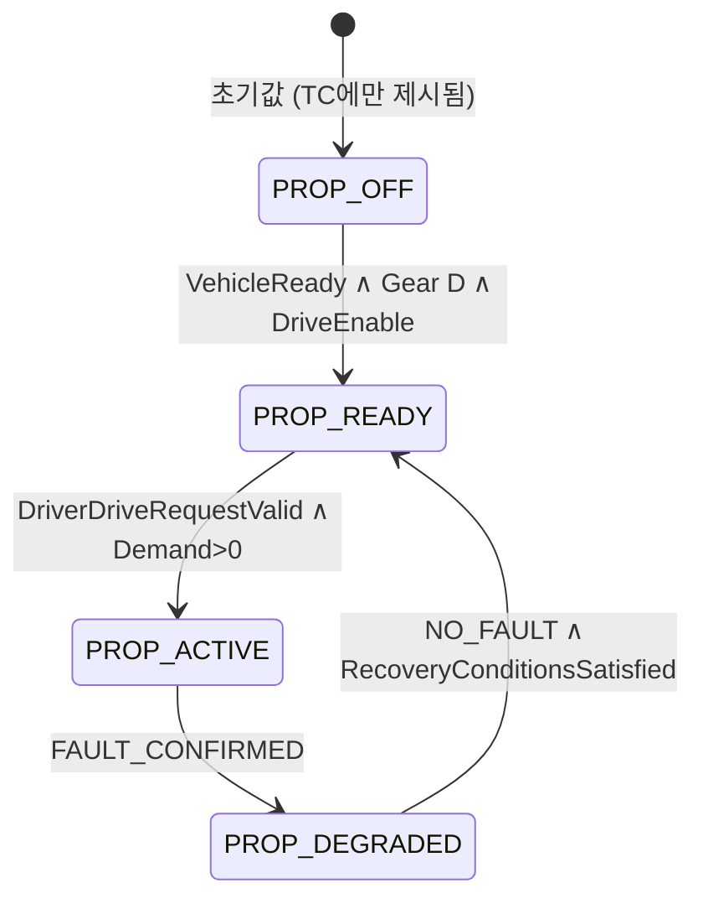

# TRACKBACK — Phase 03. 내부 로직·상태 머신 상세 설계 (한국어)

- 버전: `v0.1 — 2026-10-07`
- 상태: **검토용 설계 초안. 코드 미반영. 승인된 Ground Truth가 아님.**
- 기준 문서: `01_REFERENCE_ARCHITECTURE.md`, `02_DOMAIN_FUNCTION_DECOMPOSITION.md`, `TRACKBACK Propulsion Reference Requirements v0.1.md`, `Requirement.md`, `00_TRACEBACK_MASTER.md`, `VERIFICATION_WORKBENCH_CAPABILITY_AUDIT.md`.
- 검증 한계: 이 환경에는 최신 프로젝트 전체 소스 저장소가 없다. 실제 컴포넌트 구현·식·분기·모델 동작 확인은 Codex 보고/첨부 문서에 근거한 **간접 정보**이며 코드 대조 전까지 `CODEX_REPORTED`로 둔다.
- 본 문서의 목적: 모든 기능에 숫자와 로직을 억지로 채우는 것이 아니라, **참조 문서가 정의한 로직을 정확히 복원하고 나머지 미결 조건을 승인 전제조건으로 드러내는 것**이다.

## 0. 근거 등급과 제안 구분

| 표기 | 뜻 | 승인/사용 기준 |
|---|---|---|
| `SRC_DRAFT` | 제공된 참조 문서에 해당 내용이 **실제로 명시**되어 있음. 원문 자체도 초안일 수 있음 | 원문 확인 가능. 코드 실행 사실로 해석 금지 |
| `CODEX_REPORTED` | 이전 Codex 수행 보고서에서 실행 경로/시험 결과를 보고함 | 직접 코드·실행 결과 재확인 전까지 확정 금지 |
| `ENGINEERING_PROPOSAL` | 로직 설계의 일반적인 후보이지만 제공 자료에는 확정되어 있지 않음 | 사람 검토 및 타당성 시험 필수 |
| `OPEN` | 요구·기준·신호·실행 거동을 특정할 근거 없음 | 값을 채우지 말 것 |
| `APPROVED` | 출처, 모순 검토, 사람 승인, 구현 시험을 통과한 항목 | 현재 새로 부여하지 않음 |

**중요:** `SRC_DRAFT`는 '검증된 차량 기능'이 아니고, `CODEX_REPORTED`도 '실제 코드를 직접 열어 검증함'이 아니다. 알고리즘 식/수치/안전 반응을 대체할 추정치를 끼워 넣지 않는다.

## 1. 로직 구성 규칙

각 Function/Subfunction은 별도의 계약으로 관리한다.

```yaml
logicId: LOG-PROP-STA-001  # 신규 제안 문서 ID. 요구사항 ID와 다름.
functionId: LF-PROP-STA
kind: STATE_MACHINE | CONDITIONAL_RULE | CALCULATION | ARBITRATION | MONITOR | TRANSFER | PHYSICS_ADAPTER
sourceStatus: SRC_DRAFT | CODEX_REPORTED | ENGINEERING_PROPOSAL | OPEN
inputs: []                # 정확한 기존 명칭이 있는 경우에만 사용
statesRead: []
outputs: []
trigger:                  # 값 변경인지, tick 평가인지, 이벤트인지
applicability:            # 요구사항이 적용되는 조건
logic:                    # 표/정형 식/정의된 계산
elseBehavior: OPEN        # 문서에 없는 ELSE 동작을 임의로 넣지 않음
invalidBehavior: OPEN
holdOrResetBehavior: OPEN
priority: OPEN
samplingTiming: OPEN
observableAt: []          # 독립 관측 지점 유무 포함
requirementRefs: []       # 원문에서 명시된 ID만
implementationRefs: []   # 최신 코드 검사 후 부여
verificationStatus: REFERENCE_ONLY
reviewQuestions: []
```

### 1.1 상태와 이벤트를 분리한다

- 상태: `VehicleReady`, `GearState`, `PropulsionOperatingState`, Fault의 검출/확정 상태처럼 **시점에 걸쳐 유지되는 데이터**.
- 이벤트: 운전자 입력 갱신, 요구 변경, 경계 통과, fault activation/release, 특정 timer expiration처럼 **발생 시점이 의미 있는 사실**.
- 컨텍스트: 속도, 모드, 유효성, 가용성, 제약과 같이 특정 요구사항의 적용 여부를 결정하는 데이터.
- 값의 범위 `0..1`은 입력 형식의 유효성이고, `입력=0.2에서 출력=...`은 **상태와 요구사항에 의존하는 조건부 Expected**다. 두 판단을 혼동하지 않는다.

### 1.2 단일 tick에서의 인과 순서

`입력 샘플링 → SW 계산/상태 결정 → 출력 전달 → 어댑터/Plant 적용 → 관측`은 현재 실행 경로를 설명하는 **개념적 순서**다. 모든 Domain의 Task가 매 physics tick에 하나씩 실행된다고 뜻하지 않는다. `1/60 s`는 확인된 Vehicle Scenario 시뮬레이션 물리 tick이며 VMC 10 ms·CAN 10 ms 등의 예시는 **설계 예시**다. 실제 multi-rate scheduler의 sample/hold, 우선순위, 초기값, 이벤트 시각은 미정이다.

## 2. 현재 보고된 실제 실행 구간과 참조 구간 분리

| 단계 | 관측/실행 근거 | 상태 |
|---|---|---|
| `DriverInputRuntime` accelerator/brake/steering/gear | 이전 Codex 보고: 제어 가능한 운전자 입력 | `CODEX_REPORTED` |
| `VehicleSwInput` 등 입력 적응 | 실제 진입점/상태 매핑을 코드로 감사해야 함 | `CODEX_REPORTED / 상세 OPEN` |
| `PropulsionRequest → VMC → DriveTorqueRequest` | C/WASM 실행, 0..1, speed 0..60 m/s, direction, validity → 토크 요청 | `CODEX_REPORTED` |
| `DriveTorqueRequest → eDrive → EDriveCommand` | C/WASM 실행, 입력 0..600 Nm, direction/validity | `CODEX_REPORTED` |
| `EDriveCommand → adapter → DriveForce → Rapier` | vehicle scenario 실제 실행·모니터 보고 | `CODEX_REPORTED` |
| Brake/Steering 입력 → 물리 반응 | 입력/제동력/상태를 볼 수 있다고 보고함 | `CODEX_REPORTED`, 독립 Brake/EPS SW는 `OPEN` |
| `STA/ACQ/INTERP/GEN/ARBITRATION/LIM/OUT/MON/REA/REC` 전체 | `Propulsion v0.1` 참조 설계 | `SRC_DRAFT` **독립 실행 확인 안 됨** |
| Virtual CAN-FD, multi-rate SW, watchdog, ABS/ESC/ADAS | `Requirement.md` 향후 설계 | `REFERENCE_ONLY` |

**신호 별칭 금지:** `DriverDriveDemand`/`PropulsionRequest`, `RequestedDriveTorque`/`DriveTorqueRequest`/`ArbitratedDriveTorque`/`LimitedDriveTorque`/`DriveTorqueCommand`, `EDriveCommand`/`ActualDriveTorque`는 **동일 신호라고 승인하지 않는다**. Phase 04에 양방향 매핑과 단위·유효성·출처가 필요하다.

## 3. Propulsion — 소스에 있는 조건/수치만 사용한 정밀 전개

### 3.1 구동 상태 관리 `LF-PROP-STA` [`SRC_DRAFT`]

원문: `FR-PROP-STA-001/002`, `SYS-PROP-STA-001/002`, `SWR-PROP-STA-001/002`, `TC-SWR-PROP-STA-001-01`, `TC-SWR-PROP-STA-002-01`.

**정의된 상태 후보**: `PROP_OFF`, `PROP_READY`, `PROP_ACTIVE`, `PROP_DEGRADED`. 실제 런타임 상태 enum이라고 단정하지 않는다.

| 현재 상태 | 적용 조건 (원문) | 요구 동작 | 출처 | 미정 사항 |
|---|---|---|---|---|
| 원문 TC에서 `PROP_OFF` | `VehicleReady=TRUE AND GearState=DRIVE AND DriveEnable=TRUE` | `PROP_READY` 진입 | `STA-001` | 조건 미충족, 다른 현재 상태, hold, 우선순위 |
| `PROP_READY` | `DriverDriveRequestValid=TRUE AND DriverDriveDemand>0` | `PROP_ACTIVE` 진입 | `STA-002` | zero-demand 처리, READY 조건 지속 여부 |
| `PROP_ACTIVE` 등 | `PropulsionFaultStatus=FAULT_CONFIRMED` | `PROP_DEGRADED` 전이 및 토크 제한 필요 | `REA-001/002` | 경합 우선순위, 반응 시각, 검출 기준 |
| `PROP_DEGRADED` | `PropulsionFaultStatus=NO_FAULT AND RecoveryConditionsSatisfied=TRUE` | `PROP_READY` 복귀 | `REC-001` | clearing 절차, 지속시간, 재활성화 guard |



이것은 **기록된 네 전이만 시각화**한다. 모든 입력에서 완결된 상태 머신이 아니며, 다른 상태에서 Fault가 발생할 때의 처리·OFF로의 복귀·0 페달 시 전이·초기 진입과 clear 조건은 **OPEN**. Fault flag 생성이나 `PROP_DEGRADED`의 실제 실행도 확인되지 않았다.

**검토 필요:** `VehicleReady`/`DriveEnable`이 ACTIVE 도중 FALSE로 바뀔 때 어떤 상태로 가는지, gear 변화의 처리, INVALID 요구 시 토크 반응, Fault 반응 우선순위, 브레이크 개입 시 허용 여부.

### 3.2 입력 수용 `LF-PROP-ACQ` [`SRC_DRAFT`]

원문: `FR-PROP-IN-001/002`, `SYS-PROP-IN-001/002`, `SWR-PROP-IN-001/002`.

| 입력 유효성 | 요구 동작 | 확정할 수 없는 사항 |
|---|---|---|
| `AcceleratorPedalValid=FALSE` | `PedalInterpreter_SWC`가 `DriverDriveRequestValid=FALSE` 설정 | 토크가 0인가? 요청 hold인가? Fault 처리인가? **원문 미기재** |
| `AcceleratorPedalValid=TRUE` | `DriverDriveRequestValid=TRUE` 설정 | Pedal 0%, 범위 외, 이중 센서 정합, 신뢰도 정책 |

`DriverInputRuntime`에서 받는 accelerator 0..1 값에 실제로 `AcceleratorPedalValid` 상태가 존재하는지는 불확실하다. 입력을 0으로 보냈다고 INVALID 플래그가 생기는 것으로 처리하면 안 된다.

### 3.3 요구 해석 `LF-PROP-INTERP` [`SRC_DRAFT`]

소스에 있는 규칙:

```text
IF DriverDriveRequestValid == TRUE:
    DriverDriveDemand = PedalDemandMap(AcceleratorPedalPosition)
```

- `DriverDriveDemand` 0.0..1.0은 **참조 모델의 정규화 표현**.
- 문서의 `AcceleratorPedalPosition=20% → DriverDriveDemand=0.20`은 **기준 Calibration을 가정한 예시**다.
- 실제 PedalDemandMap의 전체 곡선·단위 변환·dead zone·비선형ity·유효성 미충족 시 처리 등은 OPEN.
- Pedal 입력 획득은 `DriverInputRuntime`와 논리적으로 구분. 원본 신호 수집이 두 번 실행돼야 한다는 의미가 아니다.

### 3.4 토크 요구 생성 `LF-PROP-GEN` [`SRC_DRAFT`]

```text
IF PropulsionOperatingState == PROP_ACTIVE
   AND DriverDriveRequestValid == TRUE:
    RequestedDriveTorque = DriveTorqueMap(DriverDriveDemand, VehicleSpeed)
```

- 참조 TC의 예시 `Demand=0.20`, `VehicleSpeed=30 km/h` → `RequestedDriveTorque=120 Nm`는 **실제 C/WASM 수식의 증거가 아니다**.
- `DriveMode`는 개요도에는 있으나 위 SWR에 적용되는 명확한 식/입출력 정의가 없음. 조건 추가가 승인되어야 한다.
- 실제 runtime `VMC`가 계산하는 `DriveTorqueRequest`와 같은 단계인지 지금 결정하지 않는다. 중복 generator 금지.

### 3.5 Motion Arbitration 경계 [`SRC_DRAFT`, `ENGINEERING_PROPOSAL`]

기존 문서에는 운전자 토크, ADAS 요청, 안정화 제한, 안전 제약의 네 논리 입력이 있고 `ArbitratedDriveTorque`가 나온다고 제안되어 있다. **최종 우선순위, 충돌 판단, 단위, 원인/상태별 권한은 정의되어 있지 않다.**

- `RequestedDriveTorque = ArbitratedDriveTorque`는 **다른 개입이 없는 참조 정상 조건의 가정**이지 일반 불변식이 아니다.
- 실제 `VMC`에 구현된 Arbitration이라는 근거가 없으므로 런타임 코드에 새 arbitration 실행을 연결하지 않는다.
- Phase 03의 결과물은 '우선순위 필요·입력 출처 보존·제약 발행 책임'의 **설계 계약**, 실제 우선순위 테이블은 OPEN으로 남긴다.

### 3.6 토크 제한 `LF-PROP-LIM` [`SRC_DRAFT`]

원문 규칙:

```text
IF ArbitratedDriveTorque > MaxAllowedDriveTorque:
    LimitedDriveTorque = MaxAllowedDriveTorque
ELSE IF ArbitratedDriveTorque <= MaxAllowedDriveTorque:
    LimitedDriveTorque = ArbitratedDriveTorque
```

이 두 분기는 원문 `SWR-PROP-LIM-001/002`의 유효한 비교 조건만 조합해 표시했다. 입력이 유효하지 않거나 제한이 음수/NaN일 때의 동작은 명시되지 않음.

- `350 Nm` vs `300 Nm` → `300 Nm`, `200 Nm` vs `300 Nm` → `200 Nm`는 문서의 **참조 TC 예시**.
- boundary test `299.9`, `300.0`, `300.1 Nm` 역시 예시 제한 300 Nm를 기준으로 생성된 **후보**.
- 회생/후진 음수 부호 규칙, direction에 따른 크기 계산, 제한의 상·하한/포화, 물리 플랜트 반응은 **OPEN**.

### 3.7 구동 명령 제공 `LF-PROP-OUT` [`SRC_DRAFT`]

```text
IF PropulsionOperatingState == PROP_ACTIVE
   AND PropulsionRequestValid == TRUE:
    DriveTorqueCommand = LimitedDriveTorque
    DriveTorqueCommandValid = TRUE
```

- 다른 상태, 비유효 요구, 통신/전달 실패 시 명령 및 validity 값은 OPEN.
- `DriveTorqueCommand`가 실제 `DriveTorqueRequest`와 같은 포트인지 알 수 없음.
- `EDriveCommand`와도 구분. `eDrive` 내부 변환/제한 이후의 명령이기 때문에 그대로 동일시하지 않음.

### 3.8 감시 `LF-PROP-MON` [`SRC_DRAFT`]

```text
WHILE PropulsionOperatingState == PROP_ACTIVE:
    CommandTorqueDeviation = ABS(DriveTorqueCommand - LimitedDriveTorque)
IF CommandTorqueDeviation <= CommandTorqueTolerance:
    PropulsionFaultStatus = NO_FAULT
```

- 이 식은 두 값이 **독립적으로 관찰 가능하다**는 걸 증명하지 않는다. 같은 alias를 두 번 읽으면 유의미한 감시가 아니다.
- 허용차 이탈 시 Fault Pending/Confirmed 전이, 검출 기간, filtering, false-positive 방지 정책은 문서에 정의되어 있지 않다.
- `CommandTorqueTolerance`는 값이 확정되지 않은 참조 Calibration.
- 현재 0.5 배율 사례에서 어떤 지점이 이상인지 아는 것과 **Fault Detector가 이를 실제 검출하는 것**은 다르다.

### 3.9 Fault Reaction `LF-PROP-REACT` [`SRC_DRAFT`]

원문:

```text
IF PropulsionFaultStatus == FAULT_CONFIRMED:
    PropulsionOperatingState = PROP_DEGRADED
IF PropulsionOperatingState == PROP_DEGRADED:
    DriveTorqueCommand <= DegradedTorqueLimit
```

`DegradedTorqueLimit=50 Nm`는 **실차/현재 코드가 아닌 참조 TC 예시**. 안전 관련 하드웨어 출력 제약, 경로 중단, 다른 기능 개입과의 우선순위는 별도 정당화가 필요하다. 이 반응이 해당 Hazard를 안전하게 만든다는 주장이나 OEM 기능안전 요구사항으로 표현하지 않는다.

### 3.10 복귀 `LF-PROP-REC` [`SRC_DRAFT`]

```text
IF PropulsionOperatingState == PROP_DEGRADED
 AND PropulsionFaultStatus == NO_FAULT
 AND RecoveryConditionsSatisfied == TRUE:
    PropulsionOperatingState = PROP_READY
```

- Fault의 단순 순간 해제는 `RecoveryConditionsSatisfied` 충족을 의미하지 않는다.
- RecoveryConditionsSatisfied의 실제 평가 근거, debounce, key cycle, 명령 무효화 등의 정책 OPEN.
- Fault activation과 fault detection, fault confirmation, recovery authorization을 같은 상태값으로 합치지 않는다.

### 3.11 eDrive / VMC 실제 계산 경계 [`CODEX_REPORTED`]

| 구분 | VMC | eDrive |
|---|---|---|
| 입력 | `PropulsionRequest` 0..1; speed 0..60 m/s; direction; validity | `DriveTorqueRequest` 0..600 Nm; direction; validity |
| 출력 | `DriveTorqueRequest` | `EDriveCommand` |
| 실행 | C/WASM `verifyVmc` | C/WASM `verifyEDrive` |
| 수학적 계산 | **소스 코드 미제공 → 식 확정 금지** | **소스 코드 미제공 → 식 확정 금지** |
| 물리 출력 | 없음(토크 요구 계산) | adapter를 거쳐 DriveForce·Rapier 반영. 직접 실토크 계측 아님 |
| 기존 시험 | `TC-PROP-NORMAL-009` | `TC-PROP-NORMAL-010A/010B` |

- 기존 case의 HALF scaling 결함을 참조 정상 알고리즘으로 일반화하지 않는다.
- `90 → 45`라는 case-specific 결과를 모든 eDrive 입력에서 재현되는 보편 법칙으로 만들지 않는다.
- reference expected 90와 actual 45는 입력/방향/validity/limit/테스트 fixture를 만족한 **특정 실행 조건의 관측**에 한정한다.
- direction의 부호 체계, saturation, rounding, mapping, 물리 force gain은 코드 확인과 반례 시험 전까지 OPEN.

### 3.12 Propulsion 미정의 조건 감사표

| ID | 반드시 확정할 조건 | 지금 알 수 있는가? | 검증 질문 |
|---|---|---|---|
| P03-01 | VehicleReady false가 되면 현재 ACTIVE에서 어떻게 되는가? | OPEN | torque 값, 상태, 출력 validity |
| P03-02 | Gear D가 해제되면 어떻게 되는가? | OPEN | 변속 요청과 accepted gear 구별 |
| P03-03 | Pedal=0, invalid=TRUE 여부 각각의 의미 | OPEN | zero-demand vs invalid 분리 |
| P03-04 | Brake가 눌렸을 때 propulsion의 제약 | OPEN | brake priority 임의 단정 금지 |
| P03-05 | `DriverDriveDemand`와 `PropulsionRequest` alias | OPEN | 값·단위·호출 지점 비교 |
| P03-06 | `RequestedDriveTorque`와 VMC 실제 출력 alias | OPEN | 요청/제한/명령 단계 구분 |
| P03-07 | Backward/Reverse 방향의 토크 부호 | OPEN | magnitude vs signed-command |
| P03-08 | Fault confirm threshold·지속시간 | OPEN | 감시 횟수/tick과 signal 독립성 |
| P03-09 | Fault 감지 후 실제 대응 가능한 명령 경로 | OPEN | pseudo-safe-state 금지 |
| P03-10 | Recovery 조건과 우선순위 | OPEN | 복귀 중 입력 활성 여부 |
| P03-11 | `EDriveCommand`와 실제 motor torque 혼동 | 알려진 구분 | 계측 위치, force adapter 검토 |
| P03-12 | arbitration/control authority | OPEN | VMC 역할 중복 회피 |
| P03-13 | 60 Hz vs software sample timing | 부분 확인 | 10 ms 작업주기 추정 금지 |
| P03-14 | calibration map/saturation/source oracle 독립성 | OPEN | 120Nm/300Nm 예시를 code에 주입 금지 |

## 4. Gear와 Vehicle State — 함께 보이지만 별도 소유자

### 4.1 Gear `LF-GEAR-*` [`ENGINEERING_PROPOSAL`]

기능 역할: (1) `GearRequest` 취득, (2) 전이 허용 조건 검사, (3) **수락된/적용된 상태** 기록, (4) 실패 처리. 기존 `Requirement.md`는 `Gear Selector → Gear Request → State/Interlock Validation → Transmission or eDrive → Gear State` 흐름을 **참조 설계**로 명시한다.

| 구분 | 필요한 입력/결정 | 안전하게 정의할 수 있는 계약 | 미정 사항 |
|---|---|---|---|
| Request Acquisition | 운전자 선택 | 요청과 실제 기어 상태를 구별 | 실제 G/P/R/N/D UI 지원 |
| Interlock | 차량 정지 여부, 허용 상태, 유효성 등 **후보** | 승인된 guard 없이 gear 전환을 확정하지 않음 | 속도 임계치, 전이 허용표 |
| State Tracking | 수락·전환·적용 결과 | 요청 상태와 accepted/reported gear 구분 | 피드백의 실제 출처 |
| Fault Handling | 미적용/불일치 | Fault 표시와 fallback은 요구사항 있을 때만 | timeout, 처리 주기 |

기어는 현재 Vehicle Scenario에서 Gear D를 전제조건으로 지원한다고 보고되지만, D 외의 상세 변속 상태 머신이 실행된다는 근거는 없다.

### 4.2 Vehicle State `LF-VS-*` [`ENGINEERING_PROPOSAL`]

| 상태 그룹 | 책임 | 검토해야 할 반례 |
|---|---|---|
| Startup / Ready | 전원/초기화/기능 준비 판단 | 구동 READY라도 제동 기능은 별개 가용성일 수 있음 |
| Drive Permission | 허용 상태의 일관성 | GearD, VehicleReady와 DriveEnable은 동의어가 아님 |
| Mode Coordination | DriveMode 등의 소비자별 적용 | 모드가 바뀌어도 같은 출력 기대가 적용된다고 단정 금지 |
| Degraded Availability | 일부 기능의 제한/사용 가능 여부 | Fault 확정=시스템 전체 가용성 OFF는 아님 |

VehicleState를 `OFF/READY/ACTIVE/FAULT`라는 단일 거대 enum으로 강제하지 않는다. 도메인별 상태들이 서로 독립이되, 상호 제약이 있음을 표기한다.

## 5. 그 밖의 Domain — 74개 논리 Function의 상태/처리 계약

아래 표의 '처리'는 `02_DOMAIN_FUNCTION_DECOMPOSITION.md`에서 제시된 하위 역할의 **논리적 순서 또는 판단 지점**을 한국어로 정리한 것이야. 원문에서 계산식·전이값이 없는 경우 이를 만들지 않았다. 실제 Function 1개가 1 Runnable로 동작한다는 의미가 아니다.

### 5.1 Driver / Environment, Braking, Steering

| Function IDs | 필요한 처리·판단 | 제약/근거 |
|---|---|---|
| `LF-DRV-ACQ` | accel/brake/steer/gear 제어 취득 → 시각 부여 → 입력 모델 전달 | 입력 조작 범위는 Codex 보고. 시간 샘플링 정책 OPEN |
| `LF-DRV-VALID` | 자료형/범위/유효성 판정 → 입력 해석에 품질 전달 | invalid 센서 모델/중복센서 OPEN |
| `LF-ENV-STATE` | 시뮬레이션 환경/객체 → 추상 환경 상태 → ADAS | 실제 카메라·레이더 구현으로 주장 금지 |
| `LF-BRK-ACQ` | 운전자·AEB·Stability 제동 요구 취득 → 출처/유효성 구분 | 현재 브레이크 물리 입력만 알려짐 |
| `LF-BRK-STATE` | 기능 가용성/모드/고장상태 점검 → 제동 가능 상태 제공 | `DriveEnable`/Gear D를 무조건 제동 guard로 사용 금지 |
| `LF-BRK-DEMAND` | 유효 제동 요구 → 감속/제동 대상량 생성 | normalized brake와 물리 감속의 식 OPEN |
| `LF-BRK-COORD` | 다수 제동 요구·구동 제약 → 우선순위·허용 한계 조정 | VMC/MotionCoord와 권한 중복 금지. 우선순위 OPEN |
| `LF-BRK-BLEND` | 회생제동 가능 여부 → 회생/마찰 제동 배분 | regen plant, energy limit이 없으면 REFERENCE_ONLY |
| `LF-BRK-CMD` | 승인 제동 요구 → 명령 형식 변환 → 적용 경계 전송 | Brake Controller SW 존재 증거 없음 |
| `LF-BRK-FDBK` | 명령 vs 독립된 실제 반응 → 불일치·Recovery 평가 | BrakeForce가 실제 압력센서라는 뜻 아님 |
| `LF-STR-ACQ` | 운전자 steering/LKA 요구 취득 → 유효성·권한 출처 구분 | normalized -1..1 ≠ wheel angle |
| `LF-STR-STATE` | steering availability/assist mode 분류 | EPS assist와 SbW 모델은 서로 다름 |
| `LF-STR-DEMAND` | 입력→목표 조향량 변환 → 허용 범위 제한 | 실제 조향각/각속도/target yaw 선택 OPEN |
| `LF-STR-COORD` | driver/LKA 요구 권한 비교 → 최종 대상 요청 | driver override priority OPEN |
| `LF-STR-ACT` | 조향 요구 → actuator/physics command | EPS SW와 직접 physics input 혼동 금지 |
| `LF-STR-MON` | 명령·실제 각도/yaw 관측 → 응답 오차 판정 | 독립 steering feedback 실제 존재 미확인 |

### 5.2 Stability / ADAS / Motion Coordination

| Function IDs | 필요한 처리·판단 | 제약/근거 |
|---|---|---|
| `LF-STB-ABS` | 휠 상태/차량 속도 추정 → 잠김 경향 → 제동 조절 | 휠 slip sensor/모델 및 고속 제어 루프 없으면 실행 불가 |
| `LF-STB-TCS` | 구동 휠 미끄럼 추정 → 토크 제한/제동 개입 | 회전 휠속도 없으면 slip 판정 불가 |
| `LF-STB-ESC` | 목표 yaw와 관측 yaw 등 비교 → 안정화 개입 후보 | 실제 제동 편차 제어·yaw estimator 없으면 reference-only |
| `LF-STB-COORD` | 안정화 개입 요구를 Motion Coord 등으로 전달 | CAN 실제 메시지 주장 금지 |
| `LF-ADAS-AEB` | 선행 장애물 유효성 → 위협 판단 → 제동 요청/해제 | TTC/거리 threshold는 OPEN |
| `LF-ADAS-ACC` | 모드/목표 선택 → 속도/거리 제어 → 종방향 요청 | radar 구현·우선권 미확정 |
| `LF-ADAS-LKA` | 차로 관측 → 편차 판단 → 조향 보조 요구 | road wheel angle vs yaw vs lane offset 구분 |
| `LF-ADAS-COMMON` | 입력 품질/기능 가용성/운전자 취소 관리 | 모든 ADAS가 동시에 활성화되는 것은 아님 |
| `LF-MC-REQ` | 종·횡방향 driver/ADAS/stability 요구 취득 → 유형·출처 검증 | 현재 VMC가 모두 입력받는다는 근거 없음 |
| `LF-MC-AUTH` | 제어권/중복 요구 검토 → Arbitration 결과 | 정책·우선순위·충돌 해결 OPEN |
| `LF-MC-LON` | 구동/제동/ACC/AEB 종방향 요구 조정 | 별도 실행 generator 추가 금지 |
| `LF-MC-LAT` | driver/LKA/ESC 조향 관련 제약 결합 | current eDrive path와 연결 강제 금지 |
| `LF-MC-ALLOC` | 목표 운동 요청 → actuator별 배분·제한 | Brake/Steer SW·regen 미구현이면 부분만 정의 |
| `LF-MC-MON` | 조정 출력/명령 일치성과 제약 준수 감시 | 수신 endpoint telemetry 확인 필수 |

### 5.3 Sensing / Energy / Occupant / Fault / Communication / Execution / Plant

| Function IDs | 필요한 처리·판단 | 제약/근거 |
|---|---|---|
| `LF-SEN-MOTION` | Plant 속도/가속도/위치 관측 → 제어 피드백 제공 | 시뮬레이션 ground truth ≠ 실제 센서 출력 |
| `LF-SEN-ACT` | 출력 명령·actuator/plant response 위치별 관측 | 실제 독립 물리 토크 feedback 미확인 |
| `LF-SEN-QUALITY` | 샘플 유효성/시각/출처 등 관측 품질 판정 | 유효성 flag와 temporal rule은 미정 |
| `LF-EN-READY` | 에너지 가용성 판단 → 구동 가능 정보 제공 | BMS/HV power model 없음 |
| `LF-EN-LIMIT` | 구동/regen 가용 한계 추정 → constraint 제공 | 임의 voltage/SOC/safe torque 도입 금지 |
| `LF-EN-MON` | 가용 한계의 유효성·변화 추적 | 실측 전력 데이터 없는 상태 |
| `LF-OCC-IMPACT` | 충돌 관련 이벤트/가상 sensor 입력 | 충돌 이벤트만으로 airbag deployment 판정 불가 |
| `LF-OCC-DECIDE` | 조건 유효성/충돌 성격 → 보호 판단 | deployment threshold·ASIL 임의 설계 금지 |
| `LF-OCC-DEPLOY` | 승인된 판단 → 출력 명령·결과 상태 | 실제 pyrotechnic hardware 없음 |
| `LF-FM-OBS` | 각 기능의 감시 지점 수집 | raw vs delivered independent 측정 구분 |
| `LF-FM-DETECT` | 기준 비교 → pending/detected/confirmed 등의 상태 관리 | status 후보는 설계상 구별, 실제 임계치 OPEN |
| `LF-FM-REACT` | 확인 고장에 대응하여 기능별 제한 요청 | 상태별 safe action 별도 requirements 필요 |
| `LF-FM-REC` | fault clear와 recovery guard 확인 → 복귀 승인 | 단순 fault release로 회복 자동 판정 금지 |
| `LF-FM-DIAG` | DTC/event 등 진단 정보 제공 | 실제 UDS runtime/DTC list 미확인 |
| `LF-COM-PORT` | 송신 출력 캡처 → transfer → 수신 입력 캡처 | alias shared object를 두 샘플로 위장 금지 |
| `LF-COM-NET` | 메시지 구성/스케줄/수신·해석 | Motion CAN-FD는 문서상 참조만 확인 |
| `LF-COM-SUP` | 마지막 유효 수신 시각/갱신 여부 → timeout 감시 | 30ms 등 예시를 진짜 설정으로 사용 금지 |
| `LF-EXE-CLOCK` | simulator time/physics fixed tick의 소유 | clock 하나라고 runnable 주기도 같지 않음 |
| `LF-EXE-SCHED` | periodic/event runnable release, sample/hold | multi-rate runner 상세 미구현 |
| `LF-EXE-SUP` | runnable alive/WD/checkpoint 감시 | 실제 MCU watchdog 동작으로 주장 금지 |
| `LF-EXE-RECORD` | blackbox/incident capture → reset/replay | 기록된 시나리오와 재실행 trace 구분 |
| `LF-ACT-DRIVE` | eDrive command → physical drive force 적용 | force 단위/스케일 실제 adapter 확인 |
| `LF-ACT-BRAKE` | brake input/command → brake force 적용 | friction brake ECU와 혼동 금지 |
| `LF-ACT-STEER` | steering control → wheel/rigidbody response | 실제 steering torque/angle mapping 확인 |
| `LF-PLANT-MOTION` | force/steering/road → speed/yaw/position 적분 | vehicle response Expected 없음: actual-only |
| `LF-PLANT-ENV` | 노면/도로/Traffic 조건 → Plant 영향 | 현재 Road friction/Traffic actor 지원 범위 감사 필요 |

## 6. 상태 머신 구체화에 필요한 미확정 데이터 (계산식/전이표 생성 차단 조건)

| 영역 | 반드시 필요한 정의 | 부재 시 허용 처리 |
|---|---|---|
| Gear | 지원 기어, 현재 상태, 변속 허용 조건, 유효성/timeout | 설명·graph only, 실행 가능한 state TC 생성 금지 |
| Braking | 요구 단위, 연산식, 우선순위, Brake ECU 존재, feedback | 물리 브레이크 입력 테스트만, SW 검증 주장 금지 |
| Steering | EPS or steer-by-wire, state transitions, angle/torque semantics | driver steering→Plant 관찰만 |
| ABS/TCS | wheel state, slip criterion and controller sampling | reference-only |
| ESC | yaw/lateral observation & actuation authority | reference-only |
| AEB/ACC/LKA | object/lane abstract state, activation, priority & desired outputs | reference-only |
| Power | energy availability/capability model | proposed only |
| Occupant | valid crash sensors & decisions | reference-only |
| Communication | physical network, producer TX / consumer RX, timing semantics | internal port only |
| Fault Reaction | threshold/confirmation/warnings, limits, recovery policy | no safe-state verdict |

## 7. 요구사항·TC·시나리오 연결

- Propulsion의 각 조건은 기존 `FR-PROP-* → SYS-PROP-* → SWR-PROP-* → TC-SWR-PROP-*` 초안에 원문 ID 그대로 연결한다. 현재 C/WASM 런타임 검증 가능한 `TC-PROP-NORMAL-009/010A/010B`와 **동일 ID 체계로 자동 변환하지 않는다**.
- Reference v0.1의 `FR-PROP-REA-*` 등은 사고 위험 분석에서 SG/FSR/TSR이 나왔다는 증거가 아니다. 정상 기능 요구사항과 안전 요구사항을 분리한다.
- 로직별 기대 결과는 `STATIC_VALID_RANGE`, `CONTEXTUAL_REQUIREMENT_EXPECTED`, `INDEPENDENT_REFERENCE`, `ACTUAL_MEASURED`, `UNAVAILABLE` 등으로 출처/적용 조건을 표시한다.
- Test verdict `PASS/FAIL`은 승인된 expected 기준이 존재해야 하고, 없다면 `OBSERVED`로 저장한다.
- `Vehicle Scenario`가 실제로 움직이더라도 전체 차량 정상 Expected trajectory가 자동 생성되지는 않는다.

## 8. 검증 가능성 및 반례(오류 발견을 위한 최소 세트)

검증 대상자는 정답 숫자를 암기하기보다 아래처럼 **반례**를 통해 규칙을 확인해야 한다.

| 번호 | 시험/검토 대상 | 반례 입력 후보 | 확인할 사실 |
|---|---|---|---|
| V01 | `STA-001` | `VehicleReady=FALSE`, 그 외 TRUE | 모호한 else 상태가 자동으로 READY가 되지 않는지 |
| V02 | `STA-001` | Gear D 아닌 상태, 나머지 TRUE | 허용 조건 미충족 시 동작은 원문에 명시되어 있지 않음 |
| V03 | `STA-002` | demand 0 vs 양의 유효값 | zero-demand에서 ACTIVE 전이는 규정되어 있지 않음 |
| V04 | `IN-001/2` | 동일 pedal 값, Valid TRUE/FALSE | 유효성에 따른 사용 여부 구분 |
| V05 | `REQ-001` | 0.2뿐 아니라 0,1,0.5 | map을 실제 calibration 없이 선형으로 가정하는 오류 검출 |
| V06 | `GEN-001` | 속도 변경, demand 동일 | speed 의존성을 무시한 식 탐지. expected 수치 없는 조건은 OBSERVED |
| V07 | `LIM-001/2` | 299.9/300/300.1 예시 | 범위 경계 전후 및 = 조건 분기 |
| V08 | `OUT-001` | ACTIVE/READY/INVALID | 정의되지 않은 상태의 출력 의미를 임의로 채우지 않음 |
| V09 | `MON-001` | source/destination alias | 독립적 값이 없는데 실제 monitoring이라고 주장하지 않음 |
| V10 | `REA-001/2` | Fault detected vs confirmed | detected만으로 DEGRADED 전이했다고 단정하지 않음 |
| V11 | `REC-001` | NO_FAULT 참, recovery false | 즉시 복귀하면 문서 규칙 위반 |
| V12 | eDrive | Forward/Reverse, 0·경계·유효/무효 | 부호·방향·포화 규칙을 실제 C/WASM 코드 확인 |
| V13 | Motion Coord | brake와 accel 동시 요구 | 임의의 우선순위 규칙을 생성하지 않았는지 |
| V14 | Brake | Gear D 아님 + 제동 입력 | propulsion DriveEnable을 brake guard로 오용하지 않는지 |
| V15 | Steering | 정규화 steering 0.7 | 이를 실제 각도 0.7rad/deg로 표시하지 않는지 |
| V16 | Vehicle trace | 가속 STEP 시 차량 응답 | 관측 speed로 실제 Expected를 만들어내는 순환 논증 금지 |
| V17 | Fault injection | 정상 입력 변화 vs intercepted output | 변화의 주입 지점을 구분 |
| V18 | Timing | 60 Hz physics와 10ms software | 명목적 sample tick 혼동·time aliasing |

위 입력들은 **향후 시험 후보**다. 일부는 현재 런타임에서 조작 불가능하므로 PASS/FAIL 수행을 주장하지 않는다.

## 9. 현재 소스 간 충돌 및 오류 위험 (필수 수정 심사)

| 위험 ID | 내용 | 왜 문제인가? | 처리/검토 요청 |
|---|---|---|---|
| `X03-01` | 소스 v0.1의 `PropulsionStateManager_SWC` 등 | 현재 코드에 실제 AUTOSAR SWC가 있다는 증거 없음 | 참조 구현명으로 명시, 코드의 실제 이름과 매핑 승인 |
| `X03-02` | `DriverDriveDemand=0.2` 및 120Nm 예시 | 시연 Calibration을 모든 속도·상태에 일반화하면 허위 Expected | 실제 map 획득 전까지 example only |
| `X03-03` | Motion Arbitration과 VMC | 두 번의 토크 생성/제한 발생 가능 | 논리 책임과 물리 구현 위치 구분 |
| `X03-04` | `MaxAllowedDriveTorque` | 마찰·전력·회생 제한이 누구에게서 나오는지 미정 | provenance/ownership 정의 |
| `X03-05` | Limit 음수/부호 | FORWARD/REVERSE와 signed/magnitude가 혼합될 위험 | 단위/부호계약 확정 |
| `X03-06` | `ActualDriveTorque`와 `EDriveCommand` | 실제 측정 토크가 없는데 SW command를 실측값으로 포장 | signal taxonomy 분리 |
| `X03-07` | monitoring | independent monitor가 없으면 자기 자신과 비교하는 tautology | 독립 sample 위치 감사 |
| `X03-08` | `CommandTorqueTolerance`/고장 확정 기준 | 수치/시점 미정인데 Fault Confirmed를 판정할 위험 | 확정 조건·debounce/counter 요구 |
| `X03-09` | `PROP_DEGRADED` 50Nm | 안전 상태가 검증된 것처럼 보이는 위험 | HARA·TSR 근거 없으면 illustrative only |
| `X03-10` | CAN/timeout/10ms | source master design examples, runtime 없음 | 사용 가능 capability 별도 표시 |
| `X03-11` | Integrated `Requirement.md` 내 'Case별 최소 SG/FSR/TSR/SSR' 정책 | 안전 관련성이 입증되지 않은 일반 기능 고장에도 SG를 강제할 위험 | 승인 정책에서 **안전 사례에 한해** 추가하도록 재검토 요청, 원문은 유지 |
| `X03-12` | case hidden failure variant가 player visible function data에 섞임 | 조사 전에 원인 누출 | graph는 neutral, evidence reveal은 discovery 기반 |
| `X03-13` | 오류 원인=소프트웨어 실패 단정 | 물리/센서/인터페이스 장애도 있음 | 대안 가설 지원 |
| `X03-14` | independent expected | 동일 버그 로직을 Oracle에서 재호출하면 공통 오류 탐지 불가 | 별도 승인 specification/independent calculation |

## 10. 사용자 직접 검토를 위한 5단계 오류 감지 절차

### G1. 출처 역추적

하나의 IF, signal, state, unit, threshold를 고르면 원본 문서/코드의 **정확한 위치**가 나와야 한다. 예: `SYS-PROP-STA-001`은 Propulsion v0.1에 명시. `GearState`가 R에서 D로 바뀌기 위한 속도 제한값은 현재 소스에서 찾을 수 없음. 후자를 '정해진 값'이라고 적었다면 오류.

### G2. 독립된 검토 질문 두 개

1. **이 조건은 실제 엔진이 수행하는가?** 입력→실행 코드→출력의 path와 run trace가 확인되어야 함.
2. **이 조건이 옳다고 판정할 근거가 따로 있는가?** 요구사항/승인된 formula가 필요. 실행 결과만으로 올바른 정상 기준을 결정하지 말 것.

### G3. 상호 대조

Reference Architecture의 producer/consumer와 Signal Dictionary 및 TC의 signal ID·type·scale을 비교. `Nm`, `N`, `m/s`, `km/h`, `normalized`가 서로 혼용되는 항목은 blocker. SYSR/SWR의 추상화 수준, Runtime signal과 Reference signal의 매핑도 비교.

### G4. 반례/불변식

조건 경계, invalid, gear change, reset, recovery, missing update, 값 범위, timing windows를 의도적으로 바꿔 봄. 같은 값만 반복하면 잘못된 수식도 통과함. 전제조건 미충족 시 기대동작이 미정이면 그 사실을 발견한 것으로 처리하고, 임의 PASS를 만들지 말 것.

### G5. 사람 검토 및 승인

AI는 검토표를 만들고 질문에 답할 수 있지만 최종 승인 대신을 맡지 않음. 외부 공신력 자료와 비교할 수 있는 주제는 해당 차종/제어방식 맥락에 맞는 원문 자료로 확인. 안전 로직은 자격 있는 검토 없이 참조 모델 이상으로 주장하지 않음. 승인 전 상태는 `PROPOSED`/`OPEN`으로 유지.

## 11. 설계 검토 Gate — Phase 04 진입 조건

| Gate | 승인 기준 | 미통과 시 행동 |
|---|---|---|
| A: Source Provenance | 모든 확정 IF/상태/숫자/신호에 sourceRef와 근거 등급 | Source 없는 조건은 OPEN |
| B: No Contradictions | Reference Propulsion vs VMC runtime alias, torque chain, CAN, task timing 충돌표 존재 | 매핑 미확정 선언 유지 |
| C: Logic Completeness | 해당 Function의 WHEN/THEN/ELSE/INVALID/RESET/PRIORITY 중 미정 표시 | 실행 TC 생성 제한 |
| D: Observability | 독립 endpoint/plant actual과 예상값의 출처 별도 | 관측값만 제공, PASS/FAIL 금지 |
| E: Semantic Honesty | SG/FSR/ASIL/실제 제어기 구현 허위 주장 없음 | 관련 배지/기능 숨김 또는 참조 표시 |
| F: Regression | 기존 VMC/eDrive 3 TC 및 Vehicle Scenario 실험 유지 | 기존 코드 변경 필요하면 별도 마이그레이션 |
| G: Human Approval | Draft 검토 + unresolved 이슈 동의 | canonical Ground Truth 반영 금지 |

## 12. 다음 단계로 넘길 데이터

Phase 04에서 실제 Signal Dictionary·Interface를 구축할 때 각 로직에 다음을 결합한다.

1. 입력/출력/상태별 정확한 **signal ID, raw/physical 타입, 단위, 범위, 부호, 유효값**.
2. 신호를 실제 생산하는 **source port**와 소비하는 **destination port**. 동일 object의 두 이름인지, 별도 데이터 전달인지 확인.
3. 로직이 참조하는 Req ID와 적용 조건. 조건 없는 정적 정상범위/동작 Expected 구분.
4. 실행·관측·판정 `SUPPORTED / OBSERVED_ONLY / REFERENCE_ONLY / UNKNOWN` 플래그.
5. 제공된 모든 예시 수치는 `EXAMPLE_ONLY`; 승인된 runtime calibration과 별도 관리.
6. Source conflict/OPEN list를 해결하지 않은 상태에서 임의의 새 ECU/네트워크 signal/전이 정책 생성 금지.

**Phase 03 종료 상태:** Propulsion source-draft 로직은 원문 수준으로 구조화했고, 다른 Domain은 처리 책임과 미정조건만 정의했다. **74개 Function에 임의의 상태 전이·임계치·공식이 확정되어 있는 것처럼 표시하지 않는다.**
