# TRACKBACK Phase 03 — 차량 전체 내부 로직 및 상태 머신 통합 설계

> 버전 v0.2 | 한국어 검토본 | 2026-10-07. **코드 반영 전 설계 초안.** 확정된 실제 OEM 차량 동작, ISO 26262 Compliance, 승인된 Ground Truth, 실제 CAN/EPS/ABS/airbag runtime 기능임을 의미하지 않는다.
>
> 이 통합본은 기존 `03_INTERNAL_LOGIC_STATE_MACHINE_KO.md`의 Propulsion 설계(일부 Vehicle State/Gear 포함)와 새 03-B~G 내용을 하나로 묶었다. 구간이 겹치는 Vehicle State/Gear의 **상세 설계는 03-B 우선**으로 검토하고, 기존 Propulsion 10개 기능의 참조 조건·ID는 기존 03 문서를 유지한다. 아직 변경되는 모든 내용은 승인 전 제안이다.

## 읽는 법

1. 전체 차량 맥락: `01_REFERENCE_ARCHITECTURE_KO.md`
2. 모든 Function/Subfunction ID 정의: `02_DOMAIN_FUNCTION_DECOMPOSITION_KO.md`
3. Phase 03 개별 내용은 이 통합본에 모두 수록. 다른 파일의 실제 C/WASM 실행 경로·Ground Truth와 자동 동기화되는 것이 아니다.
4. `SRC_DRAFT`: 제공 문서의 초안 정의. `CODEX_REPORTED`: 실제 실행 보고(최신 소스 미대조). `ENGINEERING_PROPOSAL`: 검토용 신규 설계. `OPEN`: 값/전이/승인 기준 미정.
5. 도식의 `A → B` 화살표는 **제안된 논리 관계**일 수 있고 실제 통신선/Task/SWC/Runnable/ECU 관계와 동일하지 않다.

## 기능별 파일·상태 요약

| Module | 대상 | 수 | 설계 성격 |
|---|---|---:|---|
| 기존 Phase 03 | Propulsion | 10 | v0.1 초안에 실제 조건부 처리 규칙 일부 존재. C/WASM reported 경계 비교 |
| 03-B | Driver/Environment, Vehicle State, Gear, Braking, Steering | 24 | 입력/권한/적용/관측 분리, state/guard 후보 |
| 03-C | Stability, Motion Coordination | 10 | ABS/TCS/ESC, 권한·종횡 방향 조정; 실행 미지원 기능 구분 |
| 03-D | ADAS, Sensing, Power/Energy | 10 | AEB/ACC/LKA, 관측 품질, 에너지 제약; 요구 기준 OPEN |
| 03-E | Fault/Diagnostics, Communication, Execution | 12 | fault 생명주기와 가상 네트워크/멀티레이트 분리 |
| 03-F | Occupant, Actuation/Plant | 8 | 명령/힘/차량 거동, 충돌 이벤트/보호 안전 경계 |
| 03-G | Cross-Domain Integration | 0 (전체 횡단) | 전체 Interface·정책·사례 흐름·반례·검토 Gate |
| **합계** | **16개 영역** | **74** | 기존 10 + 상세 보완 64 |


# TRACKBACK — Phase 03. 내부 로직·상태 머신 상세 설계 (한국어)

- 버전: `v0.1 — 2026-10-07`
- 상태: **검토용 설계 초안. 코드 미반영. 승인된 Ground Truth가 아님.**
- 기준 문서: `01_REFERENCE_ARCHITECTURE.md`, `02_DOMAIN_FUNCTION_DECOMPOSITION.md`, `TRACKBACK Propulsion Reference Requirements v0.1.md`, `Requirement.md`, `00_TRACEBACK_MASTER.md`, `VERIFICATION_WORKBENCH_CAPABILITY_AUDIT.md`.
- 검증 한계: 이 환경에는 최신 프로젝트 전체 소스 저장소가 없다. 실제 컴포넌트 구현·식·분기·모델 동작 확인은 Codex 보고/첨부 문서에 근거한 **간접 정보**이며 코드 대조 전까지 `CODEX_REPORTED`로 둔다.
- 본 문서의 목적: 모든 기능에 숫자와 로직을 억지로 채우는 것이 아니라, **참조 문서가 정의한 로직을 정확히 복원하고 나머지 미결 조건을 승인 전제조건으로 드러내는 것**이다.

## 0. 근거 등급과 제안 구분

| 표기 | 뜻 | 승인/사용 기준 |
|---|---|---|
| `SRC_DRAFT` | 제공된 참조 문서에 해당 내용이 **실제로 명시**되어 있음. 원문 자체도 초안일 수 있음 | 원문 확인 가능. 코드 실행 사실로 해석 금지 |
| `CODEX_REPORTED` | 이전 Codex 수행 보고서에서 실행 경로/시험 결과를 보고함 | 직접 코드·실행 결과 재확인 전까지 확정 금지 |
| `ENGINEERING_PROPOSAL` | 로직 설계의 일반적인 후보이지만 제공 자료에는 확정되어 있지 않음 | 사람 검토 및 타당성 시험 필수 |
| `OPEN` | 요구·기준·신호·실행 거동을 특정할 근거 없음 | 값을 채우지 말 것 |
| `APPROVED` | 출처, 모순 검토, 사람 승인, 구현 시험을 통과한 항목 | 현재 새로 부여하지 않음 |

**중요:** `SRC_DRAFT`는 '검증된 차량 기능'이 아니고, `CODEX_REPORTED`도 '실제 코드를 직접 열어 검증함'이 아니다. 알고리즘 식/수치/안전 반응을 대체할 추정치를 끼워 넣지 않는다.

## 1. 로직 구성 규칙

각 Function/Subfunction은 별도의 계약으로 관리한다.

```yaml
logicId: LOG-PROP-STA-001  # 신규 제안 문서 ID. 요구사항 ID와 다름.
functionId: LF-PROP-STA
kind: STATE_MACHINE | CONDITIONAL_RULE | CALCULATION | ARBITRATION | MONITOR | TRANSFER | PHYSICS_ADAPTER
sourceStatus: SRC_DRAFT | CODEX_REPORTED | ENGINEERING_PROPOSAL | OPEN
inputs: []                # 정확한 기존 명칭이 있는 경우에만 사용
statesRead: []
outputs: []
trigger:                  # 값 변경인지, tick 평가인지, 이벤트인지
applicability:            # 요구사항이 적용되는 조건
logic:                    # 표/정형 식/정의된 계산
elseBehavior: OPEN        # 문서에 없는 ELSE 동작을 임의로 넣지 않음
invalidBehavior: OPEN
holdOrResetBehavior: OPEN
priority: OPEN
samplingTiming: OPEN
observableAt: []          # 독립 관측 지점 유무 포함
requirementRefs: []       # 원문에서 명시된 ID만
implementationRefs: []   # 최신 코드 검사 후 부여
verificationStatus: REFERENCE_ONLY
reviewQuestions: []
```

### 1.1 상태와 이벤트를 분리한다

- 상태: `VehicleReady`, `GearState`, `PropulsionOperatingState`, Fault의 검출/확정 상태처럼 **시점에 걸쳐 유지되는 데이터**.
- 이벤트: 운전자 입력 갱신, 요구 변경, 경계 통과, fault activation/release, 특정 timer expiration처럼 **발생 시점이 의미 있는 사실**.
- 컨텍스트: 속도, 모드, 유효성, 가용성, 제약과 같이 특정 요구사항의 적용 여부를 결정하는 데이터.
- 값의 범위 `0..1`은 입력 형식의 유효성이고, `입력=0.2에서 출력=...`은 **상태와 요구사항에 의존하는 조건부 Expected**다. 두 판단을 혼동하지 않는다.

### 1.2 단일 tick에서의 인과 순서

`입력 샘플링 → SW 계산/상태 결정 → 출력 전달 → 어댑터/Plant 적용 → 관측`은 현재 실행 경로를 설명하는 **개념적 순서**다. 모든 Domain의 Task가 매 physics tick에 하나씩 실행된다고 뜻하지 않는다. `1/60 s`는 확인된 Vehicle Scenario 시뮬레이션 물리 tick이며 VMC 10 ms·CAN 10 ms 등의 예시는 **설계 예시**다. 실제 multi-rate scheduler의 sample/hold, 우선순위, 초기값, 이벤트 시각은 미정이다.

## 2. 현재 보고된 실제 실행 구간과 참조 구간 분리

| 단계 | 관측/실행 근거 | 상태 |
|---|---|---|
| `DriverInputRuntime` accelerator/brake/steering/gear | 이전 Codex 보고: 제어 가능한 운전자 입력 | `CODEX_REPORTED` |
| `VehicleSwInput` 등 입력 적응 | 실제 진입점/상태 매핑을 코드로 감사해야 함 | `CODEX_REPORTED / 상세 OPEN` |
| `PropulsionRequest → VMC → DriveTorqueRequest` | C/WASM 실행, 0..1, speed 0..60 m/s, direction, validity → 토크 요청 | `CODEX_REPORTED` |
| `DriveTorqueRequest → eDrive → EDriveCommand` | C/WASM 실행, 입력 0..600 Nm, direction/validity | `CODEX_REPORTED` |
| `EDriveCommand → adapter → DriveForce → Rapier` | vehicle scenario 실제 실행·모니터 보고 | `CODEX_REPORTED` |
| Brake/Steering 입력 → 물리 반응 | 입력/제동력/상태를 볼 수 있다고 보고함 | `CODEX_REPORTED`, 독립 Brake/EPS SW는 `OPEN` |
| `STA/ACQ/INTERP/GEN/ARBITRATION/LIM/OUT/MON/REA/REC` 전체 | `Propulsion v0.1` 참조 설계 | `SRC_DRAFT` **독립 실행 확인 안 됨** |
| Virtual CAN-FD, multi-rate SW, watchdog, ABS/ESC/ADAS | `Requirement.md` 향후 설계 | `REFERENCE_ONLY` |

**신호 별칭 금지:** `DriverDriveDemand`/`PropulsionRequest`, `RequestedDriveTorque`/`DriveTorqueRequest`/`ArbitratedDriveTorque`/`LimitedDriveTorque`/`DriveTorqueCommand`, `EDriveCommand`/`ActualDriveTorque`는 **동일 신호라고 승인하지 않는다**. Phase 04에 양방향 매핑과 단위·유효성·출처가 필요하다.

## 3. Propulsion — 소스에 있는 조건/수치만 사용한 정밀 전개

### 3.1 구동 상태 관리 `LF-PROP-STA` [`SRC_DRAFT`]

원문: `FR-PROP-STA-001/002`, `SYS-PROP-STA-001/002`, `SWR-PROP-STA-001/002`, `TC-SWR-PROP-STA-001-01`, `TC-SWR-PROP-STA-002-01`.

**정의된 상태 후보**: `PROP_OFF`, `PROP_READY`, `PROP_ACTIVE`, `PROP_DEGRADED`. 실제 런타임 상태 enum이라고 단정하지 않는다.

| 현재 상태 | 적용 조건 (원문) | 요구 동작 | 출처 | 미정 사항 |
|---|---|---|---|---|
| 원문 TC에서 `PROP_OFF` | `VehicleReady=TRUE AND GearState=DRIVE AND DriveEnable=TRUE` | `PROP_READY` 진입 | `STA-001` | 조건 미충족, 다른 현재 상태, hold, 우선순위 |
| `PROP_READY` | `DriverDriveRequestValid=TRUE AND DriverDriveDemand>0` | `PROP_ACTIVE` 진입 | `STA-002` | zero-demand 처리, READY 조건 지속 여부 |
| `PROP_ACTIVE` 등 | `PropulsionFaultStatus=FAULT_CONFIRMED` | `PROP_DEGRADED` 전이 및 토크 제한 필요 | `REA-001/002` | 경합 우선순위, 반응 시각, 검출 기준 |
| `PROP_DEGRADED` | `PropulsionFaultStatus=NO_FAULT AND RecoveryConditionsSatisfied=TRUE` | `PROP_READY` 복귀 | `REC-001` | clearing 절차, 지속시간, 재활성화 guard |

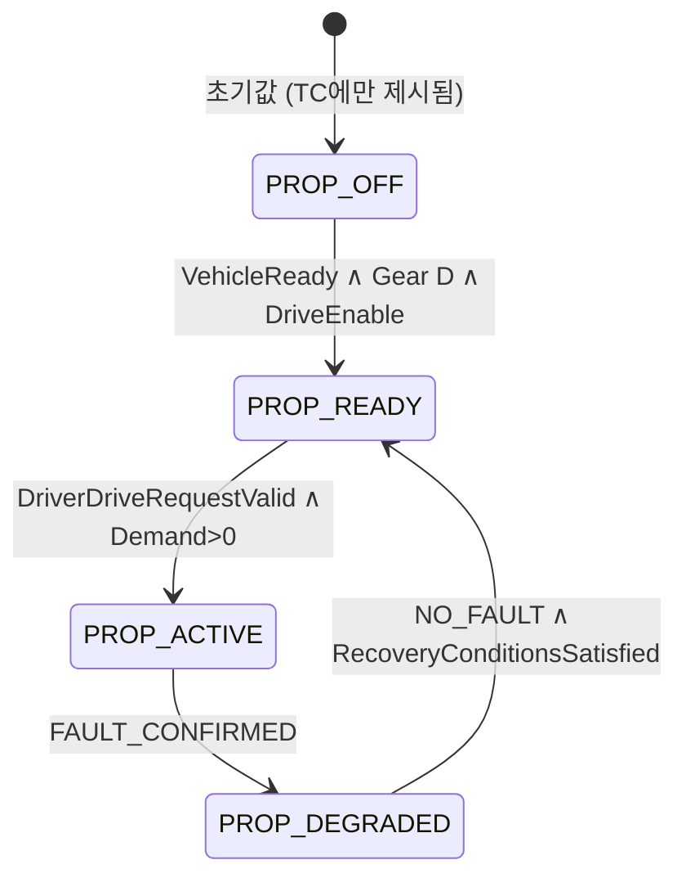
```mermaid
stateDiagram-v2
  [*] --> PROP_OFF: 초기값 (TC에만 제시됨)
  PROP_OFF --> PROP_READY: VehicleReady ∧ Gear D ∧ DriveEnable
  PROP_READY --> PROP_ACTIVE: DriverDriveRequestValid ∧ Demand>0
  PROP_ACTIVE --> PROP_DEGRADED: FAULT_CONFIRMED
  PROP_DEGRADED --> PROP_READY: NO_FAULT ∧ RecoveryConditionsSatisfied
```

이것은 **기록된 네 전이만 시각화**한다. 모든 입력에서 완결된 상태 머신이 아니며, 다른 상태에서 Fault가 발생할 때의 처리·OFF로의 복귀·0 페달 시 전이·초기 진입과 clear 조건은 **OPEN**. Fault flag 생성이나 `PROP_DEGRADED`의 실제 실행도 확인되지 않았다.

**검토 필요:** `VehicleReady`/`DriveEnable`이 ACTIVE 도중 FALSE로 바뀔 때 어떤 상태로 가는지, gear 변화의 처리, INVALID 요구 시 토크 반응, Fault 반응 우선순위, 브레이크 개입 시 허용 여부.

### 3.2 입력 수용 `LF-PROP-ACQ` [`SRC_DRAFT`]

원문: `FR-PROP-IN-001/002`, `SYS-PROP-IN-001/002`, `SWR-PROP-IN-001/002`.

| 입력 유효성 | 요구 동작 | 확정할 수 없는 사항 |
|---|---|---|
| `AcceleratorPedalValid=FALSE` | `PedalInterpreter_SWC`가 `DriverDriveRequestValid=FALSE` 설정 | 토크가 0인가? 요청 hold인가? Fault 처리인가? **원문 미기재** |
| `AcceleratorPedalValid=TRUE` | `DriverDriveRequestValid=TRUE` 설정 | Pedal 0%, 범위 외, 이중 센서 정합, 신뢰도 정책 |

`DriverInputRuntime`에서 받는 accelerator 0..1 값에 실제로 `AcceleratorPedalValid` 상태가 존재하는지는 불확실하다. 입력을 0으로 보냈다고 INVALID 플래그가 생기는 것으로 처리하면 안 된다.

### 3.3 요구 해석 `LF-PROP-INTERP` [`SRC_DRAFT`]

소스에 있는 규칙:

```text
IF DriverDriveRequestValid == TRUE:
    DriverDriveDemand = PedalDemandMap(AcceleratorPedalPosition)
```

- `DriverDriveDemand` 0.0..1.0은 **참조 모델의 정규화 표현**.
- 문서의 `AcceleratorPedalPosition=20% → DriverDriveDemand=0.20`은 **기준 Calibration을 가정한 예시**다.
- 실제 PedalDemandMap의 전체 곡선·단위 변환·dead zone·비선형ity·유효성 미충족 시 처리 등은 OPEN.
- Pedal 입력 획득은 `DriverInputRuntime`와 논리적으로 구분. 원본 신호 수집이 두 번 실행돼야 한다는 의미가 아니다.

### 3.4 토크 요구 생성 `LF-PROP-GEN` [`SRC_DRAFT`]

```text
IF PropulsionOperatingState == PROP_ACTIVE
   AND DriverDriveRequestValid == TRUE:
    RequestedDriveTorque = DriveTorqueMap(DriverDriveDemand, VehicleSpeed)
```

- 참조 TC의 예시 `Demand=0.20`, `VehicleSpeed=30 km/h` → `RequestedDriveTorque=120 Nm`는 **실제 C/WASM 수식의 증거가 아니다**.
- `DriveMode`는 개요도에는 있으나 위 SWR에 적용되는 명확한 식/입출력 정의가 없음. 조건 추가가 승인되어야 한다.
- 실제 runtime `VMC`가 계산하는 `DriveTorqueRequest`와 같은 단계인지 지금 결정하지 않는다. 중복 generator 금지.

### 3.5 Motion Arbitration 경계 [`SRC_DRAFT`, `ENGINEERING_PROPOSAL`]

기존 문서에는 운전자 토크, ADAS 요청, 안정화 제한, 안전 제약의 네 논리 입력이 있고 `ArbitratedDriveTorque`가 나온다고 제안되어 있다. **최종 우선순위, 충돌 판단, 단위, 원인/상태별 권한은 정의되어 있지 않다.**

- `RequestedDriveTorque = ArbitratedDriveTorque`는 **다른 개입이 없는 참조 정상 조건의 가정**이지 일반 불변식이 아니다.
- 실제 `VMC`에 구현된 Arbitration이라는 근거가 없으므로 런타임 코드에 새 arbitration 실행을 연결하지 않는다.
- Phase 03의 결과물은 '우선순위 필요·입력 출처 보존·제약 발행 책임'의 **설계 계약**, 실제 우선순위 테이블은 OPEN으로 남긴다.

### 3.6 토크 제한 `LF-PROP-LIM` [`SRC_DRAFT`]

원문 규칙:

```text
IF ArbitratedDriveTorque > MaxAllowedDriveTorque:
    LimitedDriveTorque = MaxAllowedDriveTorque
ELSE IF ArbitratedDriveTorque <= MaxAllowedDriveTorque:
    LimitedDriveTorque = ArbitratedDriveTorque
```

이 두 분기는 원문 `SWR-PROP-LIM-001/002`의 유효한 비교 조건만 조합해 표시했다. 입력이 유효하지 않거나 제한이 음수/NaN일 때의 동작은 명시되지 않음.

- `350 Nm` vs `300 Nm` → `300 Nm`, `200 Nm` vs `300 Nm` → `200 Nm`는 문서의 **참조 TC 예시**.
- boundary test `299.9`, `300.0`, `300.1 Nm` 역시 예시 제한 300 Nm를 기준으로 생성된 **후보**.
- 회생/후진 음수 부호 규칙, direction에 따른 크기 계산, 제한의 상·하한/포화, 물리 플랜트 반응은 **OPEN**.

### 3.7 구동 명령 제공 `LF-PROP-OUT` [`SRC_DRAFT`]

```text
IF PropulsionOperatingState == PROP_ACTIVE
   AND PropulsionRequestValid == TRUE:
    DriveTorqueCommand = LimitedDriveTorque
    DriveTorqueCommandValid = TRUE
```

- 다른 상태, 비유효 요구, 통신/전달 실패 시 명령 및 validity 값은 OPEN.
- `DriveTorqueCommand`가 실제 `DriveTorqueRequest`와 같은 포트인지 알 수 없음.
- `EDriveCommand`와도 구분. `eDrive` 내부 변환/제한 이후의 명령이기 때문에 그대로 동일시하지 않음.

### 3.8 감시 `LF-PROP-MON` [`SRC_DRAFT`]

```text
WHILE PropulsionOperatingState == PROP_ACTIVE:
    CommandTorqueDeviation = ABS(DriveTorqueCommand - LimitedDriveTorque)
IF CommandTorqueDeviation <= CommandTorqueTolerance:
    PropulsionFaultStatus = NO_FAULT
```

- 이 식은 두 값이 **독립적으로 관찰 가능하다**는 걸 증명하지 않는다. 같은 alias를 두 번 읽으면 유의미한 감시가 아니다.
- 허용차 이탈 시 Fault Pending/Confirmed 전이, 검출 기간, filtering, false-positive 방지 정책은 문서에 정의되어 있지 않다.
- `CommandTorqueTolerance`는 값이 확정되지 않은 참조 Calibration.
- 현재 0.5 배율 사례에서 어떤 지점이 이상인지 아는 것과 **Fault Detector가 이를 실제 검출하는 것**은 다르다.

### 3.9 Fault Reaction `LF-PROP-REACT` [`SRC_DRAFT`]

원문:

```text
IF PropulsionFaultStatus == FAULT_CONFIRMED:
    PropulsionOperatingState = PROP_DEGRADED
IF PropulsionOperatingState == PROP_DEGRADED:
    DriveTorqueCommand <= DegradedTorqueLimit
```

`DegradedTorqueLimit=50 Nm`는 **실차/현재 코드가 아닌 참조 TC 예시**. 안전 관련 하드웨어 출력 제약, 경로 중단, 다른 기능 개입과의 우선순위는 별도 정당화가 필요하다. 이 반응이 해당 Hazard를 안전하게 만든다는 주장이나 OEM 기능안전 요구사항으로 표현하지 않는다.

### 3.10 복귀 `LF-PROP-REC` [`SRC_DRAFT`]

```text
IF PropulsionOperatingState == PROP_DEGRADED
 AND PropulsionFaultStatus == NO_FAULT
 AND RecoveryConditionsSatisfied == TRUE:
    PropulsionOperatingState = PROP_READY
```

- Fault의 단순 순간 해제는 `RecoveryConditionsSatisfied` 충족을 의미하지 않는다.
- RecoveryConditionsSatisfied의 실제 평가 근거, debounce, key cycle, 명령 무효화 등의 정책 OPEN.
- Fault activation과 fault detection, fault confirmation, recovery authorization을 같은 상태값으로 합치지 않는다.

### 3.11 eDrive / VMC 실제 계산 경계 [`CODEX_REPORTED`]

| 구분 | VMC | eDrive |
|---|---|---|
| 입력 | `PropulsionRequest` 0..1; speed 0..60 m/s; direction; validity | `DriveTorqueRequest` 0..600 Nm; direction; validity |
| 출력 | `DriveTorqueRequest` | `EDriveCommand` |
| 실행 | C/WASM `verifyVmc` | C/WASM `verifyEDrive` |
| 수학적 계산 | **소스 코드 미제공 → 식 확정 금지** | **소스 코드 미제공 → 식 확정 금지** |
| 물리 출력 | 없음(토크 요구 계산) | adapter를 거쳐 DriveForce·Rapier 반영. 직접 실토크 계측 아님 |
| 기존 시험 | `TC-PROP-NORMAL-009` | `TC-PROP-NORMAL-010A/010B` |

- 기존 case의 HALF scaling 결함을 참조 정상 알고리즘으로 일반화하지 않는다.
- `90 → 45`라는 case-specific 결과를 모든 eDrive 입력에서 재현되는 보편 법칙으로 만들지 않는다.
- reference expected 90와 actual 45는 입력/방향/validity/limit/테스트 fixture를 만족한 **특정 실행 조건의 관측**에 한정한다.
- direction의 부호 체계, saturation, rounding, mapping, 물리 force gain은 코드 확인과 반례 시험 전까지 OPEN.

### 3.12 Propulsion 미정의 조건 감사표

| ID | 반드시 확정할 조건 | 지금 알 수 있는가? | 검증 질문 |
|---|---|---|---|
| P03-01 | VehicleReady false가 되면 현재 ACTIVE에서 어떻게 되는가? | OPEN | torque 값, 상태, 출력 validity |
| P03-02 | Gear D가 해제되면 어떻게 되는가? | OPEN | 변속 요청과 accepted gear 구별 |
| P03-03 | Pedal=0, invalid=TRUE 여부 각각의 의미 | OPEN | zero-demand vs invalid 분리 |
| P03-04 | Brake가 눌렸을 때 propulsion의 제약 | OPEN | brake priority 임의 단정 금지 |
| P03-05 | `DriverDriveDemand`와 `PropulsionRequest` alias | OPEN | 값·단위·호출 지점 비교 |
| P03-06 | `RequestedDriveTorque`와 VMC 실제 출력 alias | OPEN | 요청/제한/명령 단계 구분 |
| P03-07 | Backward/Reverse 방향의 토크 부호 | OPEN | magnitude vs signed-command |
| P03-08 | Fault confirm threshold·지속시간 | OPEN | 감시 횟수/tick과 signal 독립성 |
| P03-09 | Fault 감지 후 실제 대응 가능한 명령 경로 | OPEN | pseudo-safe-state 금지 |
| P03-10 | Recovery 조건과 우선순위 | OPEN | 복귀 중 입력 활성 여부 |
| P03-11 | `EDriveCommand`와 실제 motor torque 혼동 | 알려진 구분 | 계측 위치, force adapter 검토 |
| P03-12 | arbitration/control authority | OPEN | VMC 역할 중복 회피 |
| P03-13 | 60 Hz vs software sample timing | 부분 확인 | 10 ms 작업주기 추정 금지 |
| P03-14 | calibration map/saturation/source oracle 독립성 | OPEN | 120Nm/300Nm 예시를 code에 주입 금지 |

## 4. Gear와 Vehicle State — 함께 보이지만 별도 소유자

### 4.1 Gear `LF-GEAR-*` [`ENGINEERING_PROPOSAL`]

기능 역할: (1) `GearRequest` 취득, (2) 전이 허용 조건 검사, (3) **수락된/적용된 상태** 기록, (4) 실패 처리. 기존 `Requirement.md`는 `Gear Selector → Gear Request → State/Interlock Validation → Transmission or eDrive → Gear State` 흐름을 **참조 설계**로 명시한다.

| 구분 | 필요한 입력/결정 | 안전하게 정의할 수 있는 계약 | 미정 사항 |
|---|---|---|---|
| Request Acquisition | 운전자 선택 | 요청과 실제 기어 상태를 구별 | 실제 G/P/R/N/D UI 지원 |
| Interlock | 차량 정지 여부, 허용 상태, 유효성 등 **후보** | 승인된 guard 없이 gear 전환을 확정하지 않음 | 속도 임계치, 전이 허용표 |
| State Tracking | 수락·전환·적용 결과 | 요청 상태와 accepted/reported gear 구분 | 피드백의 실제 출처 |
| Fault Handling | 미적용/불일치 | Fault 표시와 fallback은 요구사항 있을 때만 | timeout, 처리 주기 |

기어는 현재 Vehicle Scenario에서 Gear D를 전제조건으로 지원한다고 보고되지만, D 외의 상세 변속 상태 머신이 실행된다는 근거는 없다.

### 4.2 Vehicle State `LF-VS-*` [`ENGINEERING_PROPOSAL`]

| 상태 그룹 | 책임 | 검토해야 할 반례 |
|---|---|---|
| Startup / Ready | 전원/초기화/기능 준비 판단 | 구동 READY라도 제동 기능은 별개 가용성일 수 있음 |
| Drive Permission | 허용 상태의 일관성 | GearD, VehicleReady와 DriveEnable은 동의어가 아님 |
| Mode Coordination | DriveMode 등의 소비자별 적용 | 모드가 바뀌어도 같은 출력 기대가 적용된다고 단정 금지 |
| Degraded Availability | 일부 기능의 제한/사용 가능 여부 | Fault 확정=시스템 전체 가용성 OFF는 아님 |

VehicleState를 `OFF/READY/ACTIVE/FAULT`라는 단일 거대 enum으로 강제하지 않는다. 도메인별 상태들이 서로 독립이되, 상호 제약이 있음을 표기한다.

## 5. 그 밖의 Domain — 74개 논리 Function의 상태/처리 계약

아래 표의 '처리'는 `02_DOMAIN_FUNCTION_DECOMPOSITION.md`에서 제시된 하위 역할의 **논리적 순서 또는 판단 지점**을 한국어로 정리한 것이야. 원문에서 계산식·전이값이 없는 경우 이를 만들지 않았다. 실제 Function 1개가 1 Runnable로 동작한다는 의미가 아니다.

### 5.1 Driver / Environment, Braking, Steering

| Function IDs | 필요한 처리·판단 | 제약/근거 |
|---|---|---|
| `LF-DRV-ACQ` | accel/brake/steer/gear 제어 취득 → 시각 부여 → 입력 모델 전달 | 입력 조작 범위는 Codex 보고. 시간 샘플링 정책 OPEN |
| `LF-DRV-VALID` | 자료형/범위/유효성 판정 → 입력 해석에 품질 전달 | invalid 센서 모델/중복센서 OPEN |
| `LF-ENV-STATE` | 시뮬레이션 환경/객체 → 추상 환경 상태 → ADAS | 실제 카메라·레이더 구현으로 주장 금지 |
| `LF-BRK-ACQ` | 운전자·AEB·Stability 제동 요구 취득 → 출처/유효성 구분 | 현재 브레이크 물리 입력만 알려짐 |
| `LF-BRK-STATE` | 기능 가용성/모드/고장상태 점검 → 제동 가능 상태 제공 | `DriveEnable`/Gear D를 무조건 제동 guard로 사용 금지 |
| `LF-BRK-DEMAND` | 유효 제동 요구 → 감속/제동 대상량 생성 | normalized brake와 물리 감속의 식 OPEN |
| `LF-BRK-COORD` | 다수 제동 요구·구동 제약 → 우선순위·허용 한계 조정 | VMC/MotionCoord와 권한 중복 금지. 우선순위 OPEN |
| `LF-BRK-BLEND` | 회생제동 가능 여부 → 회생/마찰 제동 배분 | regen plant, energy limit이 없으면 REFERENCE_ONLY |
| `LF-BRK-CMD` | 승인 제동 요구 → 명령 형식 변환 → 적용 경계 전송 | Brake Controller SW 존재 증거 없음 |
| `LF-BRK-FDBK` | 명령 vs 독립된 실제 반응 → 불일치·Recovery 평가 | BrakeForce가 실제 압력센서라는 뜻 아님 |
| `LF-STR-ACQ` | 운전자 steering/LKA 요구 취득 → 유효성·권한 출처 구분 | normalized -1..1 ≠ wheel angle |
| `LF-STR-STATE` | steering availability/assist mode 분류 | EPS assist와 SbW 모델은 서로 다름 |
| `LF-STR-DEMAND` | 입력→목표 조향량 변환 → 허용 범위 제한 | 실제 조향각/각속도/target yaw 선택 OPEN |
| `LF-STR-COORD` | driver/LKA 요구 권한 비교 → 최종 대상 요청 | driver override priority OPEN |
| `LF-STR-ACT` | 조향 요구 → actuator/physics command | EPS SW와 직접 physics input 혼동 금지 |
| `LF-STR-MON` | 명령·실제 각도/yaw 관측 → 응답 오차 판정 | 독립 steering feedback 실제 존재 미확인 |

### 5.2 Stability / ADAS / Motion Coordination

| Function IDs | 필요한 처리·판단 | 제약/근거 |
|---|---|---|
| `LF-STB-ABS` | 휠 상태/차량 속도 추정 → 잠김 경향 → 제동 조절 | 휠 slip sensor/모델 및 고속 제어 루프 없으면 실행 불가 |
| `LF-STB-TCS` | 구동 휠 미끄럼 추정 → 토크 제한/제동 개입 | 회전 휠속도 없으면 slip 판정 불가 |
| `LF-STB-ESC` | 목표 yaw와 관측 yaw 등 비교 → 안정화 개입 후보 | 실제 제동 편차 제어·yaw estimator 없으면 reference-only |
| `LF-STB-COORD` | 안정화 개입 요구를 Motion Coord 등으로 전달 | CAN 실제 메시지 주장 금지 |
| `LF-ADAS-AEB` | 선행 장애물 유효성 → 위협 판단 → 제동 요청/해제 | TTC/거리 threshold는 OPEN |
| `LF-ADAS-ACC` | 모드/목표 선택 → 속도/거리 제어 → 종방향 요청 | radar 구현·우선권 미확정 |
| `LF-ADAS-LKA` | 차로 관측 → 편차 판단 → 조향 보조 요구 | road wheel angle vs yaw vs lane offset 구분 |
| `LF-ADAS-COMMON` | 입력 품질/기능 가용성/운전자 취소 관리 | 모든 ADAS가 동시에 활성화되는 것은 아님 |
| `LF-MC-REQ` | 종·횡방향 driver/ADAS/stability 요구 취득 → 유형·출처 검증 | 현재 VMC가 모두 입력받는다는 근거 없음 |
| `LF-MC-AUTH` | 제어권/중복 요구 검토 → Arbitration 결과 | 정책·우선순위·충돌 해결 OPEN |
| `LF-MC-LON` | 구동/제동/ACC/AEB 종방향 요구 조정 | 별도 실행 generator 추가 금지 |
| `LF-MC-LAT` | driver/LKA/ESC 조향 관련 제약 결합 | current eDrive path와 연결 강제 금지 |
| `LF-MC-ALLOC` | 목표 운동 요청 → actuator별 배분·제한 | Brake/Steer SW·regen 미구현이면 부분만 정의 |
| `LF-MC-MON` | 조정 출력/명령 일치성과 제약 준수 감시 | 수신 endpoint telemetry 확인 필수 |

### 5.3 Sensing / Energy / Occupant / Fault / Communication / Execution / Plant

| Function IDs | 필요한 처리·판단 | 제약/근거 |
|---|---|---|
| `LF-SEN-MOTION` | Plant 속도/가속도/위치 관측 → 제어 피드백 제공 | 시뮬레이션 ground truth ≠ 실제 센서 출력 |
| `LF-SEN-ACT` | 출력 명령·actuator/plant response 위치별 관측 | 실제 독립 물리 토크 feedback 미확인 |
| `LF-SEN-QUALITY` | 샘플 유효성/시각/출처 등 관측 품질 판정 | 유효성 flag와 temporal rule은 미정 |
| `LF-EN-READY` | 에너지 가용성 판단 → 구동 가능 정보 제공 | BMS/HV power model 없음 |
| `LF-EN-LIMIT` | 구동/regen 가용 한계 추정 → constraint 제공 | 임의 voltage/SOC/safe torque 도입 금지 |
| `LF-EN-MON` | 가용 한계의 유효성·변화 추적 | 실측 전력 데이터 없는 상태 |
| `LF-OCC-IMPACT` | 충돌 관련 이벤트/가상 sensor 입력 | 충돌 이벤트만으로 airbag deployment 판정 불가 |
| `LF-OCC-DECIDE` | 조건 유효성/충돌 성격 → 보호 판단 | deployment threshold·ASIL 임의 설계 금지 |
| `LF-OCC-DEPLOY` | 승인된 판단 → 출력 명령·결과 상태 | 실제 pyrotechnic hardware 없음 |
| `LF-FM-OBS` | 각 기능의 감시 지점 수집 | raw vs delivered independent 측정 구분 |
| `LF-FM-DETECT` | 기준 비교 → pending/detected/confirmed 등의 상태 관리 | status 후보는 설계상 구별, 실제 임계치 OPEN |
| `LF-FM-REACT` | 확인 고장에 대응하여 기능별 제한 요청 | 상태별 safe action 별도 requirements 필요 |
| `LF-FM-REC` | fault clear와 recovery guard 확인 → 복귀 승인 | 단순 fault release로 회복 자동 판정 금지 |
| `LF-FM-DIAG` | DTC/event 등 진단 정보 제공 | 실제 UDS runtime/DTC list 미확인 |
| `LF-COM-PORT` | 송신 출력 캡처 → transfer → 수신 입력 캡처 | alias shared object를 두 샘플로 위장 금지 |
| `LF-COM-NET` | 메시지 구성/스케줄/수신·해석 | Motion CAN-FD는 문서상 참조만 확인 |
| `LF-COM-SUP` | 마지막 유효 수신 시각/갱신 여부 → timeout 감시 | 30ms 등 예시를 진짜 설정으로 사용 금지 |
| `LF-EXE-CLOCK` | simulator time/physics fixed tick의 소유 | clock 하나라고 runnable 주기도 같지 않음 |
| `LF-EXE-SCHED` | periodic/event runnable release, sample/hold | multi-rate runner 상세 미구현 |
| `LF-EXE-SUP` | runnable alive/WD/checkpoint 감시 | 실제 MCU watchdog 동작으로 주장 금지 |
| `LF-EXE-RECORD` | blackbox/incident capture → reset/replay | 기록된 시나리오와 재실행 trace 구분 |
| `LF-ACT-DRIVE` | eDrive command → physical drive force 적용 | force 단위/스케일 실제 adapter 확인 |
| `LF-ACT-BRAKE` | brake input/command → brake force 적용 | friction brake ECU와 혼동 금지 |
| `LF-ACT-STEER` | steering control → wheel/rigidbody response | 실제 steering torque/angle mapping 확인 |
| `LF-PLANT-MOTION` | force/steering/road → speed/yaw/position 적분 | vehicle response Expected 없음: actual-only |
| `LF-PLANT-ENV` | 노면/도로/Traffic 조건 → Plant 영향 | 현재 Road friction/Traffic actor 지원 범위 감사 필요 |

## 6. 상태 머신 구체화에 필요한 미확정 데이터 (계산식/전이표 생성 차단 조건)

| 영역 | 반드시 필요한 정의 | 부재 시 허용 처리 |
|---|---|---|
| Gear | 지원 기어, 현재 상태, 변속 허용 조건, 유효성/timeout | 설명·graph only, 실행 가능한 state TC 생성 금지 |
| Braking | 요구 단위, 연산식, 우선순위, Brake ECU 존재, feedback | 물리 브레이크 입력 테스트만, SW 검증 주장 금지 |
| Steering | EPS or steer-by-wire, state transitions, angle/torque semantics | driver steering→Plant 관찰만 |
| ABS/TCS | wheel state, slip criterion and controller sampling | reference-only |
| ESC | yaw/lateral observation & actuation authority | reference-only |
| AEB/ACC/LKA | object/lane abstract state, activation, priority & desired outputs | reference-only |
| Power | energy availability/capability model | proposed only |
| Occupant | valid crash sensors & decisions | reference-only |
| Communication | physical network, producer TX / consumer RX, timing semantics | internal port only |
| Fault Reaction | threshold/confirmation/warnings, limits, recovery policy | no safe-state verdict |

## 7. 요구사항·TC·시나리오 연결

- Propulsion의 각 조건은 기존 `FR-PROP-* → SYS-PROP-* → SWR-PROP-* → TC-SWR-PROP-*` 초안에 원문 ID 그대로 연결한다. 현재 C/WASM 런타임 검증 가능한 `TC-PROP-NORMAL-009/010A/010B`와 **동일 ID 체계로 자동 변환하지 않는다**.
- Reference v0.1의 `FR-PROP-REA-*` 등은 사고 위험 분석에서 SG/FSR/TSR이 나왔다는 증거가 아니다. 정상 기능 요구사항과 안전 요구사항을 분리한다.
- 로직별 기대 결과는 `STATIC_VALID_RANGE`, `CONTEXTUAL_REQUIREMENT_EXPECTED`, `INDEPENDENT_REFERENCE`, `ACTUAL_MEASURED`, `UNAVAILABLE` 등으로 출처/적용 조건을 표시한다.
- Test verdict `PASS/FAIL`은 승인된 expected 기준이 존재해야 하고, 없다면 `OBSERVED`로 저장한다.
- `Vehicle Scenario`가 실제로 움직이더라도 전체 차량 정상 Expected trajectory가 자동 생성되지는 않는다.

## 8. 검증 가능성 및 반례(오류 발견을 위한 최소 세트)

검증 대상자는 정답 숫자를 암기하기보다 아래처럼 **반례**를 통해 규칙을 확인해야 한다.

| 번호 | 시험/검토 대상 | 반례 입력 후보 | 확인할 사실 |
|---|---|---|---|
| V01 | `STA-001` | `VehicleReady=FALSE`, 그 외 TRUE | 모호한 else 상태가 자동으로 READY가 되지 않는지 |
| V02 | `STA-001` | Gear D 아닌 상태, 나머지 TRUE | 허용 조건 미충족 시 동작은 원문에 명시되어 있지 않음 |
| V03 | `STA-002` | demand 0 vs 양의 유효값 | zero-demand에서 ACTIVE 전이는 규정되어 있지 않음 |
| V04 | `IN-001/2` | 동일 pedal 값, Valid TRUE/FALSE | 유효성에 따른 사용 여부 구분 |
| V05 | `REQ-001` | 0.2뿐 아니라 0,1,0.5 | map을 실제 calibration 없이 선형으로 가정하는 오류 검출 |
| V06 | `GEN-001` | 속도 변경, demand 동일 | speed 의존성을 무시한 식 탐지. expected 수치 없는 조건은 OBSERVED |
| V07 | `LIM-001/2` | 299.9/300/300.1 예시 | 범위 경계 전후 및 = 조건 분기 |
| V08 | `OUT-001` | ACTIVE/READY/INVALID | 정의되지 않은 상태의 출력 의미를 임의로 채우지 않음 |
| V09 | `MON-001` | source/destination alias | 독립적 값이 없는데 실제 monitoring이라고 주장하지 않음 |
| V10 | `REA-001/2` | Fault detected vs confirmed | detected만으로 DEGRADED 전이했다고 단정하지 않음 |
| V11 | `REC-001` | NO_FAULT 참, recovery false | 즉시 복귀하면 문서 규칙 위반 |
| V12 | eDrive | Forward/Reverse, 0·경계·유효/무효 | 부호·방향·포화 규칙을 실제 C/WASM 코드 확인 |
| V13 | Motion Coord | brake와 accel 동시 요구 | 임의의 우선순위 규칙을 생성하지 않았는지 |
| V14 | Brake | Gear D 아님 + 제동 입력 | propulsion DriveEnable을 brake guard로 오용하지 않는지 |
| V15 | Steering | 정규화 steering 0.7 | 이를 실제 각도 0.7rad/deg로 표시하지 않는지 |
| V16 | Vehicle trace | 가속 STEP 시 차량 응답 | 관측 speed로 실제 Expected를 만들어내는 순환 논증 금지 |
| V17 | Fault injection | 정상 입력 변화 vs intercepted output | 변화의 주입 지점을 구분 |
| V18 | Timing | 60 Hz physics와 10ms software | 명목적 sample tick 혼동·time aliasing |

위 입력들은 **향후 시험 후보**다. 일부는 현재 런타임에서 조작 불가능하므로 PASS/FAIL 수행을 주장하지 않는다.

## 9. 현재 소스 간 충돌 및 오류 위험 (필수 수정 심사)

| 위험 ID | 내용 | 왜 문제인가? | 처리/검토 요청 |
|---|---|---|---|
| `X03-01` | 소스 v0.1의 `PropulsionStateManager_SWC` 등 | 현재 코드에 실제 AUTOSAR SWC가 있다는 증거 없음 | 참조 구현명으로 명시, 코드의 실제 이름과 매핑 승인 |
| `X03-02` | `DriverDriveDemand=0.2` 및 120Nm 예시 | 시연 Calibration을 모든 속도·상태에 일반화하면 허위 Expected | 실제 map 획득 전까지 example only |
| `X03-03` | Motion Arbitration과 VMC | 두 번의 토크 생성/제한 발생 가능 | 논리 책임과 물리 구현 위치 구분 |
| `X03-04` | `MaxAllowedDriveTorque` | 마찰·전력·회생 제한이 누구에게서 나오는지 미정 | provenance/ownership 정의 |
| `X03-05` | Limit 음수/부호 | FORWARD/REVERSE와 signed/magnitude가 혼합될 위험 | 단위/부호계약 확정 |
| `X03-06` | `ActualDriveTorque`와 `EDriveCommand` | 실제 측정 토크가 없는데 SW command를 실측값으로 포장 | signal taxonomy 분리 |
| `X03-07` | monitoring | independent monitor가 없으면 자기 자신과 비교하는 tautology | 독립 sample 위치 감사 |
| `X03-08` | `CommandTorqueTolerance`/고장 확정 기준 | 수치/시점 미정인데 Fault Confirmed를 판정할 위험 | 확정 조건·debounce/counter 요구 |
| `X03-09` | `PROP_DEGRADED` 50Nm | 안전 상태가 검증된 것처럼 보이는 위험 | HARA·TSR 근거 없으면 illustrative only |
| `X03-10` | CAN/timeout/10ms | source master design examples, runtime 없음 | 사용 가능 capability 별도 표시 |
| `X03-11` | Integrated `Requirement.md` 내 'Case별 최소 SG/FSR/TSR/SSR' 정책 | 안전 관련성이 입증되지 않은 일반 기능 고장에도 SG를 강제할 위험 | 승인 정책에서 **안전 사례에 한해** 추가하도록 재검토 요청, 원문은 유지 |
| `X03-12` | case hidden failure variant가 player visible function data에 섞임 | 조사 전에 원인 누출 | graph는 neutral, evidence reveal은 discovery 기반 |
| `X03-13` | 오류 원인=소프트웨어 실패 단정 | 물리/센서/인터페이스 장애도 있음 | 대안 가설 지원 |
| `X03-14` | independent expected | 동일 버그 로직을 Oracle에서 재호출하면 공통 오류 탐지 불가 | 별도 승인 specification/independent calculation |

## 10. 사용자 직접 검토를 위한 5단계 오류 감지 절차

### G1. 출처 역추적

하나의 IF, signal, state, unit, threshold를 고르면 원본 문서/코드의 **정확한 위치**가 나와야 한다. 예: `SYS-PROP-STA-001`은 Propulsion v0.1에 명시. `GearState`가 R에서 D로 바뀌기 위한 속도 제한값은 현재 소스에서 찾을 수 없음. 후자를 '정해진 값'이라고 적었다면 오류.

### G2. 독립된 검토 질문 두 개

1. **이 조건은 실제 엔진이 수행하는가?** 입력→실행 코드→출력의 path와 run trace가 확인되어야 함.
2. **이 조건이 옳다고 판정할 근거가 따로 있는가?** 요구사항/승인된 formula가 필요. 실행 결과만으로 올바른 정상 기준을 결정하지 말 것.

### G3. 상호 대조

Reference Architecture의 producer/consumer와 Signal Dictionary 및 TC의 signal ID·type·scale을 비교. `Nm`, `N`, `m/s`, `km/h`, `normalized`가 서로 혼용되는 항목은 blocker. SYSR/SWR의 추상화 수준, Runtime signal과 Reference signal의 매핑도 비교.

### G4. 반례/불변식

조건 경계, invalid, gear change, reset, recovery, missing update, 값 범위, timing windows를 의도적으로 바꿔 봄. 같은 값만 반복하면 잘못된 수식도 통과함. 전제조건 미충족 시 기대동작이 미정이면 그 사실을 발견한 것으로 처리하고, 임의 PASS를 만들지 말 것.

### G5. 사람 검토 및 승인

AI는 검토표를 만들고 질문에 답할 수 있지만 최종 승인 대신을 맡지 않음. 외부 공신력 자료와 비교할 수 있는 주제는 해당 차종/제어방식 맥락에 맞는 원문 자료로 확인. 안전 로직은 자격 있는 검토 없이 참조 모델 이상으로 주장하지 않음. 승인 전 상태는 `PROPOSED`/`OPEN`으로 유지.

## 11. 설계 검토 Gate — Phase 04 진입 조건

| Gate | 승인 기준 | 미통과 시 행동 |
|---|---|---|
| A: Source Provenance | 모든 확정 IF/상태/숫자/신호에 sourceRef와 근거 등급 | Source 없는 조건은 OPEN |
| B: No Contradictions | Reference Propulsion vs VMC runtime alias, torque chain, CAN, task timing 충돌표 존재 | 매핑 미확정 선언 유지 |
| C: Logic Completeness | 해당 Function의 WHEN/THEN/ELSE/INVALID/RESET/PRIORITY 중 미정 표시 | 실행 TC 생성 제한 |
| D: Observability | 독립 endpoint/plant actual과 예상값의 출처 별도 | 관측값만 제공, PASS/FAIL 금지 |
| E: Semantic Honesty | SG/FSR/ASIL/실제 제어기 구현 허위 주장 없음 | 관련 배지/기능 숨김 또는 참조 표시 |
| F: Regression | 기존 VMC/eDrive 3 TC 및 Vehicle Scenario 실험 유지 | 기존 코드 변경 필요하면 별도 마이그레이션 |
| G: Human Approval | Draft 검토 + unresolved 이슈 동의 | canonical Ground Truth 반영 금지 |

## 12. 다음 단계로 넘길 데이터

Phase 04에서 실제 Signal Dictionary·Interface를 구축할 때 각 로직에 다음을 결합한다.

1. 입력/출력/상태별 정확한 **signal ID, raw/physical 타입, 단위, 범위, 부호, 유효값**.
2. 신호를 실제 생산하는 **source port**와 소비하는 **destination port**. 동일 object의 두 이름인지, 별도 데이터 전달인지 확인.
3. 로직이 참조하는 Req ID와 적용 조건. 조건 없는 정적 정상범위/동작 Expected 구분.
4. 실행·관측·판정 `SUPPORTED / OBSERVED_ONLY / REFERENCE_ONLY / UNKNOWN` 플래그.
5. 제공된 모든 예시 수치는 `EXAMPLE_ONLY`; 승인된 runtime calibration과 별도 관리.
6. Source conflict/OPEN list를 해결하지 않은 상태에서 임의의 새 ECU/네트워크 signal/전이 정책 생성 금지.

**Phase 03 종료 상태:** Propulsion source-draft 로직은 원문 수준으로 구조화했고, 다른 Domain은 처리 책임과 미정조건만 정의했다. **74개 Function에 임의의 상태 전이·임계치·공식이 확정되어 있는 것처럼 표시하지 않는다.**


---


# TRACKBACK Phase 03-B — Driver·Environment / Vehicle State / Gear / Braking / Steering

- 버전: v0.2, 2026-10-07 | **설계 검토용** (`PROPOSED/OPEN`), 기존 C/WASM/물리 코드 변경 없음.
- 근거: `Requirement.md` §9~27·§32·§40, Phase 01/02 한글 설계, `03_INTERNAL_LOGIC_STATE_MACHINE_KO.md` 및 기존 Codex 실행 보고. **함수 이름과 Subfunction은 Phase 02 ID를 유지한다.**
- 근거 등급: `SRC_DRAFT`=참조 요구/명세에 서술; `CODEX_REPORTED`=실제 실행되었다는 도구 보고(직접 확인 전); `ENGINEERING_PROPOSAL`=신규 참조 설계; `OPEN`=정보 부족. 이 페이지의 조건을 실제 차량/검증 결과로 주장할 수 없다.
- 표에 있는 `*Request`, `*Valid`, `*Available`처럼 기존 Runtime Dictionary에 없는 표기는 **개념 데이터 항목(임시 이름)** 이지 등록된 캐노니컬 Signal이 아니다. 특히 아래 상태 후보는 enum이 아니다.

## B0. 두 가지 처리 경로를 구분한다

1. 현재 보고된 **실행 구간**: `DriverInputRuntime`의 accelerator/brake/steering, gear=D 시나리오 전제 → VMC/eDrive 구동 출력 + brake/steering의 Rapier physics 적용 경로. 독립적인 Brake Controller/EPS/Transmission Controller, 노면 휠슬립 센서는 실행 근거 없음.
2. **제안 논리 경로**: Request → validity/applicability → domain state/guard → functional demand → cross-domain constraints → controller/adapter → Plant → independent observation. 새 논리 단계가 곧 실제 실행 객체임을 뜻하지 않음.

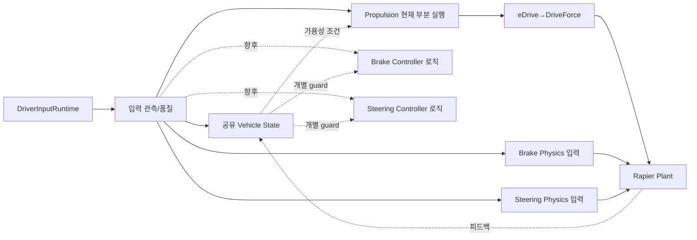
```mermaid
flowchart LR
 A[DriverInputRuntime] --> D[입력 관측/품질]
 D --> VS[공유 Vehicle State]
 D --> P[Propulsion 현재 부분 실행]
 D -.향후.-> B[Brake Controller 로직]
 D -.향후.-> S[Steering Controller 로직]
 D --> BA[Brake Physics 입력]
 D --> SA[Steering Physics 입력]
 VS -.가용성 조건.-> P
 VS -.개별 guard.-> B
 VS -.개별 guard.-> S
 P --> DA[eDrive→DriveForce]
 DA & BA & SA --> PL[Rapier Plant]
 PL -.피드백.-> VS
```

## B1. Driver/Environment: 운전자·환경 입력 경계 — 3개 기능

운전자 입력은 **조작 의도**이고, 센서 신뢰도나 실제 제어 요구와 동일하지 않다. Environment State는 참조 Ground Truth를 ADAS용 추상 정보로 변환하는 역할이며 실제 카메라/레이더 검출을 시뮬레이션하지 않는다.

### `LF-DRV-ACQ` — 취득
- **하위 처리**: `ACQ-ACCEL`, `ACQ-BRAKE`, `ACQ-STEER`, `ACQ-GEAR`, `ACQ-TIME` 각각 값을 취득 → 동일 시뮬레이션 clock에 timestamp 부여 → 원시 조작 명령을 변경하지 않고 보관 → 소비 기능으로 전달. Gear는 `requested` 값만 제공.
- **입력→출력**: 운전자 키/조작 이벤트 및 scenario stimulus → `rawDriverCommands`(개념)와 timestamp. 출처마다 수집 주기가 다르면 freshness를 별도로 기록.
- **조건/상태**: UI 게임 일시정지, 새 시나리오 reset, 사전조건 주입, driver scenario active를 구별. 이전 상태 값 유지 방식(sample/hold)은 **OPEN**.
- **반례**: accelerator 값을 0으로 만든 사건을 Invalid 센서 고장이라고 판단하면 안 됨. Gear D 요청이 실제 Gear D 적용을 뜻하지 않음.
- **지원/검증**: accelerator/brake/steering 제어 + scenario reset은 `CODEX_REPORTED`; raw sample timestamp의 독립 기록은 `OPEN`. 관측 재현 시험: reset 직후 첫 샘플, STEP/RAMP 경계 tick.

### `LF-DRV-VALID` — 입력 품질·정규화
- **하위 처리**: `VALID-RANGE` → `VALID-STATUS` → `VALID-CONVERT` → `VALID-AGE`를 논리적으로 분리. 정규화는 단위 변환/값 표현이며 센서 진단과 다름.
- **입력→출력**: 원시 조작, 자료형/등록 도메인, 제공되는 별도 validity/freshness → 판단 가능한 `quality`/normalized input; 판정 근거가 없으면 `UNKNOWN`, 정상 `VALID` 강제 금지.
- **조건/상태**: 허용 입력 범위가 [0,1]인 DriverInputRuntime accelerator/brake 및 [-1,1] steering **보고**만 존재. 실제 페달 센서 이중 채널/불일치 판단은 정의되지 않음.
- **반례**: `clamp(1.1, 1.0)`만 수행하고 입력 범위 위반 이벤트를 없애면 이상 주입 관찰이 소실. `NaN`/타입 오류를 정상 0으로 위장하면 안 됨.
- **지원/검증**: 게임 입력 경계값 BVA 가능할 수 있으나 `INVALID_STATE`, freshness 기반 Fault Diagnosis는 미지원. 변환 전후 값·변환이 일어난 위치를 구분하여 관측.

### `LF-ENV-STATE` — 환경 상태 제공
- **하위 처리**: `ENV-ROAD` 도로 구간/노면 → `ENV-TRAFFIC` 객체 위치/속도 → `ENV-REL` 상대 거리·상대 속도 → `ENV-LANE` 차로 상대 정보. 구현 근거가 없는 필드는 노출 금지.
- **입력→출력**: Scenario Environment / Traffic truth → 필요한 경우 객체 유효성, 상대 속도, 차로 위치 등 추상 state; 인지 sensor output으로 명명하지 않음.
- **조건/상태**: 환경 데이터 시각이 차량 state 시각과 일치하는지, 동일 물체 추적 ID의 연속성이 있는지, 참조 경로가 제공됐는지 확인하는 guard 필요(모두 **OPEN**).
- **반례**: 가상 객체가 보인다는 사실로 AEB가 해당 객체를 검출·추적한다고 주장할 수 없음. 상대 거리 0이 항상 충돌을 뜻하지 않음.
- **지원/검증**: 실제 Traffic/road source 필드가 확인된 후에만 의미 있는 테스트 구성. 현 단계는 `SRC_DRAFT/REFERENCE_ONLY`.

## B2. Vehicle State / Mode 공유 서비스 — 4개 기능

**기어 상태, 차량 준비, 기능별 가용성은 서로 다른 소유자가 담당한다.** VehicleReady 및 DriveEnable을 하나의 boolean으로 합치면 기능별 정책이 사라짐.

### `LF-VS-INIT` — 초기화·준비 상태
- **하위 처리**: `INIT-START` 초기화 이벤트 → `INIT-READY` 필요한 준비 조건 집계 → `INIT-EXPOSE` 요청자에게 ready 정보 → `INIT-RESET` 리셋 시 독립 기능 상태 초기화.
- **입력→출력**: 초기화 완료 이벤트·구동 가용 정보(존재할 때) → `VehicleReady`(참조 이름) 및 근거/미확정 상태.
- **Guard**: 요구조건에서 `VehicleReady=TRUE`를 사용하는 것은 명시됐지만, 그 값의 계산식은 없음(`OPEN`). 모든 ECU가 READY여야 한다는 일반 규칙을 임의 정의하지 않음.
- **상태 후보**: `UNINITIALIZED → INITIALIZING → READY`는 제안된 관찰 단계일 뿐; 전원 OFF 복귀와 Failure 상태는 미정.
- **검증 반례**: Plant가 움직인다고 VehicleReady 출력이 TRUE였다고 추정하면 안 됨.

### `LF-VS-PERM` — 주행 허용·인터록
- **하위 처리**: `PERM-READY` 준비 확인, `PERM-GEAR` 적용 기어 확인, `PERM-FAULT` 기능 제한 확인, `PERM-FINAL` 해당 기능에 필요한 허용 정보만 발행.
- **입력→출력**: `VehicleReady`, `GearState`, availability, fault limits → `DriveEnable` 또는 개별 permission. 단 `DriveEnable`의 생성 로직은 `OPEN`.
- **조건**: Propulsion v0.1 `READY` 가드인 `VehicleReady AND GearState=DRIVE AND DriveEnable`은 참조 요구상 사실. 하지만 이것이 DriveEnable 계산의 정확한 식을 정의하지는 않음.
- **반례**: DriveEnable=FALSE여도 Brake 기능까지 비활성화하면 안 됨. 주행 중 회복 정책은 별도 정의 필요.

### `LF-VS-MODE` — 모드 관리
- **하위 처리**: `MODE-REQUEST` 모드 요구 → `MODE-GUARD` 전환 가능 조건 → `MODE-PUBLISH` 현재 모드 → `MODE-TRANSITION-REPORT` 요청/실제 반영의 구분.
- **입력→출력**: 드라이브 모드 요구와 현재 적용 상태 → 실제 모드/전이 상태/거부 이유. `DriveMode`는 Propulsion v0.1 개요에만 등장, 정확한 map 반영은 `OPEN`.
- **상태 후보**: `REQUESTED`, `ACCEPTED`, `APPLIED`, `REJECTED`는 **전환 생명주기** 분류로, 실제 드라이브 모드 enum과 구분해야 함.
- **반례**: `Sport`와 `Eco` 모드에서 torque Expected가 같다고 단정하지 않고 등록 Calibration이 없으면 판정 불가로 둠.

### `LF-VS-FAULT` — 고장 상태에서의 가용성
- **하위 처리**: `FAULT-AGGREGATE` 도메인별 고장/반응 상태 취합 → `FAULT-PERMISSION` 영향 받는 기능만 제한 → `FAULT-RECOVERABILITY` 복귀 가능성 전달.
- **입력→출력**: Domain fault statuses → 독립적인 기능별 availability/limitation descriptor(개념).
- **Guard**: 누가 어떤 고장에 대해 차량 전체 READY를 변경할 수 있는지 safety/functional requirements가 필요함(**OPEN**).
- **반례**: Steering assist fault가 있다고 구동·제동을 모두 OFF로 만들면 안 됨. 특정 반응을 '안전 상태'로 선언하려면 별도 safety analysis가 필요함.

### Vehicle State — 개념 상태/가용성 상호작용
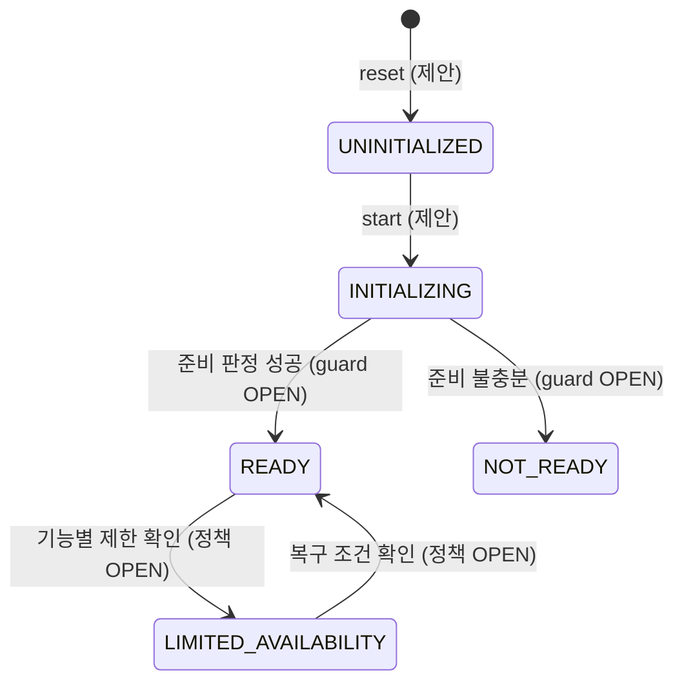
```mermaid
stateDiagram-v2
  [*] --> UNINITIALIZED: reset (제안)
  UNINITIALIZED --> INITIALIZING: start (제안)
  INITIALIZING --> READY: 준비 판정 성공 (guard OPEN)
  INITIALIZING --> NOT_READY: 준비 불충분 (guard OPEN)
  READY --> LIMITED_AVAILABILITY: 기능별 제한 확인 (정책 OPEN)
  LIMITED_AVAILABILITY --> READY: 복구 조건 확인 (정책 OPEN)
```
- `UNINITIALIZED/INITIALIZING/NOT_READY/LIMITED_AVAILABILITY`는 **신규 후보 라벨**이며 실행 enum 아님. `PropulsionOperatingState` 전이를 대신하지 않음.

## B3. Gear / Direction — 4개 기능

기어 선택 스위치의 `GearRequest`, 허용된 요구, 제어기에 반영된 `GearState`, eDrive 동작 방향은 같은 값이라고 보장되지 않음.

### `LF-GEAR-ACQ` — 요청 취득
- **하위 처리**: `GEAR-REQUEST` → `GEAR-VALID` → `GEAR-AGE`. 지원 요청 집합은 P/R/N/D 후보지만 현재 Vehicle Scenario는 gear D를 명시적 전제조건으로만 보고함.
- **입력→출력**: UI selector 요청 및 요청 시각 → 구분된 요청 값/유효성/원인. 실제 선택 가능 enum과 invalid encoding **OPEN**.
- **반례**: 화면에 D 표시가 있다고 실제 변속 actuator가 D를 적용했다는 증거는 아님.

### `LF-GEAR-INTERLOCK` — 전환 허용 판단
- **하위 처리**: `GEAR-SPEED-GUARD`, `GEAR-BRAKE-GUARD`, `GEAR-DIRECTION-GUARD`, `GEAR-INHIBIT-REASON`. 모든 guard는 기능 책임을 나타내는 **후보**.
- **입력→출력**: 요청 기어, 현재 적용 기어, 속도, 브레이크 및 도메인 가용성 → `accepted/rejected/pending`와 이유; 속도 임계값·브레이크 필요 여부는 차량 정책별이라 **OPEN**.
- **반례**: 주행 속도 >0에서 무조건 모든 기어 변경을 막는 규칙도, R 즉시 허용도 근거 없음. N/P 정책은 별도 확정.

### `LF-GEAR-STATE` — 상태 추적
- **하위 처리**: `GEAR-PENDING` → `GEAR-TRANSITION` → `GEAR-ENGAGED` → `GEAR-REPORT` (제안 생명주기).
- **입력→출력**: 승인 요청, 적용 확인 또는 실패 피드백 → 보고 가능한 `GearState`. 적용 확인 source가 없으면 실제 적용 결과로 주장 금지.
- **반례**: 요청 D가 들어온 tick에 기어 상태가 즉시 D라고 주장하면 지연/거부 고장 사례를 구현할 수 없어짐.

### `LF-GEAR-REACT` — 전환 실패
- **하위 처리**: `GEAR-FAIL-DETECT`가 관측·계약 기반 이상을 수집 → `GEAR-INHIBIT` 기능상 처리 → `GEAR-RECOVER` 복구 guard를 개별 검토.
- **입력→출력**: 전환 요청 시각, 적용 상태, 오류/timeout 기준(미정) → 진단 상태/거부 이유/복귀 가능 여부.
- **반례**: 요청→적용 한 tick 지연이 있다고 자동 timeout FAIL 처리 불가. timestamp pair와 허용시간 계약이 있어야 함.

### Gear — 요청과 적용을 구분한 생명주기
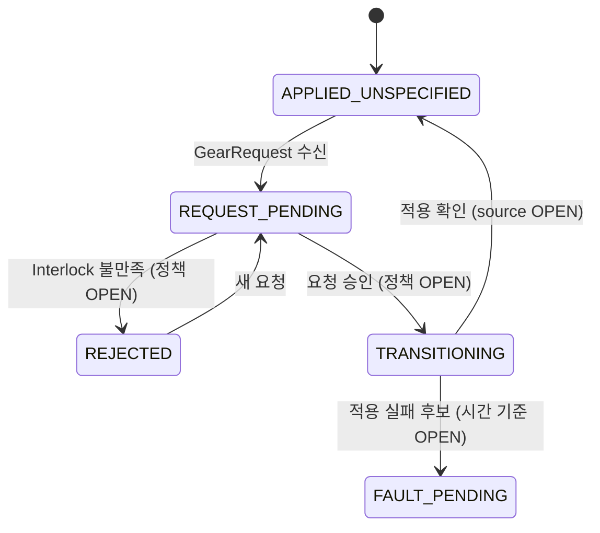
```mermaid
stateDiagram-v2
  [*] --> APPLIED_UNSPECIFIED
  APPLIED_UNSPECIFIED --> REQUEST_PENDING: GearRequest 수신
  REQUEST_PENDING --> REJECTED: Interlock 불만족 (정책 OPEN)
  REQUEST_PENDING --> TRANSITIONING: 요청 승인 (정책 OPEN)
  TRANSITIONING --> APPLIED_UNSPECIFIED: 적용 확인 (source OPEN)
  TRANSITIONING --> FAULT_PENDING: 적용 실패 후보 (시간 기준 OPEN)
  REJECTED --> REQUEST_PENDING: 새 요청
```
- 전체 상태 이름은 `DESIGN_CANDIDATE`. `GearState` 값 P/R/N/D와 **서로 다른 종류**의 상태다.

## B4. Braking — 7개 기능

Braking은 **요청 해석 → 요구 조정 → Brake Controller/Adapter → 마찰력 및 차량 감속** 역할로 분리한다. Propulsion을 끄면 모든 제동이 사라지는 식으로 연결하지 않는다. `BrakeForce`가 계산됐다는 사실만으로 실제 유압·휠 토크를 측정한 것은 아니다.

### `LF-BRK-ACQ` — 제동 요구 수집
- **하위 처리**: `BRK-PEDAL` 운전자 페달, `BRK-ADASSRC` AEB, `BRK-STABSRC` ESC/ABS 등 개입을 **출처를 보존하여** 수집 → `BRK-VALID` 독립 validity/갱신 상태.
- **입력→출력**: Driver brake ∈ [0,1] (`CODEX_REPORTED`), AEB 감속 요구/ESC 개입은 `REFERENCE_ONLY`. 요청은 단위(감속 m/s², 압력, normalized demand 등)가 다르면 즉시 수치 결합 금지.
- **조건**: 같은 출처의 두 sample을 마지막 수신 시각과 비교하는 기준은 OPEN.
- **예시 가설**: AEB braking request가 발생했는데 Brake 경계에서 인식되지 않음 → source/destination 양단 관찰 필요.

### `LF-BRK-STATE` — 가용성 및 제동 상태
- **하위 처리**: `BRK-ENABLE` 기능 가용성, `BRK-MODE` 제어 방식, `BRK-FAULT-STATE` 고장 가용성, `BRK-PUBLISH` 소비자 제공.
- **입력→출력**: 브레이크 가용 신호/진단 보고 → 기능 상태 및 요청 승인 가능 여부. 구성요소의 전원/유압/모터 존재와 같은 하드웨어 정보 **OPEN**.
- **상태 후보**: `AVAILABLE`, `LIMITED`, `UNAVAILABLE`는 가용성 범주이지 실제 Brake ECU state가 아님.
- **반례**: D 기어 해제 후에도 브레이크 제동 요구를 처리해야 할 수 있으므로 `DriveEnable`을 모든 Braking 가드에 넣는 것은 부적절.

### `LF-BRK-DEMAND` — 감속 요구 해석
- **하위 처리**: `BRK-INTENT` 유효 제동 의도 확인 → `BRK-REQUEST-MAP` 목표 감속/제동량 도출 → `BRK-COAST/DISABLE` 요구가 사라질 때 정책 → `BRK-DEMAND-PUBLISH`.
- **입력→출력**: normalized brake 등 → 논리 `RequestedDeceleration` 또는 `RequestedBrakeTorque` 중 **하나를 명시적 계약으로 선택** (아직 이름/계산식 미확정).
- **조건**: 차량 속도, 노면, 동력계, brake map, 정지 유지, 후진 부호 등이 영향을 줄 수 있지만 실제 Calibration 없음.
- **반례**: brake=0.5에서 목표 감속이 항상 절반이라고 가정하면 비선형 페달/힘 제한 문제를 은폐함.

### `LF-BRK-COORD` — 요구 조정
- **하위 처리**: `BRK-ARB-REQUEST` 출처·목적을 식별하고 충돌 검사 → `BRK-PROP-INTERLOCK` 구동/제동 공존 정책 검토 → `BRK-LIMIT` 가용 제약 → `BRK-PRIORITY` 최종 결정.
- **입력→출력**: 운전자·AEB·ESC의 서로 다른 의미/단위 요구 → 승인된 제동 목적·제어권 상태. VMC의 전체 Arbitration과 이 기능의 최종 책임을 중복 할당하지 않음.
- **조건**: Emergency request가 있다고 항상 어떤 우선순위로 특정 Brake 출력이 생성되는지는 정책 **OPEN**.
- **반례**: accelerator+brake 동시 입력이 무조건 brake priority라는 무조건 규칙은 근거 부족; 물리 제동은 무효화하지 말고 실제 정책/차량 타입에 맞춰 결정해야 함.

### `LF-BRK-BLEND` — 회생·마찰 제동 배분
- **하위 처리**: `BLEND-ELIGIBLE` 회생 가능/불가능 판단 → `BLEND-REGEN-LIMIT` 전기 구동 및 에너지 제약 적용 → `BLEND-FRICTION-REMAINDER` 목표 제동 부족분 할당 → `BLEND-TRANSITION` 중첩/변환 시 연속성 보장(정량 기준 미정).
- **입력→출력**: 승인된 총 제동 목표 + Energy/Propulsion의 회생 가능 제약 → `RegenContribution` / `FrictionContribution` **후보 신호**. 각 구동 토크/휠 토크/차량 감속으로 환산하는 모델 필요.
- **조건**: BMS, wheel slip, 에너지 회수 여건, 제동력 회복 등 무정의. 현재 Rapier에 BrakeForce가 있다고 회생 기능도 있다는 결론 금지.
- **반례**: 전체 BrakeForce에 회생 제동을 중복해서 더해 총 감속이 과대해지는 구현 금지.

### `LF-BRK-CMD` — 제동 명령 생성
- **하위 처리**: `BRK-CMD-CONVERT` 목표를 명령단위로 변환 → `BRK-CMD-VALID` 상태/유효성 보존 → `BRK-CMD-SATURATE` 승인된 가용 제한 → `BRK-CMD-PORT` 명령 발행.
- **입력→출력**: 승인 목표/회생·마찰 기여 → 출력 명령과 validity. Brake SW controller 모델이 미확정이므로 실제 `BrakeForce`는 Plant 적용 결과와 분리.
- **조건/반례**: 동적 지연, 속도에 따른 한계, failure reaction을 알고리즘으로 임의 추가하지 않음; validity FALSE 시 실제 Brake reaction은 OPEN.

### `LF-BRK-FDBK` — 응답 감시
- **하위 처리**: `BRK-OBSERVE` 독립 응답(있으면) 채취 → `BRK-COMPARE` 요구·반응의 시각과 단위 정렬 → `BRK-FAULT` 승인 criterion 평가 → `BRK-RECOVER` 복귀 guard.
- **입력→출력**: 명령, 적용 제동력, 감속 관측 중 측정 가능한 것 → `MATCH/MISMATCH/UNAVAILABLE` 성격의 관찰 결과, 진단 확정과 구분.
- **조건**: 차량 가속도는 구배/구동력/노면의 합력 결과로서 명령된 단일 BrakeTorque와 같지 않음. 단순 차이값만으로 ECU Fault 결정 불가.
- **반례**: `BrakeForce`와 brake 요청이 둘 다 증가해도 실제 감속이 정확한지 별도 기준 없으면 `OBSERVED`.

### Braking — 논리 상태 및 출력 관계
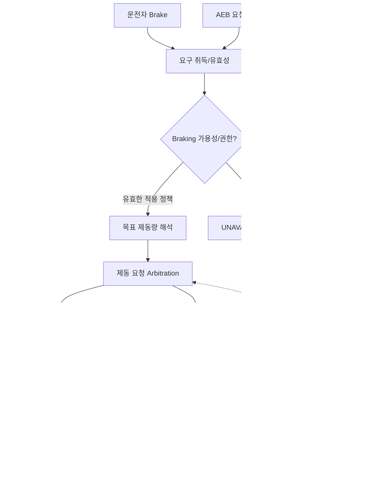
```mermaid
flowchart TB
 D[운전자 Brake] --> A[요구 취득/유효성]
 E[AEB 요청: 미래] --> A
 ESC[ESC 개입: 미래] --> A
 A --> G{Braking 가용성/권한?}
 G -->|유효한 적용 정책| I[목표 제동량 해석]
 G -->|불명/미지원| U[UNAVAILABLE: 판정 보류]
 I --> C[제동 요청 Arbitration]
 C --> B[Blending: regen 지원 시에만]
 C --> N[Blending 없이 friction만: 정책 필요]
 B & N --> O[Brake Command/Adapter]
 O --> P[Plant brake force]
 P --> M[응답 관찰]
 M -.피드백.-> C
```

**Braking state 후보**: `AVAILABLE`, `REQUESTED`, `ACTIVE`, `LIMITED`, `FAULTED`, `RECOVERY_PENDING`은 가용성과 제어 생명주기가 섞이기 쉬움. 최종 모델에서 `AvailabilityState`와 `DemandState`를 **직교 영역**으로 분리. Trigger, fault severity, recovery guard, braking zero output/park hold 정책은 전부 `OPEN`.

## B5. Steering — 6개 기능

Steering은 **운전자의 조향 의도**, **조향 보조**, **바퀴각**, **차량 yaw 결과**가 서로 다르다. EPS와 steer-by-wire는 구조가 다르므로 현재 모델이 어떤 아키텍처인지 결정되기 전에는 제어 로직을 하나의 실제 SW처럼 고정할 수 없다.

### `LF-STR-ACQ` — 요구 취득
- **하위 처리**: `STR-DRIVER` 운전자 normalized steering → `STR-ASSIST` LKA 등의 보조 요구(미래) → `STR-VALID` 요청 유효성 → `STR-AUTHORITY` 출처/제어권 기록.
- **입력→출력**: steering ∈ [-1,1] (`CODEX_REPORTED`) 및 미래 LKA 조향 보조 후보. normalized 조작값은 steer-wheel angle 또는 road-wheel angle이 아님.
- **반례**: 좌회전 steering input -1이 실제 yaw를 정확히 -1 rad/s 만드는 규칙은 거짓.

### `LF-STR-STATE` — 조향 가용성
- **하위 처리**: `STR-AVAIL` 장치/모델 가용성 → `STR-ASSIST-MODE` 보조 활성화 → `STR-FAULT-STATE` 기능제한 → `STR-PUBLISH` 현재 가용 범위.
- **입력→출력**: EPS assist 또는 SbW 구현 상태(미확정) → assist availability + mode. 실제 `ASSIST_ACTIVE`/`LIMITED` enum은 등록되기 전까지 제안 상태.
- **반례**: 보조기능 unavailable은 기계식 조향이 불가능하다는 뜻이 아닐 수 있음; steer-by-wire와 기계 연결형을 동일시하지 않음.

### `LF-STR-DEMAND` — 목표 조향 해석
- **하위 처리**: `STR-MAP` 운전자/보조 요구를 목표 조향 물리량으로 변환 → `STR-LIMIT` 범위·속도 제약 → `STR-OPTIONAL-FILTER` 연속성 조건(요구 시) → `STR-REQUEST`.
- **입력→출력**: raw steering + speed → 실제 모델이 채택한 목표(road wheel angle, assist torque, yaw-rate request 등 한 가지 타입을 명확히 택함). 데이터에 실제 mapping 없음.
- **반례**: 핸들 각도와 전륜 조향각을 일대일로 계산하면 steering ratio를 놓침. 속도 따른 동작 변화를 가정한 Expected를 만들어선 안 됨.

### `LF-STR-COORD` — 운전자와 보조 요구 조정
- **하위 처리**: `STR-REQUEST-TYPES` 요구 형태 일치 확인 → `STR-DRIVER-OVERRIDE` 운전자 개입 검출 기준(미정) → `STR-PRIORITY` 권한 결정 → `STR-FINAL-DEMAND`.
- **입력→출력**: Driver steering, LKA 요청과 availability → 최종 명령과 출처. 운전자 override가 존재한다는 개념은 제안이지만 감지 임계값 없음.
- **반례**: LKA와 운전자 요구를 단순 더하면 actuator saturation 및 중복 조향 문제가 발생할 수 있음.

### `LF-STR-ACT` — 조향 출력
- **하위 처리**: `STR-ACT-CONVERT` actuator command 변환 → `STR-ACT-GUARD` 유효성/가용 제약 → `STR-ACT-SEND` 명령 전달 → `STR-ACT-APPLIED` 적용 상태 기록.
- **입력→출력**: 최종 목표값/command → 물리 adapter 입력 및 독립된 실제 적용 상태(존재 시). 현재는 Rapier 조향 입력 반응만 보고됨.
- **반례**: physics가 돌아간다는 이유로 별도 EPS software runner와 interface telemetry가 구현됐다는 증거는 아님.

### `LF-STR-MON` — 조향 응답 감시
- **하위 처리**: `STR-FEEDBACK` 실제 조향각 또는 yaw 관측 → `STR-DEVIATION` 물리량 정렬 → `STR-MON-STATUS` 관찰 결과 → `STR-RESPONSE` 진단 요청(기준 존재 시).
- **입력→출력**: command, applied angle, vehicle yaw 등 → 비교 결과. Yaw는 속도/타이어/노면 영향 포함; 목표 steer angle과 같은 수치 비교 금지.
- **반례**: 정지 상태에서 yaw가 0이라는 사실은 조향 모터가 작동하지 않았다는 증거가 아님.

### Steering — 요청과 적용 관측
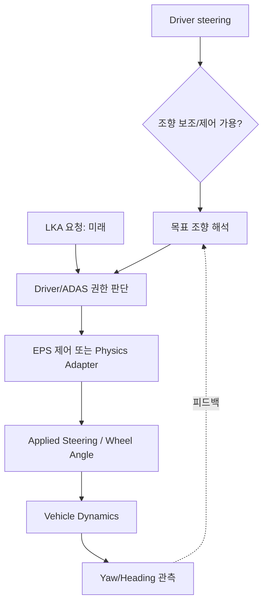
```mermaid
flowchart TB
 DRIVER[Driver steering] --> AV{조향 보조/제어 가용?}
 LKA[LKA 요청: 미래] --> AUTH[Driver/ADAS 권한 판단]
 AV --> MAP[목표 조향 해석]
 MAP --> AUTH
 AUTH --> CMD[EPS 제어 또는 Physics Adapter]
 CMD --> W[Applied Steering / Wheel Angle]
 W --> P[Vehicle Dynamics]
 P --> OBS[Yaw/Heading 관측]
 OBS -.피드백.-> MAP
```

**Steering state 후보**는 독립 `AssistAvailability` + `RequestAuthority` + `ActuatorStatus`로 다뤄야 한다. 하나의 `STEER_ACTIVE`로 압축해 LKA와 운전자 조향을 동시에 설명하려는 모델은 부적절하다.

## B6. 이 문서의 판단 기준과 열린 쟁점

| 질문 | 필요한 근거 | 미정이면 가능한 결론 |
|---|---|---|
| 차량 READY에서 브레이크 입력은 항상 유효한가? | 제동 가용성/입력 계약 | Range만 확인, 동작 Expected 불가 |
| Brake 0.5일 때 감속 얼마? | brake map, vehicle/road dynamic oracle | Actual 관찰만 가능 |
| Gear D 요청이 적용됐는가? | gear consumer/feedback | D request 확인에 한정 |
| 왜 Steering이 상태를 갖는가? | 가용성, 제어권, 모드·fault handling 관계 | 역할 설명은 가능, 정확한 전이 미정 |
| 운전자·AEB 동시 요청의 우선권? | Arbitration 정책/요구사항 | 자동 판단 금지 |
| ABS 휠잠김 해제 후 다음 명령? | 제어 주기·휠속·slip 기준 | 추후 03-C에서 분석 |

### 승인 전 검사 후보 (PASS/FAIL로 단정하지 않음)
1. DriverInput normal STEP/RAMP → 같은 시각의 physical brake/steer 관측이 실제 연결된 구간만 비교.
2. zero brake, nonzero accelerator; zero accelerator, nonzero brake; simultaneous accelerator/brake에서 관찰값과 숨겨진 정책 간 충돌 확인.
3. Gear D request와 runtime GearState/permission 사이 소유권·출처 감사.
4. 계층 식별자, 단위, source ID, validity가 없는 관측에 허위 Expected를 생성하지 않았는지 검사.
5. 제안 상태 다이어그램을 정식 testcase 또는 실제 차량 safety requirement로 자동 발행하지 않음.


---


# TRACKBACK Phase 03-C — Stability / Motion Coordination

- `v0.2`, 설계 검토용 · 2026-10-07 · 모든 신규 상태/요청 형식 `ENGINEERING_PROPOSAL`, 숫자·전이 guard는 `OPEN`.
- Phase 02 논리 Function 10개: `LF-STB-ABS/TCS/ESC/COORD`, `LF-MC-REQ/AUTH/LON/LAT/ALLOC/MON`. 문서상 예정 분야이며 **실제 ABS, 휠속도 센서, ESC yaw controller, 독립 Motion CAN-FD SW, VMC 다중 요구 Arbitration은 구현 확인 안 됨**.
- 근거: `Requirement.md` §12–16·§22·§24·§27, `02_DOMAIN_FUNCTION_DECOMPOSITION_KO.md` 해당 식별자, `03_INTERNAL_LOGIC_STATE_MACHINE_KO.md` 상태 및 VMC 경계 규칙.

## C0. 왜 두 영역을 분리하나

- **Stability**: 차량이 원하는 운동에서 벗어나거나 휠이 비정상적으로 미끄러지는 상황을 파악하여 **구동·제동·자세 안정화 개입 요구를 만드는 기능**.
- **Motion Coordination**: 운전자·ADAS·Stability·Power/Fault Constraint의 요구를 받아 **실제 구동·제동·조향 액추에이터로 어떤 목표를 보낼지 정책적으로 정하는 기능**.
- `VMC`라는 소프트웨어가 현재 수행하는 것으로 보고된 역할은 VMC/eDrive 토크 요구 계산. 모든 Motion Coordination 역할이 VMC 코드에 구현됐다는 주장은 금지.
- Stability 기능은 도메인 단위 감시/제어이지만 ESC/ABS/TCS를 무조건 동일한 차원/단위의 torque로 직접 더할 수는 없다.

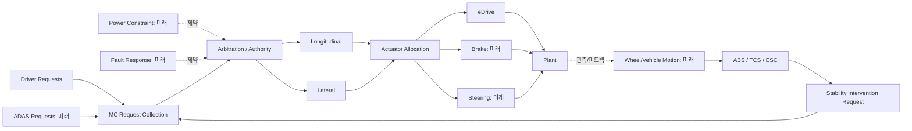
```mermaid
flowchart LR
 D[Driver Requests] --> R[MC Request Collection]
 A[ADAS Requests: 미래] --> R
 W[Wheel/Vehicle Motion: 미래] --> ABS[ABS / TCS / ESC]
 ABS --> ST[Stability Intervention Request]
 ST --> R
 EN[Power Constraint: 미래] -.제약.-> AUTH[Arbitration / Authority]
 FM[Fault Response: 미래] -.제약.-> AUTH
 R --> AUTH --> LONG[Longitudinal] & LAT[Lateral]
 LONG & LAT --> AL[Actuator Allocation]
 AL --> DRI[eDrive] & BRK[Brake: 미래] & STR[Steering: 미래]
 DRI & BRK & STR --> PL[Plant]
 PL -.관측/피드백.-> W
```

## C1. Stability — 4개 논리 Function

### `LF-STB-ABS` — Antilock Braking System
- **목적**: 제동 시 개별 휠이 잠기는 경향을 감시하고, 가능한 범위에서 바퀴 회전을 유지하도록 휠별 제동을 조절하는 기능. `차량이 반드시 제동거리가 짧아지는 기능`으로 정의하면 틀릴 수 있다.
- **하위 판단**: 휠속도 관측 → 차량 참조속도 추정 및 유효성 검사 → 제동 중 휠 슬립/감속 추정 → ABS 개입 필요 여부 → 대상 휠의 제동압력/토크 감소·유지·재증가 요청 후보 → 반응 관측.
- **입력 후보**: `wheel angular velocity`, `effective radius`, vehicle reference speed, brake demand, wheel speed validity, road/actuator state. **현재 런타임에는 신뢰 가능한 개별 휠 속도/슬립 관찰 지원이 확인되지 않음**.
- **제어 원리(수치 미정)**: 단순 감시용 longitudinal slip 후보 `s=(v - rω)/max(|v|, v_epsilon)`는 제동 방향의 이상화된 표기이며 v≈0, reverse, wheel reference direction, 타이어 유효 반경, 차량 참조속도 편향 정책 필요. 이 식은 현재 TRACKBACK의 승인 Calibration·Requirement가 아니다.
- **상태 후보**: `STANDBY`, `MONITORING`, `MODULATING`, `UNAVAILABLE`; 개입은 여러 바퀴에서 동시에 다를 수 있어 하나의 global state만으로 wheel 명령을 결정하지 않음.
- **조건**: brake request가 있는지, wheel sensor sample이 유효한지, 휠 잠김/재가속 기준이 충족됐는지. 실제 slip threshold, hold/down/up duty, timing = `OPEN`.
- **출력 후보**: `perWheelBrakeModulationRequest`와 intervention status. 마찰제동 명령에 사용되므로 임의로 eDriveCommand에 직접 덮어쓰지 않음.
- **고장/반례**: 정상 속도 신호 한 개만으로 모든 wheel lock을 판단하거나 `ABS_ON` 상태를 제동 전체 허용으로 삼으면 안 됨. 비교 기준이 없으면 `OBSERVED`만 가능.

### `LF-STB-TCS` — Traction Control System
- **목적**: 구동 시 바퀴의 과도한 회전/미끄럼을 제한하도록 구동 토크 또는 제동 개입을 요청.
- **하위 판단**: 가속 요구/휠 회전 측정 → 참조속도와 wheel rotation 관계 비교 → 구동 슬립 후보 평가 → 허용 토크 제한·선택적 wheel brake intervention 요청 → 결과 모니터.
- **입력 후보**: driven wheel speed, vehicle reference speed, applied drive torque/request, wheel validity, traction/road condition. `VehicleSpeed` 단독으로는 어떤 바퀴가 slip인지 알 수 없음.
- **상태 후보**: `STANDBY`, `WATCHING`, `INTERVENING`, `LIMITED`; guard와 phase durations OPEN.
- **출력 후보**: `driveTorqueUpperConstraint`, `wheelBrakeInterventionRequest`, source=`TCS`. torque의 signed/magnitude semantics를 Propulsion limiter가 결정할 때 보존해야 함.
- **반례**: 구동력 감소 자체를 `eDrive defect`로 단정하면 안 됨. TCS가 정상 개입해 torque를 줄인 것인지 출처를 추적해야 함.

### `LF-STB-ESC` — Electronic Stability Control
- **목적**: 차량 실제 횡방향 운동(예: yaw)이 목표 운동과 크게 어긋날 때 적절한 휠 제동/구동 제한 등 안정화 개입 요청.
- **하위 판단**: 운전자 조향·속도·유효성으로 목표 yaw/trajectory 후보 계산 → 독립 yaw/측가속/자세 관측 확인 → 방향성과 편차 평가 → 통제 가능한 개입 요청 → 실제 vehicle feedback.
- **입력 후보**: steering quantity (운전자 steering과 road wheel angle 구분), speed, yaw rate, lateral acceleration, wheel state, validity, tire/road model. **현재 Physics X/Z position을 실제 yaw sensor와 동의어로 처리 금지**.
- **상태 후보**: `AVAILABLE`, `MONITOR`, `CORRECTING`, `LIMITED`; 좌/우 개입 분배는 Wheel Brake model 및 Authority owner와 합의 후 설계.
- **출력 후보**: selective wheel brake, drive torque reduction, optional stability constraint. 마찰계수와 actuator capability를 만족할 수 없으면 안정화 성공을 주장하지 않음.
- **반례**: 정상 driver steering에도 미끄러운 노면의 Plant yaw가 어긋날 수 있어 내부 로직 불량을 자동 추정 금지.

### `LF-STB-COORD` — 안정화 개입 전달
- **목적**: ABS/TCS/ESC에서 생성된 개입 요구를 대상 제어 영역에 **출처·유효성·우선권**과 함께 전달.
- **하위 처리**: 요청별 목적 및 단위 표준화 계약 확인 → 동일 wheel/actuator 충돌 식별 → Domain owner 또는 Motion Coordination에 전달 → source/destination observation.
- **입력→출력**: `ABS wheel brake limit`, `TCS torque bound`, `ESC selective brake` → typed constraint/intervention request (예시 타입으로만 제안).
- **조건**: 어떤 요청이 Brake controller에 직접 전달되고 어떤 요청이 MC를 거치는지 Deployment allocation **OPEN**. 임의의 CAN 프레임 생성 금지.
- **반례**: ABS가 brake pressure를 낮추는 요청과 AEB가 차량 감속을 높이라는 요청은 단순 MAX/MIN으로 해석되지 않음. 권한과 액추에이터 공간이 다르다.

### Stability 상태와 원인 추적 그래프
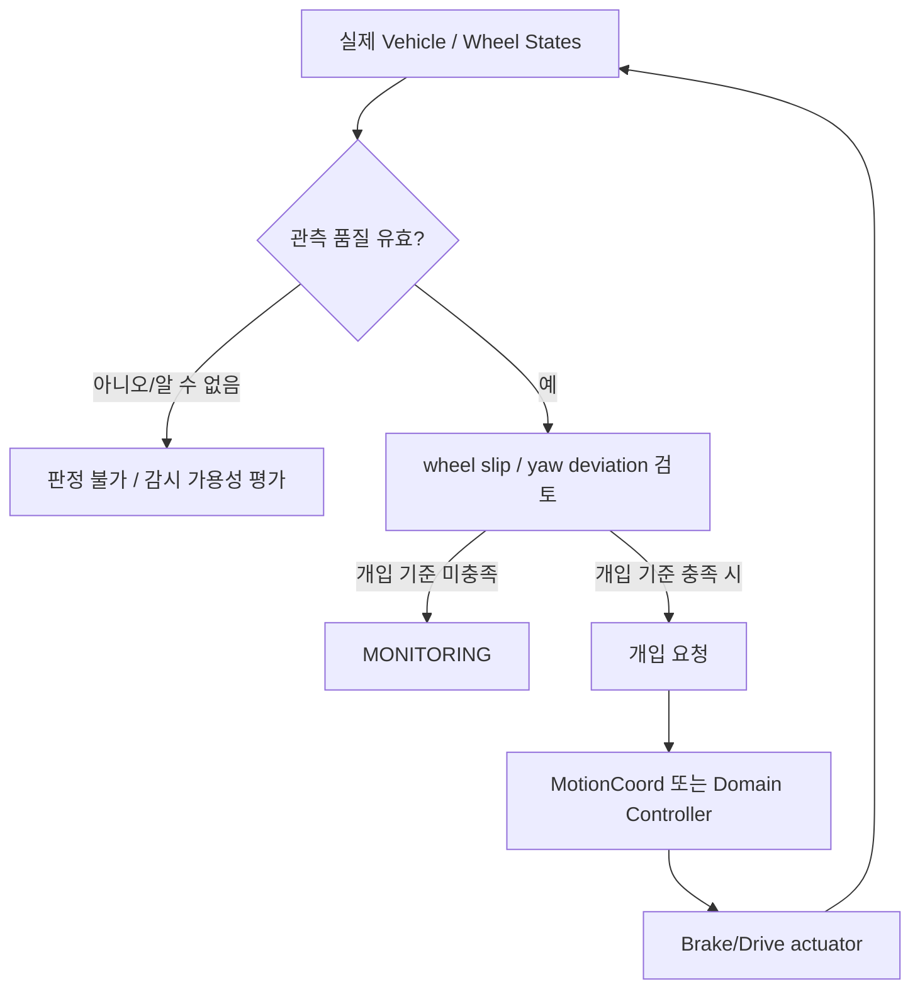
```mermaid
flowchart TB
 V[실제 Vehicle / Wheel States] --> Q{관측 품질 유효?}
 Q -->|아니오/알 수 없음| U[판정 불가 / 감시 가용성 평가]
 Q -->|예| SL[wheel slip / yaw deviation 검토]
 SL -->|개입 기준 미충족| MON[MONITORING]
 SL -->|개입 기준 충족 시| INT[개입 요청]
 INT --> MC[MotionCoord 또는 Domain Controller]
 MC --> ACT[Brake/Drive actuator]
 ACT --> V
```
`개입 기준`은 실제 threshold가 아닌 **OPEN guard**. ABS/TCS/ESC를 한 개의 상태 머신으로 합치지 않고 독립 요청자로 관리한다.

## C2. Motion Coordination — 6개 논리 Function

### `LF-MC-REQ` — 요청 수집
- **목적**: 서로 다른 기능이 요구하는 차량 운동을 **원본 요청의 의미와 권한을 보존한 채** 수용.
- **하위 처리**: `MC-COLLECT` 출처 취득 → `MC-TYPE` torque/acceleration/deceleration/steering/yaw 요구 구분 → `MC-VALID` validity/time/source 확인 → `MC-TRACE` provenance 저장.
- **입력 후보**: Propulsion, Braking, Gear permission, Driver steering, ACC/AEB/LKA, TCS/ESC; 특정 기능이 미구현이면 입력 자체 없음. 별칭 ID가 같아 보인다고 중복 sample 합산 금지.
- **출력 후보**: typed `motionRequests[]` 이벤트 집합. **그 자체는 최종 command 아님**.
- **반례**: `RequestedDriveTorque=120 Nm`와 `AEB deceleration=3 m/s²`를 직접 수치 비교하거나 하나의 공통 scalar로 저장하면 안 됨.

### `LF-MC-AUTH` — 제어권·요구 Arbitration
- **목적**: 어떤 상황에서 누가 어느 제어 축을 지배/제약하는지 확인하고 **중복·상충 요구를 해결할 정책**을 수행.
- **하위 처리**: 요청 source/criticality/validity 구분 → `ControlAxis`(LONGITUDINAL/LATERAL/WHEEL_BRAKE)별 authority 판정 → 요청 충돌 규칙 및 제한의 소유권 적용 → 승인·거부/제약의 이유 보존.
- **입력→출력**: type-tagged requests+availability+fault constraints → `arbitrationDecision` 및 근거. 실제 priority/driver override/중재 타임아웃은 `OPEN`.
- **상태 후보**: 축별 `MANUAL`, `ASSISTED`, `AUTOMATED_REQUESTED`, `CONSTRAINED`, `UNAVAILABLE`는 서로 배타적인 하나의 모드가 아니라 다양한 dimension의 후보.
- **반례**: `AEB = 항상 최대 브레이크`, `driver = 항상 조향 최우선` 같은 절대 우선순위를 Requirements 없이 고정하면 안전 관련 분석 결과와 충돌할 수 있음.

### `LF-MC-LON` — 종방향 운동 조정
- **목적**: accelerator/torque, decel/brake, ACC/AEB, traction 제약을 차량 종방향 동작 요청으로 정리.
- **하위 처리**: 축 종류 식별 → 요청 간 차량 방향/기어/주행 모드 관련성 확인 → 적용 가능한 drive/brake 요구의 균형·제약 → 인가 가능 목표 발행.
- **입력→출력**: accepted requests + torque/regen availability → longitudinal demand/constraints. 요청 단위가 토크라면 실제 변환 소유자와 관찰지점이 있어야 함.
- **반례**: driver brake>0이라고 drive torque를 항상 0으로 만드는 것은 정책 부재를 숨김. 양 제어가 실제 물리 Plant에 각각 작용할 수도 있으므로 명령·반응을 별개로 기록.

### `LF-MC-LAT` — 횡방향 운동 조정
- **목적**: 조향 운전자 요구, LKA 보조 요구, ESC의 안정화 제한이 동시에 있을 때 횡방향 목표·권한을 관리.
- **하위 처리**: steering 목표 종류 식별(각/토크/yaw) → 각 영역별 authority 선택 → 최종 제한/경로 → steering controller에 typed command 전달.
- **입력→출력**: driver steering, LKA demand, stability intervention → lateral decision + owner. wheel angle과 yaw를 같은 신호처럼 연산하지 않음.
- **반례**: 조향 및 ESC 제동 개입은 다른 actuator이므로 하나의 steering output만으로 안정화 제약을 모두 구현할 수 없음.

### `LF-MC-ALLOC` — Actuator Allocation
- **목적**: **승인된** 차량 운동 요구를 각 actuator가 수행할 수 있는 적절한 명령으로 배분.
- **하위 처리**: actuator capability/availability 확인 → drive/brake/steer 각 명령 공간으로 분리 → 한계/상호 제약 적용 → 명령 source·destination 기록.
- **입력→출력**: approved demand + capability constraints → eDrive/Brake/EPS 각각의 명령 또는 제한. 기존 VMC→eDrive 구동 경로와 별개 계산기가 중복 생성되지 않게 함.
- **조건**: 회생 제동이나 wheel-selective braking을 설계하려면 해당 물리 모형·인터페이스·controller가 실제로 필요. 미구현이면 참조 단계.
- **반례**: `AppliedDriveForce`를 `DriveTorqueRequest` 그대로 전달하거나 음수 출력이 항상 회생 제동이라고 주장 금지.

### `LF-MC-MON` — 조정 결과 감시
- **목적**: Arbitration 결정과 실제 발행/전달/적용된 값이 **계약상** 일치하는지 평가하여 관찰 결과를 제공.
- **하위 처리**: source decision 캡처 → command endpoint 캡처 → 시간·단위 정렬 → approved criterion이 있을 때 비교 → Fault Detection 입력으로 전달.
- **입력→출력**: decision/command/plant observation with provenance → `OBSERVED`, requirement-verdict, optional diagnostic report. 한 shared object의 다른 이름을 양단 독립 telemetry로 표시 금지.
- **반례**: controller의 command가 올바르게 전달된 뒤 물리 반응만 약할 수 있으므로 SW logic fault라고 단정하지 않음.

### Motion Coordination — 제어권 및 제한 구조
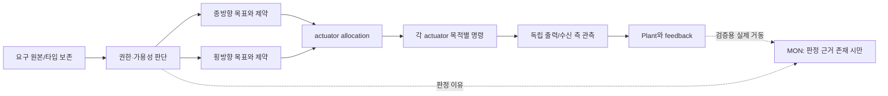
```mermaid
flowchart LR
 ORIG[요구 원본/타입 보존] --> AUTH[권한·가용성 판단]
 AUTH --> LON[종방향 목표와 제약]
 AUTH --> LAT[횡방향 목표와 제약]
 LON & LAT --> AL[actuator allocation]
 AL --> OUT[각 actuator 목적별 명령]
 OUT --> END[독립 출력/수신 측 관측]
 END --> P[Plant와 feedback]
 P -.검증용 실제 거동.-> MON[MON: 판정 근거 존재 시만]
 AUTH -.판정 이유.-> MON
```

## C3. Domain 간 명시적 책임 배분

| 질문 | Owner 추천 | 겹치면 위험한 이유 |
|---|---|---|
| ABS가 개별 휠 제동 감쇠를 결정? | Stability/Brake Actuation 경계 | AEB 감속 요구와 단위·우선순위 다름 |
| 차량 종방향 torque vs decel arbitration? | MotionCoord 논리 책임 | Propulsion과 Braking에 중복 Arbiter 생성 금지 |
| 실제 제동력을 Friction/Regen으로 배분? | Braking 기능, Energy constraint 소비 | MC allocator가 두 번 regen 제한하면 이중 제한 |
| 실제 VMC의 현재 Torque request 계산? | 현재 C/WASM VMC 단일 source | 신규 MC 구현이 동일 출력 덮어쓰기 금지 |
| 안전 고장 제한이 torque를 얼마나 줄일지? | 승인된 Safety/Functional Requirement 필요 | 개인 임의 감소 = safe state 아님 |
| yaw target/oracle은 누가 만드는지? | Steering/Stability 각 목표 정의 + Measurement | yaw angle·angle request를 동일시 금지 |

## C4. 상태 머신 완성 전 승인해야 할 정책

| 정책 ID | 결정 필요 | 미확정일 때 UI/검증 동작 |
|---|---|---|
| `MC-P01` | 축별 요청 타입/단위/방향 부호 | 비교 불가, 수치 합산 금지 |
| `MC-P02` | source 권한/우선순위 및 override | Arbitration `OPEN` |
| `MC-P03` | 감속·구동 동시 명령 제어 정책 | 실제 Plant 관측만 허용 |
| `MC-P04` | 횡방향 steering/LKA/ESC 조정 경계 | 요청 source만 trace |
| `STB-P01` | Wheel speed/slip/yaw 실제 관측 경로 | ABS/TCS/ESC 실행 `UNSUPPORTED` |
| `STB-P02` | 개입 enable, threshold, hysteresis, 샘플링 | intervention verdict `UNAVAILABLE` |
| `STB-P03` | 각 wheel actuator / brake control capability | selective braking 미지원 |
| `MC-P05` | source-output/destination-input boundary 관측 | interface MATCH 금지 |

**Phase 05 연동:** 각 정책이 요구사항 및 실제 source calibration/테스트 oracle로 정의되기 전에는 임의의 SYSR/SWR·PASS/FAIL·SG/ASIL을 발행하지 않는다.


---


# TRACKBACK Phase 03-D — ADAS / Sensing & Estimation / Power & Energy

- 버전: v0.2, 2026-10-07. **개념·논리 로직 제안** / 미정 조건 명시 / 코드 미반영.
- 대상 10개 Function: `LF-ADAS-AEB/ACC/LKA/COMMON`, `LF-SEN-MOTION/ACT/QUALITY`, `LF-EN-READY/LIMIT/MON`.
- 출처: `Requirement.md` §11~16, §19~23, §24, Phase02 목록. `Environment State Provider`는 Traffic/Environment **Ground Truth의 가상 추상화**이며 실제 camera/radar와 구분한다. 현재 구현된 ADAS, HV battery, wheel sensors 또는 independent actuator feedback의 실행 근거는 없음.
- 각 상태·함수·표 아래 있는 통상적인 차량 제어 공학 설명은 `ENGINEERING_PROPOSAL`, 공개 참조 문서에 기능명/흐름만 있는 것은 `SRC_DRAFT`; 신규 실제 신호·정확한 정량 threshold는 전부 `OPEN`.

## D0. ASIL·안전 설계 경계

AEB/ACC/LKA, BMS 가용 제약, sensor validity가 **기능상** 정의된다고 해서 Safety Goal, 특정 ASIL 또는 양산 수준 safe state가 결정되지는 않는다. HARA/FSR/TSR/SSR은 Phase 05에서 구분하며 실제 차량 자료로 가장하지 않는다.

## D1. ADAS — 4개 논리 Function

### `LF-ADAS-AEB` — Automatic Emergency Braking
- **목적**: 전방 위험과 충돌 위험이 있다고 판단되는 경우 운전자 제동 외의 **자동 제동 요청**을 생성할 후보 기능.
- **내부 순서**: 입력 objects/relative motion 및 in-path 판단 → 관측 `validity`/신선도 검사 → 객체별 위협 가설 구성 → 접근 관계/현재 속도/경로 유효성 판정 → 경고 또는 제동 요구 가능 여부 → 제동·해제 정책 → Braking/MotionCoord에 typed request 발행.
- **입력 후보**: object distance, relative speed, object position and in-path classification, Ego speed, driver brake, AEB availability. 기존 문서에 개념적인 `ObjectValid`, `Distance`, `RelativeVelocity`, `InPath` 등장하지만 실제 등록된 canonical 신호 ID가 아님.
- **판단의 핵심**: 접근 중인 객체인지와 차량 경로상 위협인지가 별개이다. `TTC = distance / closingSpeed`는 **접근속도>0과 적절한 충돌 경로를 가정한 단순 후보 지표**로, 상대속도가 0/음수 또는 객체 측정 무효일 때 TTC를 임의의 0으로 만들지 말아야 함. TTC 기준값·제동 단계·해제·재작동 정책 모두 `OPEN`.
- **상태 후보**: `DISABLED`, `STANDBY`, `THREAT_EVALUATING`, `WARNING_REQUESTED`, `BRAKE_REQUESTED`, `SUPPRESSED`, `UNAVAILABLE`. 진짜 AEB state enum은 아직 없음.
- **출력**: `AebBrakingRequest`, rationale, active status 등 후보. BrakeForce나 AppliedDeceleration과 동일하지 않음.
- **고장 시나리오**: 유효한 object 정보 누락, in-path false classification, brake request 미전달, brake controller 거부, 요청 정상인데 물리 감속 저하 — 원인 위치가 서로 다름.

### `LF-ADAS-ACC` — Adaptive Cruise Control
- **목적**: 운전자 설정 속도 및 유효한 선행 차량과의 간격 관계를 이용해 **종방향 운동 요구**를 생성.
- **내부 순서**: 설정 속도/거리 모드 확인 → ego/target data 유효성 → 선행 차량 선택 여부 → 속도 유지 후보 제어/간격 유지 후보 제어 → longitudinal request 제한 → MotionCoord/Propulsion/Braking에 타입 맞는 전달 → cancel/standby 관리.
- **입력 후보**: set speed, selected gap, lead vehicle distance/relative velocity, ego speed, driver enable/cancel, braking intervention, ADAS availability.
- **구분**: 선행 차량이 없거나 미인식일 때 차량 속도 목표를 유지하는 mode와 유효한 선행 차량의 간격을 추종하는 mode는 다른 제어 기준. target selection이 유효하지 않으면 자동으로 '없음' 또는 '가상 정상 거리'를 만들어서는 안 됨.
- **상태 후보**: `OFF`, `STANDBY`, `ACTIVE_SPEED`, `ACTIVE_GAP`, `OVERRIDDEN`, `CANCELLED`, `UNAVAILABLE`; 구체적인 cruise set조건/버튼/브레이크 override 정책 `OPEN`.
- **출력**: 승인 제어가 필요한 acceleration/deceleration 또는 torque request 후보. 실제 physical throttle/brake command와 별개.
- **반례**: 속도가 설정 속도보다 낮다고 항상 accelerator를 키워야 하는 것은 아님. AEB 개입/커브/기어/전력 제약이 더 우선할 수 있음.

### `LF-ADAS-LKA` — Lane Keeping Assistance
- **목적**: 현재 차량의 차로 상대 위치 및 차량 방향에서 **차로 이탈을 억제하는 조향 보조 요구**를 생성할 후보.
- **내부 순서**: lane boundary/offset, heading error/curvature 등의 참조 정보 취득 → 품질/차로 존재 여부 판단 → assist eligibility → correction direction 및 desired lateral/yaw/steering command 후보 도출 → steering authority와 driver override 확인 → 조향 보조 요청 → 종료/복귀 평가.
- **입력 후보**: lane offset, lane heading/curvature, ego speed/steering, driver override, lane validity; 현재 road geometry가 있다고 perception lane-detection이 존재하는 것은 아님.
- **상태 후보**: `OFF`, `ARMED`, `ASSISTING`, `DRIVER_OVERRIDE`, `SUPPRESSED`, `UNAVAILABLE`; line-crossing threshold, minimum speed, maximum torque, driver override는 모두 `OPEN`.
- **출력 후보**: type-qualified steering assist request + availability/intervention status. road-wheel angle 명령, steering torque, yaw rate는 동일 physical quantity가 아니다.
- **반례**: laneOffset 값이 0이라는 것만으로 heading error 0이라 단정 금지. 도로 곡률을 무시한 보정이면 차로 중앙 차량에도 불필요한 제어를 할 수 있음.

### `LF-ADAS-COMMON` — 기능 공통 가용성·상태
- **목적**: AEB/ACC/LKA가 각자 사용할 수 있는 입력 품질과 차량 운용상태를 확인하며, 하나의 전역 `ADAS_ACTIVE` 상태로 모든 개별 상태를 덮어쓰지 않음.
- **내부 순서**: input quality/age 평가 → 기능별 enable prerequisite → availability/override/inhibition source 별도 기록 → 기능 상태 전달 → recovery eligibility 관리.
- **입력 후보**: driver set/enable, lane/object validity, gear, speed, relevant fault statuses; **개별 기능별 조건을 따로 정의**.
- **출력 후보**: 각 기능 `AEB_AVAILABLE`, `ACC_AVAILABLE`, `LKA_AVAILABLE` 등의 개념 status. `FALSE`가 모두 동일 원인은 아님.
- **반례**: 차로 정보가 없어서 LKA unavailable이어도 AEB 거리 자료가 정상이라면 AEB까지 무조건 unavailable 처리하는 모델은 부적절.

### ADAS — 세 가지 상이한 요청 타입
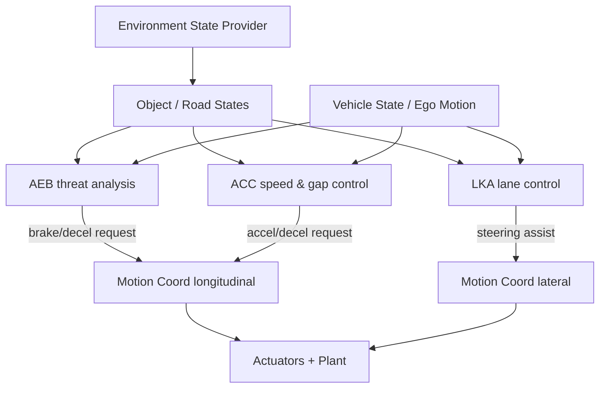
```mermaid
flowchart TB
 T[Environment State Provider] --> OV[Object / Road States]
 OV --> AEB[AEB threat analysis]
 OV --> ACC[ACC speed & gap control]
 OV --> LKA[LKA lane control]
 V[Vehicle State / Ego Motion] --> AEB & ACC & LKA
 AEB -->|brake/decel request| LON[Motion Coord longitudinal]
 ACC -->|accel/decel request| LON
 LKA -->|steering assist| LAT[Motion Coord lateral]
 LON & LAT --> ACT[Actuators + Plant]
```

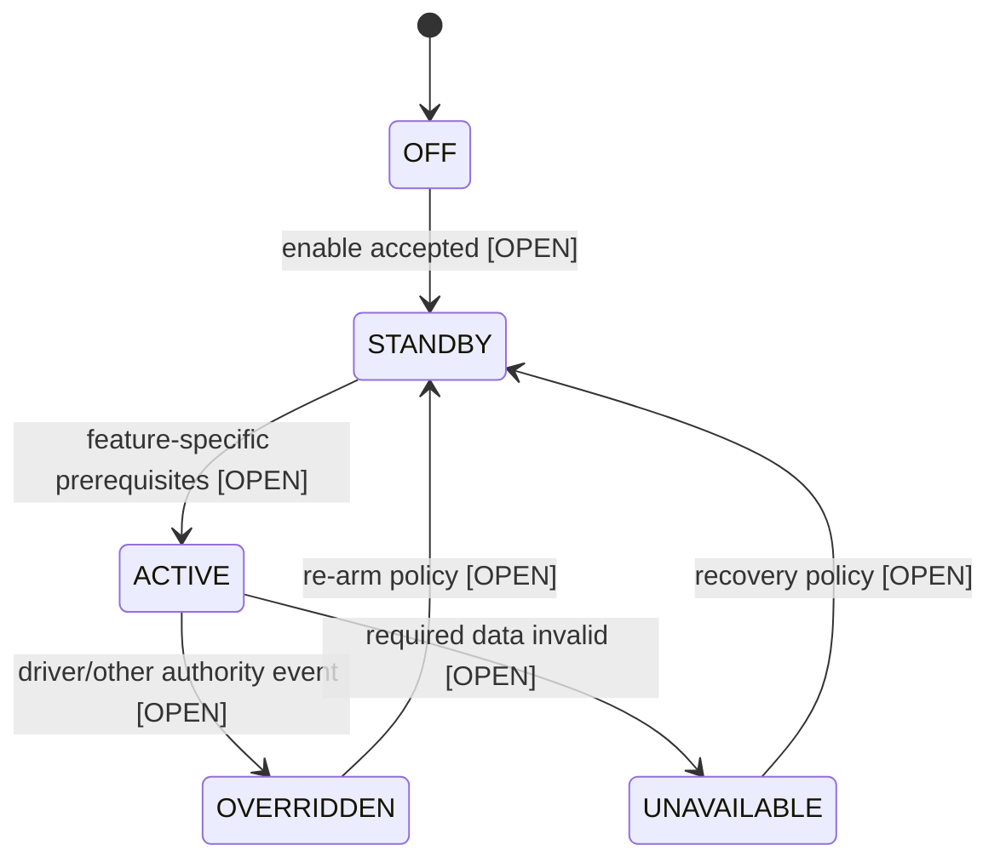
```mermaid
stateDiagram-v2
  [*] --> OFF
  OFF --> STANDBY: enable accepted [OPEN]
  STANDBY --> ACTIVE: feature-specific prerequisites [OPEN]
  ACTIVE --> OVERRIDDEN: driver/other authority event [OPEN]
  ACTIVE --> UNAVAILABLE: required data invalid [OPEN]
  OVERRIDDEN --> STANDBY: re-arm policy [OPEN]
  UNAVAILABLE --> STANDBY: recovery policy [OPEN]
```
위 상태도는 **ADAS 공통 개념**에 대한 UI 학습용 구조이지 AEB·ACC·LKA 각각의 완성된 상태 전이표가 아니다.

## D2. Sensing & State Estimation — 3개 Function

### `LF-SEN-MOTION` — 차량 운동 관측
- **목적**: physics state 또는 실제 센서/추정 상태의 출처를 분리한 채 속도·가속·회전·위치 등의 관찰 자료 생성.
- **내부 순서**: state source 선택 (`PLANT_TRUTH`, `SENSOR_SIM`, `ESTIMATED` 등의 provenance 후보) → timestamp sampling → 단위/좌표계 확인 → 관측된 양 발행 → 소비자에 전달.
- **입력/출력**: Rapier position/velocity/speed/acceleration/direction 관찰 (`CODEX_REPORTED` 범위) → `VehicleSpeed` 등 실제 존재하는 이름과 선택한 source. yaw/개별 wheel-speed/side slip의 실제 지원은 확인 전 `OPEN`.
- **조건/반례**: 속력(speed)은 크기이고 longitudinal signed velocity는 방향 성분이므로 reverse에서 같은 의미가 아님. world X/Z position을 차량 전진축으로 임의 정의하지 말 것.

### `LF-SEN-ACT` — 구동·제동·조향 반응 관측
- **목적**: 명령이 실제 시스템에 적용되는 구간의 관측을 만들어 원인 위치를 분리.
- **내부 순서**: controller output, adapter output, plant-applied value, optional independent physical feedback을 **각각 다른 관찰점**으로 기록 → Unit, scale, phase, timestamp를 첨부 → 비교 가능한 쌍만 노출.
- **입력/출력**: `EDriveCommand`/`DriveForce`, BrakeForce, steering input/plant response의 단계별 값 (보고된 부분만) → endpoint observability metadata.
- **조건/반례**: physics가 계산한 DriveForce를 `ActualMotorTorque`란 가상의 독립 센서로 등록 금지. Input command와 force가 다르다고 인터페이스 MISMATCH라고 판정할 수 없음(변환 계수 존재 가능).

### `LF-SEN-QUALITY` — 측정 품질·유효성
- **목적**: 각 관측의 사용 가능성을 결정하되 값의 논리 Expected를 여기서 만들어내지 않음.
- **내부 순서**: source/time/unit/validity flags 점검 → last update/freshness 기준 있는지 확인 → range/type consistency → 신뢰 가능한 것만 제공 → 부족한 경우 `UNKNOWN/UNAVAILABLE`.
- **입력/출력**: telemetry sample+metadata → `Observed`, `Invalid`, `Stale`, `Unavailable` 등의 품질 등급 후보. staleness의 실제 threshold `OPEN`.
- **반례**: `VehicleSpeed`가 [0,60] m/s이면 그 값은 데이터 범위 안에 있을 수 있지만 요구사항 목표 속도에 부합하는지는 이 함수에서 판정할 수 없음.

## D3. Power/Energy — 3개 Function

### `LF-EN-READY` — 전력·구동 가용성
- **목적**: EV 구동·회생제동이 가능한지를 판단하는 **논리적 제약 제공**. HV Battery, BMS, Contactor 상태의 실제 시뮬레이션은 아직 근거 없음.
- **내부 순서**: available source의 준비/정상 여부 검사 → 기능 사용 가능 범위 산정 → Propulsion·Regen을 별도 availability로 전달.
- **입력 후보**: energy system ready, drive available, charge acceptance, temperature/voltage limits (현재 실제 필드 없음).
- **출력 후보**: `DrivePowerAvailable`, `RegenAvailable`, reasons. VehicleReady와 동의어 아님.
- **반례**: 배터리 잔량이 100%이면 항상 최대 회생제동을 허용한다거나, 반대로 전체 제동을 금지한다는 단순 규칙을 만들면 안 됨.

### `LF-EN-LIMIT` — 구동·회생 허용 한계
- **목적**: 주어진 에너지 상태에서 **허용 가능한** drive/regen 한계를 제공. 명령된 토크와 실제 motor torque를 혼동하지 않음.
- **내부 순서**: available energy capacity / thermal / electric constraints → speed/direction별 actuator capability 연관 → physically consistent upper/lower limits 산정(구체식 미정) → typed constraints 발행.
- **입력 후보**: battery/hv/current/thermal/motor-speed 상태 및 limits. **현재 Source 등록값 부재**.
- **출력 후보**: `MaxAllowedDriveTorque`, `RegenTorqueAvailable` 같은 논리 용도. `MaxAllowedDriveTorque`는 Propulsion v0.1에서 언급되지만 Power/Energy가 실제 생산자라는 근거는 없음.
- **반례**: `MaxAllowedDriveTorque=300 Nm`은 v0.1 TC 예시. 이 값을 전 주행 상황 실제 power envelope로 강제하면 안 됨.

### `LF-EN-MON` — 제약 상태 감시
- **목적**: 요청 토크/회생 제약과 지원 가능 상태를 비교하여 제한·품질·일관성 관찰.
- **내부 순서**: relevant capability timestamp 확보 → request와 constraint의 단위/방향/phase 확인 → invalid/over-limit 후보 판정 → Fault management와 domain에 관측 근거 전달.
- **출력 후보**: request exceeds capability 여부, capability stale 여부, degradation suggestion. 이는 approved criterion이 있을 때만 정식 Fault.
- **반례**: 제한값을 초과하는 source demand 자체가 SW 오류인지 제약이 올바르게 적용되기 전 단계인지 확인해야 하며, 제한 후 final output이 규칙을 만족하는지가 중요할 수 있음.

### Energy — 가용성·한계 전달
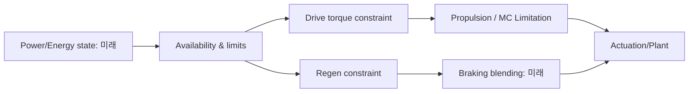
```mermaid
flowchart LR
 P[Power/Energy state: 미래] --> EN[Availability & limits]
 EN --> DR[Drive torque constraint]
 EN --> RG[Regen constraint]
 DR --> PR[Propulsion / MC Limitation]
 RG --> BL[Braking blending: 미래]
 PR & BL --> ACT[Actuation/Plant]
```

## D4. 필요 신호와 제안 정책 결정표

| ID | 데이터·정책 | 필요한 이유 | 현재 상태 |
|---|---|---|---|
| `ADAS-01` | Environment abstraction: object frame/time/validity | AEB/ACC가 동일 시간에 비교 | `OPEN` |
| `ADAS-02` | AEB threat classification·braking criteria | 불필요/미작동 판정 | `OPEN` |
| `ADAS-03` | ACC set speed, gap, lead selection, cancel | mode-specific Expected | `OPEN` |
| `ADAS-04` | LKA lane geometry, override, availability | steering assist Expected | `OPEN` |
| `SEN-01` | Plant truth vs estimated vs sensor signal provenance | 가짜 독립 관측 방지 | `OPEN/부분 보고` |
| `SEN-02` | yaw/wheel speed/lane actor 구현 여부 | Stability/ADAS 지원 판단 | `OPEN` |
| `EN-01` | 에너지 모델 및 power state 계약 | torque/regen 제한 근거 | `OPEN` |
| `EN-02` | limit producer→consumer의 실제 연결 | 제한 중복 계산 방지 | `OPEN` |

### 테스트 시나리오 후보 (아직 PASS/FAIL TC 아님)

- 동일 EgoSpeed에서 lead vehicle 유무/품질 차이 → ACC 모드/요청 반응의 요구 확인.
- 접근하지 않는 객체를 AEB 위험 개입으로 오분류하지 않는지(거리만으로 개입하는 버그 후보).
- Steering/LKA 중첩에서 driver override 시 요청 권한이 실제 policy와 일치하는지.
- `RegenAvailable=FALSE` 조건 시 총 요구 감속과 friction allocation의 연계가 부정확하지 않은지(미래 모델).
- 물리 차량 속도와 별도의 센서/추정 속도가 실제로 존재할 때만 두 값 차이에 대한 mismatch 검증 수행.

검증 원칙: 위와 같은 **시나리오 후보**는 실제 기능·신호·요구사항·오라클이 마련되기 전에는 `REFERENCE_ONLY`. 단순하게 가상의 Expected 그래프를 그려서 검증 성공/실패를 만들지 않는다.


---


# TRACKBACK Phase 03-E — Fault & Diagnostics / Communication / Execution Platform

- v0.2, 2026-10-07. 기능 12개. 문서·Phase02 기능명을 복원하고, 구현되지 않은 메커니즘은 `ENGINEERING_PROPOSAL/OPEN`으로 표기. 새 진단·네트워크·Watchdog 런타임은 구현하지 않음.
- 핵심 출처: `Requirement.md` §18, §24–28, §39–40, §49/64, `00_TRACEBACK_MASTER.md` 근거 출처 구분. 현재 `CODEX_REPORTED`: SimulationRuntime fixed physics timestep 1/60s, Scenario RESET/RUN/REPLAY, incident record/C/WASM. 독립 포트 endpoint telemetry, Fault Injection, multi-rate scheduler는 당시 audit에서는 미지원. 최신 코드 업데이트 여부는 독립 감사 필요.

## E0. 고장 사고에서 구분할 다섯 가지

1. **Fault stimulus / injection**: 시험자가 주입한 event, 외부 환경 변화, 독립 입력 교란. 고장 원인과 동일하지 않음.
2. **Defect**: 잘못된 SW/Calibration/설계 결정이라는 잠재적 결함.
3. **Failure effect**: SW가 요구된 동작을 만족하지 못하는 관측된 결과.
4. **Detection/Diagnostic status**: 별도의 monitor가 문제를 실제 검출·확정했는지.
5. **Fault reaction/recovery**: 고장 상태에 대한 기능의 반응 및 정의된 복귀 동작.

이 다섯 개를 하나의 FaultFlag에 넣으면 `fault injected`만으로 자동 `FAULT_CONFIRMED`와 `DEGRADED`로 넘어가게 되는 잘못된 모델이 생긴다.

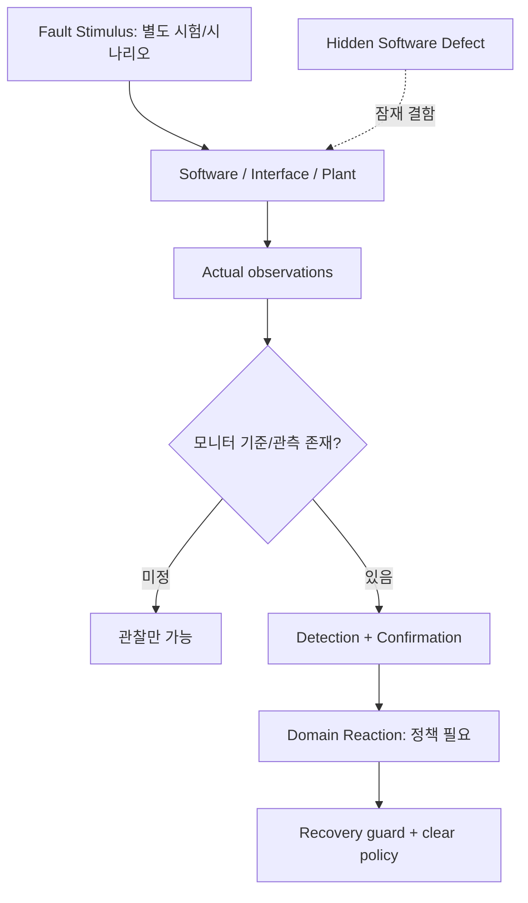
```mermaid
flowchart TB
 I[Fault Stimulus: 별도 시험/시나리오] --> PATH[Software / Interface / Plant]
 BUG[Hidden Software Defect] -.잠재 결함.-> PATH
 PATH --> OBS[Actual observations]
 OBS --> CRIT{모니터 기준/관측 존재?}
 CRIT -->|미정| U[관찰만 가능]
 CRIT -->|있음| DET[Detection + Confirmation]
 DET --> REA[Domain Reaction: 정책 필요]
 REA --> REC[Recovery guard + clear policy]
```

## E1. Fault Management / Diagnostics — 5개 Function

### `LF-FM-OBS` — 감시 입력 수집
- **하위 처리**: `FM-RANGE` 자료 표현/범위 → `FM-CONSISTENCY` 독립 source/consumer·상태 관계 → `FM-HEARTBEAT` 갱신 관측(계약 있을 때만) → `FM-EVENT-CONTEXT` 타임스탬프/상태/출처 저장.
- **입력→출력**: 개별 domain-monitor 관찰과 runtime events → `monitorObservations[]`(제안 구조). Incident ground truth 또는 fault injected flag를 모니터 출력을 대신하는 데이터로 사용 금지.
- **상태/가드**: 관측점 별 availability/validity를 보존. 기대치가 없는 관찰에 일반 FAIL 표시 금지.
- **반례**: eDrive command는 정상인데 DriveForce가 변환식 때문에 다른 값일 수 있음. 다른 단위의 값을 절댓값 비교해 fault를 보고하면 안 됨.

### `LF-FM-DETECT` — Fault Detection & Confirmation
- **하위 처리**: `FM-CONDITION` 명시된 기준 평가 → `FM-FILTER/DEBOUNCE` 시간적 조건(있을 경우) → `FM-CONFIRM` pending/confirmed 구분 → `FM-REPORT` 상태와 근거 기록.
- **입력→출력**: 관찰 시계열, criterion, timestamp, data quality → candidate detection state (`CLEAR`, `SUSPECT`, `PENDING`, `CONFIRMED`, `UNKNOWN` 모두 제안 상태), 일관성 있는 event chronology.
- **미정**: threshold, age, mismatch count, debouncing, sample period, confirmation priority, clear conditions 전부 미정. 비교 대상이 없거나 질이 낮으면 `UNKNOWN/UNAVAILABLE`로 둠.
- **반례**: injected stuck-value activated at 5.0s ≠ ECU fault detected at 5.0s. 실패가 한 tick 관측되더라도 3번 누적이 필요할 수도 있으나 횟수를 정해 넣지 않음.

### `LF-FM-REACT` — Fault Reaction Coordination
- **하위 처리**: `FM-SELECT-REACTION` 고장 진단 상태와 위험도/요구 연결 → `FM-DOMAIN-HANDOFF` 소유 domain에 전달 → `FM-AVAILABILITY` 기능 가용성 제한 정보 제공 → `FM-PUBLISH` 실제 반응 상태 기록.
- **입력→출력**: confirmed diagnostic event → domain-specific reaction request/constraint. `PROP_DEGRADED`는 기존 Propulsion v0.1의 참고 반응이며 브레이크/조향까지 같은 상태로 강제 불가.
- **Guard**: 임의로 `TORQUE=0` 또는 `BRAKE=MAX`를 안전 상태라고 선언할 수 없음. 안전 관련 반응은 별도 Safety Trace와 operational situation 근거 필요.
- **반례**: lost Steering Assist 문제에 긴급 제동을 무조건 수행하도록 배정하면 새로운 hazard를 만들 수 있음.

### `LF-FM-REC` — Recovery & Re-arm
- **하위 처리**: `FM-CLEAR-OBS` 원래 이상 발생 조건 해제 확인 → `FM-RECOVERY-GUARDS` 상태/시간/운전자 제어·재요청 조건 → `FM-REARM` 재활성 가능 여부 → `FM-LOG` 진단 이력 기록.
- **입력→출력**: fault clear observation, recovery eligibility and state-machine history → approval to return to defined domain state (도메인 별로 다름).
- **Guard**: exception release 후 곧바로 normal command 재개할지, ignition cycle 필요인지, hysteresis와 lockout 여부 `OPEN`.
- **반례**: injection 종료 후 곧바로 정상 차량이라고 주장하거나 예전 DTC를 로그에서 지워 `no fault ever`로 바꾸지 않음.

### `LF-FM-DIAG` — Diagnostics / Event Exposure
- **하위 처리**: `FM-EVENT-RECORD` 승인 event 기록 → `FM-STATE-EXPOSE` 현 fault status, freeze-frame 등 제공(정의 시) → `FM-SERVICE-BRIDGE` 별도 진단 서비스 통합(미래).
- **입력→출력**: diagnostic events → accessible diagnostic record/counter/state. `DTC ID`, `UDS DID/RID`, NRC, CAN transport 등 실제 모형이 없다면 출력 없음.
- **반례**: 사용자가 다른 Bootloader 프로젝트에서 UDS를 수행한 경험은 TRACKBACK 가상 ECU DCM이 구현됐다는 증거가 아님.

### 고장 감지 상태 — 진단 상태와 도메인 가용성 분리
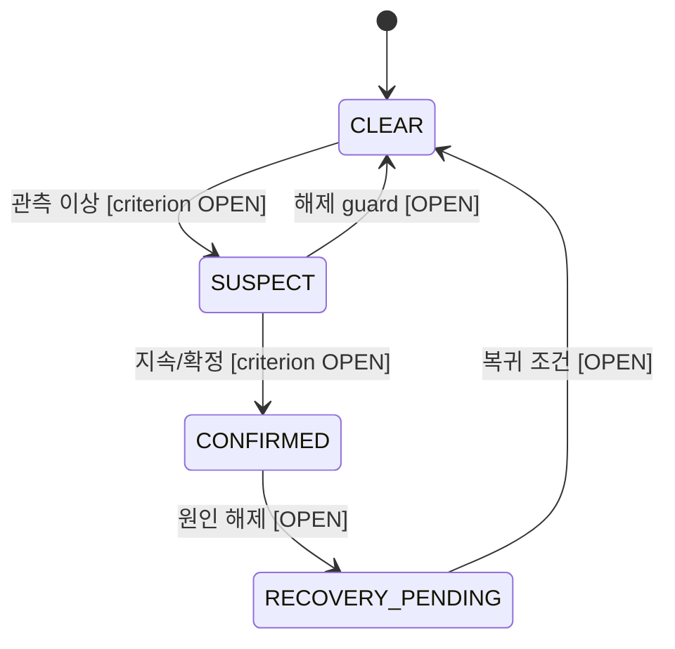
```mermaid
stateDiagram-v2
 [*] --> CLEAR
 CLEAR --> SUSPECT: 관측 이상 [criterion OPEN]
 SUSPECT --> CONFIRMED: 지속/확정 [criterion OPEN]
 SUSPECT --> CLEAR: 해제 guard [OPEN]
 CONFIRMED --> RECOVERY_PENDING: 원인 해제 [OPEN]
 RECOVERY_PENDING --> CLEAR: 복귀 조건 [OPEN]
```
**모든 상태 `ENGINEERING_PROPOSAL`.** 임계값, 검출 주기, clear policy 및 재활성 조건이 없으면 완결된 로직이 아님. 각 개별 domain reaction과 별도 state machine.

## E2. Communication / Interface — 3개 Function

### `LF-COM-PORT` — 내부 SW Port Transfer
- **하위 처리**: `COM-SOURCE-ENDPOINT` 실제 생산자 출력 캡처 → `COM-TRANSFER` 전달(로직 포트/adapter) → `COM-CONSUMER-ENDPOINT` 소비 직전 입력 캡처 → `COM-OBSERVE-BOTH-ENDS` 값/시각/단위의 비교 가능성 평가.
- **입력→출력**: typed output port sample+time → delivered typed input sample+time. zero-copy shared object를 source/destination에서 동일 pointer 두 번 읽는 것은 독립 telemetry 아님.
- **Guard**: 전달 복제인지 변환/스케일링인지, same-tick/in-order 관계인지 계약 필요. 변환 경계면 출력과 수신값이 같을 필요가 없으므로 transformation oracle을 먼저 정의.
- **반례**: Source=100 Nm → Adapter=1000 N은 단순 숫자 mismatch가 아님. 선언된 변환을 지키는지 별도 확인해야 함.

### `LF-COM-NET` — Virtual Motion CAN-FD (미래)
- **하위 처리**: `NET-TX` 지정 메시지 build → `NET-SCHEDULE` 실제 논리 시각 전송 → `NET-RX` 수신 이벤트 → `NET-VALIDATE` 프레임/신호 유효성 → `NET-DECODE` signal extraction → `NET-UPDATE-STATUS` RX state.
- **입력→출력**: Source signal samples+message catalog → raw/decoded network events. 실제 메시지 ID, DLC, BitPacking, AliveCounter, CRC, CAN driver/Bus arbitration은 정의된 것이 없음.
- **조건**: 실제 network source/destination endpoint, timestamp, send/receive, data encoding/scale가 모두 있어야 timing·value verification 가능.
- **반례**: `SRC_REQUEST`와 `DEST_REQUEST`의 소프트웨어 함수 호출을 임의로 CAN TX/RX로 표시 금지. CAN ID 예시를 게임의 정식 interface 사실로 둔갑 금지.

### `LF-COM-SUP` — Freshness / Missing Update / Timeout
- **하위 처리**: `COM-AGE` last accepted sample 시각 추적 → `COM-MISSING-UPDATE` 기대 갱신 기회 확인 → `COM-TIMEOUT` 경과 기준 판단(요구가 있을 경우) → `COM-RECOVERY` 정상 갱신 복귀 guard.
- **입력→출력**: source release/delivery events, consumer timestamp, supervision contract → `fresh/stale/timeout/unknown` 등 관측 수준. 미정 기준으로 직접 timeout FAIL 금지.
- **조건**: `DROP_UPDATE`의 의미는 destination sample-hold/invalid/skip semantics 중 실제 선택한 동작을 계약화해야 함. DELAY는 event delivery queue 필요.
- **반례**: fixed physics step 16.667ms에서 10ms task를 구현했다고 주장하면 cadence가 왜곡될 수 있음; 논리 scheduler가 별도로 필요.

### Interface — 독립 관측과 시각 정합
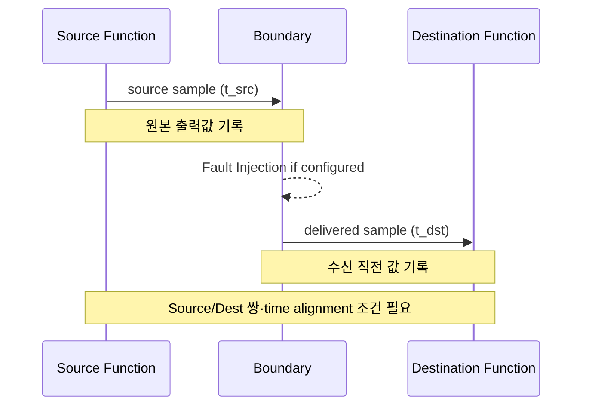
```mermaid
sequenceDiagram
 participant S as Source Function
 participant B as Boundary
 participant D as Destination Function
 S->>B: source sample (t_src)
 Note over S,B: 원본 출력값 기록
 B-->>B: Fault Injection if configured
 B->>D: delivered sample (t_dst)
 Note over B,D: 수신 직전 값 기록
 Note over S,D: Source/Dest 쌍·time alignment 조건 필요
```

## E3. Execution & Platform — 4개 Function

### `LF-EXE-CLOCK` — Simulation Clock
- **하위 처리**: `CLK-TICK`, `CLK-RESET`, `CLK-SCENARIO-TIME`, `CLK-TIMESTAMP`로 한 시뮬레이션 실행의 논리 시간과 수집 시각 관리.
- **입력→출력**: physics advance delta, scenario reset/seed/spawn, tick ownership → deterministic timeline/event timestamps within the supported configuration.
- **지원**: 1/60s Rapier fixed step과 scenario synchronized samples는 이전 Codex 보고. 이 값은 **ECU SW task period가 아니다**.
- **반례**: reset 없이 scenario만 0초로 표시하면 held state/injection/network age가 다음 run에 남을 수 있음.

### `LF-EXE-SCHED` — SW Task / Runnable Scheduler
- **하위 처리**: `SCHED-RELEASE` periodic/event release → `SCHED-PERIOD` due 시점 → `SCHED-ORDER` 의존성 순서 → `SCHED-HOLD` consumer는 이전값 유지 가능 → `SCHED-LOG` release-start-finish 기록.
- **입력→출력**: configured period/priority/task logic/due events → execution events and held data. VMC 10ms, AEB 20ms, CAN 10ms는 `Requirement.md`의 **설계 예시**.
- **조건**: 10ms와 16.667ms는 비정수 배수로 정확한 event scheduler(별도 logical clock 또는 event queue)가 필요. 단순 physics tick마다 10ms task 수행했다고 기록 금지.
- **반례**: `pulse/timing`을 UI에서 설정했어도 실제 SW task event가 없으면 Timing Verification이 아니라 stimulus observation일 뿐.

### `LF-EXE-SUP` — Execution/Alive/Watchdog Supervision
- **하위 처리**: `SUP-ALIVE` expected checkpoints/release 확인 → `SUP-TIME-BUDGET` 실행 deadline/latency 조건 → `SUP-WATCHDOG` 승인된 watchdog 서비스 조건 확인 → `SUP-RESET` 실제 논리 또는 MCU reset 처리 → `SUP-REACTION` domain availability/fault reporting.
- **입력→출력**: runnable release/finish/checkpoints, watchdog state, reset source → diagnosis events. 실제 MCU peripheral 또는 AUTOSAR WdgM 구현 확인 없음.
- **조건**: alive supervision과 timeout은 단순 elapsed time만으로 구별되지 않음; 빠른 반복/느린 반복/미실행/역순 모두 다른 failure scenario가 될 수 있음.
- **반례**: 프레임 지연을 MCU watchdog timeout으로 해석하거나, 실제 watchdog 없는 virtual reset 버튼을 hardware watchdog as-tested라고 주장 금지.

### `LF-EXE-RECORD` — Blackbox, Reset, Replay
- **하위 처리**: `REC-SAMPLE` actual observations → `REC-BUFFER` pre-fault ring buffer → `REC-CAPTURE` incident context → `REC-RESTORE` physics/SW/scenario state → `REC-REPLAY` same stimulus execution → `REC-PROVENANCE` incident recorded vs replay trace 분리.
- **입력→출력**: actual vehicle and supported SW events+scenario definition → recorded incident / runnable replay / formal verification evidence.
- **조건**: Physics/Driver/SW snapshot 외 교통/네트워크/스케줄러/경계 held value/random state도 replay할 때 해당 domain이 활성화되어 있다면 reset·restore 범위를 맞춰야 함.
- **반례**: 실제 재실행 없이 이전 incident video만 재생하는 것을 Verification Replay라고 명명 금지. Cross-device bitwise 결정론은 주장하지 않음.

### Event Time 관계 (서로 다르다)

| Event | 의미 | 필요한 로그 |
|---|---|---|
| `stimulusAppliedAt` | 플레이어 요구/시험 자극 적용 | scenario ID/tick |
| `taskReleasedAt` | SW Task 수행 조건 발생 | task ID, clock |
| `sourceProducedAt` | Producer가 출력값 생성 | endpoint ID/value |
| `boundaryDeliveredAt` | transfer 경계를 통과 | Boundary ID/injection |
| `destConsumedAt` | 소비자가 실제 샘플 사용 | consumer ID/value |
| `physicsAppliedAt` | Plant 명령 적용 | physical command |
| `observationCapturedAt` | monitor가 값 측정 | monitor ID/timestamp |
| `faultDetectedAt` | 모니터가 확정 기준 충족 | detector ID/criterion |

실제 runtime에서 별개 event가 없으면 같은 이벤트의 이름만 바꾸어 시간을 생성하지 않는다. 아직 없는 event는 `UNAVAILABLE`.

## E4. 무엇을 증명할 수 있는지

| 방법/가설 | 필요 조건 | 현재 상태 |
|---|---|---|
| Component Output Comparison | C/WASM+독립 Oracle | VMC/eDrive 일부 `CODEX_REPORTED` |
| Internal Port Endpoint Comparison | 두 개의 실제 독립 endpoint sample | 해당 audit 기준 미지원; 최신 코드 재확인 |
| Fault Injection | real interception+activation window+reset semantics | 해당 audit 기준 미지원; 최신 코드 재확인 |
| Network Timeout Test | 메시지 시각·실제 RX supervision+timeout requirement | 미래 기능 |
| Task deadline | logical release/finish+clock+criterion | 미래 기능 |
| SW fault recovery | monitor confirmed+reaction+re-arm+result | 참조 기능, 현재 미검증 |
| Incident replay | 실제 재실행과 시나리오·상태 회복 | Vehicle Scenario 일부 `CODEX_REPORTED` |

## E5. Phase 04/05에 넘길 OPEN 정책

`FM-CONFIRM` debounce/clearing, `FM-REACTION` source authority, `COM-NET` network graph+encoding, `COM-AGE` freshness/timeout, `EXE-SCHED` multi-rate scheduling semantics, `EXE-SUP` watchdog trigger/handling, `REC-REPLAY` actual restored state coverage, 다중 Fault 동시 발생시 우선순위. 모두 **추가 구현하기 전 요구사항·기술근거 확인** 필요.


---


# TRACKBACK Phase 03-F — Occupant Safety / Actuation & Vehicle Plant

- `v0.2`, 2026-10-07, 코드 미반영. 대상: `LF-OCC-IMPACT/DECIDE/DEPLOY` + `LF-ACT-DRIVE/BRAKE/STEER` + `LF-PLANT-MOTION/ENV` = 8개.
- 근거: `Requirement.md` §17, §19–23·§28/29, `02_DOMAIN_FUNCTION_DECOMPOSITION_KO.md`, 이전 Vehicle Scenario 구현 보고.
- 안전성 주의: airbag은 높은 위험의 실시간 안전 기능이다. 아래 설명은 **교육용 기능 분해**이지 에어백 전개 알고리즘, 임계치, HARA, MCU 회로, pyrotechnic hardware 설계·안전 인증이 아니다. 이를 실행 로직으로 자동 구현하거나 테스트용 '실제 에어백 반응'을 주장 금지.

## F0. 명령·물리·센서 경계

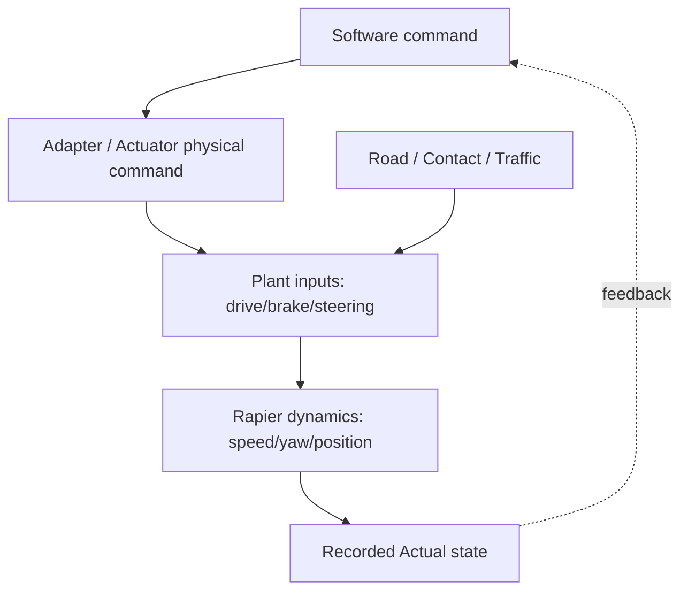
```mermaid
flowchart TB
 SW[Software command] --> AD[Adapter / Actuator physical command]
 AD --> PH[Plant inputs: drive/brake/steering]
 ROAD[Road / Contact / Traffic] --> PH
 PH --> DY[Rapier dynamics: speed/yaw/position]
 DY --> OBS[Recorded Actual state]
 OBS -.feedback.-> SW
```

- **SW 토크 명령**(`EDriveCommand`)과 **Plant 구동력**(`DriveForce`)은 일반적으로 차원이 다르다.
- `DriveForce`, `BrakeForce`는 physics에 **적용된 계산 명령/힘의 관측**이 될 수 있지만 실제 차량의 동력계·휠 토크·브레이크 압력을 독립 측정한 값이라고 할 수 없다.
- Plant의 `VehicleSpeed`는 실제 동작 관찰값이지만 전체 정상(Expected) 시간 궤적이 승인되어 있지 않으면 `OBSERVED`만 가능한 영역이다.

## F1. Actuation & Plant — 5개 Function

### `LF-ACT-DRIVE` — 구동 명령 물리 적용
- **하위 처리**: `ACT-DRIVE-CONVERT`: `EDriveCommand`를 adapter의 입력 계약으로 읽음 → `ACT-DRIVE-VALIDATE`: 타입/단위/Direction/Validity 확인 가능한 범위만 검사 → `ACT-DRIVE-APPLY`: 실제 `VehiclePhysicsCommand`/DriveForce 생성 및 적용 → `ACT-DRIVE-TRACE`: SW 출력, adapter 출력, physics 적용값과 timestamps 기록.
- **입력→출력**: `EDriveCommand` → `EDriveToVehiclePhysicsAdapter` → `DriveForce` (기존 코드 보고). 특정 drivetrain/gear ratio/wheel radius/torque-to-force 변환식은 현재 코드 대조 없이 확정하지 않음.
- **조건**: 엔진·모터 회전수, 기어비, 동력 전달 효율, 구동 방향, traction limit, 차량 프레임 변환 등의 실제 반영 여부 `OPEN`.
- **반례**: `EDriveCommand = 57 Nm`, `DriveForce = 570 N`이 관찰됐더라도 이 값들이 곧 '실제 바퀴 토크 57Nm'와 '차량 가속도 570m/s²'라는 뜻은 아님.
- **검증**: adapter original→adapted 비교에는 변환 oracle이 있어야 함. source/dest 값이 반드시 같아야 하는 Interface Test와는 구분.

### `LF-ACT-BRAKE` — 제동 명령 물리 적용
- **하위 처리**: `ACT-BRAKE-INPUT` 현재 지원되는 driver brake/추후 approved SW brake command 중 실제 적용 원천 확인 → `ACT-BRAKE-CONVERT` signed/unsigned/단위 변환 → `ACT-BRAKE-APPLY` brake force/torque 제어 → `ACT-BRAKE-TRACE` applied result/vehicle speed 연계.
- **입력→출력**: driver brake ∈ [0,1] 보고, BrakeForce 관찰은 `CODEX_REPORTED`. Brake Controller C/WASM 별도 실행은 입증되지 않음.
- **조건/반례**: brake input에 비례해 속도가 항상 선형 감소한다고 주장 금지. vehicle mass, slope, propulsion, grip과 initial speed의 영향을 받음. 0 입력 시 friction/drag/coasting은 별도 Plant 반응.
- **동시 요구**: driveForce와 brakeForce가 동시에 적용될 수 있음. 어느 쪽을 전자제어 단계에서 제한할지는 Motion Coordination/Braking의 policy.

### `LF-ACT-STEER` — 조향 명령 물리 적용
- **하위 처리**: `ACT-STEER-INPUT` normalized steering/승인 steering command 선택 → `ACT-STEER-APPLY` physics steer control → `ACT-STEER-TRACE` applied control and response observation.
- **입력→출력**: driver steering ∈ [-1,1] → Plant steering. EPS actual `assist torque`, `roadWheelAngle`, `steeringColumnAngle` 등은 현재 구현 근거 부재.
- **조건**: Steering Angle 제한, speed-sensitive steering mapping, rate limit, understeer/oversteer 물리 모델은 실제 코드 확인 후 기술.
- **반례**: steering 값 1을 1 radian으로 단정 금지, yaw change=steering input도 아님. 주차 상태에선 yaw가 변하지 않아도 입력 제어가 적용됐을 수 있음.

### `LF-PLANT-MOTION` — 차량 거동 계산
- **하위 처리**: `PLANT-FORCE-INTEGRATION` 구동 힘 등 적용 → `PLANT-BRAKE-EFFECT` 제동 저항/타이어 마찰 → `PLANT-STEERING-EFFECT` 방향제어/타이어 횡력 → `PLANT-CONTACT` 도로 contact/collision → `PLANT-STATE` 물리 상태 적분 → `PLANT-OBSERVATION` 관측 시점 기록.
- **입력→출력**: DriveForce, BrakeForce, steering, road/collision → position, orientation/rotation, speed, longitudinal acceleration 등 보고된 monitors. 실제 tire model fidelity, mass, moment of inertia, AWD traction distribution 등은 코드 대조 필요.
- **단위/물리 개념**: `sum(forces)=m*acceleration`은 물리 원리이지만 실제 시뮬레이터 출력 가속도의 좌표계/필터/step 방식이 확인되지 않으면 단순 역산 Expected로 사용 금지.
- **반례**: 1/60초 tick의 측정 acceleration이 모든 step에서 매끄럽거나 always positive라고 단정 금지. drag, braking, incline 등으로 acceleration 감소 가능.
- **검증**: 반복 재주행이 비슷한 실제 궤적을 만든다는 사실은 simulation reproducibility를 말할 뿐 차량 제조사 기준을 만족한다는 뜻이 아님.

### `LF-PLANT-ENV` — 도로·노면·교통·Scenario
- **하위 처리**: `ROAD-SEGMENT` 위치/기하 → `ROAD-FRICTION` 노면 접촉 상태(실제 지원 확인 필요) → `TRAFFIC-ACTOR-UPDATE` 객체 시간·상태 → `SCENARIO-ZONE` fault trigger eligibility.
- **입력→출력**: Map geometry/track capabilities/road state/Traffic truth → Plant/Environment State Provider 영향. scenario hidden trigger는 운전자에게 노출하지 않음.
- **반례**: Rain/low-friction 변수를 UI에 노출했다고 실제 Rapier wheel traction이 바뀌는 것은 아님. 파라미터 주입만 되고 Plant model에 전달되지 않으면 시각적 Fake Injection.
- **Case 확장**: 최소 직선거리, 커브, 선행 차량 등 `requiredTrackCapabilities`를 통해 case가 Track 명칭에 하드코딩되지 않도록 함.

### Plant 측 시간 순서 예시 (여러 Task 주기 확정 의미 아님)
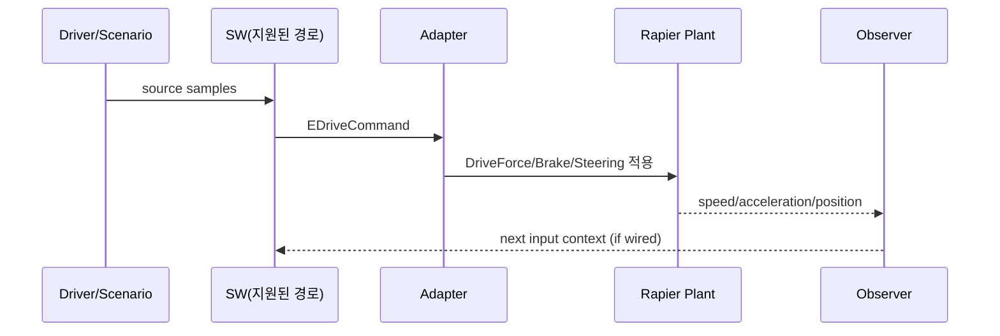
```mermaid
sequenceDiagram
 participant D as Driver/Scenario
 participant SW as SW(지원된 경로)
 participant AD as Adapter
 participant P as Rapier Plant
 participant O as Observer
 D->>SW: source samples
 SW->>AD: EDriveCommand
 AD->>P: DriveForce/Brake/Steering 적용
 P-->>O: speed/acceleration/position
 O-->>SW: next input context (if wired)
```

## F2. Occupant Safety — 3개 Function

**주의:** Airbag/Pretensioner는 차량 운동 제어 루프와 성격이 다른 보호 장치다. 예시 `Impact → Crash Sensor → Airbag Controller → Deployment Decision → Airbag`은 `Requirement.md`에서 **미래 Reference Flow**로 정의한 것일 뿐, Rapier collision과 보호 장치가 이미 연결되었다는 근거는 없음.

### `LF-OCC-IMPACT` — 충돌 관련 이벤트 취득
- **목적**: 충돌 판단에 사용할 **입력 데이터의 종류와 유효성**을 갖춘다. 게임 collision event와 actual crash sensor waveform은 전혀 다름.
- **하위 처리**: `OCC-EVENT` event capture → `OCC-VALIDITY` data confidence and timeliness → `OCC-CONTEXT` operating/configuration context.
- **입력 후보**: structural impact sensors, acceleration/crash pulse, occupant position, restraint state 등은 *실제 차종별 설계 검토가 필요한 개념*이며 현재 runtime 없음.
- **출력 후보**: credible impact observation, invalid/unavailable detection state (아직 정의된 canonical signal 없음).
- **반례**: low-speed map collision이라는 이유로 airbag deploy required를 자동 생성해서는 안 됨.

### `LF-OCC-DECIDE` — 보호 장치 전개 판단
- **목적**: 정의된 감지 자료, 억제 조건, 안전 전략을 토대로 **해당 보호 장치의 전개 여부**를 결정하는 논리적 역할만 표현.
- **하위 처리**: `OCC-CLASSIFY` 관련 충돌 맥락 분류 → `OCC-GUARD` 제어 가능/유효 입력·억제 조건 확인 → `OCC-DECISION` 보호 장치별 요구 판단 → `OCC-LOG` 판정 근거/시각 기록.
- **입력→출력**: validated impact context+occupant/restraint conditions → conceptual decision request. **충돌 판정 임계값, 알고리즘 식, deployment timing, sensor diagnostics는 전부 OPEN**.
- **상태 후보**: `NOT_READY`, `READY`, `EVALUATING`, `DECISION_RECORDED`, `INHIBITED`, `FAULTED`는 교육용 단계 구분일 뿐; 실제 restraint ECU lifecycle과 다름.
- **반례**: 차량 yaw/속도와 충돌체 감속만으로 '전개해야 한다'고 판단하면 안전하지 않고 기술적으로 성립하지 않음.

### `LF-OCC-DEPLOY` — 보호 명령/이벤트
- **목적**: 승인된 조건에서 판단된 보호 명령이 후속 actuator 모델에 전달되는 관계를 설명.
- **하위 처리**: `OCC-AIRBAG-OUTPUT` 보호 장치 별 명령 기록 → `OCC-PRETENSIONER-OUTPUT` 별도 명령/상태 → `OCC-EVENT-REPORT` 사고 기록.
- **입력→출력**: decision request → mock event trace only until actual restraint actuator/safety model approved. 실차 화약식 구동기, 전개 전류, 무결성 등의 물리 설계를 구현하지 않음.
- **반례**: UI 애니메이션(에어백 그림)이 나온 것을 실제 ECU Safety Validation `PASS`로 처리하면 안 됨.

### Occupant 경계 및 안전 Trace
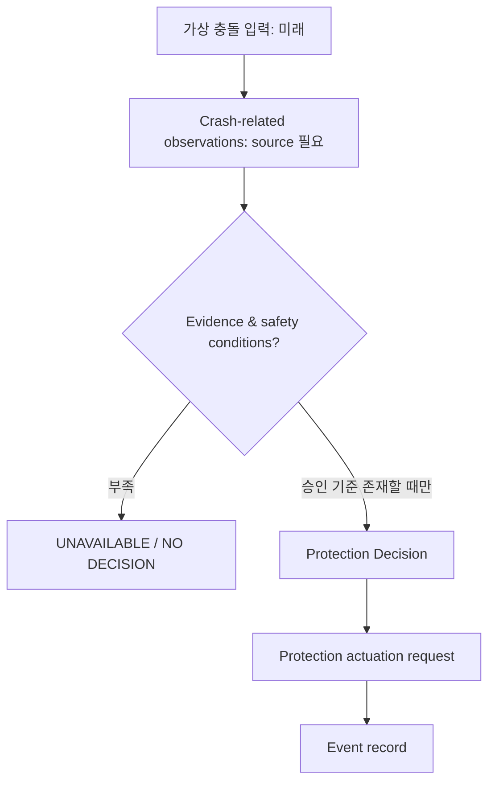
```mermaid
flowchart TB
 IMP[가상 충돌 입력: 미래] --> SENSOR[Crash-related observations: source 필요]
 SENSOR --> G{Evidence & safety conditions?}
 G -->|부족| U[UNAVAILABLE / NO DECISION]
 G -->|승인 기준 존재할 때만| DEC[Protection Decision]
 DEC --> ACT[Protection actuation request]
 ACT --> OBS[Event record]
```

Safety Trace는 별도로 `malfunctioning behavior + hazardous event/HARA → SG → FSR → TSR → allocated HW/SW requirements → Test`를 작성해야 함. **단순 충돌 scenario를 Hazardous Event/ASIL이라고 자동 확정하는 것 금지.**

## F3. 시스템 물리 인과관계 감사표

| 관찰 | 직접적으로 지지하는 주장 | 아직 지지하지 않는 주장 |
|---|---|---|
| `EDriveCommand` C output | eDrive SW 출력 명령 | 실제 모터 torque 발휘 |
| `DriveForce` adapter output | physics 입력에 쓰이는 계산 구동력 | 독립된 휠 torque 센서 |
| `BrakeForce` physics | 적용 제동력/명령 수준 | Brake ECU/유압 회로 정상 |
| `VehicleSpeed` trajectory | run의 실제 속력 변화 | 승인된 Expected speed/실차 검증 적합 |
| `Yaw/Rotation` 변화 | simulation body orientation 결과 | 실제 gyro 기반 ESC 요구 충족 |
| `Collision` event | physics 충돌 감지 | Airbag deploy condition 충족 |
| fault re-drive | 구현된 시나리오 재현 및 수정안 반응 | ISO 26262 안전 목표 검증 완료 |

## F4. Phase 04/05 이전 결정 목록

- `ACT-01`: eDriveCommand→Force 변환식/단위/방향/제한/owner 실제 코드 확인.
- `ACT-02`: Brake normalized→force/physics command의 source와 signedness 확인.
- `ACT-03`: Steering normalized→Road wheel angle or force semantics 확인.
- `PLANT-01`: masses, inertia, tire/wheel physics fidelity, collision and road contact support 확인.
- `PLANT-02`: 기존 Run의 속도/가속도/위치 관측 시각 정확도와 좌표계 확인.
- `OCC-01`: occupant safety는 별도 안전 아키텍처로 유지, 승인 원문/현실성 검토 없이는 시나리오 실행 기능 자체를 만들지 않음.
- `SYS-01`: software output verdict와 vehicle physics observation verdict를 구분할 승인 criterion 필요.


---


# TRACKBACK Phase 03-G — Cross-Domain Integration, State Model & Review Gate

- `v0.2`, 2026-10-07. Phase 03-B~F 통합. 코드 미반영 / 승인되지 않은 참조 설계. **이 문서는 기능명 목록만 만들지 않고, 실제 사례마다 확인해야 하는 인과 관계·권한·관측 기준을 고정한다.**
- 출처: Phase 01~03 초기 한글본, `Requirement.md`, Propulsion v0.1 및 Codex 보고된 차량 실행 경로.
- 여러 Domain이 동일한 Actuator, State, Signal을 변경할 수 있으므로 **기능 책임과 Runtime 데이터 소유권을 별도로 정의**. 미구현 대상에 대한 전이·Expected를 생성하지 않음.

## G1. 전체 차량 운영 인과 그래프

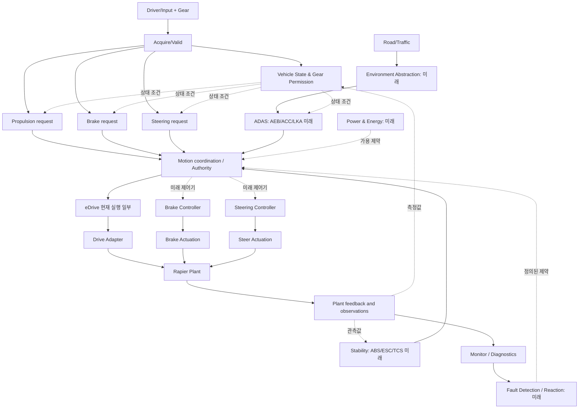
```mermaid
flowchart TB
 DRIVER[Driver/Input + Gear] --> DVALID[Acquire/Valid]
 ROAD[Road/Traffic] --> ENV[Environment Abstraction: 미래]
 DVALID --> VS[Vehicle State & Gear Permission]
 DVALID --> PROP[Propulsion request]
 DVALID --> BRK[Brake request]
 DVALID --> STR[Steering request]
 ENV --> ADAS[ADAS: AEB/ACC/LKA 미래]
 MOTION[Plant feedback and observations] -.측정값.-> VS
 MOTION -.관측값.-> STB[Stability: ABS/ESC/TCS 미래]
 VS -.상태 조건.-> PROP & BRK & STR & ADAS
 PROP & BRK & STR & ADAS & STB --> MC[Motion coordination / Authority]
 ENERGY[Power & Energy: 미래] -.가용 제약.-> MC
 FAULT[Fault Detection / Reaction: 미래] -.정의된 제약.-> MC
 MC --> DRIVE[eDrive 현재 실행 일부]
 MC -.미래 제어기.-> BRAKE[Brake Controller]
 MC -.미래 제어기.-> STEER[Steering Controller]
 DRIVE --> DRIVEACT[Drive Adapter]
 BRAKE --> BRAKEACT[Brake Actuation]
 STEER --> STEERACT[Steer Actuation]
 DRIVEACT & BRAKEACT & STEERACT --> PLANT[Rapier Plant]
 PLANT --> MOTION
 MOTION --> DIAG[Monitor / Diagnostics]
 DIAG --> FAULT
```

이 도식은 **목표 논리 Architecture**다. 현 실행 구간은 `DriverInputRuntime → C/WASM VMC/eDrive → Adapter → Rapier` 및 brake/steering의 물리 입력 경로만 보고돼 있다. 모든 모듈을 새로운 직렬 실행 경로로 추가하거나 MC에서 실제 `DriveTorqueRequest`를 중복 계산하지 않는다.

## G2. 반드시 독립적으로 관리할 상태 축

| State axis | 책임 Owner 후보 | 범위/중요성 | 기존/지원 여부 |
|---|---|---|---|
| vehicle startup/ready | Vehicle State | 전체 준비상태. 단일 도메인 ready 아님 | `VehicleReady`는 v0.1 요구상 존재, 생성식 미정 |
| gear request/accepted/applied | Gear | 요청과 실제 적용 구분 | Gear D precondition만 부분 보고 |
| propulsion operating state | Propulsion | OFF/READY/ACTIVE/DEGRADED 등 v0.1 초안 | 참조 요구, Runtime SW 구현 미확인 |
| brake availability + demand | Braking | 가용성과 제동 활성 독립 | Brake physical input 보고, SW 미정 |
| steering availability + authority | Steering | driver/EPS/LKA 권한 | steering physical input 보고 |
| ADAS states | ADAS | AEB/ACC/LKA 각자 독립 | 참조 전용 |
| stability interventions | Stability | ABS/TCS/ESC 요청 각자 독립 | 참조 전용 |
| diagnostic detected/confirmed/cleared | Fault/Diagnostics | Fault Injection 여부와 독립 | 일반 검출 로직 미확인 |
| time/event/task | Execution/Communication | release/produce/deliver/consume/apply/observe | physics tick 보고, task/CAN 미정 |
| actual physical response | Plant | speed/yaw/position/acceleration | 일부 runtime 확인 보고 |

**상태-조건-기준의 네 겹**: (1) raw valid range, (2) functional mode/availability, (3) requirement applicability & expected relation, (4) actual observation. 하나를 나머지로 대체 금지.

## G3. 주요 도메인 간 인터페이스 계약 (논리적, 숫자·ID 신규 등록 금지)

| Source → Target | 전달해야 할 의미 | 계약의 필요 요소 | 현재 |
|---|---|---|---|
| Driver → Propulsion | 요구량/유효성 | normalized vs driver demand mapping | 일부 C/WASM 입력 보고 |
| Gear/State → Propulsion | 현재 적용 gear / enable | request≠applied, invalid/reverse 구분 | D 조건 일부 보고 |
| Propulsion/VMC → eDrive | 구동 토크 요구 | Nm / Direction / Validity | `DriveTorqueRequest` C/WASM 보고 |
| eDrive → Adapter | SW 명령 | command unit, conversion, validity | `EDriveCommand` 보고 |
| Adapter → Plant | applied drive force | N, direction, tick application | `DriveForce` 보고 |
| Driver Brake → Plant | applied braking input/force | normalized→force conversion | 일부 보고 |
| Driver Steering → Plant | applied steering control | normalized→angle/control conversion | 일부 보고 |
| AEB → MC/Braking | 긴급 감속 요구 | 위협 유효성, time, authority | 미래 |
| ACC → MC | cruise longitudinal target | 속도/간격/target info | 미래 |
| LKA → MC/Steering | 조향 보조 요구 | angle/torque/yaw type | 미래 |
| ABS/TCS/ESC → MC/Braking | wheel-specific / torque intervention | 대상 wheel, target, policy | 미래 |
| Energy → Propulsion/Braking | drive/regen constraint | source/limit/validity | 미래 |
| Diagnostics → Domain | fault status/reaction request | detection evidence/level/time | 미래 |
| Communication → Consumer | source value after transfer | endpoint sample, timestamp, update | 구조만, 런타임 미확정 |
| Plant → Estimation → Controllers | 차량 거동 | 참조 좌표계, observation timestamp | 일부 보고 |

이 표의 목적은 **인터페이스가 실제로 존재한다는 거짓말을 피하면서 역할을 정렬하는 것**이다. 처음 네 줄을 제외한 미래 경로의 구체적 Signal ID는 승인된 Dictionary와 Phase 04 대조 전까지 미등록.

## G4. 현상별 도메인 접근 예시 (플레이어 학습 경로)

### I1. 가속 요구 존재하지만 가속 응답 저하
1. 사건의 accelerator, Gear/Ready, speed/deceleration 등 **실제 입력·차량 거동** 구분.
2. VehicleSpeed Actual-only면 임의 normal speed curve 생성 금지. 가능한 SW 경계의 승인 oracle로 추적.
3. `PropulsionRequest → DriveTorqueRequest → EDriveCommand → DriveForce → Plant`에서 각 변환 경계의 **정확한 source/unit/expected basis**를 확인.
4. eDrive output이 예상과 달라도 input validity/state/변환식/전달경계/Plant까지 대안 가설 유지.
5. Formal conclusion은 Phase3 실제 Test Evidence로만 논증, `0.5` 내부 계수처럼 입증하지 않은 механизм을 정답으로 노출하지 않음.

### I2. 가속·제동 동시 입력
1. Driver accelerator 및 brake 수집이 각각 유효한가.
2. Braking 기능이 허용·활성인지와 Propulsion request가 어떻게 적용됐는지 분리.
3. MotionCoord 또는 domain-specific 인터록 **승인 정책**이 실제로 있는가. 없다면 바로 'Brake priority FAIL' 주장 금지.
4. DriveForce와 BrakeForce가 모두 Rapier에 적용됐을 수 있어 최종 Acceleration만으로 어느 경계 결함인지 판정 불가.

### I3. 기어 D 요청 직후 가속 안 됨
1. `GearRequest=D`와 실제 `GearState=D`를 구분.
2. 전환 pending/inhibit/invalid 상태 또는 DriveEnable 정책이 정해져 있는지 확인.
3. Gear 적용 이전에는 READY 요구사항 적용 가능성을 판단할 수 없음.
4. Gear가 D인 것이 확인돼도 Propulsion state/validity/torque request 검증 필요.

### I4. AEB 요청이 있는데도 감속하지 않음
1. AEB object threat 분석이 유효하게 **제동 요구**를 생성했는가.
2. AEB 출력→MotionCoord/Brake 기능의 전달 및 권한 우선순위를 확인.
3. Brake Controller/Plant의 실제 적용 확인.
4. 요청/명령은 정상인데 노면·actuator가 원인인 경우 software defect와 구분.
5. 현재 미구현이므로 실제 testcase PASS/FAIL 생성 불가.

### I5. AEB와 ABS가 동시에 개입
1. AEB는 차량 목표 감속 **요구**, ABS는 wheel lock 예방을 위한 제동 조절 **제약**.
2. 둘은 다른 제어 목적이므로 단순히 한쪽을 일괄 override하면 안 됨. 상호 policy/actuator authority 확인.
3. 각 wheel 속도/슬립/제어 command가 실제 존재해야 판단 가능.
4. Braking와 Stability/Motion Coordination 간 Owner가 이중 명령을 생성하지 않는지 확인.

### I6. 조향했는데 방향이 바뀌지 않음
1. Driver steering normalized input 자체와 Steering SW command 존재 여부 구별.
2. Controller 출력, applied wheel angle, Plant yaw/rotation, 차량 속도·노면 상태 비교.
3. 정지 상태의 yaw=0은 조향 기계 이상을 단정하지 못함.
4. LKA/ESC가 제약을 가했는지 출처 기반 추적(미래 모델).

### I7. 통신 Drop/Timeout 의심
1. Producer `t_src`, Boundary event, Consumer `t_dst`가 실제로 각각 캡처되었는가.
2. drop event는 정확히 어떤 전달 semantic(보류/hold/invalid)을 택했는가.
3. 수신자가 감지하는 timeout은 구성된 **기준**과 실제 lastRxTime이 필요.
4. `drop at 5s`는 `detected timeout at 5s`의 증거가 아님.

### I8. Runtime 늦은 출력
1. Stimulus/producer release, task execution, boundary delivery, plant application, observation 시간을 분리.
2. 기준이 Task deadline인지 signal freshness인지 physical response latency인지 질문을 먼저 정함.
3. 1/60s physics sampling만으로 10ms Runnable 타이밍 검증 PASS/FAIL을 정하지 않음.

## G5. 충돌 정책: 결정 전에는 어떤 것도 기본값으로 삼지 않는다

| Policy ID | 충돌 상황 | 승인 전 허용할 상태 | 확정해야 할 실제 근거 |
|---|---|---|---|
| CD-01 | Accelerator + Brake | 양 입력·각 적용 결과 관찰 | Brake override, anti-two-foot, drive limitation |
| CD-02 | Driver Brake + AEB | 출처별 요구 보존 | AEB activation/suppression, merge policy |
| CD-03 | AEB + ABS/ESC | 요구/제약 타입 분리 | wheel intervention and braking authority |
| CD-04 | Driver Steering + LKA | driver and assist authority 분리 | override limits, target type |
| CD-05 | TCS + Propulsion Torque | upstream torque vs constrained torque 분리 | traction control priority |
| CD-06 | Fault Reaction + Normal Demand | fault status와 실제 reaction 결과 구분 | safety requirements / recovery policy |
| CD-07 | Gear transition + Torque | request/applied gear 구분 | Shift interlock/DriveEnable |
| CD-08 | Regen blending + ESC/ABS | friction/regen contribution 분리 | energy/wheel constraint allocation |
| CD-09 | CAN missing update + Task stall | 네트워크 수신과 Producer 실행 구분 | independent event telemetry |
| CD-10 | Power/Energy limit + DriveTorque | 요청값과 최종 제한값 분리 | constraint ownership, signed limits |

## G6. 하나의 논리적 상태 처리/이벤트 표준 계약

```yaml
# 문서 설명용 개념 스키마. 실제 코드 타입이 아님.
logicId: <stable, unique ID>
functionId: <Phase02 LF-ID>
sourceStatus: ENGINEERING_PROPOSAL|SRC_DRAFT|CODEX_REPORTED|OPEN
runtimeSupport: EXECUTABLE|PARTIAL|REFERENCE_ONLY|UNAVAILABLE
inputSamples:
  - {portId: ..., signalId: ..., sampleTime: ..., unit: ..., validity: ...}
applicability:
  requiredStates: []
  guards: []    # boolean expression, threshold if approved
trigger: {kind: EVENT|PERIODIC|CONTINUOUS_OBSERVATION, ownerClock: ...}
currentState: {axis: ..., value: ...}
transition:
  from: ...
  event: ...
  guard: ...
  to: ...
  action: ...
  timing: OPEN
outputSample:
  signalId: ...
  producerPortId: ...
  timestamp: ...
invalid/else/recovery: OPEN
allocation: []  # SWC/Runnable/ECU separate
requirementIds: []
verification:
  criterionIds: []
  tests: []
  observableAt: []
  allowedVerdict: OBSERVED # no accepted oracle
```

**정합성**: `inputSamples.signalId`는 등록된 Signal Dictionary에 있어야 하고 각 edge는 source/target relationship registry에 실제로 연결되어야 한다. `sourceStatus=PROPOSED`와 `runtimeSupport=EXECUTABLE`이 충돌하면 리뷰 필요. Existing Requirement ID를 문자열 유사성만으로 자동 참조 연결 금지.

## G7. 전체 Phase 02 Function ID × Phase 03 반영 체크

Phase 02 총 74개:

| 영역 | 기능 수 | 상세 설계 파일 |
|---|---:|---|
| Driver/Environment | 3 | 03-B |
| Vehicle State | 4 | 03-B |
| Gear | 4 | 03-B |
| Propulsion | 10 | 초기 `03_INTERNAL_LOGIC_STATE_MACHINE_KO.md` |
| Braking | 7 | 03-B |
| Steering | 6 | 03-B |
| Stability | 4 | 03-C |
| ADAS | 4 | 03-D |
| Motion Coordination | 6 | 03-C |
| Sensing | 3 | 03-D |
| Energy | 3 | 03-D |
| Occupant | 3 | 03-F |
| Fault/Diagnostics | 5 | 03-E |
| Communication | 3 | 03-E |
| Execution/Platform | 4 | 03-E |
| Actuation/Plant | 5 | 03-F |
| **계** | **74** | **10 기존 + 64 신규** |

### G7-A. Propulsion 10번째 논리 기능 ID 대응 검토 — `LF-PROP-EDRV`

Phase 02는 기존 Propulsion 9개 주요 논리 영역에 **eDrive 명령 처리 1개**를 더해 10개로 정의한다. 초기 Phase 03의 **3.11절**에는 eDrive/VMC의 현재 계산 경계를 설명하지만 `LF-PROP-EDRV` 식별자가 명시되지 않았으므로 여기에서 연결을 고정한다.

- **역할**: `DriveTorqueRequest` (Nm, 방향·유효성 포함)를 입력받아 C/WASM eDrive에서 `EDriveCommand`를 생성하는 실행 기능(`CODEX_REPORTED`); 내부 임의 변환/limiter 단계와 자세한 C source는 최신 코드 재확인 전 `OPEN`.
- **하위 판단 후보**: 요청형식/유효성 확인 → eDrive 계산 실행 → SW 출력 캡처 → 물리 Adapter 전송; 실제 별도 Runnable 4개를 뜻하지 않음.
- **검증 관계**: 보고된 `TC-PROP-NORMAL-010A/010B` 등 실행 TC의 실제 대상/Oracle과 결합하되 `RequestedDriveTorque`, `DriveTorqueCommand`, `ActualDriveTorque`를 자동 alias 하지 않음.
- **고장 조사 반례**: output half-scaling이 관측되더라도 내부 0.5 coefficient가 원인이라는 결론은 별도 소스 증거 없으면 성립하지 않음.

## G8. 최종 리뷰 게이트 (Phase 04 진입 전에 확인할 것)

**R1 Ownership:** VMC/MC/Propulsion에서 Torque Generator 중복이 없는지. Braking arbitration, regen blending, MC actuator allocation이 동일 결정에 독립적으로 서로 상반된 command를 만들지 않는지.

**R2 State:** GearRequest/GearState, VehicleReady/DriveEnable, fault injected/fault confirmed, ADAS availability/active, Steering availability/authority 등 유사 개념을 서로 동의어로 처리하지 않는지.

**R3 Units:** normalized input, Nm torque request, signed request, N drive/brake force, m/s speed, m/s² acceleration, rad angle, rad/s yaw를 구분하는지. 각 signal frame/timebase와 validity가 있는지.

**R4 Timing:** SW task rates와 physics 60Hz를 동일시하지 않는지. missing-update/latency/timeout마다 측정 지점과 기준이 있는지.

**R5 Verification:** 실제 oracle 없는 Actual-only vehicle trace, wheel slip, Occupant decision에는 PASS/FAIL 생성하지 않는지.

**R6 Missing HW:** Brake ECU/EPS/ABS wheel sensor/Crash Sensor/virtual CAN-FD/BMS/Watchdog을 유령 구현하지 않았는지.

**R7 Safety:** HARA 없는 곳에 SG/ASIL을 붙이거나, 단순 정상 기능 동작을 Safety Goal 달성으로 과대해석하지 않았는지.

**R8 Data Provenance:** 문서 `SRC_DRAFT`, `ENGINEERING_PROPOSAL`, `CODEX_REPORTED`와 실제 CODE VERIFIED를 분리하는지. 이 단계에서 새로운 `APPROVED` 부여 금지.

**R9 Case Generality:** 현재 eDrive half-scaling 사례 외에도 brake command, gear interlock, steering override, input validity, sensor absence, transfer drop, task timing, plant faults를 Reference Case로 표현할 수 있는지. 하지만 새 case를 **구현하지는 않음**.

**R10 UI Contract:** Domain/Function/Signal/Requirement/TC/Note/RunResult의 ID와 return-context가 하나의 canonical graph에서 오며, ref-only 기능을 executable로 노출하지 않는지.

## G9. 이후 단계 인계

**Phase 04 Signal & Interface:** `G3`의 각 경계에 실제 Signal, producer/consumer port, type, unit, value range, time, validity, transformation을 붙임. 존재하지 않는 Signal은 `candidate`로 보류. 2개의 관측값이 없으면 Interface Comparison 불가.

**Phase 05 Requirement:** 본 문서의 `[OPEN]` guard를 임의로 SYSR/SWR 정답 문장으로 자동 변환 금지. 시스템 수준 기대 동작과 SW 할당 구현 조건을 나누고, Safety Trace는 HARA에 의해 도출.

**Phase 06 Test/Verification:** testcase는 승인된 criterion과 실제 executor가 있을 때 executable. 그렇지 않으면 design-only/ref-only. Fault injection/stimulus/hidden software defect와 evidence의 원인을 구분.

**현재 단계 결론:** 모든 Phase 02 기능에 대한 *논리적 판단·입력·출력·제어 흐름의 검토 기반*은 갖추되, 상세 계산식·임계치·안전 반응·실제 구현/동작은 승인되지 않았고 일부는 근거 자체가 부족하다. 이는 정상적인 `OPEN` 상태이며 강제 완성하지 않는다.


