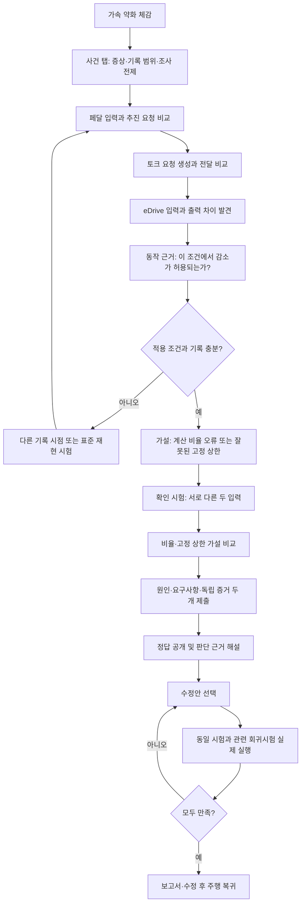

# CASE-PT-001 — 가속이 약해진 이유

상태: PROTOTYPE_IMPLEMENTED / PLAYTEST_REQUIRED (v0.2). 사용자 확정 범위: 추진 SW 계산 오류, 신호·요구사항 중심, 최종 제출 후 해설·수정안 선택·재시험. C 결함 경로와 5개 조사 탭을 게임에 연결했다. 새로운 OEM 사실, ASIL 또는 양산 아키텍처를 주장하지 않는다. 아래 기획 중 구현 차이와 검증 범위는 11절을 우선한다.

## 1. 범위와 완료 모습

첫 사건은 하나의 가상 통합 ECU에 배치된 POWERTRAIN / PROPULSION 기능의 Application SW 계산 결함이다. 논리 컴포넌트: Gear Logic → Propulsion Function → VMC → eDrive. Vehicle Physics는 Plant다. ECU 통신, Task 결함, Monitor, Watchdog, 노면 변화는 이 사건의 원인 후보에서 제외한다. 플레이어에게 제외 범위를 공개한다.

첫 사건의 목적은 '출력이 작다'에서 멈추지 않고, 적용 조건을 확인하고, 같은 호출의 입력/출력을 비교하고, 가설 구분 시험을 고른 다음, 수정으로 계약이 복구됐는지 확인하는 것이다. 원인 진단은 Component/Integration 수준이며 주행 응답은 증상과 확인 수단이다. 실제 임베디드 타깃이나 HIL 검증이 아니다.

## 2. 정상 계약과 요구사항 추적

기준: docs/ground-truth/PROPULSION_NORMAL_FLOW_GROUND_TRUTH_v0.3.md. 원문/승인 상태를 변경하지 않는다.

- SYSR-PROP-009 → SWR-VMC-001 / SWR-EDR-001 → VMC / eDrive → TC-PROP-NORMAL-009 / 010A / 010B.
- **직접 진단 근거는 SWR-EDR-001의 Clamp 계약이다.** VALID이고 방향이 FORWARD/REVERSE이며 magnitude>0일 때, expected magnitude = min(input magnitude, 해당 방향 limit). 따라서 한계 이하의 값은 보존한다. 방향과 validity도 보존한다.
- SYSR-PROP-009는 범위/방향 제약이다. 출력 절반은 여전히 이 제약을 만족할 수 있으므로 이 SYSR만으로 FAIL을 강제하지 않는다.
- SYSR-PROP-010은 응답의 방향과 유한성을 요구한다. 약한 가속도 이 요구사항을 만족할 수 있다. 별도 가속 성능 요구사항이 없는 상태에서 임의 목표 가속도를 실패 기준으로 쓰지 않는다.
- 기존 010A/B의 '한계 이내' 확인만으로 부족하다. CASE 전용 시험에서 **Clamp 함수의 정확한 출력**을 확인한다. 새 시험을 기존 TC 실행 결과로 위장하지 않는다.
- zero/invalid/NONE 입력 처리는 현재 정상 baseline과 관련 Propulsion 요구사항을 회귀 기준으로 유지한다. eDrive 입력 invalid 처리의 독립적인 상세 요구사항은 향후 문서 보완 항목이며, 여기서는 baseline regression임을 명시한다.

Calibration: TRACKBACK_SIMULATION_CALIBRATION_v0.1, forward limit 180 Nm, reverse limit 130 Nm, forward VMC map 180 Nm / 24 m/s, reverse map 130 Nm / 12 m/s. 모두 TRACKBACK simulation assumption이며 원본 calibration의 REVIEW_REQUIRED를 유지한다. 컴포넌트 수치 비교 tolerance 1e-6 Nm는 CASE 시험 설정이다.

## 3. 제작자 전용 결함 정의

결함: 정상 saturation 결과에 잘못된 0.5 배율이 적용된다. 활성화 후 eDrive magnitude만 줄어들며 direction/validity는 그대로다. 식은 author-only.json에 두고 정답 공개 전 UI에는 노출하지 않는다. 브라우저 기반 오프라인 게임이므로 소스 분석 방지/보안을 보장한다는 의미는 아니다.

구현 위치는 C eDrive 내부의 case 전용 결함 경로다. TS 화면이나 Plant 어댑터에서 숫자만 바꾸지 않는다. 정상 실행 경로는 보존하며 case 초기화로 격리한다. 정답 판정기는 결함 스위치가 켜졌다는 이유만으로 사용자의 증거를 정답 처리하지 않는다.

활성화 조건: countdown 이후 정상 주행, D, Ready/Enable, valid inputs, brake<=0.01, 실제 소비 pedal>=0.2, VehicleSpeed>=0.3 m/s, 조향 절대값<=0.35. 이 조건이 simulation time 0.75초 연속 유지되고 세션 주행 시간이 3초 이상이면 현재 C 호출부터 한 번 활성화한다. 페달/속력 상한과 도로 위 조건은 적용하지 않는다. 일반 키보드 최대 입력에서도 재현되도록 한 조정이며 노면 이상을 판정하는 모니터가 아니다. 고장 후 2초 조건 유지 구간을 확보하면 안내한다. 조건이 무너지면 다음 안정 구간을 기다린다. 이 수치들은 플레이테스트 조정 대상이다.

조건이 충족되지 않으면 '직선 구간에서 D 기어로 가속해 보세요' 안내를 표시한다. 그래도 재현하기 어려우면 **실제 C 실행 기반 표준 재현 시험**으로 진입한다. 미리 만든 성공/실패 영상을 대신 보여주지 않는다. 정상 임계와 고장 결과를 기록하지 못한 경우 원인 제출 대신 증거 확보를 유도한다.

고장 발생 시 한 번만 대사: '어라? 가속 페달을 밟고 있는데 차가 잘 안 나가네!' → '방금 상황을 기록했어. 함께 확인해 볼까?' 이름표·밝고 둥근 대화창·다음 표시를 사용한다. 기록 완료 뒤 주행을 정지하고 조사/계속 주행 선택을 제공한다. UI에서 eDrive 고장이라는 답은 알려주지 않는다.

## 4. 플레이어의 추리 흐름

초기 가이드는 질문을 준다: '페달 입력이 실제로 들어갔을까?' → '요청이 다음 컴포넌트에 그대로 전달됐을까?' → '이 조건에서는 어느 출력이 맞을까?' → '어떤 시험이 두 가설을 구분할까?' 최종 제출 전 힌트는 단계적으로 제공하고 사용 횟수를 기록한다. 오답이어도 학습을 중단하지 않는다.

## 5. X-Ray 탭별 공개 범위

1. **사건**: 증상, 사건 시각, 기록 범위, '이번 사건은 추진 Application SW 단일 결함' 전제. 내부 결함 활성화 시각/변수명/정답은 숨긴다.
2. **신호 추적**: 처음에는 Driver Input → Propulsion → VMC → eDrive 경로, 선택한 경계 2~4개 신호. Gear/Ready/Enable/validity/브레이크는 조건 확인으로 확장. 시간 커서는 모든 패널과 기록 주행 뷰가 공유한다. 활동 색은 실행/값 변화만 뜻하며 고장 확정 색이 아니다.
3. **동작 근거**: 선택한 컴포넌트와 연결된 요구사항, 적용 조건, 기대값, 제한값, 단위. 전체 지도는 접힌 보조 탐색. C 소스는 플레이어에게 공개하지 않는다. Clamp는 '한계 이하는 그대로, 초과분만 제한'과 정상 예제로 설명한다.
4. **확인 시험**: 제공된 템플릿을 선택한다. 해당 컴포넌트 시험은 실제 torque 입력을 C 컴포넌트 경계에 넣는 harness이고 운전자 페달 주행 재생이 아님을 명시한다. 편집 가능한 값은 허용 목록으로 제한한다. 내부 출력·결함 변수 편집은 없다.
5. **원인 제출 / 해설 / 수정 검증**: 제출 전 증거 모음, 최종 제출 후 정답/내 답 비교, 수정안, 재실행 결과, 보고서. 서로 다른 세 상태를 명시한다.

주행 썸네일은 별도 슬롯을 확보한다. 기록 보기에서는 RECORDED, 실시간에서는 LIVE, 시험 결과에서는 TEST RUN을 표시한다. 각 탭은 독립 스크롤하고 탭 변경 시 선택 시점/증거를 유지한다. replay가 아직 없다면 정적인 pose 재구성을 영상 녹화라고 부르지 않는다.

## 6. 기록과 시간 계약

Recorder는 UI 10 Hz publish가 아니라 각 SW invocation에 붙인다. case 최초 prototype은 60 Hz 기존 호출 주기를 사용하고 OS Task라 부르지 않는다. 15초 ring buffer, 사건 전 5초/후 2초 보존을 기본값으로 한다. 기록 부족/누락은 명시하고 정상값을 보간해 판정하지 않는다.

각 Frame: runId, stepId, invocation start/end simulation time, SW build hash, calibration hash, case version, 실제 소비 입력, Gear 상태, Propulsion/VMC/eDrive 입출력, 최종 signed driveForce/brakeForce/steering, plant pre/post state, vehicle pose, coverage/gap 정보. 기존 snapshot만으로는 eDrive 소비 입력과 최종 Plant command가 완전히 명시되지 않아 보충이 필요하다.

시간 커서로 한 invocation을 선택한다. producer output과 consumer input이 같은 호출/같은 연결인지 확인한다. 현재 구조는 동기 C 함수 전달이며 CAN 송수신으로 표현하지 않는다. Plant는 그 명령을 적용한 post-step 결과로 구분한다. 사건 발생·관측·대사 표시 시각을 분리한다.

기록 재생은 저장된 상태의 관찰이다. 재시험은 독립 C 인스턴스를 초기화해 입력을 새로 실행한다. 첫 단계에서는 임의 과거 시점에서 실행 분기하지 않는다. Plant 재현은 기록된 초기 snapshot 복원 기능이 없으면 표준 초기상태에서 새로 실행하고 원본 사건의 정확한 재현이라고 주장하지 않는다.

## 7. 확인 시험과 독립 판정

플레이어에게 기본 TC가 제공된다. 45/90/120 Nm 중 서로 다른 두 점을 고를 수 있으며 초기 안내는 45와 90 Nm다. FWD/VALID 조건과 180 Nm limit을 고정한다. 정상 기대값 45/90, 제작자용 결함 예상 22.5/45. 잘못된 상한 45 Nm라면 45/45이므로 두 가설을 구분할 수 있다. 임의의 모든 비선형 함수와 구별 가능하다고 주장하지 않는다.

증거가 비율 문제를 지지해도 정확한 소스 위치나 변수명은 요구하지 않는다. 인정 정답은 'eDrive magnitude 계산에 불필요한 비율 감소가 적용됨'. 0.5를 계산할 수 있으면 설명에 포함하되 제출 필수 정답 토큰으로 강제하지 않는다.

상한 시험은 컴포넌트 harness에서만 179/180/181/600 Nm와 REV 129/130/131/400 Nm를 사용한다. 페달 0..1로 만들 수 없는 큰 토크 입력을 게임 주행에서 입력했다고 표현하지 않는다. 모든 기대값은 requirements-derived oracle과 명시적 수치 벡터가 책임지고 C actual output과 비교한다. 같은 결함 함수를 oracle로 재사용하지 않는다.

판정: PASS, FAIL, INVALID_TEST(잘못된 전제/입력), INCONCLUSIVE(기록 부족/실행 실패). 후자의 둘은 제품 결함이나 사용자 오답으로 채점하지 않는다. 테스트 중 게임 시간은 정지하고 별도 testRunId를 사용한다.

## 8. 제출 및 수정 검증

제출: 원인 Component, 오류 메커니즘, 직접 근거 Requirement, 서로 다른 증거 두 개, 선택한 확인 시험. 증거는 같은 값을 중복 선택해 개수를 채울 수 없으며 frame/testRun ID와 관측 경계를 보존한다. UI에 보여주지 않은 지식으로 채점하지 않는다.

진단 완료 기준: eDrive + magnitude scaling 계열 설명 + SWR-EDR-001 + 유효한 입력/출력 불일치 증거 + 두 입력에서의 비율 결과. SYSR-PROP-009만 선택한 경우 상한 조건만으로는 감소 오류를 판정할 수 없다는 설명을 제공한다. 정답 컴포넌트만 맞힌 경우 부분적으로 맞았음을 알려준다. 첫 구현은 점수 숫자보다 각 판단 항목의 충족/미충족을 보여준다.

최종 제출 시 첫 답안을 고정하고 정답과 인과 해설을 공개한다. 그 이후 다시 정답을 선택해 최초 진단 성과를 덮어쓰지 않는다. 모든 플레이어가 수정 검증 단계에 진입한다.

수정안 A: 잘못된 비율 감소를 제거하고 기존 제한 유지. B: 입력 요청을 두 배로 보상하고 기존 결함 유지. C: 상한 제한을 제거하고 기존 결함 유지. 구현 방법/계산은 제작자 전용이며 플레이어는 위 동작 설명으로 선택한다. 각각 실제 C variant로 재실행해야 한다. A를 고르면 자동 PASS를 띄우는 구현은 금지한다.

B는 작은 입력에서 맞을 수 있으나 큰 입력에서 실패한다. C도 일부 상한 부근에서 우연히 맞을 수 있지만 한계 초과 입력에서 실패한다. 예: FWD 90 입력은 A=90, B=90, C=45; FWD 600 입력은 A=180, B=90, C=300. 요구사항에 근거한 회귀시험이 필요한 이유를 결과로 설명한다.

필수 회귀: FWD/REV saturation 정확한 경계, zero/invalid/NONE baseline, P/N inhibit, D/R 방향, disabled gating, direct D↔R interlock. 마지막 차량 응답 확인은 기존 TC011/012와 연결하되 약한 가속 원인의 단독 증거로 사용하지 않는다.

보고서: first diagnosis, evidence IDs, explanation, selected fix attempts, SW/calibration/case versions, test object, preconditions/input, expected/actual/tolerance/verdict. 분석 보고서와 현재 주행 live monitor 판정을 혼동하지 않는다.

## 9. 구현 순서와 인수 조건

1. 순수 Case 상태 머신: READY → DRIVING → INCIDENT_CAPTURED → INVESTIGATING → DIAGNOSIS_SUBMITTED → EXPLAINED → FIX_SELECTED → RETESTING → RESOLVED. 실패 시험은 FIX_SELECTED로 돌아가며 race lifecycle과 분리한다. restart/quit 시 기록·fault·fix를 모두 초기화한다.
2. C case fault/repair variants + 독립 oracle 시험. 정상 baseline 45개 회귀를 유지한다.
3. 각 invocation recorder와 기록 pose 뷰, 공통 시간 커서. pause/resume와 기록 누락 처리.
4. 다섯 탭, 단계적 힌트, 증거 수집/제출.
5. 실제 시험 실행·해설·수정 결과 보고서. 키보드 가이드는 입력 강도 상승 시간을 고려한다.

인수: 정답을 모르는 사용자가 공개된 정보만으로 첫 사건을 해결할 수 있음; 원인 후보가 시험으로 구분됨; 원본 incident 보존; live/test 값 혼입 없음; 실패한 수정은 실제 시험에서 실패함; 요구사항·Cal 원문 미변경; 초기화 후 다른 세션에 결함이 남지 않음.

## 10. 미확정값과 추가로 필요한 사용자 자료

사용자에게 추가 JSON 작성은 요구하지 않는다. 제공한 범위 결정과 기존 Ground Truth로 명세를 구성했다. playtest에서 안내 시점·기록 길이·가속 체감·힌트 문구를 조정한다. 새로운 가속 성능 requirement나 CAN/Task 원인은 현재 필요하지 않다.

Clamp의 입력 보존 의미를 별도 요구사항 문장으로 명문화할지는 후속 문서 정합성 검토 항목이다. 이번 명세는 기존 영어 원문의 clamp 의미를 시험 기준으로 풀어 썼으며 SYSR에 새로운 성능 조건을 승인 처리하지 않았다.

동반 파일: player.json(공개 정보/시험), author-only.json(정답/결함/수정안 검증 벡터). 현재 src에서 import하지 않는 설계 데이터다. 최초 검증은 정상 기준선에 한정됐고, v0.2 실행 검증 범위는 아래와 같다.

## 11. v0.2 구현 및 확인

- `c/vehicle_sw/edrive.c`의 Case 경로에서 실제 0.5 배율을 적용한다. 정상 경로와 리셋은 유지한다. 화면·Plant의 수치를 위조하지 않는다.
- `PropulsionCase`는 DRIVING / CAPTURED / SUBMITTED / RESOLVED를 저장한다. 조사 탭·해설·수정 선택은 화면 상태이고 재시험은 동기 C 실행이므로 별도 가짜 비동기 실행 단계를 만들지 않았다.
- 매 60 Hz SW 호출의 소비 입력, 출력, calibration, 적용 물리 명령, post-step 차량 pose를 저장한다. 최대 15초 임시 기록 중 최근 7초를 사건 기록으로 고정한다. Plant pose는 같은 호출의 SW 출력 적용 후 상태다.
- X-Ray는 주행을 정지한다. 시간 커서는 보존된 신호와 차량 pose를 표시하며 과거 물리 상태로 현재 시뮬레이션을 되감지 않는다. 재생은 녹화 영상이 아닌 pose 재구성이다. 표준 재현 시험은 독립 C 인스턴스의 5초 고정 입력 시험이고 Plant 기록이 없으므로 영상 영역은 실제 주행 정지 위치를 유지한다.
- 확인 시험은 45/90/120 Nm 중 서로 다른 두 입력만 선택한다. 제작자가 정의한 경계/한계 시험은 수정 후 18개 회귀시험으로 실행한다. 범용 TC 편집기는 없다.
- 첫 제출과 기록 증거를 보존하고 해설을 공개한다. 틀린 답도 수정 학습을 진행할 수 있다. 잘못된 보상/제한 해제 수정안은 실제 C 회귀시험에서 실패한다. 정상 수정만 RESOLVED로 전환하여 주행 복귀에 적용한다.
- 보고서 JSON은 build hash, calibration, 증거 프레임, 첫 제출, 두 입력 시험, 수정 시도와 결과를 담는다. 새 세션/재시작은 기록과 결함을 초기화한다. 자동 영구 저장은 없다.
- `check-case-pt-001.mjs`는 이제 정상 11개 + 결함/수정 33개 C 샘플을 실행해 CHECK.json을 생성한다. `tests/case-gameplay.test.mjs`는 실제 C + Rapier의 proving ground와 판교 맵 자동 발동, 정지, 기록 보존, 수정 주행 복귀와 초기화를 확인한다.
- 브라우저에서 표준 재현 → 신호 증거 → 두 입력 시험 → 원인 제출 → 18개 수정 재시험 PASS를 확인했다. 초보 사용자의 난이도/문구/가속 체감은 추가 플레이테스트 대상이다. 타깃 ECU, CAN, Task, HIL은 구현 범위 밖이다.
