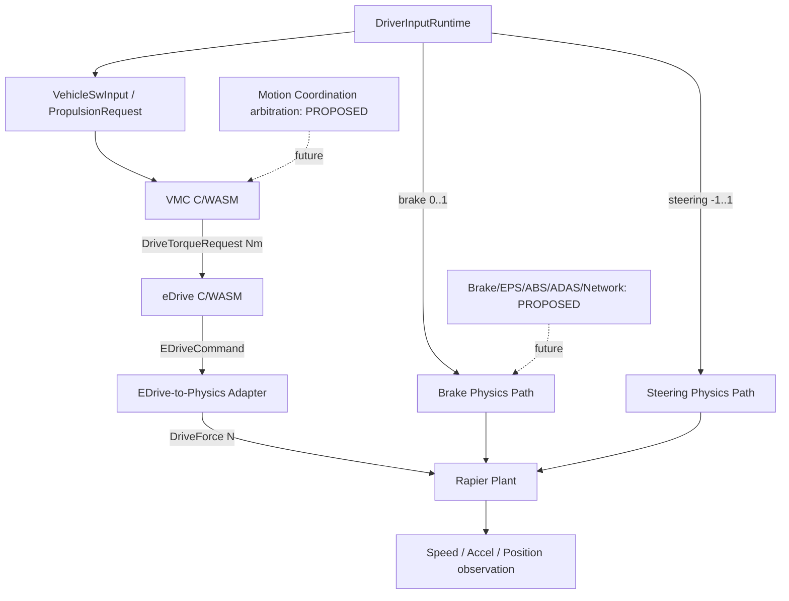

# TRACKBACK — Phase 04 신호 및 인터페이스 아키텍처 설계 v0.1 (한글)

**범위:** 16개 도메인/공통 영역, 74개 LF 기능 전체. Phase 03의 로직-상태 초안을 기반으로 작성. 이 문서는 **참조 신호/후보 포트/경계 설계**이며 기존 승인 canonical registry를 변경하지 않는다.
**상태:** `PROPOSED` — 최신 소스코드 대조 및 사용자 승인 전 제품 Ground Truth / Test Oracle / 실제 CAN으로 사용 금지.

## 0. Phase 03 감사의 선행 결과
상세는 `PHASE03_DESIGN_AUDIT_KO.md`를 따른다. 우선 해결: VMC/MC 계산 책임(A01,A14), 런타임/참조 Signal alias(A02,A13), command/force/torque 단위(A03,A16), SW logical task/60Hz 물리 시간(A04), 독립 endpoint(A11), 안전 요구사항 필수 여부(A10). **OPEN 문제를 Phase 04 작성만으로 해결했다고 간주하지 않는다.**

## 1. Signal과 Port/Interface를 분리하는 원칙
1. Signal 이름은 값의 의미(identity). **생산자 출력 Port**와 **소비자 입력 Port**는 관측 지점(endpoint)이며 Signal과 1:1이라고 강제하지 않는다. 한 Signal이 여러 Consumer를 가질 수 있다.
2. `value`, `quality(valid/invalid/unknown)`, `freshness(stale/unknown)`, `applicability`(요구가 적용되는지), `Expected`, `Actual`은 독립된 속성이다. 물리 유효 범위와 요구사항 정상은 다른 개념이다.
3. Signal Domain은 `request`, `command`, `applied physical effect`, `measured plant value`, `diagnostic status`, `calibration/limit`, `scenario stimulus` 등에서 정한다.
4. SW 명령 토크(Nm), DriveForce(N), 차체 가속도(m/s²), 속력(m/s), signed longitudinal velocity(m/s), steering normalized ratio, wheel angle(rad), yaw(rad/s)는 실제 변환식과 좌표계가 없으면 서로 수치 비교 불가.
5. 실시간 샘플링 이벤트는 `sourceProducedAt`, `deliveredAt`, `destConsumedAt`, `physicsAppliedAt`, `observedAt`을 **실제 발생한 이벤트에 한해** 별도 기록한다. 없는 이벤트의 timestamp를 복제해 둘러대지 않는다.
6. Frame clock `1/60 s`는 물리/Vehicle Scenario tick. 문서상의 10ms task/CAN 전송주기는 미래 설계 예시이며 현재 런타임에서 발생한다고 할 수 없다.
7. 이전 문서에 있는 `CAN-FD`, BMS, ABS wheel speed, EPS/Brake SW, Crash sensor는 reference-only. 임의 메시지 ID, DBC bit layout, CRC, timeout 숫자 생성 금지.
8. 동일 데이터 객체의 두 번 읽기는 생산·소비 양단 독립 telemetry가 아니다. Byte/copy 또는 실제 양쪽 API boundary를 계측하기 전 Interface MATCH 금지.

## 2. 실존 보고 경로와 전체 참조 경로

실선의 일부도 **코드에서 직접 확인된 것이 아니라 기존 Codex 실행 보고 범위**다. `Brake/EPS/ADAS` 등의 미래 경로를 실선으로 바꾸지 않는다.

## 3. 신규 신호 등록을 위한 권장 메타데이터
```yaml
# 스키마 예시, 현재 코드와 동일한 타입이 아님
signalId: <globally unique stable identity>
technicalName: <existing canonical name or candidate>
meaningKO: <educational definition>
quantity: <physical dimension / enum / event>
unit: <approved unit or OPEN>
dataType: <raw/logical representation, signedness, precision>
valueDomain: <range or allowed enum, specific to boundary>
quality: <validity, provenance, freshness policies>
producer: {functionId: ..., portId: ..., eventPhase: ..., timebase: ...}
consumers: [{functionId: ..., portId: ..., samplingPolicy: ...}]
transformations: [{boundaryId: ..., ruleId: ..., conversionUnit: ...}]
coordinateFrame: <world, vehicle body, wheel, none, OPEN>
semantics: <requested / commanded / applied / observed / reference>
requirementLinks: [] # only explicitly traced links
sourceDocument: <file/section/code path>
sourceStatus: SRC_DRAFT|CODEX_REPORTED|PROPOSED|CODE_VERIFIED
runtimeCapability: UNAVAILABLE|STRUCTURAL|OBSERVABLE|EXECUTABLE|COMPARABLE
approval: AI_DRAFT # not approved until review
```
**권장:** technicalName과 UI에서 보여줄 쉬운 설명/단위는 분리. 제안 후보가 같은 이름일지라도 기존 registry를 자동 덮어쓰지 않는다.

## 4. 전체 Signal 후보 카탈로그 (참조 관계, 공식 Signal DB 아님)
표의 `Producer/Consumer`는 의도한 논리적 기능 참조다. 해당 실행 Port가 존재한다는 뜻은 아니다. 상세 `sourceStatus`, `clockBasis`, 출처 주의점은 **04_SIGNAL_CANDIDATE_CATALOG.csv**에 수록.

### 4.1 Driver/Vehicle/Gear (24 관계 항목)
| 신호명 | 의미 | 단위 | 생산자 후보 | 소비자 | 근거 |
|---|---|---|---|---|---|
| `DriverInputRuntime.accelerator` | 운전자의 정규화 가속 입력 | `ratio` | `LF-DRV-ACQ` | `LF-PROP-ACQ` | `CODEX_REPORTED` |
| `DriverInputRuntime.brake` | 운전자의 정규화 제동 입력 | `ratio` | `LF-DRV-ACQ` | `LF-ACT-BRAKE` | `CODEX_REPORTED` |
| `DriverInputRuntime.steering` | 운전자의 정규화 조향 입력 | `ratio` | `LF-DRV-ACQ` | `LF-ACT-STEER` | `CODEX_REPORTED` |
| `GearScenarioPrecondition` | 시나리오에서 보고된 D 기어 사전조건을 표현하기 위한 별도 후보 | `enum` | `LF-DRV-ACQ` | `LF-GEAR-ACQ` | `PROPOSED` |
| `VehicleReady` | 차량 준비 조건 | `boolean` | `LF-VS-INIT` | `LF-VS-PERM,LF-PROP-STA` | `SRC_DRAFT` |
| `DriveEnable` | 구동 허용 상태 | `boolean` | `LF-VS-PERM` | `LF-PROP-STA` | `SRC_DRAFT` |
| `GearState` | 현재 적용/보고 기어 상태 | `enum` | `LF-GEAR-STATE` | `LF-VS-PERM,LF-PROP-STA` | `SRC_DRAFT` |
| `DriveMode` | 운전 모드 상태 | `enum` | `LF-VS-MODE` | `LF-PROP-GEN` | `SRC_DRAFT` |
| `DriverInputQuality` | 운전자 조작 입력의 타입·범위·유효성 메타데이터 | `quality` | `LF-DRV-VALID` | `LF-PROP-ACQ,LF-BRK-ACQ,LF-STR-ACQ` | `PROPOSED` |
| `GearRequest` | 운전자 기어 선택 요구 | `enum` | `LF-GEAR-ACQ` | `LF-GEAR-INTERLOCK` | `PROPOSED` |
| `GearRequestValidity` | 기어 요청 표현·상태 유효성 | `quality` | `LF-GEAR-ACQ` | `LF-GEAR-INTERLOCK` | `PROPOSED` |
| `GearTransitionStatus` | 변속 요청 처리 결과 | `enum` | `LF-GEAR-INTERLOCK` | `LF-GEAR-STATE` | `PROPOSED` |
| `GearApplyFeedback` | 실제 gear 전환 피드백 | `enum` | `OPEN` | `LF-GEAR-STATE` | `PROPOSED` |
| `GearFaultObservation` | 기어 전환 실패 후보 관측 | `event` | `LF-GEAR-REACT` | `LF-FM-OBS` | `PROPOSED` |
| `VehicleInitializationStatus` | 차량 초기화 절차 상태 | `enum` | `LF-VS-INIT` | `LF-VS-PERM` | `PROPOSED` |
| `VehicleModeRequest` | 운용 모드 선택 요구 | `enum` | `LF-VS-MODE` | `LF-PROP-GEN` | `PROPOSED` |
| `DomainAvailability` | 기능별 사용 가능 상태/사유 | `enum` | `LF-VS-FAULT` | `LF-MC-REQ,LF-PROP-STA,LF-BRK-STATE` | `PROPOSED` |
| `ObjectRelativeDistance` | 전방 대상과의 상대 거리 | `m` | `LF-ENV-STATE` | `LF-ADAS-AEB,LF-ADAS-ACC` | `PROPOSED` |
| `ObjectRelativeVelocity` | 대상 상대 속도 | `m/s` | `LF-ENV-STATE` | `LF-ADAS-AEB,LF-ADAS-ACC` | `PROPOSED` |
| `ObjectInPath` | 대상이 진행 경로에 있는지 | `boolean` | `LF-ENV-STATE` | `LF-ADAS-AEB` | `PROPOSED` |
| `LaneOffset` | 차로 중심 기준 상대 위치 | `m` | `LF-ENV-STATE` | `LF-ADAS-LKA` | `PROPOSED` |
| `FaultReactionConstraint` | domain별 고장 대응 제약 | `typed request` | `LF-FM-REACT` | `LF-VS-FAULT,LF-MC-REQ` | `PROPOSED` |
| `FaultRecoveryEligibility` | 복귀 승인 조건 | `enum/boolean` | `LF-FM-REC` | `LF-VS-FAULT,LF-PROP-REC` | `PROPOSED` |
| `ScenarioRoadState` | 도로 기하·마찰 및 Scenario 조건 | `struct` | `LF-PLANT-ENV` | `LF-ENV-STATE,LF-PLANT-MOTION` | `PROPOSED` |

### 4.1 Propulsion + eDrive (36 관계 항목)
| 신호명 | 의미 | 단위 | 생산자 후보 | 소비자 | 근거 |
|---|---|---|---|---|---|
| `DriverInputRuntime.accelerator` | 운전자의 정규화 가속 입력 | `ratio` | `LF-DRV-ACQ` | `LF-PROP-ACQ` | `CODEX_REPORTED` |
| `PropulsionRequest` | VMC가 입력받는 정규화된 구동 요구 | `ratio` | `OPEN` | `LF-PROP-GEN` | `CODEX_REPORTED` |
| `VehicleSpeed` | VMC 입력 및 Plant 관측 속력 | `m/s` | `LF-PLANT-MOTION` | `LF-PROP-GEN,LF-SEN-MOTION` | `CODEX_REPORTED` |
| `DriveTorqueRequest` | VMC 출력, eDrive 입력 토크 요구 | `Nm` | `LF-PROP-GEN` | `LF-PROP-EDRV` | `CODEX_REPORTED` |
| `EDriveCommand` | eDrive SW에서 만든 명령 | `Nm로 보고되었으나 포트 단위 재확인` | `LF-PROP-EDRV` | `LF-ACT-DRIVE` | `CODEX_REPORTED` |
| `Direction` | VMC/eDrive 시험 방향 parameter | `enum` | `OPEN` | `LF-PROP-GEN,LF-PROP-EDRV` | `CODEX_REPORTED` |
| `Validity` | VMC/eDrive 시험 validity parameter | `enum` | `OPEN` | `LF-PROP-GEN,LF-PROP-EDRV` | `CODEX_REPORTED` |
| `VehicleReady` | 차량 준비 조건 | `boolean` | `LF-VS-INIT` | `LF-VS-PERM,LF-PROP-STA` | `SRC_DRAFT` |
| `DriveEnable` | 구동 허용 상태 | `boolean` | `LF-VS-PERM` | `LF-PROP-STA` | `SRC_DRAFT` |
| `GearState` | 현재 적용/보고 기어 상태 | `enum` | `LF-GEAR-STATE` | `LF-VS-PERM,LF-PROP-STA` | `SRC_DRAFT` |
| `PropulsionOperatingState` | 구동 기능 내부 상태 | `enum` | `LF-PROP-STA` | `LF-PROP-GEN,LF-PROP-REACT` | `SRC_DRAFT` |
| `AcceleratorPedalPosition` | 페달 위치 기반 요구사항 입력 | `%` | `LF-PROP-ACQ` | `LF-PROP-INTERP` | `SRC_DRAFT` |
| `AcceleratorPedalValid` | 가속페달 입력 유효성 요구조건 | `boolean` | `OPEN` | `LF-PROP-ACQ` | `SRC_DRAFT` |
| `DriverDriveRequestValid` | 해석된 운전자 요구 유효성 | `boolean` | `LF-PROP-ACQ` | `LF-PROP-INTERP,LF-PROP-STA` | `SRC_DRAFT` |
| `DriverDriveDemand` | 정규화 운전자 구동 의도 | `ratio` | `LF-PROP-INTERP` | `LF-PROP-GEN` | `SRC_DRAFT` |
| `DriveMode` | 운전 모드 상태 | `enum` | `LF-VS-MODE` | `LF-PROP-GEN` | `SRC_DRAFT` |
| `RequestedDriveTorque` | Motion Arbitration 이전 토크 요구 | `Nm` | `LF-PROP-GEN` | `LF-MC-REQ` | `SRC_DRAFT` |
| `ArbitratedDriveTorque` | Motion arbitration 결과 토크 | `Nm` | `LF-MC-LON` | `LF-PROP-LIM` | `SRC_DRAFT` |
| `MaxAllowedDriveTorque` | 토크 허용 상한 기준 | `Nm` | `OPEN` | `LF-PROP-LIM` | `SRC_DRAFT` |
| `LimitedDriveTorque` | 토크 제한 후 요구 | `Nm` | `LF-PROP-LIM` | `LF-PROP-OUT,LF-PROP-MON` | `SRC_DRAFT` |
| `PropulsionRequestValid` | 최종 Propulsion output 생성 전제 | `boolean` | `OPEN` | `LF-PROP-OUT` | `SRC_DRAFT` |
| `DriveTorqueCommand` | 구동계에 전송되는 토크 명령 | `Nm` | `LF-PROP-OUT` | `LF-PROP-MON,LF-PROP-EDRV` | `SRC_DRAFT` |
| `DriveTorqueCommandValid` | 구동 토크 명령 유효성 | `boolean` | `LF-PROP-OUT` | `LF-PROP-EDRV` | `SRC_DRAFT` |
| `CommandTorqueTolerance` | 명령 일관성 판단 허용차 | `Nm` | `OPEN` | `LF-PROP-MON` | `SRC_DRAFT` |
| `CommandTorqueDeviation` | 제한값과 명령의 편차 | `Nm` | `LF-PROP-MON` | `LF-FM-OBS` | `SRC_DRAFT` |
| `PropulsionFaultStatus` | 진단된 구동 고장 상태 | `enum` | `LF-PROP-MON` | `LF-PROP-REACT,LF-PROP-REC` | `SRC_DRAFT` |
| `DegradedTorqueLimit` | 고장시 토크 제한 보정 | `Nm` | `OPEN` | `LF-PROP-REACT` | `SRC_DRAFT` |
| `RecoveryConditionsSatisfied` | 복귀 가능한지 여부 | `boolean` | `LF-FM-REC` | `LF-PROP-REC` | `SRC_DRAFT` |
| `DriverInputQuality` | 운전자 조작 입력의 타입·범위·유효성 메타데이터 | `quality` | `LF-DRV-VALID` | `LF-PROP-ACQ,LF-BRK-ACQ,LF-STR-ACQ` | `PROPOSED` |
| `VehicleModeRequest` | 운용 모드 선택 요구 | `enum` | `LF-VS-MODE` | `LF-PROP-GEN` | `PROPOSED` |
| `DomainAvailability` | 기능별 사용 가능 상태/사유 | `enum` | `LF-VS-FAULT` | `LF-MC-REQ,LF-PROP-STA,LF-BRK-STATE` | `PROPOSED` |
| `CoordinatedLongitudinalRequest` | 종방향 조정 결과 | `typed request` | `LF-MC-LON` | `LF-MC-ALLOC,LF-PROP-LIM` | `PROPOSED` |
| `AllocatedActuatorCommand` | 차량 구동/제동/조향으로 나눈 명령 | `typed bundle` | `LF-MC-ALLOC` | `LF-PROP-OUT,LF-BRK-CMD,LF-STR-ACT` | `PROPOSED` |
| `DrivePowerAvailable` | 전기 구동 전력 가용성 | `boolean or enum` | `LF-EN-READY` | `LF-EN-LIMIT,LF-PROP-LIM` | `PROPOSED` |
| `EnergyDriveTorqueLimit` | 에너지/구동계 허용 토크 | `Nm` | `LF-EN-LIMIT` | `LF-MC-ALLOC,LF-PROP-LIM` | `PROPOSED` |
| `FaultRecoveryEligibility` | 복귀 승인 조건 | `enum/boolean` | `LF-FM-REC` | `LF-VS-FAULT,LF-PROP-REC` | `PROPOSED` |

### 4.1 Braking (17 관계 항목)
| 신호명 | 의미 | 단위 | 생산자 후보 | 소비자 | 근거 |
|---|---|---|---|---|---|
| `DriverInputQuality` | 운전자 조작 입력의 타입·범위·유효성 메타데이터 | `quality` | `LF-DRV-VALID` | `LF-PROP-ACQ,LF-BRK-ACQ,LF-STR-ACQ` | `PROPOSED` |
| `DomainAvailability` | 기능별 사용 가능 상태/사유 | `enum` | `LF-VS-FAULT` | `LF-MC-REQ,LF-PROP-STA,LF-BRK-STATE` | `PROPOSED` |
| `RequestedDeceleration` | 목표 감속 요구 | `m/s²` | `LF-BRK-DEMAND` | `LF-BRK-COORD,LF-MC-LON` | `PROPOSED` |
| `BrakeDemandValidity` | 제동 입력 품질/유효성 | `quality` | `LF-BRK-ACQ` | `LF-BRK-STATE,LF-BRK-DEMAND` | `PROPOSED` |
| `BrakeAvailability` | 제동 기능의 가용성 | `enum` | `LF-BRK-STATE` | `LF-BRK-DEMAND,LF-MC-LON` | `PROPOSED` |
| `SelectedBrakingRequest` | 출처 중재된 제동 요구 | `typed request` | `LF-BRK-COORD` | `LF-MC-LON,LF-BRK-BLEND` | `PROPOSED` |
| `RegenTorqueRequested` | 회생제동 토크 요구 | `Nm` | `LF-BRK-BLEND` | `LF-MC-ALLOC` | `PROPOSED` |
| `FrictionBrakeTorqueRequest` | 마찰제동 토크 요구 | `Nm` | `LF-BRK-BLEND` | `LF-BRK-CMD` | `PROPOSED` |
| `BrakeCommand` | 제동 제어기 출력 명령 | `OPEN` | `LF-BRK-CMD` | `LF-ACT-BRAKE` | `PROPOSED` |
| `BrakeActuationFeedback` | 제동 실제 피드백 | `OPEN` | `OPEN` | `LF-BRK-FDBK` | `PROPOSED` |
| `BrakeFaultObservation` | 제동 반응 이상 후보 | `event` | `LF-BRK-FDBK` | `LF-FM-OBS` | `PROPOSED` |
| `AbsBrakeIntervention` | 잠김방지 제동 개입 제약 | `typed request` | `LF-STB-ABS` | `LF-STB-COORD,LF-BRK-CMD` | `PROPOSED` |
| `StabilityConstraintRequest` | 합의된 안정화 제약 | `typed request` | `LF-STB-COORD` | `LF-MC-REQ,LF-BRK-COORD` | `PROPOSED` |
| `AebBrakeRequest` | 자동 긴급 제동 요구 | `typed brake/decel` | `LF-ADAS-AEB` | `LF-MC-REQ,LF-BRK-ACQ` | `PROPOSED` |
| `AllocatedActuatorCommand` | 차량 구동/제동/조향으로 나눈 명령 | `typed bundle` | `LF-MC-ALLOC` | `LF-PROP-OUT,LF-BRK-CMD,LF-STR-ACT` | `PROPOSED` |
| `RegenAvailable` | 회생제동 가용성 | `boolean or enum` | `LF-EN-READY` | `LF-BRK-BLEND` | `PROPOSED` |
| `RegenTorqueLimit` | 회생 제동 허용 토크 | `Nm` | `LF-EN-LIMIT` | `LF-BRK-BLEND` | `PROPOSED` |

### 4.1 Steering (9 관계 항목)
| 신호명 | 의미 | 단위 | 생산자 후보 | 소비자 | 근거 |
|---|---|---|---|---|---|
| `DriverInputQuality` | 운전자 조작 입력의 타입·범위·유효성 메타데이터 | `quality` | `LF-DRV-VALID` | `LF-PROP-ACQ,LF-BRK-ACQ,LF-STR-ACQ` | `PROPOSED` |
| `SteeringDemandNormalized` | 운전자 조향 요구 | `ratio` | `LF-STR-ACQ` | `LF-STR-DEMAND` | `PROPOSED` |
| `SteeringAvailability` | 조향 기능 가용성 | `enum` | `LF-STR-STATE` | `LF-STR-COORD` | `PROPOSED` |
| `RequestedSteeringAction` | 요구 조향 동작 | `OPEN` | `LF-STR-DEMAND` | `LF-STR-COORD` | `PROPOSED` |
| `SelectedSteeringRequest` | 운전자/LKA 조정 요청 | `typed request` | `LF-STR-COORD` | `LF-MC-LAT` | `PROPOSED` |
| `EPSCommand` | EPS 동작 명령 | `OPEN` | `LF-STR-ACT` | `LF-ACT-STEER` | `PROPOSED` |
| `SteeringActuationFeedback` | 조향 실제 응답 | `OPEN` | `OPEN` | `LF-STR-MON` | `PROPOSED` |
| `LkaAssistRequest` | 차로 유지 조향 보조 요구 | `OPEN` | `LF-ADAS-LKA` | `LF-MC-REQ,LF-STR-COORD` | `PROPOSED` |
| `AllocatedActuatorCommand` | 차량 구동/제동/조향으로 나눈 명령 | `typed bundle` | `LF-MC-ALLOC` | `LF-PROP-OUT,LF-BRK-CMD,LF-STR-ACT` | `PROPOSED` |

### 4.1 Stability (8 관계 항목)
| 신호명 | 의미 | 단위 | 생산자 후보 | 소비자 | 근거 |
|---|---|---|---|---|---|
| `WheelAngularVelocity` | 차륜 회전속도 관측 | `rad/s` | `OPEN` | `LF-STB-ABS,LF-STB-TCS` | `PROPOSED` |
| `WheelSlipRatio` | 휠 slip 추정/판정 | `ratio` | `OPEN` | `LF-STB-ABS,LF-STB-TCS` | `PROPOSED` |
| `YawRateEstimate` | 차량 yaw 운동량 추정 | `rad/s` | `OPEN` | `LF-STB-ESC` | `PROPOSED` |
| `AbsBrakeIntervention` | 잠김방지 제동 개입 제약 | `typed request` | `LF-STB-ABS` | `LF-STB-COORD,LF-BRK-CMD` | `PROPOSED` |
| `TractionTorqueConstraint` | 구동 미끄럼 제한 제약 | `Nm or typed limit` | `LF-STB-TCS` | `LF-STB-COORD,LF-MC-LON` | `PROPOSED` |
| `EscMotionCorrection` | 차량 자세 안정화 개입 후보 | `typed request` | `LF-STB-ESC` | `LF-STB-COORD,LF-MC-REQ` | `PROPOSED` |
| `StabilityConstraintRequest` | 합의된 안정화 제약 | `typed request` | `LF-STB-COORD` | `LF-MC-REQ,LF-BRK-COORD` | `PROPOSED` |
| `VehicleRoadContactState` | 타이어/노면 접촉 상태 | `struct` | `LF-PLANT-MOTION` | `LF-STB-ABS,LF-STB-TCS` | `PROPOSED` |

### 4.1 ADAS (11 관계 항목)
| 신호명 | 의미 | 단위 | 생산자 후보 | 소비자 | 근거 |
|---|---|---|---|---|---|
| `ObjectRelativeDistance` | 전방 대상과의 상대 거리 | `m` | `LF-ENV-STATE` | `LF-ADAS-AEB,LF-ADAS-ACC` | `PROPOSED` |
| `ObjectRelativeVelocity` | 대상 상대 속도 | `m/s` | `LF-ENV-STATE` | `LF-ADAS-AEB,LF-ADAS-ACC` | `PROPOSED` |
| `ObjectInPath` | 대상이 진행 경로에 있는지 | `boolean` | `LF-ENV-STATE` | `LF-ADAS-AEB` | `PROPOSED` |
| `LaneOffset` | 차로 중심 기준 상대 위치 | `m` | `LF-ENV-STATE` | `LF-ADAS-LKA` | `PROPOSED` |
| `AebBrakeRequest` | 자동 긴급 제동 요구 | `typed brake/decel` | `LF-ADAS-AEB` | `LF-MC-REQ,LF-BRK-ACQ` | `PROPOSED` |
| `AccLongitudinalRequest` | 순항 속도/차간거리 기반 종방향 요구 | `m/s² or typed` | `LF-ADAS-ACC` | `LF-MC-REQ` | `PROPOSED` |
| `LkaAssistRequest` | 차로 유지 조향 보조 요구 | `OPEN` | `LF-ADAS-LKA` | `LF-MC-REQ,LF-STR-COORD` | `PROPOSED` |
| `AebAvailability` | AEB 기능 가용성 | `enum` | `LF-ADAS-COMMON` | `LF-ADAS-AEB` | `PROPOSED` |
| `AccAvailability` | ACC 기능 가용성 | `enum` | `LF-ADAS-COMMON` | `LF-ADAS-ACC` | `PROPOSED` |
| `LkaAvailability` | LKA 기능 가용성 | `enum` | `LF-ADAS-COMMON` | `LF-ADAS-LKA` | `PROPOSED` |
| `VehicleMotionObservation` | vehicle plant 관측 + provenance | `typed snapshot` | `LF-SEN-MOTION` | `LF-MC-LON,LF-ADAS-AEB,LF-ADAS-ACC` | `PROPOSED` |

### 4.1 MotionCoordination (24 관계 항목)
| 신호명 | 의미 | 단위 | 생산자 후보 | 소비자 | 근거 |
|---|---|---|---|---|---|
| `RequestedDriveTorque` | Motion Arbitration 이전 토크 요구 | `Nm` | `LF-PROP-GEN` | `LF-MC-REQ` | `SRC_DRAFT` |
| `ArbitratedDriveTorque` | Motion arbitration 결과 토크 | `Nm` | `LF-MC-LON` | `LF-PROP-LIM` | `SRC_DRAFT` |
| `DomainAvailability` | 기능별 사용 가능 상태/사유 | `enum` | `LF-VS-FAULT` | `LF-MC-REQ,LF-PROP-STA,LF-BRK-STATE` | `PROPOSED` |
| `RequestedDeceleration` | 목표 감속 요구 | `m/s²` | `LF-BRK-DEMAND` | `LF-BRK-COORD,LF-MC-LON` | `PROPOSED` |
| `BrakeAvailability` | 제동 기능의 가용성 | `enum` | `LF-BRK-STATE` | `LF-BRK-DEMAND,LF-MC-LON` | `PROPOSED` |
| `SelectedBrakingRequest` | 출처 중재된 제동 요구 | `typed request` | `LF-BRK-COORD` | `LF-MC-LON,LF-BRK-BLEND` | `PROPOSED` |
| `RegenTorqueRequested` | 회생제동 토크 요구 | `Nm` | `LF-BRK-BLEND` | `LF-MC-ALLOC` | `PROPOSED` |
| `SelectedSteeringRequest` | 운전자/LKA 조정 요청 | `typed request` | `LF-STR-COORD` | `LF-MC-LAT` | `PROPOSED` |
| `TractionTorqueConstraint` | 구동 미끄럼 제한 제약 | `Nm or typed limit` | `LF-STB-TCS` | `LF-STB-COORD,LF-MC-LON` | `PROPOSED` |
| `EscMotionCorrection` | 차량 자세 안정화 개입 후보 | `typed request` | `LF-STB-ESC` | `LF-STB-COORD,LF-MC-REQ` | `PROPOSED` |
| `StabilityConstraintRequest` | 합의된 안정화 제약 | `typed request` | `LF-STB-COORD` | `LF-MC-REQ,LF-BRK-COORD` | `PROPOSED` |
| `AebBrakeRequest` | 자동 긴급 제동 요구 | `typed brake/decel` | `LF-ADAS-AEB` | `LF-MC-REQ,LF-BRK-ACQ` | `PROPOSED` |
| `AccLongitudinalRequest` | 순항 속도/차간거리 기반 종방향 요구 | `m/s² or typed` | `LF-ADAS-ACC` | `LF-MC-REQ` | `PROPOSED` |
| `LkaAssistRequest` | 차로 유지 조향 보조 요구 | `OPEN` | `LF-ADAS-LKA` | `LF-MC-REQ,LF-STR-COORD` | `PROPOSED` |
| `MotionRequestEnvelope` | 출처/유형 보존 통합 요구 envelope | `typed request` | `LF-MC-REQ` | `LF-MC-AUTH` | `PROPOSED` |
| `ControlAuthority` | 현재 출처별 제어권 결과 | `enum/struct` | `LF-MC-AUTH` | `LF-MC-LON,LF-MC-LAT` | `PROPOSED` |
| `CoordinatedLongitudinalRequest` | 종방향 조정 결과 | `typed request` | `LF-MC-LON` | `LF-MC-ALLOC,LF-PROP-LIM` | `PROPOSED` |
| `CoordinatedLateralRequest` | 횡방향 조정 결과 | `typed request` | `LF-MC-LAT` | `LF-MC-ALLOC` | `PROPOSED` |
| `AllocatedActuatorCommand` | 차량 구동/제동/조향으로 나눈 명령 | `typed bundle` | `LF-MC-ALLOC` | `LF-PROP-OUT,LF-BRK-CMD,LF-STR-ACT` | `PROPOSED` |
| `MotionCoordinationObservation` | 요구/결정/출력 일관성 확인 | `event` | `LF-MC-MON` | `LF-FM-OBS` | `PROPOSED` |
| `VehicleMotionObservation` | vehicle plant 관측 + provenance | `typed snapshot` | `LF-SEN-MOTION` | `LF-MC-LON,LF-ADAS-AEB,LF-ADAS-ACC` | `PROPOSED` |
| `SignalQuality` | 타입·freshness·validity 품질 | `enum/quality` | `LF-SEN-QUALITY` | `LF-FM-OBS,LF-MC-REQ` | `PROPOSED` |
| `EnergyDriveTorqueLimit` | 에너지/구동계 허용 토크 | `Nm` | `LF-EN-LIMIT` | `LF-MC-ALLOC,LF-PROP-LIM` | `PROPOSED` |
| `FaultReactionConstraint` | domain별 고장 대응 제약 | `typed request` | `LF-FM-REACT` | `LF-VS-FAULT,LF-MC-REQ` | `PROPOSED` |

### 4.1 Sensing (10 관계 항목)
| 신호명 | 의미 | 단위 | 생산자 후보 | 소비자 | 근거 |
|---|---|---|---|---|---|
| `VehicleSpeed` | VMC 입력 및 Plant 관측 속력 | `m/s` | `LF-PLANT-MOTION` | `LF-PROP-GEN,LF-SEN-MOTION` | `CODEX_REPORTED` |
| `VehicleLongitudinalVelocity` | 차량 전진축 종방향 속도 | `m/s` | `LF-PLANT-MOTION` | `LF-SEN-MOTION` | `PROPOSED` |
| `VehicleLongitudinalAcceleration` | 차량 종방향 가속도 관측 | `m/s²` | `LF-PLANT-MOTION` | `LF-SEN-MOTION` | `PROPOSED` |
| `VehiclePositionXZ` | 차량 world X/Z position 관측 | `m` | `LF-PLANT-MOTION` | `LF-SEN-MOTION` | `PROPOSED` |
| `ActualDriveTorque` | 실제 구동 토크 개념 신호 | `Nm` | `OPEN` | `LF-SEN-ACT` | `SRC_DRAFT` |
| `VehicleMotionObservation` | vehicle plant 관측 + provenance | `typed snapshot` | `LF-SEN-MOTION` | `LF-MC-LON,LF-ADAS-AEB,LF-ADAS-ACC` | `PROPOSED` |
| `ActuatorEndpointObservation` | 원출력/적용출력 지점별 관측 | `typed samples` | `LF-SEN-ACT` | `LF-FM-OBS` | `PROPOSED` |
| `SignalQuality` | 타입·freshness·validity 품질 | `enum/quality` | `LF-SEN-QUALITY` | `LF-FM-OBS,LF-MC-REQ` | `PROPOSED` |
| `PortSourceSample` | 생산자 경계에서 원본 캡처 | `typed sample` | `LF-COM-PORT` | `LF-SEN-ACT` | `PROPOSED` |
| `PortDestinationSample` | 소비자 경계 직전 샘플 | `typed sample` | `LF-COM-PORT` | `LF-SEN-ACT` | `PROPOSED` |

### 4.1 Power/Energy (10 관계 항목)
| 신호명 | 의미 | 단위 | 생산자 후보 | 소비자 | 근거 |
|---|---|---|---|---|---|
| `ObjectRelativeDistance` | 전방 대상과의 상대 거리 | `m` | `LF-ENV-STATE` | `LF-ADAS-AEB,LF-ADAS-ACC` | `PROPOSED` |
| `ObjectRelativeVelocity` | 대상 상대 속도 | `m/s` | `LF-ENV-STATE` | `LF-ADAS-AEB,LF-ADAS-ACC` | `PROPOSED` |
| `ObjectInPath` | 대상이 진행 경로에 있는지 | `boolean` | `LF-ENV-STATE` | `LF-ADAS-AEB` | `PROPOSED` |
| `LaneOffset` | 차로 중심 기준 상대 위치 | `m` | `LF-ENV-STATE` | `LF-ADAS-LKA` | `PROPOSED` |
| `DrivePowerAvailable` | 전기 구동 전력 가용성 | `boolean or enum` | `LF-EN-READY` | `LF-EN-LIMIT,LF-PROP-LIM` | `PROPOSED` |
| `RegenAvailable` | 회생제동 가용성 | `boolean or enum` | `LF-EN-READY` | `LF-BRK-BLEND` | `PROPOSED` |
| `EnergyDriveTorqueLimit` | 에너지/구동계 허용 토크 | `Nm` | `LF-EN-LIMIT` | `LF-MC-ALLOC,LF-PROP-LIM` | `PROPOSED` |
| `RegenTorqueLimit` | 회생 제동 허용 토크 | `Nm` | `LF-EN-LIMIT` | `LF-BRK-BLEND` | `PROPOSED` |
| `EnergyLimitObservation` | 에너지 제한 초과 등 후보 | `event` | `LF-EN-MON` | `LF-FM-OBS` | `PROPOSED` |
| `ScenarioRoadState` | 도로 기하·마찰 및 Scenario 조건 | `struct` | `LF-PLANT-ENV` | `LF-ENV-STATE,LF-PLANT-MOTION` | `PROPOSED` |

### 4.1 OccupantSafety (3 관계 항목)
| 신호명 | 의미 | 단위 | 생산자 후보 | 소비자 | 근거 |
|---|---|---|---|---|---|
| `CrashRelatedObservation` | 충돌 판단 입력 후보 | `OPEN` | `LF-OCC-IMPACT` | `LF-OCC-DECIDE` | `PROPOSED` |
| `ProtectionDecision` | 탑승자 보호 장치 판단 후보 | `enum/struct` | `LF-OCC-DECIDE` | `LF-OCC-DEPLOY` | `PROPOSED` |
| `ProtectionCommandEvent` | 보호 명령 사건 정보 | `event` | `LF-OCC-DEPLOY` | `LF-FM-DIAG` | `PROPOSED` |

### 4.1 Fault/Diagnostics (17 관계 항목)
| 신호명 | 의미 | 단위 | 생산자 후보 | 소비자 | 근거 |
|---|---|---|---|---|---|
| `CommandTorqueDeviation` | 제한값과 명령의 편차 | `Nm` | `LF-PROP-MON` | `LF-FM-OBS` | `SRC_DRAFT` |
| `RecoveryConditionsSatisfied` | 복귀 가능한지 여부 | `boolean` | `LF-FM-REC` | `LF-PROP-REC` | `SRC_DRAFT` |
| `GearFaultObservation` | 기어 전환 실패 후보 관측 | `event` | `LF-GEAR-REACT` | `LF-FM-OBS` | `PROPOSED` |
| `BrakeFaultObservation` | 제동 반응 이상 후보 | `event` | `LF-BRK-FDBK` | `LF-FM-OBS` | `PROPOSED` |
| `MotionCoordinationObservation` | 요구/결정/출력 일관성 확인 | `event` | `LF-MC-MON` | `LF-FM-OBS` | `PROPOSED` |
| `ActuatorEndpointObservation` | 원출력/적용출력 지점별 관측 | `typed samples` | `LF-SEN-ACT` | `LF-FM-OBS` | `PROPOSED` |
| `SignalQuality` | 타입·freshness·validity 품질 | `enum/quality` | `LF-SEN-QUALITY` | `LF-FM-OBS,LF-MC-REQ` | `PROPOSED` |
| `EnergyLimitObservation` | 에너지 제한 초과 등 후보 | `event` | `LF-EN-MON` | `LF-FM-OBS` | `PROPOSED` |
| `ProtectionCommandEvent` | 보호 명령 사건 정보 | `event` | `LF-OCC-DEPLOY` | `LF-FM-DIAG` | `PROPOSED` |
| `FaultMonitorObservation` | 도메인에서 등록한 이상 후보 관찰 | `typed obs` | `LF-FM-OBS` | `LF-FM-DETECT` | `PROPOSED` |
| `FaultDetectionStatus` | 실제 감시기로 판정된 오류 생명주기 | `enum` | `LF-FM-DETECT` | `LF-FM-REACT,LF-FM-REC` | `PROPOSED` |
| `FaultReactionConstraint` | domain별 고장 대응 제약 | `typed request` | `LF-FM-REACT` | `LF-VS-FAULT,LF-MC-REQ` | `PROPOSED` |
| `FaultRecoveryEligibility` | 복귀 승인 조건 | `enum/boolean` | `LF-FM-REC` | `LF-VS-FAULT,LF-PROP-REC` | `PROPOSED` |
| `DiagnosticEvent` | 고장/진단 이벤트 기록 | `event` | `LF-FM-DIAG` | `LF-EXE-RECORD` | `PROPOSED` |
| `TransferFreshnessStatus` | 소비 값의 최신성/누락/지연 관찰 | `enum` | `LF-COM-SUP` | `LF-FM-OBS` | `PROPOSED` |
| `ExecutionSupervisionStatus` | alive/deadline/watchdog 상태 | `enum` | `LF-EXE-SUP` | `LF-FM-OBS` | `PROPOSED` |
| `IncidentFrameRecord` | 사건 시점 주변 run 관측 기록 | `snapshot` | `LF-EXE-RECORD` | `LF-FM-DIAG` | `PROPOSED` |

### 4.1 Communication (4 관계 항목)
| 신호명 | 의미 | 단위 | 생산자 후보 | 소비자 | 근거 |
|---|---|---|---|---|---|
| `PortSourceSample` | 생산자 경계에서 원본 캡처 | `typed sample` | `LF-COM-PORT` | `LF-SEN-ACT` | `PROPOSED` |
| `PortDestinationSample` | 소비자 경계 직전 샘플 | `typed sample` | `LF-COM-PORT` | `LF-SEN-ACT` | `PROPOSED` |
| `VirtualCanFrameEvent` | 가상 CAN frame 전송/수신 사건 | `event` | `LF-COM-NET` | `LF-COM-SUP` | `PROPOSED` |
| `TransferFreshnessStatus` | 소비 값의 최신성/누락/지연 관찰 | `enum` | `LF-COM-SUP` | `LF-FM-OBS` | `PROPOSED` |

### 4.1 Execution (5 관계 항목)
| 신호명 | 의미 | 단위 | 생산자 후보 | 소비자 | 근거 |
|---|---|---|---|---|---|
| `DiagnosticEvent` | 고장/진단 이벤트 기록 | `event` | `LF-FM-DIAG` | `LF-EXE-RECORD` | `PROPOSED` |
| `SimulationTick` | 시뮬레이션 기준 Tick | `tick` | `LF-EXE-CLOCK` | `LF-EXE-SCHED,LF-PLANT-MOTION` | `PROPOSED` |
| `RunnableExecutionEvent` | 주기 작업 release/finish 이력 | `event` | `LF-EXE-SCHED` | `LF-EXE-SUP` | `PROPOSED` |
| `ExecutionSupervisionStatus` | alive/deadline/watchdog 상태 | `enum` | `LF-EXE-SUP` | `LF-FM-OBS` | `PROPOSED` |
| `IncidentFrameRecord` | 사건 시점 주변 run 관측 기록 | `snapshot` | `LF-EXE-RECORD` | `LF-FM-DIAG` | `PROPOSED` |

### 4.1 Actuation/Plant (15 관계 항목)
| 신호명 | 의미 | 단위 | 생산자 후보 | 소비자 | 근거 |
|---|---|---|---|---|---|
| `DriverInputRuntime.brake` | 운전자의 정규화 제동 입력 | `ratio` | `LF-DRV-ACQ` | `LF-ACT-BRAKE` | `CODEX_REPORTED` |
| `DriverInputRuntime.steering` | 운전자의 정규화 조향 입력 | `ratio` | `LF-DRV-ACQ` | `LF-ACT-STEER` | `CODEX_REPORTED` |
| `VehicleSpeed` | VMC 입력 및 Plant 관측 속력 | `m/s` | `LF-PLANT-MOTION` | `LF-PROP-GEN,LF-SEN-MOTION` | `CODEX_REPORTED` |
| `EDriveCommand` | eDrive SW에서 만든 명령 | `Nm로 보고되었으나 포트 단위 재확인` | `LF-PROP-EDRV` | `LF-ACT-DRIVE` | `CODEX_REPORTED` |
| `DriveForce` | adapter가 Plant로 전달하는 구동력/물리 명령 | `N` | `LF-ACT-DRIVE` | `LF-PLANT-MOTION` | `CODEX_REPORTED` |
| `BrakeForce` | 차량 물리 계층의 제동력/명령 관측 | `N` | `LF-ACT-BRAKE` | `LF-PLANT-MOTION` | `CODEX_REPORTED` |
| `VehicleLongitudinalVelocity` | 차량 전진축 종방향 속도 | `m/s` | `LF-PLANT-MOTION` | `LF-SEN-MOTION` | `PROPOSED` |
| `VehicleLongitudinalAcceleration` | 차량 종방향 가속도 관측 | `m/s²` | `LF-PLANT-MOTION` | `LF-SEN-MOTION` | `PROPOSED` |
| `VehiclePositionXZ` | 차량 world X/Z position 관측 | `m` | `LF-PLANT-MOTION` | `LF-SEN-MOTION` | `PROPOSED` |
| `BrakeCommand` | 제동 제어기 출력 명령 | `OPEN` | `LF-BRK-CMD` | `LF-ACT-BRAKE` | `PROPOSED` |
| `EPSCommand` | EPS 동작 명령 | `OPEN` | `LF-STR-ACT` | `LF-ACT-STEER` | `PROPOSED` |
| `SimulationTick` | 시뮬레이션 기준 Tick | `tick` | `LF-EXE-CLOCK` | `LF-EXE-SCHED,LF-PLANT-MOTION` | `PROPOSED` |
| `PhysicsSteeringCommand` | 물리 조향 적용 값 | `normalized or rad` | `LF-ACT-STEER` | `LF-PLANT-MOTION` | `PROPOSED` |
| `VehicleRoadContactState` | 타이어/노면 접촉 상태 | `struct` | `LF-PLANT-MOTION` | `LF-STB-ABS,LF-STB-TCS` | `PROPOSED` |
| `ScenarioRoadState` | 도로 기하·마찰 및 Scenario 조건 | `struct` | `LF-PLANT-ENV` | `LF-ENV-STATE,LF-PLANT-MOTION` | `PROPOSED` |

## 5. 전체 74개 Function과 필요한 Signal 연결 범위
**표기:** `P`=해당 기능이 생산자로 제안·기술됨, `C`=소비자로 제안·기술됨. 기존 Src와 제안 Signal이 섞일 수 있으며 Function Input/Output 포트의 실제 구현 근거는 아니다. Phase 03의 74개 논리 책임을 누락 없이 다뤘는지 확인하기 위한 coverage.
| Function | 현재 설계에서 연결된 Signal (대표) | 주의 |
|---|---|---|
| `LF-DRV-ACQ` | `DriverInputRuntime.accelerator`(P, 보고), `DriverInputRuntime.brake`(P, 보고), `DriverInputRuntime.steering`(P, 보고), `GearScenarioPrecondition`(P, 제안) | **실제 포트·상세 제어 로직은 코드 검증 전 미승인** |
| `LF-DRV-VALID` | `DriverInputQuality`(P, 제안) | **실제 포트·상세 제어 로직은 코드 검증 전 미승인** |
| `LF-ENV-STATE` | `ObjectRelativeDistance`(P, 제안), `ObjectRelativeVelocity`(P, 제안), `ObjectInPath`(P, 제안), `LaneOffset`(P, 제안) | **실제 포트·상세 제어 로직은 코드 검증 전 미승인** |
| `LF-VS-INIT` | `VehicleReady`(P, 문서), `VehicleInitializationStatus`(P, 제안) | **실제 포트·상세 제어 로직은 코드 검증 전 미승인** |
| `LF-VS-PERM` | `VehicleReady`(C, 문서), `DriveEnable`(P, 문서), `GearState`(C, 문서), `VehicleInitializationStatus`(C, 제안) | **실제 포트·상세 제어 로직은 코드 검증 전 미승인** |
| `LF-VS-MODE` | `DriveMode`(P, 문서), `VehicleModeRequest`(P, 제안) | **실제 포트·상세 제어 로직은 코드 검증 전 미승인** |
| `LF-VS-FAULT` | `DomainAvailability`(P, 제안), `FaultReactionConstraint`(C, 제안), `FaultRecoveryEligibility`(C, 제안) | **실제 포트·상세 제어 로직은 코드 검증 전 미승인** |
| `LF-GEAR-ACQ` | `GearScenarioPrecondition`(C, 제안), `GearRequest`(P, 제안), `GearRequestValidity`(P, 제안) | **실제 포트·상세 제어 로직은 코드 검증 전 미승인** |
| `LF-GEAR-INTERLOCK` | `GearRequest`(C, 제안), `GearRequestValidity`(C, 제안), `GearTransitionStatus`(P, 제안) | **실제 포트·상세 제어 로직은 코드 검증 전 미승인** |
| `LF-GEAR-STATE` | `GearState`(P, 문서), `GearTransitionStatus`(C, 제안), `GearApplyFeedback`(C, 제안) | **실제 포트·상세 제어 로직은 코드 검증 전 미승인** |
| `LF-GEAR-REACT` | `GearFaultObservation`(P, 제안) | **실제 포트·상세 제어 로직은 코드 검증 전 미승인** |
| `LF-PROP-STA` | `VehicleReady`(C, 문서), `DriveEnable`(C, 문서), `GearState`(C, 문서), `PropulsionOperatingState`(P, 문서) | **실제 포트·상세 제어 로직은 코드 검증 전 미승인** |
| `LF-PROP-ACQ` | `DriverInputRuntime.accelerator`(C, 보고), `AcceleratorPedalPosition`(P, 문서), `AcceleratorPedalValid`(C, 문서), `DriverDriveRequestValid`(P, 문서) | **실제 포트·상세 제어 로직은 코드 검증 전 미승인** |
| `LF-PROP-INTERP` | `AcceleratorPedalPosition`(C, 문서), `DriverDriveRequestValid`(C, 문서), `DriverDriveDemand`(P, 문서) | **실제 포트·상세 제어 로직은 코드 검증 전 미승인** |
| `LF-PROP-GEN` | `PropulsionRequest`(C, 보고), `VehicleSpeed`(C, 보고), `DriveTorqueRequest`(P, 보고), `Direction`(C, 보고) | **실제 포트·상세 제어 로직은 코드 검증 전 미승인** |
| `LF-PROP-LIM` | `ArbitratedDriveTorque`(C, 문서), `MaxAllowedDriveTorque`(C, 문서), `LimitedDriveTorque`(P, 문서), `CoordinatedLongitudinalRequest`(C, 제안) | **실제 포트·상세 제어 로직은 코드 검증 전 미승인** |
| `LF-PROP-OUT` | `LimitedDriveTorque`(C, 문서), `PropulsionRequestValid`(C, 문서), `DriveTorqueCommand`(P, 문서), `DriveTorqueCommandValid`(P, 문서) | **실제 포트·상세 제어 로직은 코드 검증 전 미승인** |
| `LF-PROP-MON` | `LimitedDriveTorque`(C, 문서), `DriveTorqueCommand`(C, 문서), `CommandTorqueTolerance`(C, 문서), `CommandTorqueDeviation`(P, 문서) | **실제 포트·상세 제어 로직은 코드 검증 전 미승인** |
| `LF-PROP-REACT` | `PropulsionOperatingState`(C, 문서), `PropulsionFaultStatus`(C, 문서), `DegradedTorqueLimit`(C, 문서) | **실제 포트·상세 제어 로직은 코드 검증 전 미승인** |
| `LF-PROP-REC` | `PropulsionFaultStatus`(C, 문서), `RecoveryConditionsSatisfied`(C, 문서), `FaultRecoveryEligibility`(C, 제안) | **실제 포트·상세 제어 로직은 코드 검증 전 미승인** |
| `LF-PROP-EDRV` | `DriveTorqueRequest`(C, 보고), `EDriveCommand`(P, 보고), `Direction`(C, 보고), `Validity`(C, 보고) | **실제 포트·상세 제어 로직은 코드 검증 전 미승인** |
| `LF-BRK-ACQ` | `DriverInputQuality`(C, 제안), `BrakeDemandValidity`(P, 제안), `AebBrakeRequest`(C, 제안) | **실제 포트·상세 제어 로직은 코드 검증 전 미승인** |
| `LF-BRK-STATE` | `DomainAvailability`(C, 제안), `BrakeDemandValidity`(C, 제안), `BrakeAvailability`(P, 제안) | **실제 포트·상세 제어 로직은 코드 검증 전 미승인** |
| `LF-BRK-DEMAND` | `RequestedDeceleration`(P, 제안), `BrakeDemandValidity`(C, 제안), `BrakeAvailability`(C, 제안) | **실제 포트·상세 제어 로직은 코드 검증 전 미승인** |
| `LF-BRK-COORD` | `RequestedDeceleration`(C, 제안), `SelectedBrakingRequest`(P, 제안), `StabilityConstraintRequest`(C, 제안) | **실제 포트·상세 제어 로직은 코드 검증 전 미승인** |
| `LF-BRK-BLEND` | `SelectedBrakingRequest`(C, 제안), `RegenTorqueRequested`(P, 제안), `FrictionBrakeTorqueRequest`(P, 제안), `RegenAvailable`(C, 제안) | **실제 포트·상세 제어 로직은 코드 검증 전 미승인** |
| `LF-BRK-CMD` | `FrictionBrakeTorqueRequest`(C, 제안), `BrakeCommand`(P, 제안), `AbsBrakeIntervention`(C, 제안), `AllocatedActuatorCommand`(C, 제안) | **실제 포트·상세 제어 로직은 코드 검증 전 미승인** |
| `LF-BRK-FDBK` | `BrakeActuationFeedback`(C, 제안), `BrakeFaultObservation`(P, 제안) | **실제 포트·상세 제어 로직은 코드 검증 전 미승인** |
| `LF-STR-ACQ` | `DriverInputQuality`(C, 제안), `SteeringDemandNormalized`(P, 제안) | **실제 포트·상세 제어 로직은 코드 검증 전 미승인** |
| `LF-STR-STATE` | `SteeringAvailability`(P, 제안) | **실제 포트·상세 제어 로직은 코드 검증 전 미승인** |
| `LF-STR-DEMAND` | `SteeringDemandNormalized`(C, 제안), `RequestedSteeringAction`(P, 제안) | **실제 포트·상세 제어 로직은 코드 검증 전 미승인** |
| `LF-STR-COORD` | `SteeringAvailability`(C, 제안), `RequestedSteeringAction`(C, 제안), `SelectedSteeringRequest`(P, 제안), `LkaAssistRequest`(C, 제안) | **실제 포트·상세 제어 로직은 코드 검증 전 미승인** |
| `LF-STR-ACT` | `EPSCommand`(P, 제안), `AllocatedActuatorCommand`(C, 제안) | **실제 포트·상세 제어 로직은 코드 검증 전 미승인** |
| `LF-STR-MON` | `SteeringActuationFeedback`(C, 제안) | **실제 포트·상세 제어 로직은 코드 검증 전 미승인** |
| `LF-STB-ABS` | `WheelAngularVelocity`(C, 제안), `WheelSlipRatio`(C, 제안), `AbsBrakeIntervention`(P, 제안), `VehicleRoadContactState`(C, 제안) | **실제 포트·상세 제어 로직은 코드 검증 전 미승인** |
| `LF-STB-TCS` | `WheelAngularVelocity`(C, 제안), `WheelSlipRatio`(C, 제안), `TractionTorqueConstraint`(P, 제안), `VehicleRoadContactState`(C, 제안) | **실제 포트·상세 제어 로직은 코드 검증 전 미승인** |
| `LF-STB-ESC` | `YawRateEstimate`(C, 제안), `EscMotionCorrection`(P, 제안) | **실제 포트·상세 제어 로직은 코드 검증 전 미승인** |
| `LF-STB-COORD` | `AbsBrakeIntervention`(C, 제안), `TractionTorqueConstraint`(C, 제안), `EscMotionCorrection`(C, 제안), `StabilityConstraintRequest`(P, 제안) | **실제 포트·상세 제어 로직은 코드 검증 전 미승인** |
| `LF-ADAS-AEB` | `ObjectRelativeDistance`(C, 제안), `ObjectRelativeVelocity`(C, 제안), `ObjectInPath`(C, 제안), `AebBrakeRequest`(P, 제안) | **실제 포트·상세 제어 로직은 코드 검증 전 미승인** |
| `LF-ADAS-ACC` | `ObjectRelativeDistance`(C, 제안), `ObjectRelativeVelocity`(C, 제안), `AccLongitudinalRequest`(P, 제안), `AccAvailability`(C, 제안) | **실제 포트·상세 제어 로직은 코드 검증 전 미승인** |
| `LF-ADAS-LKA` | `LaneOffset`(C, 제안), `LkaAssistRequest`(P, 제안), `LkaAvailability`(C, 제안) | **실제 포트·상세 제어 로직은 코드 검증 전 미승인** |
| `LF-ADAS-COMMON` | `AebAvailability`(P, 제안), `AccAvailability`(P, 제안), `LkaAvailability`(P, 제안) | **실제 포트·상세 제어 로직은 코드 검증 전 미승인** |
| `LF-MC-REQ` | `RequestedDriveTorque`(C, 문서), `DomainAvailability`(C, 제안), `EscMotionCorrection`(C, 제안), `StabilityConstraintRequest`(C, 제안) | **실제 포트·상세 제어 로직은 코드 검증 전 미승인** |
| `LF-MC-AUTH` | `MotionRequestEnvelope`(C, 제안), `ControlAuthority`(P, 제안) | **실제 포트·상세 제어 로직은 코드 검증 전 미승인** |
| `LF-MC-LON` | `ArbitratedDriveTorque`(P, 문서), `RequestedDeceleration`(C, 제안), `BrakeAvailability`(C, 제안), `SelectedBrakingRequest`(C, 제안) | **실제 포트·상세 제어 로직은 코드 검증 전 미승인** |
| `LF-MC-LAT` | `SelectedSteeringRequest`(C, 제안), `ControlAuthority`(C, 제안), `CoordinatedLateralRequest`(P, 제안) | **실제 포트·상세 제어 로직은 코드 검증 전 미승인** |
| `LF-MC-ALLOC` | `RegenTorqueRequested`(C, 제안), `CoordinatedLongitudinalRequest`(C, 제안), `CoordinatedLateralRequest`(C, 제안), `AllocatedActuatorCommand`(P, 제안) | **실제 포트·상세 제어 로직은 코드 검증 전 미승인** |
| `LF-MC-MON` | `MotionCoordinationObservation`(P, 제안) | **실제 포트·상세 제어 로직은 코드 검증 전 미승인** |
| `LF-SEN-MOTION` | `VehicleSpeed`(C, 보고), `VehicleLongitudinalVelocity`(C, 제안), `VehicleLongitudinalAcceleration`(C, 제안), `VehiclePositionXZ`(C, 제안) | **실제 포트·상세 제어 로직은 코드 검증 전 미승인** |
| `LF-SEN-ACT` | `ActualDriveTorque`(C, 문서), `ActuatorEndpointObservation`(P, 제안), `PortSourceSample`(C, 제안), `PortDestinationSample`(C, 제안) | **실제 포트·상세 제어 로직은 코드 검증 전 미승인** |
| `LF-SEN-QUALITY` | `SignalQuality`(P, 제안) | **실제 포트·상세 제어 로직은 코드 검증 전 미승인** |
| `LF-EN-READY` | `DrivePowerAvailable`(P, 제안), `RegenAvailable`(P, 제안) | **실제 포트·상세 제어 로직은 코드 검증 전 미승인** |
| `LF-EN-LIMIT` | `DrivePowerAvailable`(C, 제안), `EnergyDriveTorqueLimit`(P, 제안), `RegenTorqueLimit`(P, 제안) | **실제 포트·상세 제어 로직은 코드 검증 전 미승인** |
| `LF-EN-MON` | `EnergyLimitObservation`(P, 제안) | **실제 포트·상세 제어 로직은 코드 검증 전 미승인** |
| `LF-OCC-IMPACT` | `CrashRelatedObservation`(P, 제안) | **실제 포트·상세 제어 로직은 코드 검증 전 미승인** |
| `LF-OCC-DECIDE` | `CrashRelatedObservation`(C, 제안), `ProtectionDecision`(P, 제안) | **실제 포트·상세 제어 로직은 코드 검증 전 미승인** |
| `LF-OCC-DEPLOY` | `ProtectionDecision`(C, 제안), `ProtectionCommandEvent`(P, 제안) | **실제 포트·상세 제어 로직은 코드 검증 전 미승인** |
| `LF-FM-OBS` | `CommandTorqueDeviation`(C, 문서), `GearFaultObservation`(C, 제안), `BrakeFaultObservation`(C, 제안), `MotionCoordinationObservation`(C, 제안) | **실제 포트·상세 제어 로직은 코드 검증 전 미승인** |
| `LF-FM-DETECT` | `FaultMonitorObservation`(C, 제안), `FaultDetectionStatus`(P, 제안) | **실제 포트·상세 제어 로직은 코드 검증 전 미승인** |
| `LF-FM-REACT` | `FaultDetectionStatus`(C, 제안), `FaultReactionConstraint`(P, 제안) | **실제 포트·상세 제어 로직은 코드 검증 전 미승인** |
| `LF-FM-REC` | `RecoveryConditionsSatisfied`(P, 문서), `FaultDetectionStatus`(C, 제안), `FaultRecoveryEligibility`(P, 제안) | **실제 포트·상세 제어 로직은 코드 검증 전 미승인** |
| `LF-FM-DIAG` | `ProtectionCommandEvent`(C, 제안), `DiagnosticEvent`(P, 제안), `IncidentFrameRecord`(C, 제안) | **실제 포트·상세 제어 로직은 코드 검증 전 미승인** |
| `LF-COM-PORT` | `PortSourceSample`(P, 제안), `PortDestinationSample`(P, 제안) | **실제 포트·상세 제어 로직은 코드 검증 전 미승인** |
| `LF-COM-NET` | `VirtualCanFrameEvent`(P, 제안) | **실제 포트·상세 제어 로직은 코드 검증 전 미승인** |
| `LF-COM-SUP` | `VirtualCanFrameEvent`(C, 제안), `TransferFreshnessStatus`(P, 제안) | **실제 포트·상세 제어 로직은 코드 검증 전 미승인** |
| `LF-EXE-CLOCK` | `SimulationTick`(P, 제안) | **실제 포트·상세 제어 로직은 코드 검증 전 미승인** |
| `LF-EXE-SCHED` | `SimulationTick`(C, 제안), `RunnableExecutionEvent`(P, 제안) | **실제 포트·상세 제어 로직은 코드 검증 전 미승인** |
| `LF-EXE-SUP` | `RunnableExecutionEvent`(C, 제안), `ExecutionSupervisionStatus`(P, 제안) | **실제 포트·상세 제어 로직은 코드 검증 전 미승인** |
| `LF-EXE-RECORD` | `DiagnosticEvent`(C, 제안), `IncidentFrameRecord`(P, 제안) | **실제 포트·상세 제어 로직은 코드 검증 전 미승인** |
| `LF-ACT-DRIVE` | `EDriveCommand`(C, 보고), `DriveForce`(P, 보고) | **실제 포트·상세 제어 로직은 코드 검증 전 미승인** |
| `LF-ACT-BRAKE` | `DriverInputRuntime.brake`(C, 보고), `BrakeForce`(P, 보고), `BrakeCommand`(C, 제안) | **실제 포트·상세 제어 로직은 코드 검증 전 미승인** |
| `LF-ACT-STEER` | `DriverInputRuntime.steering`(C, 보고), `EPSCommand`(C, 제안), `PhysicsSteeringCommand`(P, 제안) | **실제 포트·상세 제어 로직은 코드 검증 전 미승인** |
| `LF-PLANT-MOTION` | `VehicleSpeed`(P, 보고), `DriveForce`(C, 보고), `BrakeForce`(C, 보고), `VehicleLongitudinalVelocity`(P, 제안) | **실제 포트·상세 제어 로직은 코드 검증 전 미승인** |
| `LF-PLANT-ENV` | `ScenarioRoadState`(P, 제안) | **실제 포트·상세 제어 로직은 코드 검증 전 미승인** |

## 6. Interface Boundaries: 구조 경계, 전송 관찰, 변환 관찰을 구분
**구조 연결(STRUCTURAL)**은 추적성으로 표현할 수 있으나, 인터페이스 결과(MATCH/MISMATCH), Timing Verdict는 실제 source/destination 두 관측점과 판정 계약이 없으면 금지.
| 후보 Boundary | Producer | Consumer | Signal | 방식·분류 | Source status |
|---|---|---|---|---|---|
| `IFC-DESIGN-001` | `LF-DRV-ACQ` | `LF-PROP-ACQ` | `DriverInputRuntime.accelerator` | DIRECT_INPUT | `CODEX_REPORTED` |
| `IFC-DESIGN-002` | `LF-PROP-ACQ` | `LF-PROP-INTERP` | `DriverDriveRequestValid` | LOGICAL_REF | `SRC_DRAFT` |
| `IFC-DESIGN-003` | `LF-PROP-INTERP` | `LF-PROP-GEN` | `DriverDriveDemand` | LOGICAL_REF | `SRC_DRAFT` |
| `IFC-DESIGN-004` | `LF-PROP-GEN` | `LF-PROP-EDRV` | `DriveTorqueRequest` | SOFTWARE_BOUNDARY | `CODEX_REPORTED` |
| `IFC-DESIGN-005` | `LF-PROP-EDRV` | `LF-ACT-DRIVE` | `EDriveCommand` | SOFTWARE_ADAPTER | `CODEX_REPORTED` |
| `IFC-DESIGN-006` | `LF-ACT-DRIVE` | `LF-PLANT-MOTION` | `DriveForce` | PLANT_APPLY | `CODEX_REPORTED` |
| `IFC-DESIGN-007` | `LF-DRV-ACQ` | `LF-ACT-BRAKE` | `DriverInputRuntime.brake` | DIRECT_PHYSICS_INPUT | `CODEX_REPORTED` |
| `IFC-DESIGN-008` | `LF-DRV-ACQ` | `LF-ACT-STEER` | `DriverInputRuntime.steering` | DIRECT_PHYSICS_INPUT | `CODEX_REPORTED` |
| `IFC-DESIGN-009` | `LF-PLANT-MOTION` | `LF-SEN-MOTION` | `VehicleSpeed` | PLANT_OBSERVATION | `CODEX_REPORTED` |
| `IFC-DESIGN-010` | `LF-GEAR-STATE` | `LF-VS-PERM` | `GearState` | LOGICAL_REF | `SRC_DRAFT` |
| `IFC-DESIGN-011` | `LF-VS-PERM` | `LF-PROP-STA` | `DriveEnable` | LOGICAL_REF | `SRC_DRAFT` |
| `IFC-DESIGN-012` | `LF-PROP-MON` | `LF-PROP-REACT` | `PropulsionFaultStatus` | LOGICAL_REF | `SRC_DRAFT` |
| `IFC-DESIGN-013` | `LF-FM-REC` | `LF-PROP-REC` | `RecoveryConditionsSatisfied` | LOGICAL_REF | `SRC_DRAFT` |
| `IFC-DESIGN-014` | `LF-GEAR-ACQ` | `LF-GEAR-INTERLOCK` | `GearRequest` | PROPOSED_LOGICAL | `PROPOSED` |
| `IFC-DESIGN-015` | `LF-BRK-ACQ` | `LF-BRK-DEMAND` | `BrakeDemandValidity` | PROPOSED_LOGICAL | `PROPOSED` |
| `IFC-DESIGN-016` | `LF-BRK-DEMAND` | `LF-BRK-COORD` | `RequestedDeceleration` | PROPOSED_LOGICAL | `PROPOSED` |
| `IFC-DESIGN-017` | `LF-BRK-COORD` | `LF-BRK-BLEND` | `SelectedBrakingRequest` | PROPOSED_LOGICAL | `PROPOSED` |
| `IFC-DESIGN-018` | `LF-BRK-BLEND` | `LF-BRK-CMD` | `FrictionBrakeTorqueRequest` | PROPOSED_LOGICAL | `PROPOSED` |
| `IFC-DESIGN-019` | `LF-BRK-CMD` | `LF-ACT-BRAKE` | `BrakeCommand` | PROPOSED_SOFTWARE | `PROPOSED` |
| `IFC-DESIGN-020` | `LF-STR-ACQ` | `LF-STR-DEMAND` | `SteeringDemandNormalized` | PROPOSED_LOGICAL | `PROPOSED` |
| `IFC-DESIGN-021` | `LF-STR-DEMAND` | `LF-STR-COORD` | `RequestedSteeringAction` | PROPOSED_LOGICAL | `PROPOSED` |
| `IFC-DESIGN-022` | `LF-STR-COORD` | `LF-MC-LAT` | `SelectedSteeringRequest` | PROPOSED_LOGICAL | `PROPOSED` |
| `IFC-DESIGN-023` | `LF-STR-ACT` | `LF-ACT-STEER` | `EPSCommand` | PROPOSED_SOFTWARE | `PROPOSED` |
| `IFC-DESIGN-024` | `LF-STB-COORD` | `LF-MC-REQ` | `StabilityConstraintRequest` | PROPOSED_LOGICAL | `PROPOSED` |
| `IFC-DESIGN-025` | `LF-ADAS-AEB` | `LF-MC-REQ` | `AebBrakeRequest` | PROPOSED_LOGICAL | `PROPOSED` |
| `IFC-DESIGN-026` | `LF-ADAS-ACC` | `LF-MC-REQ` | `AccLongitudinalRequest` | PROPOSED_LOGICAL | `PROPOSED` |
| `IFC-DESIGN-027` | `LF-ADAS-LKA` | `LF-MC-REQ` | `LkaAssistRequest` | PROPOSED_LOGICAL | `PROPOSED` |
| `IFC-DESIGN-028` | `LF-MC-REQ` | `LF-MC-AUTH` | `MotionRequestEnvelope` | PROPOSED_LOGICAL | `PROPOSED` |
| `IFC-DESIGN-029` | `LF-MC-AUTH` | `LF-MC-LON` | `ControlAuthority` | PROPOSED_LOGICAL | `PROPOSED` |
| `IFC-DESIGN-030` | `LF-MC-AUTH` | `LF-MC-LAT` | `ControlAuthority` | PROPOSED_LOGICAL | `PROPOSED` |
| `IFC-DESIGN-031` | `LF-MC-LON` | `LF-MC-ALLOC` | `CoordinatedLongitudinalRequest` | PROPOSED_LOGICAL | `PROPOSED` |
| `IFC-DESIGN-032` | `LF-MC-LAT` | `LF-MC-ALLOC` | `CoordinatedLateralRequest` | PROPOSED_LOGICAL | `PROPOSED` |
| `IFC-DESIGN-033` | `LF-MC-ALLOC` | `LF-PROP-OUT` | `AllocatedActuatorCommand` | PROPOSED_LOGICAL | `PROPOSED` |
| `IFC-DESIGN-034` | `LF-EN-LIMIT` | `LF-PROP-LIM` | `EnergyDriveTorqueLimit` | PROPOSED_LOGICAL | `PROPOSED` |
| `IFC-DESIGN-035` | `LF-EN-LIMIT` | `LF-BRK-BLEND` | `RegenTorqueLimit` | PROPOSED_LOGICAL | `PROPOSED` |
| `IFC-DESIGN-036` | `LF-ENV-STATE` | `LF-ADAS-AEB` | `ObjectRelativeDistance` | PROPOSED_LOGICAL | `PROPOSED` |
| `IFC-DESIGN-037` | `LF-ENV-STATE` | `LF-ADAS-ACC` | `ObjectRelativeVelocity` | PROPOSED_LOGICAL | `PROPOSED` |
| `IFC-DESIGN-038` | `LF-ENV-STATE` | `LF-ADAS-LKA` | `LaneOffset` | PROPOSED_LOGICAL | `PROPOSED` |
| `IFC-DESIGN-039` | `OPEN` | `LF-STB-ABS` | `WheelSlipRatio` | PROPOSED_SENSING | `PROPOSED` |
| `IFC-DESIGN-040` | `OPEN` | `LF-STB-ESC` | `YawRateEstimate` | PROPOSED_SENSING | `PROPOSED` |
| `IFC-DESIGN-041` | `LF-FM-DETECT` | `LF-FM-REACT` | `FaultDetectionStatus` | PROPOSED_LOGICAL | `PROPOSED` |
| `IFC-DESIGN-042` | `LF-FM-REACT` | `LF-VS-FAULT` | `FaultReactionConstraint` | PROPOSED_LOGICAL | `PROPOSED` |
| `IFC-DESIGN-043` | `LF-COM-PORT` | `LF-SEN-ACT` | `PortSourceSample` | INTERNAL_PORT_TELEMETRY | `PROPOSED` |
| `IFC-DESIGN-044` | `LF-COM-NET` | `LF-COM-SUP` | `VirtualCanFrameEvent` | VIRTUAL_NETWORK | `PROPOSED` |
| `IFC-DESIGN-045` | `LF-EXE-SCHED` | `LF-EXE-SUP` | `RunnableExecutionEvent` | LOGICAL_CLOCK | `PROPOSED` |
| `IFC-DESIGN-046` | `LF-EXE-CLOCK` | `LF-PLANT-MOTION` | `SimulationTick` | SIMULATION_CLOCK | `PROPOSED` |
| `IFC-DESIGN-047` | `LF-PLANT-MOTION` | `LF-EXE-RECORD` | `VehicleSpeed` | RECORDED_EVENT | `PROPOSED` |
| `IFC-DESIGN-048` | `LF-OCC-IMPACT` | `LF-OCC-DECIDE` | `CrashRelatedObservation` | PROPOSED_SAFETY | `PROPOSED` |
| `IFC-DESIGN-049` | `LF-OCC-DECIDE` | `LF-OCC-DEPLOY` | `ProtectionDecision` | PROPOSED_SAFETY | `PROPOSED` |

### 6.1 비교 가능한 경계와 단위가 변하는 경계
- `DriveTorqueRequest`의 **VMC Source Output ↔ eDrive Consumer Input**은 같은 단위의 값 전달 후보이나, 현재 보고는 독립 endpoint 샘플을 증명하지 않는다. 동일 tick의 `sourceProducedAt`과 `destConsumedAt`과 전달 정책을 실제로 확인해야 한다.
- `EDriveCommand` C/WASM → Adapter 입력도 값 전달 후보. Adapter에서 `DriveForce`로 변경되는 경계는 **같은 값 비교가 아니라 transformation contract 비교**가 필요하다.
- 정상적인 `DriveForce=10×EDriveCommand` 등 특정 배율·변환식은 소스/교정값 대조 전 고정할 수 없다.
- `GearRequest` → `GearState`는 전이/인터록/적용 처리 관계이다. 수치 동일성 비교는 일반적으로 적절하지 않다.
- `AEB Request` → `Braking` → `BrakeForce`는 request arbitration/actuation/vehicle plant의 서로 다른 물리량을 거친다. 각 경계 별 판단 항목 필요.

### 6.2 독립 Endpoint 관측 증빙 계약 (미래 구현)
```text
Producer executes → produce(valueSrc, tSrc, eventId)
Capture Source endpoint immutable snapshot
Transfer/Inject by boundaryId (if actual seam exists)
Consumer receives(valueDst, tRecv, matchedEventId)
Capture Destination endpoint immutable snapshot
Consumer applies at tUse if distinct
Compare ONLY if same semantic signal, units, transform rule, valid timing policy
```
`DROP_UPDATE`=실제 소비자 갱신을 건너뛰고 held/default/invalidate 정책을 계측. `DELAY`=틱 기반 delivery queue 필요. `STUCK`=activation moment에 latched value를 저장 후 release까지 유지. 이런 기능이 현재 이미 구현됐다고 주장하지 않는다.

## 7. Value · Quality · Freshness · Expected · Actual
| 계층 | 묻는 질문 | 필요한 source | 무근거 시 상태 |
|---|---|---|---|
| Static/Representable | 자료형·비트·부호/허용 표현인가? | 실제 port type/spec | UNKNOWN |
| Validity | 유효한 값/상태로 전달됐는가? | validity rule/source | UNKNOWN |
| Freshness | 최근 갱신인가? | publication schedule/last update | UNKNOWN |
| Applicability | 요구사항의 IF/WHEN이 지금 적용되는가? | current vehicle mode/state | NOT_APPLICABLE 또는 UNKNOWN |
| Contextual Expected | 조건이 참일 때 출력/상태는 무엇인가? | approved oracle/calibration | UNAVAILABLE |
| Actual | 측정된 값은 무엇인가? | run-time timestamped sample | UNAVAILABLE if not observed |
| Behavioral Verdict | Expected와 Actual이 충분히 비교 가능한가? | criterion + aligned samples | OBSERVED / INCONCLUSIVE |

**주의:** `uint16`의 표현 가능 범위, 물리 signal range, 요구사항 하한·상한, testcase stimulus 허용범위는 같은 값이 아니다. scaling/factor/offset은 변환 관계로 관리하고 범위가 없는 곳에 형식 최대값을 허용 정상 범위로 쓰지 않는다.

## 8. Timing, Signal validity, alias와 coordinate frame 계약
- 각 Signal에 `valueProducedAt`, `sourceSampledAt`, `destReceivedAt`, `destConsumedAt`와 유효/무효 여부를 선택적으로 보유. timestamp 부재가 곧 delay=0의 의미는 아님.
- Clock owners: `SIM_FIXED_STEP_60HZ`=보고됨, `C_WASM_COMPONENT_EXECUTION`=컴포넌트 실행은 있음, 정확한 주기 **OPEN**; `LOGICAL_SW_TASK`/`VIRTUAL_NETWORK`=reference-only.
- `GearState = DRIVE`(문서) vs scenario gear `D`(UI precondition) 매핑은 명시적 승인 전 enum을 통합하지 않는다.
- `VehicleSpeed` 절댓값 vs signed longitudinal velocity; `VehiclePosition X/Z` world frame vs body longitudinal; `Steering` normalized vs road wheel angle; `Yaw` body vs world orientation을 구별.
- Network `factor`, `offset`, `bit length`, `endianness`, `DLC`, `CRC`, `AliveCounter`는 실제 가상 네트워크 설계와 승인된 message schema 생길 때만 등록.

## 9. 도메인 간 테스트·Fault Case 확장에 필요한 Interface 정책
| Fault Family | 필요한 최소 관측·계약 | 현재 처리 |
|---|---|---|
| 계산/스케일 | 입력, 함수 출력, 독립 Expected | VMC/eDrive component oracle 일부 **보고됨** |
| State/Mode | current state, trigger, guard, prior state, after state | 일부 참조 전이만, 나머지 OPEN |
| 전달 왜곡 | source/dest 별도 capture, aligned event | Endpoint telemetry 미검증 |
| Update 누락/지연 | expected publish schedule + consumer last-used sample + logical times | scheduler/contract OPEN |
| Brake/Steering 명령 | SW/adapter/plant의 분리된 관측 | physics 경로 일부 보고, SW controller OPEN |
| 안정화·ADAS | wheel/slip/yaw/object/lane 실제 source와 authority | Reference only |
| Fault/Recovery | detected, confirmed, reaction, recovery state source | criterion/monitor 미정 |
| Vehicle trajectory | independent physical response criterion | Actual-only, OBSERVED |

## 10. Phase 04의 DONE / OPEN 규정
**완료(설계 수준):** 전체 74개 Function에 관련된 참고/제안 Signal, 주요 인터페이스 경계 후보, 단위·시간·유효성·실행 능력 스키마, UI/query 계약, 신규 Fault Case 확장 제약 작성.
**미완료(승인 불가):** 최신 실제 코드 검증, source/dest 포트 존재, CAN protocol, SW task timing, ABS/ADAS/wheel sensor, full vehicle oracle, SYS/SWR requirement derived expected, real Fault Injection seam 실행 확인.

## 11. 저장소 통합 방법 (코드 감사 후)
1. 실제 `Architecture.ts`/`Trace.ts`/`PropulsionGroundTruth.ts`/SW C I/O/`SimulationRuntime`/`VehicleScenario`의 소스·타입·시간을 읽어 매핑 테이블 생성.
2. 현재 registries에 이미 존재하는 실제 이름은 유지하고 임시 후보를 unique ID로 등록 **하지 말고** mapping으로만 연결한다.
3. status를 registry 필드에 직접 사용할 경우 `conceptStatus`(설계 수준), `runtimeCapability`(능력), `approvalStatus`(승인 여부)를 분리한다.
4. Source/Dest interface telemetry가 진짜 생기기 전 Page 2는 structural, Page 3 Interface Comparison은 unavailable 유지한다.
5. `FRAME_ACTUAL` / `ORACLE_EXPECTED` / `RECORDED_REFERENCE` provenance가 섞이지 않는지 검사하고 case hidden ground truth에 대한 public projection을 보호한다.
6. 코드 반영 전에 automatic consistency validation을 만들고, 중복 Signal owner, 단위 충돌, cycle, orphan Function, forbidden alias, false executable flag를 실패로 처리한다.
7. UI는 기능 설명 → 해당 신호의 역할 및 경로 → 요구사항/TC의 실제 trace → Workbench capability를 동일 canonical graph query에서 얻는다.

## 12. 후속 Phase 05로 이월하는 결정
1. Torque/Brake/Steering의 정확한 Expected 계약과 허용 편차.
2. state-machine guard, simultaneous requests, Fault Detection/Recovery의 구체 조건.
3. SYSR의 vehicle-level condition/output vs SWR function/output, 안전 요구사항의 HARA 기반 추적.
4. test case와 oracle이 지원되지 않는 후보 signal에는 아무런 invented PASS/FAIL도 부여하지 않는다.

### 파일 목록
- `04_SIGNAL_INTERFACE_ARCHITECTURE_KO.md`: 설계 본문 및 전수 Function mapping.
- `04_SIGNAL_CANDIDATE_CATALOG.csv`: 후보 Signal Dictionary (근거 및 단위, 생산자/소비자 개념).
- `04_INTERFACE_BOUNDARY_CANDIDATES.csv`: 구조/실행 Interface 경계 후보 목록.
- `PHASE03_DESIGN_AUDIT_KO.md`: 선행 정합성 감사 및 결함/모호성 목록.
